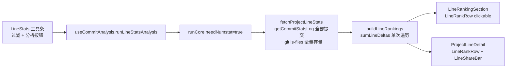

## 产品概述

对 Git 推送（gitPush）的「行数统计」视图做两项收尾整改：一是移除会误导人的「每项目抓取条数」下拉框，二是把三处重复实现的「排行行 / 条形」与两处重复的纯函数合并去重。数据来源、指标口径与信息结构保持不变。

## 核心功能（调整后）

- 工具条：仍展示分析状态（未分析 / 分析中 / 上次分析时间）、文件格式过滤入口（带已选数量角标）、「开始行数分析 / 重新分析」按钮；**不再出现条数选择下拉框**。
- 行数统计范围固定为「全部提交历史 + 工作区全部已跟踪文件」：界面不再提供任何条数旋钮，视图内只剩一个自洽口径，不会再出现「选了 30 却看不出差别」的困惑。
- 汇总卡片、项目代码行数排行、项目详情弹窗（文件明细 / 作者明细）、文件格式过滤弹窗的功能与外观均不变。
- 排行的视觉与交互保持不变：表格吸顶表头、条形可读宽度、行可键盘聚焦并回车/空格打开详情；详情弹窗作者排行仍为非交互列表，占比迷你条仍出现在文件明细表格的占比列。
- 「提交分析」「提交规则检查」两个视图的条数选择下拉框**保留**，仅其外观与全库下拉控件统一（弹出式面板而非系统原生下拉）。

## 视觉与交互效果

- 行数统计工具条右侧只剩「过滤按钮 + 分析按钮」，更简洁；分析按钮在分析中仍显示加载态且宽度不跳动。
- 排行行、占比迷你条的观感与现在完全一致（同样的列位、条形、颜色语义、hover 与焦点环），但因实现统一，后续任一处调整会同时生效。
- 提交分析 / 规则检查工具条里的条数选择器外观变为项目统一风格的下拉（高度与同排按钮对齐，仍带「每项目 N 条」悬停说明）。

## 技术栈选择

- Vue 3 + TypeScript + Vite + SCSS（现状不变）；样式继续按 `styles/` 分离规则落在 gitPush feature 内。
- 复用项目共享组件库 `src/components/`：`Select`（本次唯一新引入的共享控件）、既有 `Toolbar` / `Button` / `Badge` / `Card` / `Checkbox` / `Tabs`+`Tag` / `IconWrapper` 保持不变。
- 复用 gitPush 内部复用目录 `components/common/`（跨 ≥2 视图引用的组件，非共享组件库组件 ⇒ 无需 8 步注册、无需 `previewData`）。
- 不引入任何新依赖。

## 实施方案

### 一、行数统计移除条数选择并固定「全部提交」

现状链路（已核实）：`gitPush/index.vue:88,97` 把共享的 `commitCount` 与 `setCommitCount(n, true)` 传给 `LineStatsPanel`；`LineStats/index.vue` 再透传给 `LineStatsToolbar`；`useCommitAnalysis.fetchProjectLineStats`（第 178-191 行）第 181 行读共享 `commitCount.value` 决定 `git log -n`。

做法：

1. **UI 层逐段拆除**：`LineStatsToolbar.vue` 删掉 `CommitCountSelect`（第 34-39 行）与 `commitCount` prop / `updateCount` emit / 对应 import；`LineStats/index.vue` 删掉 `commitCount` prop 与 `updateCount` emit 及模板透传；`gitPush/index.vue` 删掉 `:commit-count="analysisCommitCount"` 与 `@update-count="(n) => setCommitCount(n, true)"` 两处绑定（`analysisCommitCount` 仍供另外两个视图使用，保留导出）。
2. **数据层改为显式全量口径**：`fetchProjectLineStats` 内部直接把 `manager.getCommitStatsLog(path)` 调用为**不传上限**（= 全部提交），并更新 docstring 注明「行数统计固定统计全部提交历史，不接受条数限制」；`runCore(needNumstat)`（第 217 行）与 `refreshLineStatsProject`（第 458 行）两个调用点因此自动一致，无需各自传参（YAGNI，不新增 `maxCount` 参数）。
3. **缓存字段清理**：`types/meta.ts` 的 `LineStatsCache` 删除 `commitCount` 字段及其注释；`types/storage.ts` 的 `DEFAULT_LINE_STATS_CACHE` 删除 `commitCount: 100`；`useCommitAnalysis.ts` 删除 `lineStatsCache.save` 里的 `commitCount: commitCount.value`（第 311 行）与 `loadLineStatsCache` 里的 `commitCount.value = cache.commitCount`（第 403 行）。

- **向后兼容已核实**：`TypedStorage.loadOrDefault` 对对象是「浅合并 `{...default, ...saved}` + 类型校验」，旧缓存多出的 `commitCount` 键会保留在返回对象中但无人读取，**无需写迁移代码**，也不会告警。

4. **保留不动**：`commitAnalysisCache.save` 里的 `commitCount: commitCount.value`（提交分析视图仍需要）、`CommitCountSelect.vue` 与其 i18n 键（`analysisCommitsAll` / `analysisCommitsPerProject` / `analysisCommitsPerProjectAll`）、`entries` / `analyzedAt` 的跨视图共用状态。

### 二、抽取「排行行」与「占比迷你条」共享组件

现状三处同构实现（已核实）：`.gls-bar-*`（`LineRankingSection.vue` + `LineStatsPanel.scss:110-260`，grid 六列 + 吸顶表头 + 行是原生 `<button>`）、`.pld-bar-*`（`ProjectLineDetail.vue` 作者 Tab + `ProjectLineDetail.scss:226-283`，flex、非交互）、`.pld-share-*`（`ProjectLineDetail.vue` 文件表格占比列 + `ProjectLineDetail.scss:185-199`）。

落位：`src/features/gitPush/components/common/LineRankRow.vue` + `styles/LineRankRow.scss`（承载行与表头共用的列模板）、`components/common/LineShareBar.vue` + `styles/LineShareBar.scss`（轨道 + 填充 + 百分比文本）。

关键设计（含取舍）：

- **根元素用 `<component :is="clickable ? 'button' : 'div'">`**，内部结构只写一份。刻意不用「统一 button + disabled」：`disabled` 会让部分浏览器/思源主题下的 `title` 提示与 hover 表现退化；非交互场景用 `div` 天然不进入 Tab 序列，与现状（详情弹窗作者行不可聚焦）一致。
- **列模板单点定义**：`LineRankRow.scss` 用文件级私有变量 `$_lrr-cols: 18px minmax(64px, 1.1fr) minmax(36px, 1fr) auto 40px minmax(40px, auto)`，行与表头都必须 `@use` 同一文件才能取得（SCSS 变量不跨文件传递，必须显式 `@use`）。表头仍留在 `LineRankingSection.vue`，通过 `showTotal` 区分 6 列（项目排行）/ 5 列（作者排行）——作者排行无「总行数」列。
- **净增语义色只留一套**：新组件用统一前缀 `lrr-net--pos/neg/zero`（仍复用具名导出 `netClass(net, "lrr-net")`），fill 的语义色覆盖只写一遍；`.pld-net--*` 与 `.pld-share-fill.pld-net--*` / `.pld-bar-fill.pld-net--*` 随之删除。**`.gls-net--*` 必须保留**（汇总卡片 `LineStatsCards.vue` 仍在用，删了会回归正负着色与零值弱化）。
- **纯展示、零 i18n 新增**：行组件用 `i18n` prop（gitPush 既有惯例）生成「新增 / 删除 / 净增」列 tooltip；`LineShareBar` 只接收 `pct` / `share` / `net`，无任何文案。
- 项目排行的键盘可达（Tab + Enter/Space + `focus-visible` 焦点环）与 `emit('viewProject')` 语义经行组件的 `clickable` + `select` 事件原样保留。

### 三、纯函数去重

1. **排序比较器**：把 `(b.totalLines ?? 0) - (a.totalLines ?? 0) || b.net - a.net || b.added - a.added`（`useCommitAnalysis.ts:163` 与 `:469` 逐字重复）抽为 `utils.ts` 的 `compareProjectLineRank(a, b): number`，两处调用。
2. **单次遍历**：`reportMetrics.ts` 新增核心函数 `sumLineDeltas(commits, extensions): { project: LineDelta, authors: Map<string, LineDelta> }`（一次 `for commits → for files` 同时产出项目合计与作者分组）；`sumProjectLines` / `sumAuthorLines` 改为**薄包装**（`=> sumLineDeltas(...).project` / `.authors`），既有调用点（`useCommitAnalysis.ts:464` 取项目、`ProjectLineDetail.vue:283` 取作者）零改动；`buildLineRankings`（第 128-140 行）改用 `sumLineDeltas` **一次拿两者，把 2 遍遍历降为 1 遍**。

- 取舍：薄包装会让「详情弹窗只取作者」时白算一个 O(1) 累加器（每提交两个数字），换来遍历逻辑单一来源与调用点零扰动，值得。

### 四、CommitCountSelect 内部改共享 Select

对外 props/emit 契约（`i18n` / `commitCount` / `updateCount`）**保持不变**，只换内部实现，`AnalysisToolbar` 与 `RuleCheckToolbar` 无需改动：

- `options` 由 `COMMIT_COUNT_OPTIONS`（`useCommitAnalysis.ts:29`）映射为 `SelectOption[]`：数字 → `String(n)`、`"all"` → `i18n.analysisCommitsAll`；`modelValue` 传 `commitCount`；`@update:model-value` 里 `v === "all" ? "all" : Number(v)` 保持原 `onCountChange` 语义。
- **档位取 `size="xsmall"`**：已核实共享 `Select` 的 xsmall 档 trigger `min-height: 22px`、字号 10px，与旧原生 `.gp-count-select`（10px 字号、紧凑内边距）最接近，且与同排共用 `Toolbar size="xsmall"` 的 22px 按钮同档；`Select` 默认 `small`(28px) 会明显高于同排按钮，故不取。**不传 `filterable`**（保持原无搜索行为）。
- tooltip 语义保留：`:title="countTitle"`（共享 `Select` 的 `containerAttrs` 会保留 `title` 并落到根元素）+ `:aria-label="countTitle"`，不新增 i18n 键。
- 收尾：`styles/CommitCountSelect.scss` 仅被该组件引用（已核实），迁移后**删除该文件**；`styles/CommitAnalysisSettings.scss:42` 的注释「与公共 gp-count-select 同视觉」改为指向共享下拉，避免过期描述。

## 实施注意（防回归）

- **项目排行的表头与行必须共用同一 grid 模板**：这是上一轮确立的硬约束，一旦行组件用独立列宽，跨行条形起止点就会错位。表头与行同处一个 SCSS 模块（`LineRankRow.scss`）是最稳的保证方式。
- **不要顺手扩展范围**（用户未勾选，本次明确不做）：存量统计异步化（`countFileLines` 仍是同步 `readFileSync`）、按扩展名过滤后再读文件、新增「跳过存量统计」开关、`entries` / `analyzedAt` 彻底解耦、新增口径说明文案。这些作为**已知遗留**记录，不在本次改动。
- **`.gls-net--*` 保留、`.pld-net--*` 删除**：删除前逐条确认使用方已迁到 `lrr-net`，避免误删导致颜色回归。
- 行组件新增后 `common/` 计数 25 → 27，`styles/` 因 +2 新文件、-1 删除文件变为 55；这两个数字与 README 里的清单必须同时更新（计数必须实测，不靠推算）。
- 删除清单（一次列全，避免死样式/死文件）：`LineStatsPanel.scss` 的 `.gls-bar-list/-head/-row/-rank/-label/-track/-fill`、`.gls-line-nums/-num/-num--add/-num--del`、`.gls-bar-share/-head-net`、`.gls-line-total`（迁入 `LineRankRow.scss` 后原处删除；`.gls-net--*` 与 `.gls-cards*` 保留）；`ProjectLineDetail.scss` 的 `.pld-bar-*`、`.pld-line-num*`、`.pld-share-*`、`.pld-net--*`；`styles/CommitCountSelect.scss`（整文件）。
- 性能：`buildLineRankings` 由「每项目 2 遍 numstat 遍历」降为「1 遍」，收益随 `commits × files` 规模线性放大；行数统计固定全部提交后单次 `git log --numstat` 的耗时在大仓库上可能高于原先的 `-30`，但消除了口径混淆（`getCommitStatsLog` 已有 60s 超时兜底），渲染路径无新增响应式计算、watch 或定时器。
- 验证边界：AI 禁止执行 `pnpm lint` 与 `pnpm vite build`；可执行 `read_lints`、`npx tsc --noEmit`、`pnpm i18n:merge` + `pnpm i18n:verify`、`pnpm validate:icons`，以及用 `sass.compileAsync` + 自定义 importer（`@/` → `src/`，`import * as sass`）做离线 SCSS 编译；**编译通过 ≠ 正确，必须抽查产物中 `$_lrr-cols` 展开后的 `grid-template-columns`、`.lrr-net--*` 与吸顶规则**。
- `read_lints` 偶有陈旧诊断需读回代码核对；`tsc --noEmit` 不解析 `.vue`；`.ts` 不得 `import type` from `*.vue`（`TS2614`）；本次**不新增 i18n 键**。

## 架构设计与数据流

数据流不变：`useCommitAnalysis` 仍是唯一分析状态源（`runCore` 抓取 → `buildLineRankings` 聚合 → 视图渲染），本次只做「去掉一个入口 + 合并重复实现」：



## 目录结构

```
src/features/gitPush/
├── index.vue                                   # [MODIFY] 删 LineStatsPanel 的 :commit-count / @update-count 绑定（另两视图绑定保留）
├── README.md                                   # [MODIFY] 功能条去掉「支持 30/50/100/200 条数选择」；目录树更新 common/ 25→27、styles/ 55、新增两个组件与两个 scss、删除 CommitCountSelect.scss 行；修正 LineRankingSection 的过期描述（无 mode prop）
├── utils.ts                                    # [MODIFY] 新增 compareProjectLineRank（排序比较器单一来源）
├── reportMetrics.ts                            # [MODIFY] 新增 sumLineDeltas 单次遍历核心；sumProjectLines / sumAuthorLines 改薄包装
├── composables/useCommitAnalysis.ts            # [MODIFY] fetchProjectLineStats 固定全部提交；lineStatsCache 去掉 commitCount 读写；buildLineRankings 改单次遍历 + 复用比较器；refreshLineStatsProject 复用比较器
├── types/meta.ts                               # [MODIFY] LineStatsCache 删除 commitCount 字段与注释
├── types/storage.ts                            # [MODIFY] DEFAULT_LINE_STATS_CACHE 删除 commitCount
├── components/
│   ├── LineStats/
│   │   ├── LineStatsToolbar.vue                # [MODIFY] 删除 CommitCountSelect 及其 prop/emit/import
│   │   ├── index.vue                           # [MODIFY] 删除 commitCount prop 与 updateCount emit 及模板透传
│   │   ├── LineRankingSection.vue              # [MODIFY] 改为消费 LineRankRow；表头沿用共享列模板；删除本地条形/数字列标记与 netClass 包装
│   │   └── ProjectLineDetail.vue               # [MODIFY] 作者 Tab 改用 LineRankRow、文件表格占比列改用 LineShareBar；删除本地 netClass 包装
│   └── common/
│       ├── LineRankRow.vue                     # [NEW] 排行行（排名/名称/条形/增删净/占比/可选总行数；clickable 时渲染原生 button 并 emit select）
│       ├── LineShareBar.vue                    # [NEW] 占比迷你条（轨道 + 填充 + 百分比文本，填充按净增正负着色）
│       └── CommitCountSelect.vue               # [MODIFY] 内部由原生 select 改为共享 Select(size=xsmall)，对外 props/emit 不变
└── styles/
    ├── LineStatsPanel.scss                     # [MODIFY] 删除已迁出的 .gls-bar-* / .gls-line-* 规则；保留 .gls-cards* / .gls-net--*（汇总卡片在用）/ 工具条与面板基座
    ├── ProjectLineDetail.scss                  # [MODIFY] 删除 .pld-bar-* / .pld-line-num* / .pld-share-* / .pld-net--*（已由共享组件取代）
    ├── LineRankRow.scss                        # [NEW] 列模板单点定义 + 行/表头/条形/数字列/净增语义色（统一 lrr-net 前缀）
    ├── LineShareBar.scss                       # [NEW] 占比迷你条样式
    ├── CommitCountSelect.scss                  # [DELETE] 已被共享 Select 取代，全库无其它引用
    └── CommitAnalysisSettings.scss             # [MODIFY] 修正「与公共 gp-count-select 同视觉」注释指向
```

## 关键代码结构

```ts
// src/features/gitPush/reportMetrics.ts —— 单次遍历核心（sumProjectLines / sumAuthorLines 均包装它）
export function sumLineDeltas(
  commits: NumstatCommit[],
  extensions?: string[],
): { project: LineDelta, authors: Map<string, LineDelta> }

// src/features/gitPush/utils.ts —— 项目行数排行排序比较器单一来源（buildLineRankings 与 refreshLineStatsProject 共用）
export function compareProjectLineRank(
  a: ProjectLineRankItem,
  b: ProjectLineRankItem,
): number

// src/features/gitPush/components/common/LineRankRow.vue —— 排行行对外契约
// props: rank: number; label: string; pct: string; share: string;
//        added: number; deleted: number; net: number;
//        totalLines?: number | null;   // 不传 = 不渲染总行数列（作者明细场景）
//        clickable?: boolean;          // true 时根元素为 <button>，可 Tab 聚焦 + Enter/Space
//        i18n?: Record<string, any>    // 仅用于列 tooltip，零 i18n 分片改动
// emits: select: []                    // clickable 时点击/回车/空格触发
```

## 收尾验证（预期结果）

1. `read_lints`：改动文件 0 错误。
2. `npx tsc --noEmit`：无本次路径新增错误（基线为 44 行历史噪声）。
3. `pnpm i18n:merge` + `pnpm i18n:verify`：键对齐通过（本次不新增键，回归防护）。
4. `sass.compileAsync` 编译 `LineRankRow.scss` / `LineShareBar.scss` / `LineStatsPanel.scss` / `ProjectLineDetail.scss` 全通过，**并抽查产物**确认 `grid-template-columns` 六列模板、`.lrr-net--pos/neg` 与吸顶表头规则正确。
5. 残留检查：全库无 `.gls-bar-*` / `.pld-bar-*` / `.pld-share-*` / `.pld-net--*` / `.gp-count-select` / `LineStatsCache.commitCount` 的引用。
6. 用户自验：`pnpm dev` 目视「行数统计」工具条无条数框、排行与详情观感与改前一致；「提交分析 / 规则检查」条数下拉为统一样式且 tooltip 正常。

## Agent Extensions

### SubAgent

- **code-explorer**
- Purpose: 收尾阶段做跨文件核查扫描 —— 确认被删除的选择器（`.gls-bar-*` / `.pld-bar-*` / `.pld-share-*` / `.pld-net--*` / `.gp-count-select`）与缓存字段 `LineStatsCache.commitCount` 在全库无残留引用；核对 `Select` / `Toolbar` 等共享组件的真实 props 与 `common/` 目录新组件是否被正确接入，避免落到猜 props 与死样式。
- Expected outcome: 输出「无残留引用」结论清单 + 每处替换所用 props 与其调用样例的对照表，并确认 `common/`（27）与 `styles/`（55）实测量与 README 更新一致。