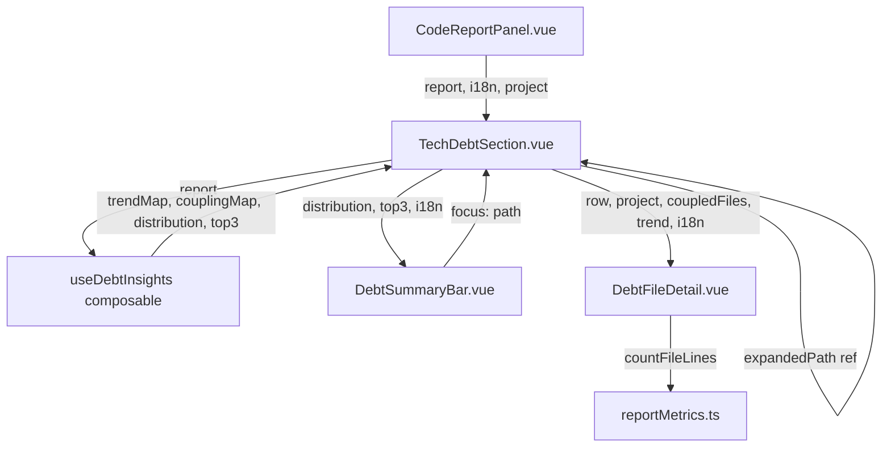

## 产品概述

对 gitPush 模块技术债务分析报告分区进行展示层扩展。参考 CodeScene（Adam Tornhill 行为代码分析方法论）的核心洞见，在保持现有风险评分公式和数据模型不变的前提下，为技术债务分区新增三个分析维度和可展开行交互。

## 核心功能

- **债务汇总摘要条**：表格上方新增严重度四档分布占比可视化条（严重/高/中/低，色段宽度=占比百分比），附 Top3 优先治理文件清单（文件名+风险分，点击可聚焦展开对应表格行）
- **趋势推断信号**：从每个债务文件的最后修改时间派生趋势方向——活跃恶化（7天内+高频修改）、持续活跃（30天内）、趋于稳定（90天内）、可能改善（90天以上）。以彩色箭头徽章（红向上/橙向右/灰向右/绿向下）呈现在文件行中，复用已有 recencyBonus 时间阈值逻辑
- **近期共变耦合**：按最后修改日期聚类，识别同日被修改的文件组。在展开详情中列出"近期共变文件"，标注为启发式推断（基于日期代理信号，非完整提交历史分析）
- **可展开行详情**：点击文件行展开下方详情面板（手风琴模式，同时仅展开一行）。面板展示完整文件路径、最后修改相对时间、代码行数、趋势解释文案、共变文件列表
- **代码行数按需懒加载**：展开行时若 LOC 为 null（当前仅 Top12 热点文件预读），调用 fs 读取文件行数；加载中显示旋转动画，完成后显示数值；2MB 以上文件跳过读取

## 技术栈

- 前端框架：Vue 3 + TypeScript（现有项目栈，无新依赖）
- 样式：SCSS + Codex 设计 Token（`$font-size-xs`/`$font-size-2xs`/`$spacing-*`/`$radius-*`/`$vp-mono`）
- 图标：@iconify/vue（`mdi:trending-up`/`mdi:trending-down`/`mdi:trending-neutral`/`mdi:link-variant`）
- 数据源：`CodeReportData.debtFiles`（DebtFileRow[]）+ `debtSummary`（已有聚合数据，零新增 git 命令）

## 实现方案

### 策略概述

将趋势推断、耦合聚类、汇总统计三个纯计算逻辑提取到 `useDebtInsights` composable，TechDebtSection 调用一次后以 props 分发给 DebtSummaryBar 和 DebtFileDetail 两个子组件。父组件仅负责展开状态管理和数据透传，子组件自包含渲染。

### 关键技术决策

1. **趋势信号复用 recencyBonus 阈值**：`reportMetrics.ts` 中 `recencyBonus` 已定义 3d/7d/30d 三档时间阈值。趋势推断直接复用这些阈值（≤7d→worsening, 8-30d→active, 31-90d→stabilizing, >90d→improving），保持口径一致，零额外常量
2. **耦合信号用 lastModified 日期聚类**：`DebtFileRow.lastModified` 是 ISO 时间戳，按 `slice(0,10)` 截取到日精度分组，同日≥2 文件视为"近期共变"。这是代理信号——真实 temporal coupling 需要 commit 级共现矩阵，但用户选择"仅展示层"，此方案零额外数据获取
3. **LOC 懒加载用 countFileLines 同步读取**：`countFileLines(project, filePath)` 已存在（2MB 上限 + fs.readFileSync）。在 DebtFileDetail 的 `onMounted` 中调用，用 `setTimeout(0)` 包装避免阻塞首次渲染。2MB 内文件读取通常 <10ms
4. **手风琴展开用单一 ref**：`expandedPath = ref<string | null>(null)`，点击行切换值，同一时间仅一行展开。DebtSummaryBar 的 Top3 点击通过 emit `focus(path)` 也能设置此 ref
5. **子组件不触碰 report 全量**：DebtSummaryBar 只接收 `distribution` + `top3` + `i18n`；DebtFileDetail 只接收 `row` + `project` + `coupledFiles` + `trend` + `i18n`。遵循子组件自包含原则

### 性能考量

- **耦合聚类 O(n)**：对 debtFiles 做一次 Map 分组，n 通常 <50（仅≥门槛的文件），无性能隐患
- **趋势计算 O(n)**：每文件一次 Date.parse + 比较，可忽略
- **LOC 懒加载**：仅展开行时触发单文件读取，不批量读取。2MB 上限保护避免大文件卡顿
- **computed 缓存**：trendMap/couplingMap/distribution/top3 均为 computed，report 不变时不重算

## 实现备注

- **LOC 同步读取风险**：`countFileLines` 用 `fs.readFileSync`，在 Electron renderer 中会阻塞主线程。用 `setTimeout(0)` 或 `requestAnimationFrame` 延迟到渲染后执行，2MB 内文件通常 <10ms 可接受
- **lastModified 空值处理**：DebtFileRow.lastModified 可能为空串（git 历史无日期时），趋势推断返回 `stabilizing`（中性默认），耦合聚类跳过
- **向后兼容**：不修改 DebtFileRow/CodeReportData 接口，不修改 reportMetrics.ts 评分逻辑。新增的 TrendSignal/TREND_META 定义在 composable 内导出，不污染 types/report.ts
- **共享 SCSS 基座复用**：新组件复用 `.gpr-section`/`.gpr-row`/`.gpr-cell`/`.gpr-table-wrap` 等已有基座类 + `row-divider`/`text-ellipsis`/`gp-label-base` mixin，仅新增组件专属样式
- **i18n 键约 12 个**：新增 reportDebtDistribution/reportDebtTop3/reportTrendCol/reportTrendWorsening/reportTrendActive/reportTrendStabilizing/reportTrendImproving/reportDebtCoupling/reportDebtCouplingHint/reportDebtNoCoupling/reportDebtLoadingLoc/reportDebtLocUnit

## 架构设计



## 目录结构

```
src/features/gitPush/
├── composables/
│   └── useDebtInsights.ts          [NEW] 趋势推断 + 耦合聚类 + 汇总统计 composable。
│                                       导出 TrendSignal 类型、TREND_META 常量、
│                                       useDebtInsights(report, debtThreshold) 函数。
│                                       返回 trendMap/couplingMap/distribution/top3 四个 computed。
│                                       趋势复用 recencyBonus 阈值；耦合按 lastModified 日期聚类。
├── components/report/
│   ├── TechDebtSection.vue          [MODIFY] 主组件重构：集成 DebtSummaryBar + 可展开行 +
│                                       趋势徽章列。新增 project prop（GitProject|null）。
│                                       新增 expandedPath ref 管理手风琴状态。
│                                       表头新增"趋势"列；文件行可点击展开 DebtFileDetail。
│                                       预计 ~160 行（抽取子组件后低于 300 警戒线）。
│   ├── DebtSummaryBar.vue            [NEW] 严重度分布条 + Top3 优先治理清单。
│                                       Props: distribution/top3/i18n。
│                                       Emit: focus(path) — Top3 点击聚焦到表格行。
│                                       分布条用 4 色段 flex 横条，宽度=占比百分比。
│                                       Top3 列表每项显示文件名+风险分+严重度色点。
│   ├── DebtFileDetail.vue            [NEW] 展开行详情面板。
│                                       Props: row/project/coupledFiles/trend/i18n。
│                                       onMounted 懒加载 LOC（countFileLines + setTimeout 0）。
│                                       展示：完整路径/最后修改相对时间/LOC/趋势解释/共变文件列表。
│   └── CodeReportPanel.vue           [MODIFY] 新增 currentProject computed（从 projects+projectId 派生），
│                                       传递 :project="currentProject" 给 TechDebtSection。
│                                       仅新增 3 行（computed + prop 绑定），不影响其他分区。
├── styles/
│   ├── TechDebtSection.scss          [MODIFY] 新增：趋势徽章样式（.gpr-trend-badge + 4 色变体）、
│                                       可展开行交互样式（cursor:pointer + 展开面板容器）、
│                                       表头趋势列宽度。
│   ├── DebtSummaryBar.scss           [NEW] 分布条样式（.gpr-dist-bar/.gpr-dist-seg 4 色）、
│                                       Top3 列表样式（.gpr-top3-list/.gpr-top3-item）。
│   └── DebtFileDetail.scss           [NEW] 详情面板网格布局（.gpr-detail-grid）、
│                                       LOC 加载态（复用 .gp-spin）、共变文件列表样式。
src/i18n/
├── zh_CN/gitPush.json                [MODIFY] 新增 12 个 i18n 键（债务分布/Top3/趋势4档/耦合3条/LOC加载）
└── en_US/gitPush.json                [MODIFY] 同步新增 12 个英文翻译键
```

## 关键代码结构

```typescript
// useDebtInsights.ts — 趋势信号类型与展示元数据（composable 内导出，不污染 types/report.ts）

/** 趋势方向（从 lastModified + modCount 派生） */
type TrendSignal = "worsening" | "active" | "stabilizing" | "improving"

/** 趋势展示元数据（图标/颜色/i18n 键，驱动模板渲染） */
const TREND_META: Record<TrendSignal, { icon: string, color: string, labelKey: string }> = {
  worsening:    { icon: "mdi:trending-up",    color: "#ef4444", labelKey: "reportTrendWorsening" },
  active:       { icon: "mdi:trending-neutral", color: "#f59e0b", labelKey: "reportTrendActive" },
  stabilizing:  { icon: "mdi:trending-neutral", color: "#64748b", labelKey: "reportTrendStabilizing" },
  improving:    { icon: "mdi:trending-down",  color: "#10b981", labelKey: "reportTrendImproving" },
}

/** composable 返回值契约（TechDebtSection 调用一次，props 分发给子组件） */
interface DebtInsights {
  trendMap: Map<string, TrendSignal>           // path → 趋势信号
  couplingMap: Map<string, DebtFileRow[]>       // path → 同日共变文件（不含自身）
  distribution: Array<{ sev: DebtSeverity, count: number, pct: number }>
  top3: DebtFileRow[]                           // 按 riskScore 降序前 3
}
```

## 设计方案

在现有 Codex 风格基础上扩展技术债务分区 UI，保持与 HotspotSection/TeamOverviewSection 同级的视觉一致性。新增三个视觉模块：

1. **债务汇总摘要条**（表格上方）：四段水平分布条（严重红/高橙/中灰/低浅灰），每段宽度=占比百分比，段内显示计数。下方 Top3 优先治理清单，每项含严重度色点+文件名+风险分，可点击聚焦

2. **趋势徽章列**（表格新增列）：12px 宽窄列，每行一个小图标徽章——红色向上箭头(恶化)/橙色向右(活跃)/灰色向右(稳定)/绿色向下(改善)。表头标签"趋势"

3. **展开行详情面板**（文件行下方展开）：浅色底卡片，左侧网格展示完整路径/最后修改/LOC/趋势解释，右侧列出共变文件（文件名+路径悬浮提示）。LOC 加载中显示旋转图标

交互：文件行整体可点击（cursor:pointer），展开时背景高亮。手风琴模式——展开新行自动收起旧行。Top3 点击通过事件总线触发对应行展开并滚动到视口

## Agent Extensions

### Skill

- **codex-ui-style-guide**
- 用途：在编写 DebtSummaryBar.scss、DebtFileDetail.scss 和扩展 TechDebtSection.scss 时，强制校验 Codex UI 样式规范——设计 Token 使用（禁止硬编码 font-size/font-weight/line-height/spacing）、禁止 box-shadow（改用 border）、SCSS 分离规范、`.gpr-*` 命名一致性
- 预期结果：3 个新/改 SCSS 文件全部通过 Codex 样式规范审查，零硬编码值，与现有 `.gpr-*` 基座风格一致