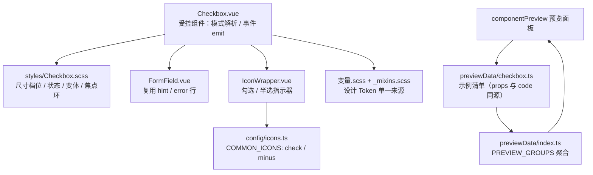

## 产品概述

在项目共享 UI 组件库 `src/components/`（现有 14 个组件）中新增第 15 个组件 `Checkbox`（复选框），参考 PrimeVue 5 Checkbox 的 API 与视觉体系，但完全沿用本项目既有的 Codex 设计语言、四档尺寸体系与设计 Token，使全项目获得统一的勾选控件（替代散落的原生 `<input type="checkbox">`）。

## 核心功能

- **二元勾选**：`v-model` 绑定布尔值，支持 `trueValue` / `falseValue` 自定义开关值对
- **分组多选**：`v-model` 绑定数组时，各实例通过 `value` 标识自身，勾选推入数组、取消移出数组
- **半选态**：`indeterminate` 表示「既非全选也非未选」，方框显示横线指示器，语义标记为 mixed
- **视觉变体**：`outlined`（默认，透明底 + 描边）与 `filled`（实底灰底，强调度更高）
- **尺寸四档**：`xsmall` / `small`（默认）/ `medium` / `large`，方框、指示器图标、标签字号同步递进
- **状态与校验**：`disabled`（禁用）、`readonly`（只读不可改但可聚焦）、`error`（校验失败描红）、`hint`（辅助说明）
- **标签与插槽**：内建行内可点击 `label` 文案，支持默认插槽自定义标签内容、`icon` 插槽自定义方框内指示器
- **无障碍**：内嵌视觉隐藏的原生 checkbox 承载真实表单语义，Tab 聚焦、Space 切换开箱可用，支持 `name` / `inputId` / `ariaLabel` / `ariaLabelledby`
- **接入组件预览面板**：新增预览分区，展示各能力组合的真实渲染快照与可复制代码

## 视觉与交互效果

未选中为细描边空方框，悬停时边框转为主色；选中时方框填充主题主色并浮现勾形图标；半选态为实底方框 + 横线指示器。聚焦时方框外圈出现 2px 主色轮廓（不使用阴影发光）。禁用态整体降透明度且光标为禁止符号，只读态光标为默认箭头。所有底色、边框、文字颜色均跟随思源明暗主题自动切换，与现有 14 个组件观感完全一致。

## 技术栈

- 框架：Vue 3.5 `<script setup lang="ts">`（单文件组件，与既有 14 个组件同构）
- 样式：SCSS，设计 Token 来自 `@/variables.scss`（实为 `src/_variables.scss` 部分文件）+ `src/components/styles/_mixins.scss`，样式必须外置到 `src/components/styles/Checkbox.scss`
- 复用组件：`FormField.vue`（hint/error 行）、`IconWrapper.vue`（勾选/半选图标）
- 图标：`src/config/icons.ts` 的 `COMMON_ICONS`（仅需新增 `minus`，`check` 已存在）
- 预览接入：`src/features/componentPreview`（纯数据清单驱动，无需改渲染层）
- 本次不新增 feature 模块，因此不走 8 步注册清单，不改 `src/index.ts` / `src/config/settings.ts` / `src/features/config.ts` / i18n 分片

## 实现方案

### 核心策略

单个受控组件 + 模式自动解析 + 原生输入承载语义。`modelValue` 为数组即进入分组模式（用 `value` 定位），否则进入二元模式（用 `trueValue`/`falseValue`），`binary` 作为显式强制二元模式的开关。可见方框为纯展示层，真实交互由视觉隐藏的原生 `<input type="checkbox">` 承担，从而免费获得 Tab/Space 键盘行为与表单语义。

### 关键决策与权衡

1. **原生 input 而非 `role="checkbox"` 按钮**：PrimeVue 亦采用隐藏原生输入方案；本项目 `Switch` 用 `button + role="switch"` 是因为开关无原生等价元素，而复选框有原生实现，复用可少写一套键盘处理并支持 `<label for>` 外部关联。
2. **受控回写防漂移**：`:checked` 绑定受控值，`@change` 中计算新值并 emit 后，**同步把 `input.checked` 写回当前受控值**；父级接受更新时由 `watch` 再同步为最新值，父级忽略更新时视觉已回滚。避免「DOM 已勾选、数据未变」的不一致。
3. **`indeterminate` 必须写 DOM 属性**：该状态无 HTML 属性可表达，只能经 `ref` 赋 `input.indeterminate`，并用 `watch` 同步；同时手动设置 `aria-checked="mixed"`。与 PrimeVue 一致，半选为受控 prop，点击后由父级负责清除。
4. **分组模式返回全新数组**：`[...filtered]` / `[...modelValue, value]`，绝不原地 mutate —— 项目既有经验表明原地 splice 对非 deep watch 永不触发。对象值用 `indexOf` 做引用相等判断（PrimeVue 同）。
5. **尺寸与图标联动**：组件内定义 `TIER_ICON_SIZE` 常量（10/12/14/16）传给 `IconWrapper`，与 `Button.vue` 的既有约定一致；标签字号走项目四档阶梯 `$font-size-2xs/xs/sm/base`，四档禁止同号。
6. **复用 `FormField` 承载 hint/error**：`FormField` 为无根元素片段，不传 `label` 时只渲染默认插槽 + hint/error 行，可直接复用其提示样式；其 label 是**上方独立元素且无 `for`**，不适合承载复选框的行内标签，故组件自带行内 `<label>`（`label` prop / 默认插槽）。不引入 `required`（无顶部标签时星号无意义）。
7. **焦点环用 `outline`**：遵循项目硬规则 —— `m.focus-ring` mixin 只改 `border-color`，实底控件复用后焦点不可见；改用 `input:focus-visible + .si-checkbox__box { outline: 2px solid var(--b3-theme-primary); outline-offset: 2px; }`。
8. **不实现 PrimeVue 的 `size="small"|"large"` 三档与 `invalid` 命名**：已与用户确认统一为本库四档 `xsmall/small/medium/large`（默认 `small`）与 `error` 命名，保持与 `Input`/`Slider`/`Select` 一致。

### 性能与可靠性

- 组件为纯受控渲染，无定时器、无全局事件监听、无异步副作用，不涉及 `TimerRegistry` 与生命周期销毁。
- 分组模式判断为 `Array.isArray` O(1)；`indexOf` O(n) 中 n 为**单个分组内选项数**，非全量数据，可忽略。
- 渲染复杂度 O(1)：单方框 + 单图标，无 `v-for` 内层循环。

### 边界与异常处理

- `modelValue` 为 `undefined`/`null` 时按未选中处理，不抛错。
- `readonly` 时：原生 input `@click.prevent` + `@keydown.space.prevent`，并设 `aria-readonly="true"`，光标 `default`。
- `disabled` 时：原生 `:disabled`，整体 `opacity: m.$opacity-disabled`，光标 `not-allowed`。
- 二元模式判定用严格相等（`===`），避免 `trueValue` 为 `0`/`""` 时误判。
- 分组模式下若 `value` 未传，不静默错误，保持不勾选（`indexOf(undefined)` 语义可预期）。

## 实现要点（执行注意）

- 文件头注释：`Checkbox.vue` 顶部必须有 10~30 字功能说明；`Checkbox.scss` 沿用 `// ========== Checkbox.scss ==========` 头注释风格。
- SCSS 内颜色一律 `var(--b3-theme-xxx, $color-yyy)` 双保险写法；禁止硬编码颜色。
- 无对应 Token 的像素值（如 18px 方框）必须硬编码并加 `// 无对应 Token` 注释；10px 间距用 `m.$spacing-2_5`、6px 用 `m.$gap-xs`、2px 用 `$spacing-2px`。
- 禁止 emoji 图标；图标只能传 `IconKey`（半选图标 `minus` 必须先注册，否则 `tsc` 报错，故图标注册需先于组件编写）。
- emit 事件名必须 camelCase（`update:modelValue` / `change` / `focus` / `blur`）；`if` 语句必须带花括号。
- `change` 事件载荷沿用 `Input` 风格 `(value, event)`，不做 PrimeVue 的 `{originalEvent, checked}` 对象包装。
- 组件 `size` 只改字号/尺寸，不联动 padding 与行高之外的属性。
- 用户已明确本次**不迁移**任何 feature 内的原生 checkbox（约 20+ 文件），严禁顺手改动 feature 代码。
- 组件 API 变更必须同步预览清单（`props` 与 `code` 严格一致）与预览 README。
- AI 不执行 `pnpm vite build` / `pnpm lint`，验证由用户自行完成。
- 预览示例标题为数据文件内中文硬编码（非 i18n 键），本次**无 i18n 改动**。

## 架构设计

本次改动落在「共享组件库」这一既有横切层，不引入新架构模式、不新增 feature 模块、不涉及跨功能事件总线。



## 目录结构

本次仅新增 1 个组件与其预览数据，其余为文档计数同步，全部为增量改动，不触碰任何 feature 业务代码。

```
siyuanPluginVueSN/
├── src/
│   ├── components/
│   │   ├── Checkbox.vue                      # [NEW] 复选框共享组件。实现二元勾选（trueValue/falseValue）、数组分组多选（value 定位、返回全新数组）、indeterminate 半选（经 ref 写 DOM 属性 + aria-checked="mixed"）、outlined/filled 变体、四档尺寸（TIER_ICON_SIZE 联动图标）、disabled/readonly/error/hint、行内 label 与默认插槽/icon 插槽、视觉隐藏原生 input 承载 Tab/Space 无障碍；受控回写防漂移；复用 FormField（hint/error）与 IconWrapper；顶部需文件头注释
│   └── styles/
│       └── Checkbox.scss                     # [NEW] Checkbox 样式。根类 .si-checkbox 与元素 .si-checkbox__control/__input/__box/__icon/__label；四档方框 14/16/18/20px（18px 无 Token 需注释）与标签字号 10/12/14/16；outlined/filled 未选中底色差异、选中态主题主色填充；disabled 用 m.$opacity-disabled、readonly 光标 default；焦点环用 outline（禁用 focus-ring mixin）；颜色统一 var(--b3-theme-*, $color-*) 双保险
│   ├── config/
│   │   └── icons.ts                          # [MODIFY] 在 COMMON_ICONS 注册半选图标 minus（mdi:minus）；check（mdi:check）已存在可复用。必须先于组件编写，否则 IconKey 类型不含 minus 导致 tsc 失败
│   └── features/
│       └── componentPreview/
│           ├── previewData/
│           │   ├── checkbox.ts               # [NEW] 复选框预览分组。导出 checkboxGroup（id/component/name/summary/importCode/sizeable: true/examples），示例覆盖：基础二元、自定义值对、分组多选、半选态、四档尺寸对比、实底变体、禁用、只读、错误态 + hint、自定义 icon 插槽；每条 props 与 code 必须严格一致
│           │   └── index.ts                  # [MODIFY] 引入 checkboxPreviewGroups 并加入 PREVIEW_GROUPS 聚合（置于 control 之后，保持分类稳定顺序）
│           └── README.md                     # [MODIFY] 「全部 14 个组件」改 15；功能清单追加 Checkbox；sizeable 组件列举追加 Checkbox；档位字号阶梯说明补 Checkbox 标签
├── AGENTS.md                                 # [MODIFY] 5 处计数同步：L160「（14 个组件）」、L168 预览面板说明、L181「### 3. 组件清单（14 个）」标题、L440 目录树注释、L478 componentPreview 说明行；并在 L181 起的能力清单表中新增 Checkbox.vue 行（职责 + 关键 props）
└── README.md                                 # [MODIFY] 目录树「共享 UI 组件（14 个原子组件）」改 15
```

## 关键代码结构

组件对外契约（Props / Emits / Slots）为核心接口，需精确定义：

```ts
type CheckboxSize = "xsmall" | "small" | "medium" | "large"
type CheckboxVariant = "outlined" | "filled"

interface Props {
  /** 二元模式为布尔值；分组模式为数组 */
  modelValue?: boolean | any[]
  /** 分组模式下本项代表的值 */
  value?: any
  /** 二元模式选中时写入的值，默认 true */
  trueValue?: any
  /** 二元模式取消时写入的值，默认 false */
  falseValue?: any
  /** 强制二元模式（不传时：modelValue 为数组则分组，否则二元） */
  binary?: boolean
  /** 半选态（受控，点击后由父级负责清除） */
  indeterminate?: boolean
  size?: CheckboxSize            // 默认 "small"
  variant?: CheckboxVariant      // 默认 "outlined"
  /** 行内可点击标签文案 */
  label?: string
  /** 辅助说明（与 error 互斥，error 优先显示） */
  hint?: string
  /** 校验失败文案（同时描红方框） */
  error?: string
  disabled?: boolean
  readonly?: boolean
  name?: string
  /** 原生 input 的 id，供外部 <label for> 关联 */
  inputId?: string
  ariaLabel?: string
  ariaLabelledby?: string
  autofocus?: boolean
  /** 标签置于方框左侧 */
  labelBefore?: boolean
}

interface Emits {
  (e: "update:modelValue", value: boolean | any[]): void
  (e: "change", value: boolean | any[], event: Event): void
  (e: "focus", event: FocusEvent): void
  (e: "blur", event: FocusEvent): void
}
// Slots: default（自定义标签内容）、icon（自定义方框内指示器）
```

## 设计风格

延续项目既有的 Codex 设计语言（暖色中性 + 琥珀金强调、边框优先、无发光阴影、等宽元素），新增复选框作为该体系中的表单勾选控件，观感必须与既有 `Switch` / `Input` / `Select` 完全同源。实现为 Vue 3 单文件组件 + 独立 SCSS，消费思源 `--b3-theme-*` 主题变量与项目设计 Token，明暗自适应。

## 视觉规格

- **根容器**：`inline-flex` 纵向排列，内部控件行为 `inline-flex` 横排，方框与标签间距 8px；标签在左时行方向反转。
- **方框**：1px 描边 + 6px 圆角（`$vp-radius`）。未选中为透明底 + `--b3-border-color` 描边；悬停时描边转主色。选中时填充 `--b3-theme-primary`，指示器图标用 `--b3-theme-on-primary`。半选态为实底主色 + 横线图标。
- **变体**：`outlined`（默认）未选中透明底；`filled` 未选中为 `--b3-theme-surface-lighter` 实底 + 透明描边，强调度更高，选中态两者一致。
- **尺寸档位**（方框 / 指示器图标 / 标签字号）：XS 14/10/10px、S 16/12/12px（默认）、M 18/14/14px、L 20/16/16px。
- **状态**：`disabled` 整体透明度 0.5 + 禁止光标；`readonly` 光标为默认箭头、可聚焦不可改；`error` 方框描边转危险色，下方提示文字同步转危险色。
- **焦点环**：`input:focus-visible` 时方框外圈 2px 主色 `outline`，偏移 2px（不使用 box-shadow 发光）。
- **提示文字**：方框下方，与 `FormField` 的 hint/error 行完全一致的排版与颜色。

## 交互

- 点击方框、标签文字均可切换；键盘 Tab 聚焦、Space 切换（原生行为）。
- 悬停仅变描边/底色，过渡统一 0.12s ease，不做位移与缩放，避免密集表单中抖动。
- 选中/取消切换即时生效，无动画延迟；半选态点击后由父级清除半选。

## Agent Extensions

### MCP

- **Context7**
- Purpose: 精确获取 PrimeVue 5 Checkbox 的官方 API 定义（props 默认值、events 载荷、slots、无障碍要求），作为组件契约对齐的依据，避免仅凭网页抓取摘要产生偏差。
- Expected outcome: 得到 PrimeVue Checkbox 完整 props/events/slots 清单与默认值，用于逐项确认本组件「已对齐 / 有意偏离（尺寸档位与 error 命名）」的取舍，形成可核对的差异说明。

### Skill

- **universal-arch-skill**
- Purpose: 对新增的共享组件做架构规范审查——校验 SCSS 是否外置、是否遵守设计 Token 与尺寸档位阶梯、是否复用共享组件、文件行数是否在 300/500 阈值内、文件头注释是否齐备。
- Expected outcome: 输出一份架构合规审查结论，列出 Checkbox.vue / Checkbox.scss / previewData 的规范符合情况与需修正项，确保新组件与既有 14 个组件规范完全一致。

### SubAgent

- **code-explorer**
- Purpose: 全量定位需同步的文档计数与潜在命名冲突——搜索全部「14 个组件」类表述的确切文件与行号，并确认 `src/components/` 下不存在既有 Checkbox 组件或 `si-checkbox` 类名冲突、`minus` 图标键未重复注册。
- Expected outcome: 一份精确的待改清单（文件 + 行号 + 现内容）与冲突排查结论，使文档同步与图标注册零遗漏、零重复。