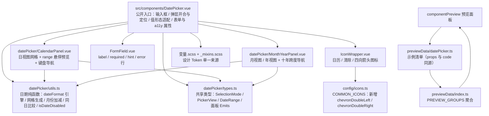

## 产品概述

在项目共享 UI 组件库 `src/components/`（现有 15 个组件）中新增第 16 个组件 `DatePicker`（日期选择器），参考 PrimeVue 5 DatePicker 的 API 与交互体系，但完全沿用项目既有的 Codex 设计语言、四档尺寸体系与设计 Token，使全项目获得统一的日期选择控件（替代散落的原生 `<input type="date">`）。

## 核心功能

- **单选日期**：`v-model` 绑定单个日期，输入框显示格式化文本，点击弹出日历面板选择
- **区间选择**：`selectionMode="range"` 时绑定起止日期，第一次点击定起点、悬停预览区间、第二次点击完成；终点早于起点自动交换
- **三种视图**：`view` 支持 日（网格）/ 月（12 宫格）/ 年（十年跨度）视图，面板头部可逐级切换
- **格式模板**：`dateFormat` 自定义显示格式（令牌 `d/dd/m/mm/M/MM/y/yy/o/oo/D/DD/@/!` 与 `'字面文本'`），默认 `yy-mm-dd`
- **值形态**：`modelValue` 默认 `Date` 对象（区间为 `Date[]`），开启 `valueFormat` 后输入输出字符串
- **范围与禁用**：`minDate`/`maxDate` 边界、`disabledDates`（数组或函数）、`disabledDays`（星期几）统一置为不可选
- **清除与快捷**：输入框内清除按钮（`showClear`）、面板底部「今天 / 清除」按钮栏（`showButtonBar`）
- **表单集成**：`label`/`required`/`hint`/`error` 内建，`disabled`/`readonly`、`name`/`inputId`/`ariaLabel` 等表单与无障碍属性
- **自定义插槽**：`date` 插槽自定义日期单元格内容、`buttonbar` 插槽自定义底部按钮栏
- **接入组件预览面板**：新增预览分区，展示各能力组合的真实渲染快照与可复制代码

## 视觉与交互效果

输入框为描边圆角框，左侧为格式化日期文本（未选中时显示占位提示），右侧为清除图标与日历图标按钮。悬停时边框转主色，聚焦时边框变主色且不出现发光阴影。点击后在输入框下方（或空间不足时的上方）淡入缩放展开日历面板：头部为「‹‹ ‹ 2026 年 9 月 › ››」导航栏与视图切换标题，中部为 7 列星期表头与 6 行日期网格，今日带主色描边标记、选中日期为主色实底、区间内日期为浅色底、禁用日期降透明度且光标为禁止符号；月/年视图为 3×4 宫格。键盘 Tab 聚焦、Enter/Space 打开、Esc 关闭并回焦，方向键在网格内移动、Home/End 跳周首末、PageUp/PageDown 切月（加 Shift 切年）。所有底色、边框、文字颜色均跟随思源明暗主题自动切换，与现有 15 个组件观感完全一致。

## Tech Stack Selection

- 框架：Vue 3.5 `<script setup lang="ts">`（单文件组件，与既有 15 个组件同构）
- 样式：SCSS，Token 来自 `@/variables.scss` + `src/components/styles/_mixins.scss`；样式一律外置到 `src/components/styles/*.scss`
- 复用组件：`FormField.vue`（label/hint/error 行）、`IconWrapper.vue`（图标）
- 日期处理：**零新依赖**——`package.json` 现有 dependencies 中无 dayjs/date-fns/luxon/moment，全项目均用原生 `Date`，本次自建纯函数库保持包体积与既有风格一致
- 图标：`src/config/icons.ts` 的 `COMMON_ICONS`，仅需新增 `chevronDoubleLeft`/`chevronDoubleRight`（`calendar`/`chevronLeft`/`chevronRight`/`chevronUp`/`chevronDown`/`close`/`x`/`check` 均已存在，勿重复注册）
- 本次不新增 feature 模块，因此不走 8 步注册清单，不改 `src/index.ts` / `src/config/settings.ts` / `src/features/config.ts` / `src/features/FEATURE_ICONS` / i18n 分片

## Implementation Approach

### 核心策略

**公开入口单一文件 + 私有实现子目录 + 单一纯函数库**。`src/components/DatePicker.vue` 作为唯一公开入口（保持全库 `@/components/X.vue` 导入约定并计入 AGENTS 组件清单），负责输入框渲染、弹层开合与定位、值形态适配、表单属性透传；日历/月年视图拆为两个子部件；全部日期数学收敛进一个纯函数模块，杜绝网格层与视图层的重复实现。

### 关键决策与权衡

1. **零第三方日期库**：`dayjs`/`date-fns` 会给插件包增加 6~20KB 且与项目现有原生 `Date` 实践割裂。所需能力（格式化模板、月份加减、网格生成、同日比较、禁用判定）合计约 230 行纯函数，自建成本低于引入依赖。
2. **结构：入口平铺 + 私有子目录**：常用子集版 DatePicker 需 3 个视图单元 + 日期函数库，单文件必然突破 500 行硬阈值。采用 `src/components/DatePicker.vue`（平铺入口）+ `src/components/datePicker/{types.ts,utils.ts,CalendarPanel.vue,MonthYearPanel.vue}`（私有实现）。子目录命名沿用 `chart.types.ts` 已在 `src/components/` 根放类型文件的先例，且不改变公开导入约定、不让子部件污染组件清单。该结构约定需补进 `AGENTS.md § 共享组件库使用规则`。
3. **视觉分段复用**：输入框部分复用 `Input.vue` 的 `__wrapper` 范式（`background: --b3-theme-background` + `1px solid --b3-border-color` + `:hover` 转主色 + `:focus-within` 用 `outline`），弹层部分完整复用 `Select.vue` 的范式（wrapper 内 `position: absolute` + `z-index: m.$z-select-dropdown`(1000) + `resolvePlacement()` 用 `getBoundingClientRect()` 比较上下空间择大 + `<Transition>` + `document` click 外部关闭 + 内部 `@click.stop`）。理由：前者是文本输入框的既有观感、后者是项目唯一的浮层定位范式；两者拼装即得本组件，不引入第三种模式。
4. **值形态适配层**：内部一律以 `Date` 运算。输入侧接受 `Date`/`Date[]`/字符串（自动解析，失败视为空）；输出侧由 `valueFormat` 决定——为真时按 `dateFormat` 序列化为字符串（区间为长度 2 字符串数组），否则回写 `Date`。该设计让「字符串型旧调用」与「Date 型新调用」共存，且不需要用户手写适配代码。
5. **`dateFormat` 默认值有意偏离 PrimeVue**：PrimeVue 默认 `mm/dd/yy`，本项目默认 **`yy-mm-dd`**。理由：组件为中文优先（占位/按钮文案均为中文），且与 `src/utils/format.ts` 的 `formatTime` 输出 `YYYY-MM-DD HH:mm:ss` 的日期段一致。该偏离需在组件 JSDoc 与预览清单中标注。
6. **`firstDayOfWeek` 默认 `1`（周一起始）**：PrimeVue/JS 默认周日（0），但中文日历习惯周一起始，且组件 `weekdayLabels` 默认值为中文。提供 prop 可设 0，属有意偏离。
7. **禁用判定单一入口**：`minDate`/`maxDate`/`disabledDays`/`disabledDates`（数组或函数）四种约束收敛为一个 `isDateDisabled(date, options)` 纯函数，网格、月视图、年视图共用。
8. **文案范式沿用 `Select.vue`**：共享组件不以 i18n 分片为文案来源（`Select.vue` 既有 `placeholder: "请选择"` / `emptyText: "暂无数据"` 等中文默认 prop 值）。本组件同样以中文默认 prop 值提供 `placeholder`/`todayText`/`clearText`/`weekdayLabels` 与全部无障碍 aria 文案，调用方可用 props 覆盖。**本次零 i18n 改动**。
9. **不实现 PrimeVue 的 `showTime`/`timeOnly`/`multiple`/`inline`/`numberOfMonths`/`variant`**：已与用户确认范围，明确不做，避免范围蔓延。
10. **`manualInput` 默认关闭**：默认输入框只读，只能通过日历选择，避免模糊解析引发的脏值；开启后按 `dateFormat` 反向解析，解析失败在 blur 时回滚为上一个有效值。

### 性能与可靠性

- `resolvePlacement` 只在打开弹层时调用一次（`nextTick` 后），`getBoundingClientRect` 为单次强制布局，无滚动/resize 监听（与 `Select.vue` 一致）。
- 日期网格固定 6 行 × 7 列 = 42 格，生成复杂度 O(42) 常数级；不使用 `v-for` 嵌套深层循环。
- **`disabledDates` 数组预处理为 `Set<number>`（时间戳）**，把逐日 `Array.includes` 的 O(n) 降为 O(1)，避免 42 次线性查找；仅在 `disabledDates` 为数组且引用变化时重建。
- 单元格元数据（`disabled/today/selected/inRange/rangeStart/rangeEnd/inCurrentMonth`）在 `computed` 中一次性预计算为数组，模板只读，避免模板内多次函数调用；同时该数组直接作为 `date` 插槽的 scope 载荷，一份数据两用。
- 组件无定时器、无全局滚动监听、无异步副作用，不涉及 `TimerRegistry` 与生命周期销毁；唯一副作用是 `document` click 监听，`onUnmounted` 成对移除。

### 边界与异常处理

- `modelValue` 为 `null`/`undefined`/解析失败 → 视为未选中，不抛错。
- 区间模式 `modelValue` 为长度 1 数组（仅选了起点）→ 输入框显示「起始日期 — 」，视为未完成区间。
- `minDate > maxDate` → 全部日期禁用（可预期，不报错）。
- 第二次点击早于起点的日期 → 自动交换为合法区间。
- 点击已选区间内的日期 → 重新开始选择（清空 pending 起点）。
- `readonly` → 输入框不可编辑，但日历面板仍可打开与选择（`manualInput` 生效被抑制）。
- `disabled` → 输入框不可聚焦、不可打开面板，整体降透明度。
- 弹层在 `overflow: hidden` 容器内可能被裁剪 —— 用户已确认接受该代价（不使用 Teleport），需在组件 JSDoc 中标注为已知限制。

## Implementation Notes (Execution Details)

- **改 `icons.ts` 前必须用宽松模式复核**（例如 grep `chevron-double` 或 `mdi:chevron`），不可用 `^\s+key:` 之类的严格锚定写法——上一轮 Checkbox 用严格锚定漏检出已存在的 `minus`，重复注册后触发 TS1117「对象文本不能具有多个名称相同的属性」。注册完成立即 `read_lints` 验证。
- **SCSS 嵌套陷阱**：档位/状态/范围变体必须写 `.si-datepicker--tier &` 反向选择器（`&` 为当前元素选择器）；写成 `.si-datepicker--tier { .si-datepicker__el {} }` 会被 Sass 前置父选择器变成错误的后代链。参考 `Switch.scss` 既有写法。
- **焦点环用 `outline`**（`outline: 2px solid var(--b3-theme-primary, $color-danger); outline-offset: 2px;`），禁止复用 `_mixins.scss` 的 `focus-ring`——它只改 `border-color`，在本组件的实底日历单元格上完全不可见。
- `--b3-theme-primary` 的 fallback 全库统一为 `$color-danger`（历史约定，勿"修正"为 `$color-accent`）。
- 颜色一律 `var(--b3-theme-xxx, $color-yyy)` 双保险；字号/字重/行高/圆角用 Token；14px/18px 无对应 Token 时硬编码并加 `// 无对应 Token` 注释；6px 用 `m.$gap-xs`、10px 用 `m.$spacing-2_5`、2px 用 `$spacing-2px`。
- size 档位字号阶梯 XS/S/M/L = `$font-size-2xs/xs/sm/base` = 10/12/14/16px，四档禁止同号；日历单元格字号随档位联动（不联动单元格边长与图标尺寸之外的其他属性）。
- 文件头注释：`DatePicker.vue`/`CalendarPanel.vue`/`MonthYearPanel.vue` 顶部 `<!-- ... -->`（`<template>` 之前）；`types.ts`/`utils.ts` 顶部 `// ...`，均为 10~30 字职责说明。
- `.vue` 的 `<style>` 内只允许 `@use`；子部件按 `Select.vue` 惯例双行导入（组件专属 + 共享 `index.scss`，本组件仅需组件专属即可）。
- emit 事件名必须 camelCase；`if` 语句必须带花括号。
- 组件 `defineExpose({ focus, blur, open, close })`（对齐 `Select.vue`）。
- **单文件行数红线**：任一文件不得超 500 行；预估 `DatePicker.vue` ≈290、`utils.ts` ≈230、`CalendarPanel.vue` ≈250、`MonthYearPanel.vue` ≈150、三个 SCSS 合计 ≈470。
- **禁止触碰 feature 代码**：本次仅新增组件库文件与文档；项目现有 2 处原生 `<input type="date">`（`statistics/components/overview/DocChangeSection.vue`、`quickNote/components/todo/TodoForm.vue`）本次不迁移。
- 组件 API 新增/变更必须同步 `previewData/datePicker.ts`（`props` 与 `code` 严格一致）与 `componentPreview/README.md`；具名/作用域插槽（`date`/`buttonbar`）无法在预览快照渲染，必须在 `componentPreview/README.md` 登记。
- **AI 不执行** `pnpm vite build` / `pnpm lint`，验证由用户自行完成。

## Architecture Design

本次改动落在「共享组件库」这一既有横切层，不引入新架构模式、不新增 feature 模块、不涉及跨功能事件总线与统一入口 API。



## Directory Structure

本次新增 1 个公开组件 + 4 个私有实现文件 + 3 个样式文件 + 1 个预览数据文件，其余为文档计数同步，全部为增量改动，不触碰任何 feature 业务代码。

```
siyuanPluginVueSN/
├── src/
│   ├── components/
│   │   ├── DatePicker.vue                    # [NEW] 日期选择器公开入口。渲染描边输入框（格式化文本 + 清除图标 + 日历图标按钮）并挂载弹层；实现 wrapperRef + resolvePlacement（getBoundingClientRect 比较上下空间择大）+ Transition + document 点击外部关闭（内部 @click.stop）；值形态适配（输入 Date/字符串自动解析，输出按 valueFormat 决定 Date 或字符串）；range 模式值编排（长度 0/1/2 数组语义、终点早于起点自动交换）；透传 label/required/hint/error/disabled/readonly/name/inputId/aria*；键盘 Enter/Space 打开、Esc 关闭并回焦、Tab 关闭；aria 用 role=combobox + aria-haspopup=dialog + aria-expanded + aria-controls + 仅屏读可见的 aria-live=polite 播报区；defineExpose focus/blur/open/close；复用 FormField 与 IconWrapper；顶部需文件头注释
│   │   └── datePicker/                       # [NEW] 该组件私有实现（禁止 feature 直接导入，不计入组件清单）
│   │       ├── types.ts                      # [NEW] 共享类型。定义 DatePickerSize / PickerView / DatePickerSelectionMode / DateRange / DatePickerValue / CalendarCell（单元格元数据）/ MONTH_LABELS / WEEKDAY_LABELS 默认清单 / DisabledDates 类型；供入口与两个面板共用，避免重复定义
│   │       ├── utils.ts                      # [NEW] 日期纯函数库（不依赖 Vue 响应式）。formatDate(date, template) 令牌引擎（d/dd/o/oo/D/DD/m/mm/M/MM/y/yy/@/! 与 '字面文本' 转义）、parseDate(text, template) 反向解析（失败返回 null）、startOfDay、isSameDay、isSameMonth、addMonths、addYears、getMonthMatrix(year, month, firstDayOfWeek) 生成 42 格、buildDisabledTimestampSet(disabledDates) 预处理为 Set<number>、isDateDisabled(date, options) 四类约束统一判定、clampToRange、toDate/toStringValue 值形态转换
│   │       ├── CalendarPanel.vue             # [NEW] 日视图面板。7 列星期表头 + 6 行日期网格（role=grid，th scope=col 带 abbr，单元格 aria-label 为完整日期、aria-selected）；今日描边标记、选中实底、区间内浅底、区间端点强调、非本月日期弱化；range 悬停预览（pendingRangeStart 本地状态 + hoverDate）；禁用日期不发 click 且不可聚焦；键盘 ↑↓←→ / Home / End / PageUp / PageDown（+Shift 切年）移动与切换；date 插槽透传单元格元数据；emit dateSelect/panelMove
│   │       └── MonthYearPanel.vue            # [NEW] 月视图 / 年视图面板。月视图 3×4 共 12 格、年视图 3×4 共 10 格（十年跨度）；当前月/年主色标记；禁用月/年（该范围内全部日期禁用）降透明度不可选；chevronDoubleLeft/Right 十年跨度导航、chevronLeft/Right 单步导航；emit monthSelect/yearSelect/panelMove
│   └── config/
│       └── icons.ts                          # [MODIFY] 在 COMMON_ICONS 注册 chevronDoubleLeft（mdi:chevron-double-left）与 chevronDoubleRight（mdi:chevron-double-right）；calendar/chevronLeft/chevronRight/chevronUp/chevronDown/close/x/check 均已存在，严禁重复注册（改前用宽松 grep 复核 + 改后 read_lints）
│   └── features/
│       └── componentPreview/
│           ├── previewData/
│           │   ├── datePicker.ts             # [NEW] 日期选择器预览分组。导出 datePickerGroup（id/component/name/summary/importCode/sizeable: true/examples），示例覆盖：基础单选、自定义 dateFormat、区间选择（range）、月视图（view=month）、年视图（view=year）、minDate/maxDate 限定、disabledDates 数组、disabledDays 禁用周末、showClear 可清除、valueFormat 字符串值、四档尺寸对比、错误态 + hint、禁用；每条 props 与 code 必须严格一致，Date 值用 new Date(...) 字面量
│           │   └── index.ts                  # [MODIFY] 引入 datePickerPreviewGroups 并加入 PREVIEW_GROUPS 聚合（置于 checkbox 之后，保持分类稳定顺序）
│           └── README.md                     # [MODIFY] 「全部 15 个组件」改 16；全组件覆盖列表追加 DatePicker；sizeable 组件列举追加 DatePicker；档位字号阶梯说明补 DatePicker；新增「具名/作用域插槽」登记表的 date / buttonbar 两行
├── AGENTS.md                                 # [MODIFY] 5 处计数 15→16（L160 / L168 / L181 / L441 / L479）；L181 起组件清单表新增 DatePicker.vue 行（职责 + 关键 props）；L177 复用控件清单加「日期选择」；§ 共享组件库使用规则补一句结构约定：公开组件平铺于 src/components/、组件私有子部件与纯函数放同名小写子目录、子部件不计入组件清单
└── README.md                                 # [MODIFY] 目录树「共享 UI 组件（15 个原子组件）」改 16
```

## Key Code Structures

组件对外契约与跨文件共享类型是本次的核心接口，需精确定义：

```ts
// src/components/datePicker/types.ts
export type DatePickerSize = "xsmall" | "small" | "medium" | "large"
export type PickerView = "date" | "month" | "year"
export type DatePickerSelectionMode = "single" | "range"
export type DateRange = [Date, Date] | [Date] | null
/** 输入侧接受 Date / 字符串（valueFormat 时），输出侧形态由 valueFormat 决定 */
export type DatePickerValue = Date | Date[] | string | string[] | null
export type DisabledDates = Date[] | ((date: Date) => boolean)

/** 单个日期单元格的完整元数据（预计算一次，模板只读 + 作 date 插槽 scope 载荷） */
export interface CalendarCell {
  date: Date
  /** 是否属于当前显示月份（非本月日期弱化显示） */
  inCurrentMonth: boolean
  disabled: boolean
  today: boolean
  selected: boolean
  /** 位于已选（或悬停预览中）区间内 */
  inRange: boolean
  rangeStart: boolean
  rangeEnd: boolean
}
```

```ts
// src/components/DatePicker.vue 对外 Props（关键项）
interface Props {
  modelValue?: DatePickerValue
  selectionMode?: DatePickerSelectionMode   // 默认 "single"
  view?: PickerView                         // 默认 "date"（初始视图）
  dateFormat?: string                       // 默认 "yy-mm-dd"（有意偏离 PrimeVue 的 mm/dd/yy）
  valueFormat?: boolean                     // 默认 false；为真则输出字符串
  minDate?: Date | null
  maxDate?: Date | null
  disabledDates?: DisabledDates
  disabledDays?: number[]                   // 0=周日 … 6=周六
  firstDayOfWeek?: number                   // 默认 1（周一起始，有意偏离 JS 默认 0）
  showClear?: boolean
  showButtonBar?: boolean                   // 默认 true（今天 / 清除）
  manualInput?: boolean                     // 默认 false（仅日历选择）
  size?: DatePickerSize                     // 默认 "small"
  label?: string
  required?: boolean
  hint?: string
  error?: string
  disabled?: boolean
  readonly?: boolean
  name?: string
  inputId?: string
  placement?: "top" | "bottom" | "auto"     // 默认 "auto"
  weekdayLabels?: string[]                  // 默认 ["日","一","二","三","四","五","六"]
  todayText?: string                        // 默认 "今天"
  clearText?: string                        // 默认 "清除"
  ariaLabel?: string
  ariaLabelledby?: string
}
// Emits: update:modelValue(value) / change(value) / visible-change(visible) / view-change(view) / clear / focus(event) / blur(event)
// Slots: date（scope: CalendarCell）/ buttonbar（底部按钮栏）
// Expose: focus / blur / open / close
```

### 视觉规格

- **输入框**：1px 描边 + `$vp-radius`(6px) 圆角；内部左文本、右侧 `showClear` 时的 × 图标与日历图标按钮（`m.button-gap` 间距 4px）；`:hover` 边框转 `var(--b3-theme-primary)`；`:focus-within` 用 2px `outline` 主色 + `outline-offset: 2px`；`error` 时边框转 `var(--b3-theme-error)`；`disabled` 整体 `m.$opacity-disabled` + 禁止光标。
- **弹层**：`position: absolute` + `z-index: m.$z-select-dropdown`(1000) + `background: var(--b3-theme-background)` + `1px solid var(--b3-border-color)` + `$vp-radius` 圆角；`--bottom` 时 `margin-top: $spacing-1`、`--top` 时 `margin-bottom: $spacing-1`；Transition 为 fade + `scale(0.96)` + ±4px 位移，`transform-origin` 随 placement 翻转，时长 0.12s ease。
- **头部导航**：左侧「‹‹」十年 / 「‹」单步按钮、中间可点击视图标题（日视图显示「2026 年 9 月」并可逐级切换到月/年视图）、右侧「›」/「››」对应按钮；按钮 24×24、图标 14px，`:hover` 弱底色、`:focus-visible` 用 outline。
- **日期网格**：7 列等宽，单元格正方形（XS 22 / S 24 / M 28 / L 32px），字号随档位 10/12/14/16px；表头星期为 `$font-size-2xs` 弱化色；今日 `1px solid var(--b3-theme-primary)` 描边；选中态主色实底 + `--b3-theme-on-primary` 文字；区间内 `var(--b3-theme-primary)` 12% 透明底（用 `hsla(from var(--b3-theme-primary, $color-danger) h s l / 0.12)`，同 `Tag.scss` 既有写法）；区间端点为主色实底；非本月日期 `m.$opacity-muted`；禁用日期 `m.$opacity-disabled` + `cursor: not-allowed`；`range` 模式下起点与终点的内侧圆角设为 0 以形成连续区间条。
- **月/年视图**：3×4 宫格，单元格高 36px/字号随档位，当前月/年主色描边、选中主色实底。
- **底部按钮栏**：上边框分隔 + 右对齐两个文本按钮（今天 / 清除），沿用 `Button.vue` 的 `text` 外观语义（或用 `button` + 同款 hover 弱底色），字号 12px。

## Agent Extensions

### MCP

- **Context7**
- Purpose: 核实 PrimeVue 5 DatePicker 的完整 API 契约（`selectionMode`/`view`/`dateFormat`/`minDate`/`maxDate`/`updateModelType` 的默认值与语义、`date-select`/`view-change` 等事件载荷、`date` 与 `buttonbar` 插槽的 scope 结构），以及 `dateFormat` 令牌表的精确定义。上一轮抓取该页面时 API 区块为占位文本，需以 Context7 的官方 API 文档为准。
- Expected outcome: 得到可核对的 PrimeVue DatePicker props/events/slots 清单，用于逐项标注本组件的「已对齐」与「有意偏离（`dateFormat` 默认 `yy-mm-dd`、`firstDayOfWeek` 默认 1、无 `showTime`/`multiple`/`inline`/`numberOfMonths`/`variant`）」差异说明，确保 `utils.ts` 的格式化令牌引擎语义与官方一致。

### Skill

- **universal-arch-skill**
- Purpose: 以模式 C（代码架构审查）对新增的 5 个实现文件与 3 个 SCSS 做架构合规审查——校验样式是否外置、是否全部使用设计 Token（无硬编码颜色与字号/字重/行高）、size 档位字号阶梯是否为 10/12/14/16、文件头注释是否齐备、单文件是否低于 300 警戒线与 500 硬阈值、是否正确复用 `FormField`/`IconWrapper` 而未自建同类控件、是否存在跨 feature 导入或绕过统一入口。
- Expected outcome: 输出一份结构化审查报告（每条违规含文件 + 行号 + 违规代码 + 违反原则 + 修复建议），并逐项收口至 0 违规，确保新组件与既有 15 个组件规范完全一致。

### SubAgent

- **code-explorer**
- Purpose: 全量定位需同步的文档计数与潜在命名冲突——搜索全部「15 个组件 / 15 个原子组件 / 组件清单（15 个）/ 共享组件库 15 个 / 全部 15 个」表述的确切文件与行号；确认 `src/components/` 下不存在 `DatePicker.vue` 或 `datePicker/` 目录、无 `si-datepicker` 类名前缀冲突；确认 `chevronDoubleLeft`/`chevronDoubleRight` 在 `COMMON_ICONS` 中零出现（避免重复注册触发 TS1117）；确认 `previewData/index.ts` 的聚合顺序与 `datePicker.ts` 的导出命名约定。
- Expected outcome: 一份精确的待改清单（文件 + 行号 + 现内容）与冲突排查结论，使文档同步零遗漏、图标注册零重复、目录结构无冲突。