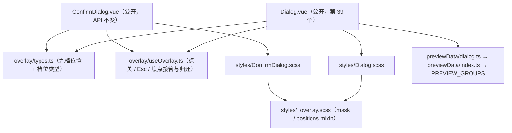

## Product Overview

依据 PrimeVue Dialog 官方文档，在项目共享 UI 组件库新增通用「对话框」组件（第 39 个公开组件）。它是 `ConfirmDialog` 之外的**通用模态容器**：标题 + 任意内容 + 可选操作区，供项目内各类功能弹窗统一使用（当前项目有 59 个自建弹窗，属后续迁移对象）。同时把弹层共用外壳能力（遮罩点关、Esc、焦点接管与归还）沉淀为组件库私有能力，与刚交付的 `ConfirmDialog` 共用。

## Core Features

- **受控显示**：`v-model:visible` 打开/关闭，关闭请求统一回写 `false`；派发显示、隐藏、隐藏完成三类时机事件。
- **结构三段**：标题栏（可关闭按钮、可整体隐藏）、内容区（恒定渲染、长内容内部滚动）、页脚（传文本或插槽才出现，常用于放按钮组）。
- **位置九档**：居中默认，另支持四边与四角贴边（模板类驱动，零 JS 定位）；**尺寸四档**驱动弹窗宽度、内边距与基准字号。
- **关闭方式**：右上角关闭按钮、Esc、点击遮罩（均可开关）；遮罩点按需「按下与抬起落在同一处」才关闭，避免误关。
- **模态与非模态**：模态时遮罩加深并声明模态语义；非模态时遮罩不遮断页面其余交互。
- **无障碍**：容器 `role="dialog"` + 标题关联/`aria-label` 兜底；打开时接管焦点（优先聚焦内容中标记为自动聚焦的元素）、关闭时把焦点归还给打开前的元素。
- **插槽**：内容、标题（带标题类名与标题 id）、页脚、关闭按钮、关闭图标、整块替换容器。
- **共享外壳**：遮罩点关 / Esc / 焦点接管与归还抽为组件库私有能力，由本组件与 `ConfirmDialog` 共用（确认框公开用法与外观不变）。
- **预览面板**：新增一个分区，提供打开态快照与可复制代码，支持全局尺寸档位联动。

## Visual Effect

半透明黑色遮罩上浮起一张浅色圆角卡片，1px 中性描边、无阴影（靠遮罩对比区分层级）；标题栏与页脚各以 1px 分隔线与内容区分开，长内容在内容区内部滚动；进入与退出为 0.12s 淡入淡出 + 卡片轻微缩放。

## 技术选型

- 沿用项目现有栈：Vue 3.5（`<script setup lang="ts">`）+ TypeScript + SCSS（`@use` + 短名 Token），**零新依赖、零 Teleport、零 ResizeObserver**。
- 组件库规范沿用既有：每个公开 `.vue` 一行 `import "./kit/theme"`、首行功能说明注释、`<style scoped>` 只 `@use` 自己那份 `styles/<Name>.scss`、单文件 ≤ 500 行。
- 官方契约以 `https://unpkg.com/primevue/dialog/index.d.ts` 与 `index.mjs` 为准（本轮已逐条核实 props/默认值/插槽作用域/事件时机/DOM 结构）。

## 实现方案

1. **抽共享弹层外壳（私有目录 `overlay/`）**：只抽三样——① 九档位置类型与档位类型（从 `confirm/types.ts` 上移，`ConfirmPosition` / `ConfirmSize` 改为别名转出，外部类型名与用法零变更）；② `useOverlay()` composable：遮罩点关（官方 `mousedown`/`mouseup` 同目标判定）、Esc 监听（`closeOnEscape` 开关 + `preventDefault`）、打开时记录 `document.activeElement` 并聚焦、关闭时解绑监听并归还焦点、卸载兜底解绑；③ `styles/_overlay.scss` 下划线部分文件导出 `overlay-mask($prefix)` / `overlay-positions($prefix)` 两个 mixin（`@each` 生成九档修饰类），由 `Dialog.scss` 与 `ConfirmDialog.scss` 各自 `@include`，避免九档位置样式两处重复。

- **不抽**遮罩 DOM 结构（两组件内部结构差异大：一个是 `ConfirmBody`，一个是 header/content/footer），**不建** `dialog/` 私有目录（Dialog 无子部件，类型内联即可）。

2. **Dialog 就地 fixed**：遮罩即布局容器（`position: fixed; inset: 0; display: flex` + 位置档位类），与 `ConfirmDialog`/`ConfirmPopup` 同款范式，避开思源浮动窗口下的层级问题；根节点 `v-if="visible"` + `Transition`，`show`/`hide`/`after-hide` 分别挂 `onEnter`/`onLeave`/`onAfterLeave`。
3. **关键决策（含理由）**：

- `dismissableMask` 默认 **`false`**（忠于官方；`ConfirmDialog` 保持 `true`，两处默认值差异在清单行与预览 README 写明）。
- `modal` 默认 **`true`**（官方 `false`，属有意差异）：本项目遮罩恒定渲染，若默认非模态会出现「透明遮罩挡住点击却看不出遮罩」的怪异态；语义收敛为「是否声明 `aria-modal` + 遮罩是否加深 + 是否允许遮罩点关」，点关条件照官方 `dismissableMask && modal`。
- 非模态时遮罩追加 `--plain` 类：背景透明 + `pointer-events: none`，卡片自身 `pointer-events: auto`（保证不遮断页面其余交互）。官方非模态的具体表现未逐条核实，故以「不遮断交互」这一语义为准并在文档标注。
- 初始焦点**可注入**：`ConfirmDialog` 继续聚焦容器（既有决策：避免危险操作被 Enter 误触），Dialog 走「容器内 `[autofocus]`（footer → header → content）→ 容器回退」。
- 遮罩点关**统一切到官方 mousedown/mouseup 同目标判定**（`ConfirmDialog` 由 `@click.self` 迁移，属可感知的小改进，需目视回归）。
- `showHeader: false` 时不渲染标题栏（连带不渲染关闭按钮），须在文档写明「此时只能靠 Esc / 遮罩 / 插槽内自建按钮关闭」。
- `aria-labelledby`：`showHeader` 且（有 `header` prop 或有 `header` 插槽）时指向 `${id}-header`，否则用 `ariaLabel`；`headerId` 由 `useId()` 生成。
- 四档几何量必须落 `componentPreview/README.md`：宽度 320/400/520/680px、内边距、基准字号 10/12/14/16；**恒定项**：`max-height: 80vh`、1px 分隔线、圆角 `$r-base`、无阴影。

4. **性能与可靠性**：仅 `watch(visible)` 一个 O(1) 副作用（绑/解绑一个 `window` 监听 + 一次 `nextTick` 聚焦），无定时器、无测量、无 rAF 循环；长内容走 CSS `overflow: auto` 内部滚动，不产生额外渲染压力；`Transition` 保证离场节点在动画结束后才移除，`onBeforeUnmount` 兜底解绑避免监听泄漏。
5. **技术债控制**：优先复用既有先例（`ConfirmDialog` 的受控范式、`confirm/types.ts` 的别名转出、`_mixins.scss` 的部分文件范式、预览框架的 `sizeable`/静态 `visible: true` 快照口径），不引入新的架构模式；不为 Dialog 建私有目录、不做官方 `dt`/`pt`/`unstyled` 与 ZIndex 管理。

## 架构设计



## 目录结构（新增 6 / 修改 9）

```
src/
├── components/
│   ├── Dialog.vue                    # [NEW] 公开组件：Transition + mask（位置档位类 + mousedown/mouseup 走 useOverlay）+ 卡片（role=dialog、aria-modal、aria-labelledby/aria-label、tabindex=-1、档位类）。props：visible（必填，v-model:visible）/ header / footer / modal(true) / closable(true) / dismissableMask(false) / closeOnEscape(true) / showHeader(true) / position(center，九档) / size(small，四档) / closeLabel(中文默认「关闭」) / ariaLabel。emits：update:visible、show、hide、after-hide。slots：default / header({ class, headerId }) / footer / closebutton({ closeCallback }) / closeicon / container({ closeCallback }，官方 maximize/drag 回调属裁剪)。公开类型别名 DialogPosition / DialogSize 照 ConfirmDialog 写法转出；不建 dialog/ 私有目录。
│   ├── overlay/
│   │   ├── types.ts                  # [NEW] OverlayPosition（九档，含「对齐官方 Dialog 取值」注释）、OverlaySize（xsmall/small/medium/large）、位置类名生成纯函数。
│   │   └── useOverlay.ts             # [NEW] 共享外壳 composable：入参 visible/dismissableMask/closeOnEscape/onDismiss/containerRef/initialFocus（可注入）；出参 handleMaskMouseDown/handleMaskMouseUp/handleKeydown；内部 watch(visible, { immediate: true }) 做焦点记录-接管-归还、Esc 监听与卸载兜底；遮罩同目标判定才关闭。
│   ├── ConfirmDialog.vue             # [MODIFY] 改为消费 overlay/：删除本地 previousActive/handleKeydown/handleMaskClick/焦点 watch，遮罩事件从 @click.self 换成 mousedown/mouseup；props/emits/slots/类名零变更。
│   ├── confirm/types.ts              # [MODIFY] ConfirmPosition / ConfirmSize 改为对 overlay/types.ts 的别名转出，其余不动（ConfirmBody/ConfirmPopup 无需改）。
│   └── styles/
│       ├── _overlay.scss             # [NEW] 下划线部分文件：overlay-mask($prefix)（fixed/inset/z-index 10000/flex/padding/半透明黑底）与 overlay-positions($prefix)（@each 生成九档 flex 对齐）。
│       ├── Dialog.scss               # [NEW] .si-dialog-mask（@include 两个 mixin；--plain 非模态版）+ .si-dialog（宽度/内边距/基准字号走档位 CSS 变量，max-height 80vh，1px --b3-border-color 边框，圆角 $r-base，无阴影）+ header（下边线 1px）+ header-actions + content（flex:1 + overflow:auto）+ footer（上边线 1px）+ 0.12s 淡入淡出与卡片 scale(0.98)。
│       └── ConfirmDialog.scss        # [MODIFY] 遮罩基础段与九档位置段改为 @include mixin，类名与声明值保持等价（视觉零变化）。
└── features/componentPreview/
    ├── previewData/dialog.ts         # [NEW] dialogGroup + dialogPreviewGroups（id: "dialog"、sizeable: true）。示例（全部静态 visible: true，code 展示真实 v-model:visible）：基础三段 / 仅内容(showHeader:false) / 页脚按钮组插槽 / topleft / bottomright / dismissable-mask=false / closable=false / header 插槽 / container 整块替换 / 长内容内部滚动 / size=large；超 300 行则拆第二数据文件。
    ├── previewData/index.ts          # [MODIFY] import dialogPreviewGroups 并加入 PREVIEW_GROUPS（紧邻 confirm 两分组）。
    └── styles/PreviewSection.scss    # [MODIFY] 追加 .si-dialog-mask.si-dialog-mask { position: absolute; z-index: 1 }（类名写两遍抬特异性到 (0,3,0)，文件内注释已要求）；若快照高度不足再补 .cp-card__stage--dialog 并在 PreviewSection.vue 的 :class 判定里加 group.id === 'dialog'。
```

文档同步（[MODIFY]）：`AGENTS.md`（第 160/168/504 行 38→39；第 181 行标题→39 且表格新增 `Dialog.vue` 行，密度对齐 `ConfirmDialog.vue` 行；第 177 行「优先复用」枚举补「对话框（模态弹层）」；目录树注释计数与枚举补 `Dialog`）、`README.md` 第 147 行、`src/features/componentPreview/README.md`（计数与清单、功能条目、弹层沙箱一节补 Dialog、具名插槽表 6 行、事件表 4 行、四档尺寸作用清单与档位细则）、`src/components/kit/README.md` 第 22 行、`src/components/kit/theme.ts` 第 14 行、`src/components/docs/components-vue3-migration-guide.md`（计数 3 处、基线文件数按 `Get-ChildItem -Recurse -File src/components` 实测重写、组件清单按字母序插入 `Dialog`、裁剪表私有子目录补 `overlay/`）。

## 关键接口（仅签名）

```ts
// src/components/overlay/useOverlay.ts
export interface OverlayOptions {
  visible: () => boolean
  dismissableMask: () => boolean
  closeOnEscape: () => boolean
  /** 关闭请求（组件内统一收敛为 emit("update:visible", false)） */
  onDismiss: () => void
  containerRef: Ref<HTMLElement | null>
  /** 初始焦点：默认聚焦容器；Dialog 传入「容器内 [autofocus] → 容器」的查找函数 */
  initialFocus?: () => HTMLElement | null
}
export function useOverlay(options: OverlayOptions): {
  handleMaskMouseDown: (event: MouseEvent) => void
  handleMaskMouseUp: (event: MouseEvent) => void
  handleKeydown: (event: KeyboardEvent) => void
}
```

## 实现注意

- **不自造路径/API**：所有落点已实测（`overlay/` 需新建；`ConfirmDialog.vue` 第 196–244 行是要迁移的本地逻辑；预览沙箱覆盖在 `styles/PreviewSection.scss` 第 78–81 行旁追加）。
- **相邻色陷阱**：`--b3-theme-surface` 与 `--b3-theme-background` 灰度仅差约 3% ⇒ header 下边线与 footer 上边线一律用 `--b3-border-color`；不使用 `box-shadow`。
- **错误色陷阱**：不得使用从未定义的 `--b3-theme-destructive`（本组件无错误态，仅作提示）。
- **禁止**：硬编码字号/字重/行高/圆角/间距（尺寸走档位 CSS 变量），标题字号 > 16px，根容器缺基准字号。
- **私有目录禁止 feature 直接导入**；`overlay/` 不得引入 `siyuan`/i18n/plugin；私有子部件不重复引 `theme`。
- **范围控制**：本次不改 `src/features/**` 任何弹窗与 SCSS（59 个自建弹窗迁移属后续独立任务），不动 `ConfirmPopup` 与其 `confirm/position.ts`。
- **验证约定**：AI 禁止执行 `pnpm lint` 与 `pnpm vite build`；允许 `read_lints`、`npx tsc --noEmit`、离线 Sass 编译（`node -e` + `require('sass').compileAsync`，逐份编译 `Dialog.scss` 与改动后的 `ConfirmDialog.scss`，二者会连带验证 `_overlay.scss`）、`pnpm validate:icons`、`pnpm i18n:verify`；PowerShell 用 `Select-String` / `Get-ChildItem`；`read_lints` 陈旧诊断须回读源码核对。

## Agent Extensions

### MCP

- **Context7**
- Purpose: 在实现 Dialog 前复核 PrimeVue Dialog 的受控语义、插槽作用域与事件时机，避免仅凭记忆写错 props 名与默认值。
- Expected outcome: 输出与 `index.d.ts`/`index.mjs` 一致的契约要点，用于校对 `Dialog.vue` 的 props 默认值、`header`/`closebutton`/`container` 插槽作用域与 `show`/`hide`/`after-hide` 触发时机。

### SubAgent

- **code-explorer**
- Purpose: 全库扫描所有写明共享组件数量或枚举组件清单的位置，确保 38 → 39 与新增 `Dialog` 条目无遗漏。
- Expected outcome: 按文件分组给出「路径 + 行号 + 原文 + 应改成什么」的清单，作为文档同步的核对依据。

### Skill

- **universal-arch-skill**
- Purpose: 对新增的 `overlay/` 私有模块、`Dialog.vue` 与 `ConfirmDialog` 重构做架构一致性审查（模块化、统一入口、设计 Token、注册完整性）。
- Expected outcome: 给出审查结论与需修正项清单，确认无违反项目架构规范之处。