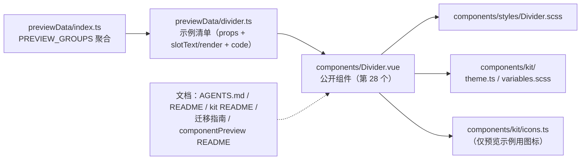

## 需求概述

在项目共享组件库中新增第 28 个公开组件**分隔线（Divider）**，对齐 PrimeVue Divider 的 API 形状：以「线的样式 × 方向 × 内容位置」三个维度描述一条分隔线，并支持在线中间放自定义内容（如分组标题、图标）。本次仅做组件库新增（组件本体 + 样式 + 预览示例 + 文档计数同步），不改动任何业务功能模块。

## 核心功能

- **三种线型**：实线（默认）、虚线、点线。
- **两个方向**：水平（默认，用于上下分节）与垂直（用于并排内容之间）。
- **内容位置三档**：水平方向取「靠左 / 居中 / 靠右」，垂直方向取「靠上 / 居中 / 靠下」；不指定时按居中处理，方向与取值不匹配时静默回落到居中。
- **可选内容**：默认插槽可在线上承载文字或图标；不传时整条线连续贯通。
- **零交互**：无点击、无悬停反馈、无内部状态，纯展示；语义上标记为分隔元素并声明方向，屏幕阅读器可正确识别。
- **自适应主题**：线色读取运行环境主题变量，明暗主题自动跟随；宽度铺满父容器（水平）或撑满父容器高度（垂直）。
- **预览可见**：可在组件预览面板直接看到三种线型、三档内容位置、带文字与图标内容、垂直分隔等真实渲染效果，并复制对应用法代码。
- **可外迁**：零业务耦合（无文案、不依赖任何功能模块），可与其他共享组件一起整体复制到普通 Vue 3 项目复用。

## 视觉表现

- 水平分隔线为 1 像素细线，上下各留出紧凑间距；带内容时线在内容两侧各留一小段间隙，形成「线—内容—线」的三段式节奏。
- 内容靠左时左侧线段极短（内容贴左边缘），右侧保留整段长线；靠右为其镜像；居中则两侧等分。
- 垂直分隔线为 1 像素细竖线，左右各留出间距，用于并排区块之间；父容器高度不足时仍保证最小可见高度，不会退化成看不见的零高度。
- 线型差异通过线本身的实线 / 虚线 / 点线表达，颜色取中性边框色以保证明暗主题下均清晰可辨。

## 技术栈选择

无新增依赖，全部复用现有栈：

| 项 | 选择 |
| --- | --- |
| 框架 | Vue 3 + TypeScript（`<script setup>` + `withDefaults`，与 `Card.vue` / `Timeline.vue` 一致） |
| 样式 | SCSS，强制分离到 `src/components/styles/Divider.scss`；`.vue` 的 `<style scoped>` 只写 `@use './styles/Divider.scss';` |
| 设计 Token | 真源 `src/components/kit/variables.scss`，**新代码一律用短名**（`$s-3` / `$s-6` / `$c-border`）；组件内 scss 用 `@use '../kit/variables.scss' as *;` |
| 主题 | 消费 `--b3-border-color`（线的颜色）；公开组件必须 `import "./kit/theme"` 以保证外迁时自带默认主题 |
| 预览 | 复用现有 `componentPreview` 框架（清单驱动），**无需扩展框架**：Divider 只有默认插槽，用 `slotText` / `render` 即可覆盖全部示例 |
| 图标 | 仅预览示例可能用到，只能取 `src/components/kit/icons.ts` 已注册的 `IconKey` |


## 实现方案

### 核心策略

组件是一个「单根元素 + 可选内容的三段式」纯展示构件：

```html
<div :class="rootClasses" role="separator" :aria-orientation="orientation">
  <template v-if="$slots.default">
    <span class="si-divider__line" aria-hidden="true" />
    <span class="si-divider__content"><slot /></span>
    <span class="si-divider__line" aria-hidden="true" />
  </template>
</div>
```

- 无内容：根元素自己就是那条线（水平 `border-top`、垂直 `border-left`）。
- 有内容：根元素切换为 flex 容器，两段真实线段 + 中间内容容器；按内容位置隐藏**首段**或**末段**线。
- `$slots.default` 判断写在**模板**里，不写进 `computed` —— 本项目已记录「`useSlots()` 返回的 slots 对象非响应式，放进 computed 会缓存失效」这一坑。

### 关键决策与理由

1. **不复刻官方的「根元素画线 + 内容遮罩背景」实现**：官方的内容容器靠背景色遮盖穿过的线，而遮罩底色必须等于父容器底色；本项目父容器底色可能是 `--b3-theme-background`、`--b3-theme-surface` 或 Card 内部等多种，遮罩必露底色色块。改用**两段真实线段**实现，视觉等价且零底色假设。此为对官方实现的**有意偏离，必须写入文档**。
2. **`align` 语义严格复刻官方**（已从官方 style preset 源码读到 `classes` + `inlineStyles` 原样实现）：①未传 `align` 时按 `center` 处理（不是左对齐）；②取值与方向绑定（水平只认 `left/center/right`，垂直只认 `top/center/bottom`）；③**交叉组合（如水平 + `top`）不报错、不加对齐类、样式回落居中**。本项目用「隐藏首段 / 末段线」表达位置，与官方「`justify-content` 贴边」在视觉上一致。
3. **不建私有目录、不导出类型**：组件只有 3 个 props + 1 个默认插槽，三个字面量联合类型定义在 SFC 内即可。按 Rule of Three 与「仅 1 处使用且逻辑简单不提取」，建 `divider/` 目录属过度模块化（与 `Card.vue` / `Tag.vue` / `Badge.vue` 同型）。
4. **线色必须取 `--b3-border-color`**：项目已知「相邻色陷阱」——`--b3-theme-surface`(#f7f7f5) 与 `--b3-theme-background`(#ffffff) 灰度仅差约 3%，画需区分的细线不可辨。
5. **垂直方向必须有 `min-height` 兜底**（`$s-6`，24px）：垂直 Divider 在非 flex / 无确定高度的父容器中高度会塌成 0、完全不可见，这是 vertical divider 的经典坑；同时文档写明「垂直分隔需要父容器有确定高度，本组件已给最小高度兜底」。
6. **默认间距由组件给出，可被调用方覆盖**：水平 `margin: $s-3 0`、垂直 `margin: 0 $s-3`（Codex 紧凑风格；官方主题为 `1rem`，属有意差异化）。单根元素 ⇒ attrs 自然透传，调用方可直接 `class` / `style` / `margin` 覆盖。
7. **不做什么（YAGNI）**：不加 `size` 档位与 `label` prop（官方用默认插槽承载内容，保持插槽驱动）；不引入官方 `pt` / `unstyled` / `dt`（本项目未采用 PT 体系）；不新增 i18n（组件库零 i18n，组件内无任何文案）；不改 `icons.ts` / `settings.ts` / `features/config.ts`；不迁移全库 22 处 feature 自建分隔线（后续独立任务）。

### 性能与可靠性

- 渲染为**零运行时计算**：仅 3 个纯字符串拼接的 class 派生，无 `ref` / `watch` / 定时器 / 事件监听 / 副作用。
- 有内容时 VNode 数约 4 个（根 + 线段 ×2 + 内容容器），无内容时仅 1 个根元素 —— 与原生 `<hr>` 同量级。
- 对齐与线型全部走 CSS（根类 + 一个 CSS 变量驱动 `border-style`），切档不触发任何逻辑分支。
- 无网络、无存储、无 DOM 操作；卸载即自然回收，无需 `destroy`。

## Implementation Notes

### 必须遵守的项目硬规则

- **文件头注释（强制）**：`Divider.vue` 首行 `<!-- 分隔线：... -->`（10~30 字职责说明）。
- **`import "./kit/theme"`**：新增公开组件必须补这一行（`src/components/kit/README.md` 第 22 行的约定）。
- **样式分离**：`.vue` 的 `<style scoped lang="scss">` 只允许 `@use './styles/Divider.scss';`。
- **短名 Token / 禁用事项**：线宽 1px 与最小高度 24px 属几何量，若全局无对应 Token 需行内注明 `// 无对应 Token`；禁用 `box-shadow`；禁止硬编码颜色（线色走 CSS 变量 + `$c-border` 兜底）。
- **组件库零业务耦合**：`src/components/**` 禁止 import i18n / plugin / `siyuan` / `@/features`。

### 预览示例的垂直方向技巧（避免改预览框架）

`.cp-card__stage` 是 `display: flex; align-items: center; justify-content: center; min-height: 96px; padding: $s-4`，垂直 Divider 作为唯一子元素时靠 `align-self: stretch` 可撑到约 64px。若示例需展示更高、更规整的垂直形态，**直接给示例传 `props: { style: "height: 80px" }` 即可**（Divider 单根元素，`style` 作为 fallthrough attr 落到根元素上），`code` 中同步写 `style="height: 80px"`。**这样无需改动 `PreviewSection.vue` 的舞台高度映射，也无需新增 `.cp-card__stage--divider` 沙箱类。**

### 变更半径控制

- 新增 3 个文件（组件 + 样式 + 预览数据）、修改 1 个预览聚合入口、修改 5 份文档计数。**不触碰任何 feature、不改预览框架、不改 i18n / 图标注册 / 设置 / 功能配置。**
- 文档计数同步是机械但必需的收尾（27 → 28），漏改会让 `AGENTS.md` 的组件清单与真实库漂移。

## Architecture Design

依赖方向单向无新增模块，仍是「预览清单 → 共享组件 → kit 支撑」：



组件 DOM 结构：

```text
<div class="si-divider si-divider--{layout} si-divider--{type} si-divider--{align}[ si-divider--with-content]"
     role="separator" aria-orientation="horizontal|vertical">     ← 单根，attrs 透传
  ├─（无内容）根元素自身即线段：水平 border-top / 垂直 border-left
  └─（有内容）<span class="si-divider__line" />      ← 首段线段，left / top 时隐藏
               <span class="si-divider__content"><slot /></span>
               <span class="si-divider__line" />      ← 末段线段，right / bottom 时隐藏
```

## Directory Structure

```text
siyuanPluginVueSN/
├── src/
│   ├── components/
│   │   ├── Divider.vue                        # [NEW] 公开组件。单根 <div>，role="separator" +
│   │   │                                     #       aria-orientation；props = type(solid 默认) /
│   │   │                                     #       layout(horizontal 默认) / align(无默认值，
│   │   │                                     #       按方向归一为 center)；有内容时渲染两段线段 +
│   │   │                                     #       内容容器，按对齐隐藏首/末段；类型定义在 SFC 内、
│   │   │                                     #       不建私有目录；import "./kit/theme"；
│   │   │                                     #       <style scoped> 仅 @use './styles/Divider.scss'
│   │   └── styles/
│   │       └── Divider.scss                   # [NEW] 组件样式。短名 Token；线色
│   │                                          #       var(--b3-border-color, $c-border)（相邻色陷阱）；
│   │                                          #       线型经 --si-divider-style CSS 变量由档位类改写；
│   │                                          #       水平有内容时 flex + 两段 __line{flex:1}；
│   │                                          #       垂直 align-self:stretch + min-height 兜底；
│   │                                          #       间距 水平 $s-3 0 / 垂直 0 $s-3；禁用 box-shadow
│   └── features/
│       └── componentPreview/
│           ├── previewData/
│           │   ├── divider.ts                 # [NEW] 预览分组数据（双导出 dividerGroup +
│           │   │                              #       dividerPreviewGroups）。9 例：基础 solid /
│           │   │                              #       dashed / dotted / 带文字内容（居中）/
│           │   │                              #       align=left / align=right / 带图标内容（render +
│           │   │                              #       IconWrapper，图标取已注册 IconKey）/
│           │   │                              #       垂直 layout=vertical（props.style 给高度）/
│           │   │                              #       垂直 + 内容（layout=vertical + align=top）。
│           │   │                              #       不标记 sizeable（无 size prop）；每例 props 与
│           │   │                              #       code 同源
│           │   └── index.ts                   # [MODIFY] import 并加入 PREVIEW_GROUPS（挨着 display 分组）
│           └── README.md                      # [MODIFY] 计数 27→28；全组件清单插入 Divider；
│                                              #       新增「分隔线」功能条（三档线型 / 两个方向 /
│                                              #       align 语义含未传按 center 与交叉组合回落、
│                                              #       仅默认插槽、两段真实线段而非官方遮罩法、
│                                              #       垂直需父容器高度且有 min-height 兜底、
│                                              #       默认间距可被调用方覆盖）；「不参与档位切换」的注
│                                              #       补上 Divider（无 size prop）
├── AGENTS.md                                  # [MODIFY] 5 处计数 27→28；组件清单表新增 Divider.vue 行；
│                                              #          「优先复用」枚举补「分隔线」；目录树注释补 Divider
├── README.md                                  # [MODIFY] 共享 UI 组件计数 27→28
└── src/components/
    ├── kit/README.md                          # [MODIFY] 「由 27 个公开组件…触发」→ 28
    └── docs/components-vue3-migration-guide.md # [MODIFY] 计数 27→28、基线文件数 86→88
                                                #          （新增 Divider.vue + styles/Divider.scss）、
                                                #          组件清单插入 Divider、相对路径引用那句改 28
```

**无需改动**：`src/components/kit/variables.scss`（无新 Token）、`src/i18n/**`（组件库零 i18n）、`src/config/icons.ts`、`src/config/settings.ts`、`src/features/config.ts`、`src/features/index.ts`（Divider 是组件不是功能模块，无需 8 步注册）、以及全部 feature 文件。

## Key Code Structures

1）组件对外契约（`src/components/Divider.vue`，仅签名）：

```ts
type DividerType = "solid" | "dashed" | "dotted"
type DividerLayout = "horizontal" | "vertical"
type DividerAlign = "left" | "center" | "right" | "top" | "bottom"

interface Props {
  /** 线型，默认 solid */
  type?: DividerType
  /** 方向，默认 horizontal */
  layout?: DividerLayout
  /** 内容位置：水平用 left/center/right，垂直用 top/center/bottom；不传按 center，取值与方向不匹配时回落到 center */
  align?: DividerAlign
}
// 无 defineEmits（纯展示、无自有事件）
// 插槽：仅默认插槽（无具名、无作用域参数）
```

2）`align` 归一规则（复刻官方语义，实现时按此落地）：

| layout | align 取值 | 归一结果 | 表现 |
| --- | --- | --- | --- |
| horizontal | 未传 / `center` | center | 两段线段等分 |
| horizontal | `left` | left | 隐藏首段线，内容贴左 |
| horizontal | `right` | right | 隐藏末段线，内容贴右 |
| vertical | 未传 / `center` | center | 两段线段等分 |
| vertical | `top` | top | 隐藏首段线，内容贴顶 |
| vertical | `bottom` | bottom | 隐藏末段线，内容贴底 |
| 任意 | 交叉组合（水平 + `top` / 垂直 + `left`） | center | 静默回落居中，不报错 |


## Agent Extensions

### MCP

- **Context7**
- Purpose: 在实现组件前再次交叉核对 PrimeVue Divider 的权威契约（3 个业务 props 的类型与默认值、仅 `default` 一个插槽且无作用域参数、无敌对自定义事件、PT 仅 `root`/`content`），并在写文档措辞时对齐官方原文。
- Expected outcome: 产出一份可对照的官方契约结论，确认 `type`/`layout`/`align` 的取值与默认值与实现、文档三处完全一致，避免凭记忆写文档导致 API 漂移。

### Skill

- **universal-arch-skill**
- Purpose: 用其「模式 C：代码架构审查」的 Vue/TS 审查清单核对本次新增 —— 文件头注释是否补齐、`.vue` 是否仅 `@use` 一份样式、设计 Token 是否全短名且无硬编码颜色/间距、组件库是否仍零 i18n / 零 plugin 依赖、是否按 Rule of Three 避免了过度模块化（未建私有目录）、以及「改共享组件 API 必须同步预览清单与文档」是否落实。
- Expected outcome: 输出逐条对照的审查结论与需修正项清单；若发现违规，当场修正后再交付用户执行 `pnpm lint` / `pnpm i18n:verify` / `pnpm validate:icons` / `npx tsc --noEmit` 四道验证，并在预览面板目视 Divider 分区。