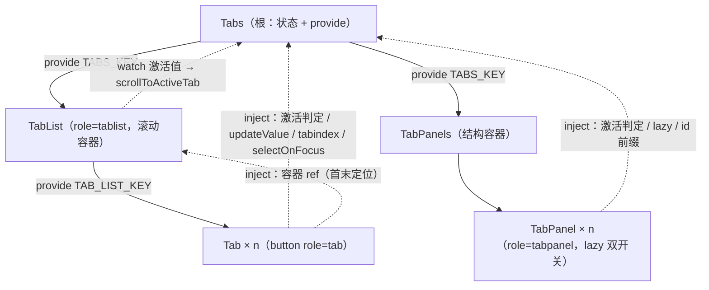

## 产品概述

在项目共享组件库中新增「标签页」能力，采用官方五件套形态：`Tabs`（根）、`TabList`（标签栏容器）、`Tab`（单个标签）、`TabPanels`（面板容器）、`TabPanel`（单个面板）。`Tab` 与 `TabPanel` 通过同一个 `value` 配对，调用方按官方文档写法即可组装出完整的选项卡界面。共享组件数量由 31 增至 36。

## 核心功能

- **标签切换**：点击标签即切换对应面板；既可外部受控（双向绑定当前值），也可不绑定而由组件内部自行切换。
- **键盘操作与无障碍**：左/右方向键在标签间移动焦点（到端点回绕）、Home/End 跳到首/末标签、Enter/空格选中；仅激活标签可被 Tab 键停留；标签与面板之间有完整的无障碍关联与语义角色，读屏可正确播报标签名与选中态。
- **溢出滚动**：标签栏横向溢出时可滚动，滚动条隐藏；当前激活标签会自动滚入可视区域（默认仅在贴边/被裁切时才滚动，也可设为始终居中）。
- **面板惰性渲染**：可选开启后，未激活的面板完全不进入页面（切走再回来会重置内部状态）；默认关闭，所有面板保留在页面中仅隐藏，切换不丢状态。
- **禁用项**：单个标签可禁用，键盘导航与点击均会跳过。
- **尺寸档位**：四档（超小/小/中/大），默认小。

## 视觉与交互效果

标签栏为一行文字标签，底部有一条细分隔线；当前激活标签的文字为主色调并带一条 2px 主色下划线，未激活为次级文字色，悬停时文字变为主色；禁用标签为浅灰且不可点击。鼠标悬停与键盘聚焦有清晰的视觉反馈（悬停变色、聚焦轮廓），切换无横向位移或抖动。面板区域与标签栏之间以细线分隔，面板自带内边距与基准字号。长标签栏在窄面板中可横向滑动，当前标签始终可见。整体配色、字号、间距与现有组件库完全一致，明暗主题下均正常。

## 范围

仅组件库新增 + 预览面板用法清单 + 组件文档计数同步。项目内已有的自建标签实现本次不动，其迁移属后续独立任务。

## 技术栈选择

沿用项目既有栈，**零新增依赖**：Vue 3.5.42（`<script setup lang="ts">` + `defineComponent` 内联子组件）+ TypeScript + SCSS（短名 Token，`@use` 单一 ent）。

- 复用既有设施：`useId()`（项目已在 `Panel.vue` / `Listbox.vue` / `DatePicker.vue` / `Textarea.vue` / `select/useSelectNavigation.ts` 中使用）生成实例 id 前缀；`kit/variables.scss` 短名 Token（`$t-2xs` / `$t-xs` / `$t-sm` / `$t-base` / `$s-*` / `$r-*` / `$ff-zh`）；每个公开 `.vue` 首行功能注释 + 一行 `import "./kit/theme"`；`provide` / `inject` 做父子供值（先例：`Splitter` → `SplitterPanel`）。
- 预览侧复用既有 `PreviewGroup` / `PreviewExample`（已有 `props` / `render` / `slots` / `sizeable`），**本次不需要扩展预览框架**（见实施说明）。

## 实现方案

### 总体策略

完全对齐官方五件套的 DOM 契约与无障碍属性，用最小自研替换官方两处重量级实现（滑动墨条测量、PassThrough/多态渲染），其余语义照抄。

### 关键契约（已从官方类型声明与 `index.mjs` 编译产物逐条核实）

- **Tabs（根）**：`provide` 上下文；内部状态 `d_value` 初始取 `value`，`watch(value)` 单向覆盖（受控），`value` 不传时自持（非受控）；`updateValue(next)` **幂等**——值相同时不派发；仅 `emit("update:value")`。
- **TabList**：`div > div[role="tablist"][aria-orientation="horizontal"]`，该容器即滚动容器；**键盘逻辑不在 TabList**，它只通过 `provide` 暴露容器 ref 给 `Tab` 做首/末定位。
- **Tab**：`<button type="button">`，`role="tab"` + `aria-selected` + `aria-controls` + `id`（`${tabsId}_tab_${value}`）+ `tabindex`（`active ? tabindex : -1`，即 roving）+ `disabled`；`aria-label` / `aria-labelledby` 由调用方经 attrs 透传（组件零内置文案）。
- **TabPanel**：`role="tabpanel"` + `id`（`${tabsId}_tabpanel_${value}`）+ `aria-labelledby`（指向对应 Tab）+ `tabindex`（与 Tab 共用同一个 prop）；**默认插槽无作用域参数**（官方仅在 `asChild` 模式下才传，本项目不做 `asChild`）。
- **`lazy` 双开关**（照抄官方语义）：`v-if="lazy ? active : true"` + `v-show="lazy ? true : active"`。

### 关键决策与取舍

1. **值类型与比较**：`value` 限定 `string | number`，用**严格相等**判定激活。理由：官方 `equals()` 深比较是为支持任意类型，本项目收窄类型后深比较纯属额外开销，且 `declare` 层面也不再需要。差异写入清单与预览 README。
2. **活动指示器 = 静态下划线**（激活 Tab 自身 `::after`，2px 主色）。官方为滑动墨条（`ResizeObserver` + `mounted` 后 150ms 定时器测量）。取舍：墨条在思源面板宽度频繁变化时存在首帧错位与抖动风险，且需两个 Observer + 定时器；静态下划线零测量、零清理逻辑，观感差异仅在切换瞬间的横向滑动。若后续确需滑动观感，再按「测量 `offsetLeft` / `offsetWidth` 写 CSS 变量」补 ~20 行。
3. **`tabindex` prop 语义**：照抄官方——roving 基准值（激活项取该值，其余 `-1`），并同时打到 `TabPanel` 上；传 `-1` 可把整组移出 Tab 序列（文档写明）。
4. **键盘导航的相邻项查找**：改为 **容器内 `querySelectorAll('[role="tab"]')` 后过滤未禁用项成数组**，按索引取上/下一项、回绕取首/末。取舍：官方走 DOM 兄弟遍历并额外跳过 activebar；本项目无墨条元素，数组方案边界 case 更少、`Home`/`End` 直接取数组首末，且天然跳过禁用项。键位完全照抄官方：`ArrowRight` / `ArrowLeft`（回绕 + `preventDefault`）、`Home` / `End`（`preventDefault`）、`PageUp` / `PageDown`（仅滚动不聚焦 + `preventDefault`）、`Enter` / `NumpadEnter` / `Space`（选中，不 `preventDefault`）；焦点移动 = `focus()` + `scrollIntoView({ block: "nearest" })`。
5. **`scrollStrategy` 保留官方完整语义**：`false`（禁用）/ 函数（交给调用方）/ `"center"`（居中）/ 其余（含默认 `"nearest"`：留 `contentWidth * 0.1` 缓冲，仅越界时滚动）；结果钳制到 `[0, scrollWidth - clientWidth]` 后 `scrollTo({ behavior: "smooth" })`；RTL 用 `Math.abs` 归一化读数、写回取负。触发点：`TabList` 监听激活值（`flush: "post"`）后调用。
6. **不做**（明确裁剪，写入文档）：`showNavigators` 及 `previcon` / `nexticon`、`scrollable`（v5 已废弃）、`as` / `asChild` 多态渲染、`dt` / `pt` / `ptOptions` / `unstyled`。
7. **`size` 档位**：Tabs 根输出单一档位 CSS 变量组（`--si-tabs-*`）供 5 个组件消费（先例：`Splitter` → `SplitterPanel`）；随档位变化的量 = 标签**字号（10 / 12 / 14 / 16）**、标签水平内边距、面板内边距；**不随档位变化**：下划线厚度（2px）、标签栏下边线（1px）。此表写入 `componentPreview/README.md`。
8. **私有目录拆分**：`tabs/types.ts` 只放纯类型（`TabsValue` / `TabsSize` / `TabsScrollStrategy`），`tabs/context.ts` 放两个 `InjectionKey` + `useTabsContext()` / `useTabListContext()`（含脱离容器时的清晰报错）。分开的理由：`InjectionKey` 是运行时常量，`types.ts` 保持零运行时依赖，避免类型文件被当作运行时模块引用。
9. **「优先复用」枚举**：`AGENTS.md` 第 177 行补「标签页 / 选项卡」，此后 feature 自建 tab 属违规。

### 性能与可靠性

- 热路径（切换/键盘）为 O(1)～O(n)（n = 标签数，仅在按键时执行一次 `querySelectorAll`；n 通常 < 20），无 Observer、无定时器、无 `getBoundingClientRect` 批量测量，避免布局抖动。
- 自动滚入视野仅在激活值变化时触发一次，`scrollStrategy: false` 时直接短路。
- `updateValue` 幂等，防止父级未回写时出现重复 emit 与无谓渲染。
- 非受控模式下 `watch(value)` 只在外部显式传入新值时覆盖，避免与内部状态互相打架。

## 实现说明（执行要点）

- **预览框架无需改动（已验证）**：官方 Tabs 原生支持非受控，而 `PreviewSection.vue` 的 `isControlledComponent()` 只给 `modelValue` 注入受控绑定（不会碰 `value`）⇒ 预览示例**默认不传 `value`**，点击即可真实切换。复合示例用既有 `render` 组装 `TabList` / `TabPanels` 子树（`render` 返回的是**子节点数组**，不是组件本身，参照 `previewData/inputGroup.ts`）；`sizeable: true` 让 `resolveProps` 注入全局档位（档位同时透传给 `Tab` 与 `TabPanel`）。
- **`Tabs` 根自带 `width: 100%`**：免去新增 `.cp-card__stage--tabs` 舞台钩子（`align-items: center` 下显式宽度仍生效）。仅当视觉回归发现需要高度时再追加钩子。
- **attrs 透传**：五个组件均为单根，`class` / `style` 自动落到根元素；`TabList` 的其余 attrs 落到 `role="tablist"` 容器，便于调用方用 `aria-label` 命名整组。
- **Token 陷阱**：标签栏下边线与面板分隔线一律 `--b3-border-color`（`--b3-theme-surface` 与 `--b3-theme-background` 仅差约 3%，画不了细线）；错误/危险态若用到必须 `--b3-theme-error`；禁用项用次级文字色 + 降低不透明度，不用 `box-shadow`。
- **规范红线**：组件库零 i18n / 零 plugin / 零 `siyuan` 导入；无内置文案（`aria-label` 由调用方提供）；单文件 ≤ 500 行；每份 scss 只被对应 `.vue` 的 `<style scoped>` `@use`；`previewData/tabs.ts` 超 300 行则拆第二个文件。
- **文档计数一次性改全**：`31 → 36` 出现在 `AGENTS.md`（160 / 168 / 181 / 459 / 497 行）、根 `README.md`（147 行）、`componentPreview/README.md`（第 3、8 行及功能/尺寸/插槽/扩展指南四节）、`components/kit/README.md`（22 行）、`components/docs/components-vue3-migration-guide.md`（第 3、62、146 行 + 裁剪表 + 基线文件数实测）。执行前用正则全库扫一遍 `31 个`，避免遗漏。

## 架构设计



私有模块 `tabs/`（types + context）被 5 个组件共同引用；对外只暴露 5 个平铺组件（`@/components/Xxx.vue`）。

## 目录结构

新增 13 个文件、修改 6 个文件。

```
src/
├── components/
│   ├── Tabs.vue                     # [NEW] 公开根组件。props：value / lazy(false) / selectOnFocus(false) / tabindex(0) / scrollStrategy("nearest") / size("small")；emits：update:value。内部 d_value 支持受控与非受控；幂等 updateValue；useId() 生成 id 前缀；实现 scrollToActiveTab（false/函数/center/nearest 四分支 + 10% 缓冲 + 钳制 + smooth + RTL）；provide TABS_KEY
│   ├── TabList.vue                  # [NEW] 标签栏容器。div > div[role="tablist"][aria-orientation="horizontal"]，该容器 overflow-x:auto 且隐藏滚动条；provide TAB_LIST_KEY（暴露容器 ref）；watch 激活值（flush:"post"）调用 Tabs 的 scrollToActiveTab；属主容器 attrs 透传（供 aria-label 命名整组）
│   ├── Tab.vue                      # [NEW] 单个标签。<button type="button"> + role/aria-selected/aria-controls/id/tabindex/disabled；点击选中；onFocus 仅在 selectOnFocus 时选中；完整键盘键位（←→ 回绕、Home/End、PageUp/PageDown 仅滚动、Enter/NumpadEnter/Space 选中）；相邻项查找走容器内 [role="tab"] 数组过滤；默认插槽为标签内容 + 可选前置图标
│   ├── TabPanels.vue                # [NEW] 面板容器（纯结构 div + 默认插槽，无 role）
│   ├── TabPanel.vue                 # [NEW] 单个面板。role="tabpanel" + id + aria-labelledby + tabindex + data-si-active；v-if="lazy ? active : true" 与 v-show="lazy ? true : active" 双开关；默认插槽无作用域参数
│   ├── tabs/
│   │   ├── types.ts                 # [NEW] 私有类型：TabsValue（string | number）、TabsSize（xsmall/small/medium/large）、TabsScrollStrategy（"nearest" | "center" | false | 自定义函数）、TabsContext、TabListContext。禁止 feature 直接导入
│   │   └── context.ts               # [NEW] TABS_KEY / TAB_LIST_KEY 两个 InjectionKey + useTabsContext() / useTabListContext()（脱离容器时给出清晰错误）
│   └── styles/
│       ├── Tabs.scss                # [NEW] 档位变量组（字号 10/12/14/16、标签横向内边距、面板内边距）、根基准字号、width:100%
│       ├── TabList.scss             # [NEW] 标签栏：overflow-x auto + 隐藏滚动条 + 底部 1px --b3-border-color + 滚动留白
│       ├── Tab.scss                 # [NEW] 标签本体：字号/内边距取档位变量、悬停变主色、激活文字主色 + 2px ::after 下划线、禁用浅灰不可点、聚焦轮廓
│       ├── TabPanels.scss           # [NEW] 面板容器内边距与基准字号
│       └── TabPanel.scss            # [NEW] 面板：上边线 --b3-border-color、聚焦轮廓、display:none 隐藏兜底
├── features/componentPreview/
│   ├── previewData/
│   │   ├── tabs.ts                  # [NEW] 预览分区数据（双导出 tabsGroup + tabsPreviewGroups，sizeable: true）。九例：基础三页 / 标签带图标 / 禁用项 / 受控 v-model:value / lazy 与默认对比（面板内放输入框演示状态保留差异）/ 长列表 20+ 项 / scrollStrategy="center" / size="large" / 富内容面板；复合子树用 render 组装，示例默认不传 value 以保证点击可交互；每例都有对应可复制 code
│   │   └── index.ts                 # [MODIFY] import tabsPreviewGroups 并加入 PREVIEW_GROUPS 聚合数组
├── README.md                        # [MODIFY] 第 147 行「共享 UI 组件（31 个原子组件…）」→ 36
AGENTS.md                            # [MODIFY] 160 / 168 / 181 / 459 / 497 行 31→36；第 177 行「优先复用」枚举补「标签页 / 选项卡」；「### 3. 组件清单」表格新增 5 行（Tabs.vue / TabList.vue / Tab.vue / TabPanels.vue / TabPanel.vue），信息密度对齐 Splitter.vue / SplitterPanel.vue 行，并写明与本项目有意差异（静态下划线、严格相等、裁剪 showNavigators/previcon/nexticon/scrollable/asChild/PT、五件套共用「Tabs」一个预览分区）
src/features/componentPreview/README.md   # [MODIFY] 第 3、8 行 31→36 并补 Tabs 五件套；「## 功能」新增标签页条目（受控/非受控、lazy 双开关与状态丢失取舍、roving tabindex 与键位表、scrollStrategy、四档 size 驱动项、裁剪清单）；「具名插槽」表补 Tab / TabPanel / Tabs 三行说明（均无具名插槽、TabPanel 默认插槽无作用域参数、previcon/nexticon 已裁剪）；清单扩展指南补五件套复合写法与 sizeable 用法
src/components/kit/README.md              # [MODIFY] 第 22 行 31→36
src/components/docs/components-vue3-migration-guide.md  # [MODIFY] 第 3、62、146 行 31→36 并在清单补 5 个组件名；第 105 行裁剪表补 tabs/ 私有目录；基线文件数与 Get-ChildItem 实测对齐
```

## 关键代码结构

组件库私有上下文契约（被 5 个组件共同依赖，必须精确）：

```ts
// src/components/tabs/types.ts（私有：禁止 feature 直接导入）
export type TabsValue = string | number
export type TabsSize = "xsmall" | "small" | "medium" | "large"
export type TabsScrollStrategy = "nearest" | "center" | false | ((content: HTMLElement, tab: HTMLElement) => void)

export interface TabsContext {
  value: ComputedRef<TabsValue | undefined>   // 激活值（受控与非受控统一入口）
  updateValue: (next: TabsValue) => void      // 幂等：值未变不派发 update:value
  lazy: boolean                               // true 时未激活面板不进 DOM
  selectOnFocus: boolean                      // 焦点移入即选中
  tabindex: number                            // roving 基准（激活项取该值，其余 -1；面板共用）
  scrollStrategy: TabsScrollStrategy
  id: string                                  // id 前缀：`${id}_tab_${value}` / `${id}_tabpanel_${value}`
  scrollToActiveTab: (content: HTMLElement, tab: HTMLElement) => void
}

export interface TabListContext {
  contentRef: Ref<HTMLElement | null>         // role="tablist" 滚动容器，供 Tab 做首末定位与方向键查找
}
```

## 使用的 Agent 扩展

### MCP

- **Context7**
- Purpose: 实现阶段再次核对官方 Tabs 的键盘键位表、aria 属性拼法与 `scrollStrategy` 语义，避免凭记忆写错契约。
- Expected outcome: 得到逐条可对照的 props / 键盘 / aria 事实，落实为 Tab 与 TabPanel 的绑定表达式。

### Skill

- **universal-arch-skill**
- Purpose: 交付前按项目架构规范审查新增组件（统一入口与命名、样式分离、设计 Token 使用、私有目录边界、文档注册完整性）。
- Expected outcome: 产出审查结论并按结论修正命名、Token 与私有目录导入边界问题。

### SubAgent

- **code-explorer**
- Purpose: 全库扫描 `31 个`／组件清单类引用与既有自建 tab 落点，确认文档计数无遗漏、并核实没有需要同步的其它文件。
- Expected outcome: 给出完整的待改文件行号清单，避免文档计数不同步。