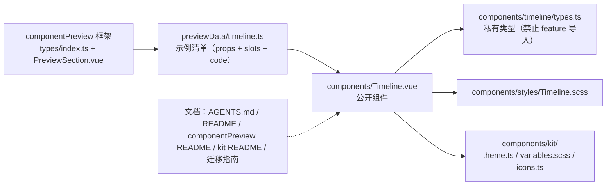

## User Requirements

在现有插件的共享组件体系中新增一个**时间线（Timeline）通用组件**，对齐 PrimeVue Timeline 的核心能力并做裁剪：只做垂直时间线，去掉水平布局与连接线自定义插槽。本次仅做组件库新增（组件本体 + 样式 + 预览示例 + 文档同步），不改动任何已有功能模块。

## Product Overview

时间线用于把「一串按先后发生的事件」可视化：左侧（或两侧）排列事件内容，中间由一条竖线串起各节点，节点上可放圆点、序号、图标或缩略图。调用方只需提供事件数组，并用三个内容槽位分别描述「主内容 / 对侧信息 / 节点」，组件本身不干预数据结构、不内置任何文案。

组件以三种形态呈现：

- 竖向居左（默认）：竖线靠左，主内容在竖线右侧，对侧信息落在左侧留白区并贴线右对齐。
- 竖向居右（镜像）：竖线靠右，主内容在竖线左侧，对侧信息贴线左对齐。
- 竖向交错：竖线居中，主内容沿竖线左右交替，形成「卡片—日期—卡片—日期」的节奏。

## Core Features

- **三档对齐**：默认居左、可镜像居右、可左右交错；交错形态按事件顺序自动判定所在侧。
- **三类内容槽位**：主内容（必填）、对侧信息（可选，如时间戳）、节点（可选，不传则回退为内置圆点）；三者的内容均由调用方决定，组件只负责排布。
- **内置默认节点**：直径 10px 的空心圆，主题色描边加背景色填充；连接线为 2px 细竖线，自节点向下延伸，最后一项不再延长。
- **四档尺寸**：仅调整字号（10 / 12 / 14 / 16px），节点直径与线宽保持恒定，保证跨档视觉稳定。
- **纯展示无交互**：组件内不含任何可聚焦元素、无 hover 变形、无内置过渡、无自有事件；节点上的点击行为由调用方在自己的槽位内容里提供。
- **明暗自适应**：全部颜色取自运行环境主题变量，随主题切换自动变化；宽度铺满容器，不设固定尺寸。
- **预览可见**：可在组件预览面板中直接看到三档对齐、对侧信息、自定义节点、尺寸档位等真实渲染效果，并复制对应用法代码。
- **可外迁**：组件零业务耦合（不含文案、不依赖具体功能模块），可与其他共享组件一起整体复制到普通项目中复用。

## 技术栈选择

无新增依赖，全部复用现有栈：

| 项 | 选择 |
| --- | --- |
| 框架 | Vue 3 + TypeScript（`<script setup>` + `withDefaults`，与 `Button`/`Paginator`/`Card` 一致） |
| 样式 | SCSS（强制分离到 `src/components/styles/<Name>.scss`，`.vue` 只 `@use` 一份） |
| 设计 Token | 真源 `src/components/kit/variables.scss`，**新代码一律用短名**（`$s-px6` / `$t-xs` / `$r-full` / `$ff-zh`），并与 `styles/_mixins.scss` 配合 |
| 主题 | 消费思源 `--b3-theme-*` / `--b3-border-color`；新公开组件必须 `import "./kit/theme"` 保证外迁时自带默认主题 |
| 预览 | 复用现有 `src/features/componentPreview/` 框架（清单驱动），不新增依赖 |
| 图标 | 仅预览示例可能用到，只能取 `src/components/kit/icons.ts` 已注册的 `IconKey`（`check` 已存在） |


## 实现方案

### 核心策略

组件就是一个「语义化有序列表 + 每项三段式布局」的纯展示构件：根节点 `<ol>` 承载列表语义并透传外部 attrs；每个事件是一个 `<li>`，内部按 `对侧容器 | 分隔列（节点 + 连接线） | 内容容器` 三段排布；三档对齐全部通过**根类 + 项类 + flex 方向**实现，不产生任何条件分支渲染；四档尺寸只输出一个字号 CSS 变量。

### 关键决策与理由

1. **结构对齐官方**：根为 `<ol>`、项为 `<li>`，不强制 `role`，额外属性（`class` / `style` / `aria-*`）透传到列表元素；组件内**无任何可聚焦元素**，键盘只需 Tab 跳过。这样既与官方无障碍设计一致，也满足「纯展示」诉求。
2. **插槽而非字段映射**：保留 `content`（必填）/ `opposite` / `marker` 三个插槽，作用域统一 `{ item, index }`。**不提供官方 `icon` 作用域参数**（官方该参数来自其内部图标解析，本项目由调用方在插槽内自行渲染 `IconWrapper`，不引入图标解析逻辑）。**不提供 `connector` 插槽**（用户已确认裁剪）。
3. **`value` 设为必填**（官方为 `any[] | undefined`）：既然是列表渲染构件，缺少数据源即为调用方错误，编译期暴露比运行期静默渲染空列表更安全；传空数组时渲染空 `<ol>`，由调用方决定是否挂载。
4. **不提供 `dataKey`**：`:key` 用 `index` 兜底。本组件无内部状态、无焦点管理、无 DOM 复用风险（`<li>` 内是调用方插槽内容，Vue 按 key 复用不会串状态），因此 YAGNI；若后续确有重排需求，再加可选参数（向后兼容）。
5. **始终渲染 `opposite` 容器**（即使未传 `opposite` 插槽）：这是官方 Basic 示例的观感 —— 两侧等宽（`flex: 1`），竖线稳定在容器中部，主内容占据内容侧半区。好处是三种对齐下竖线位置一致、切换对齐不跳动；若省略该容器，内容侧会独占整宽，切到 `alternate` 时布局会突然改变。代价是纯 `content` 用法左侧留白，属官方既定观感。
6. **`alternate` 的奇偶判定**：与官方 CSS 的 `nth-child(even)` 反向排列等价 —— **0 基偶数索引内容在右、奇数索引在左**。实现用 `flex-direction: row-reverse` 而非 CSS `order`：`row-reverse` 会同时翻转视觉顺序与主轴起点，能自动让插入的行内文本与对齐规则保持一致，且不必为三段各自写 `order`。
7. **文本对齐**：内容容器一律左对齐（长文本右对齐会破坏可读性）；对侧容器朝竖线侧对齐 —— 基类 `text-align: right`，反向项（对侧落在右侧）覆盖为 `left`。仅两条规则即可覆盖「居左 / 居右 / 交错」全部形态，无需为每档写分支。
8. **四档尺寸只驱动字号**：严格执行 `AGENTS_STYLE.md` 的「组件 size 档位字号阶梯」强制规则（只改字号，不联动 padding / min-height / gap / 图标）。节点直径固定 10px、连接线宽固定 2px，跨档不缩放，避免新增几何联动例外（Slider / DatePicker 的几何联动属已登记的既有特例，不宜再扩）。
9. **节点视觉**：默认空心圆 = `2px solid var(--b3-theme-primary)` 描边 + `var(--b3-theme-background)` 填充，填充的作用是遮住穿行其后的连接线，避免线从圆点中间穿过。**连接线必须用 `--b3-border-color`**：`--b3-theme-surface`(#f7f7f5) 与 `--b3-theme-background`(#ffffff) 灰度仅差约 3%，画细线不可辨（项目已知「相邻色陷阱」）。全程不使用 `box-shadow`。
10. **预览框架必须先扩展**（关键前置）：现有 `PreviewExample` 只能渲染默认插槽（`slotText` / `render`），而 Timeline 的渲染完全由具名作用域插槽驱动 ⇒ 若不动框架，Timeline 在预览面板里只会是一个空列表，且无法复用官方既有排障手段（预览面板是组件库唯一的目视回归入口）。因此新增可选的 `slots` 字段并在 `PreviewStage` 内组装为插槽对象。该改动**纯增量、向后兼容**，且必须保持 `hasSlot` 的既有语义（仅表示「有默认插槽内容」）不变 —— 否则 `FormField` 这类多根组件会因注入多余属性产生 extraneous attrs 警告。
11. **不加专属预览舞台高度类**：组件宽度自适应（根设 `width: 100%`）而非依赖沙箱 hack；示例高度由内容决定，`.cp-card` 的 `overflow: hidden` 不影响（无溢出定位元素）。这样避免在 `PreviewSection.vue` 里再增一条 `group.id === 'timeline'` 判定。

### 性能与可靠性

- 渲染为**单次线性遍历 `O(n)`**：无 `computed`、无 `watch`、无定时器、无事件监听、无跨项递归；末项判定 `index < value.length - 1` 为 `O(1)`。
- 除必要的三个容器 `<div>` 外不额外包一层组件（插槽直接透传），VNode 数量与官方结构一致（约 4 个节点/项）。
- 对齐与尺寸全部走 CSS（根类 + 一个 CSS 变量），切换档位不触发重渲染，零运行时代价。
- 无网络、无存储、无副作用；组件卸载即自然回收，无需 `destroy`。

## Implementation Notes

### 必须遵守的项目硬规则

- 文件头注释强制：`.vue` 首行 `<!-- 时间线：... -->`，`.ts` 首行 `// ...`（10~30 字职责说明）。
- 新公开组件必须补 `import "./kit/theme"`（见 `src/components/kit/README.md` 第 22 行约定）。
- 样式强制分离：`.vue` 的 `<style scoped lang="scss">` 只写 `@use './styles/Timeline.scss';`。
- 私有目录 `src/components/timeline/` 与「配套组件」同级约定：**禁止 feature 直接导入**（`src/components/*` 是唯一对外入口）。
- 组件库零 i18n / 零 plugin / 零 `siyuan` 导入；默认圆点是纯 CSS，组件内不出现任何文案 ⇒ **本次零 i18n 分片改动**。
- 错误色只能用 `--b3-theme-error`（`--b3-theme-destructive` 从未定义）。
- 组件内 scss 的相对导入：`@use '../kit/variables.scss' as *;` + `@use './_mixins.scss' as m;`（仅当需要 `m.$opacity-*` 等局部 Token 时）。

### 预览框架扩展的执行注意

- `slots` 的取值是**工厂函数** `(slotProps) => VNode | VNode[]`，工厂在渲染期按每个事件被调用一次 ⇒ **必须在工厂内部新建 VNode**，禁止在数据文件顶层构造 VNode 后复用（同一 VNode 实例被多次挂载会触发 Vue 警告 / 渲染异常）。
- `PreviewStage` 组装插槽时把非数组返回值包成数组，并保持 `default` 插槽走原有 `hasSlot` 分支；`children` 为空时传 `undefined`（不要传空对象）。
- `PreviewSection.vue` 只需在 `<PreviewStage>` 上透传 `:named-slots="example.slots"`，**不要**把 `example.slots` 并入 `hasSlot`。

### 变更半径控制

- 仅新增 3 个源码文件 + 1 个预览数据文件；修改 2 个预览框架文件（纯增量）+ 6 处文档。
- **不触碰任何 feature**（已全库确认无现存时间线用例）；不新增 i18n、不改 `icons.ts`、不改 `settings.ts` / `features/config.ts`（本组件不是功能模块，无需 8 步注册）。
- 文档计数同步是**机械性但必需**的收尾（26 → 27），漏改会让 AGENTS.md 的组件清单与真实库漂移。

## Architecture Design

依赖方向单向、无环：



组件内部 DOM 结构（与官方一致，便于对照排障）：

```text
<ol class="si-timeline si-timeline--{align} si-timeline--{size}">   ← 语义列表，attrs 透传
  <li class="si-timeline__event [--reverse]">
    <div class="si-timeline__opposite">   ← opposite 插槽（始终渲染；朝竖线侧对齐）
    <div class="si-timeline__separator">
      <div class="si-timeline__marker">   ← marker 插槽，缺省渲染空心圆
      <div class="si-timeline__connector"/>  ← 仅 index < value.length - 1 时渲染
    <div class="si-timeline__content">    ← content 插槽（必填）
```

- `--reverse` 只出现在 `align="alternate"` 且索引为奇数的项上（等价官方 `nth-child(even)`），以及 `align="right"` 的全部项上（整表镜像）。
- 面板与组件全部消费 `--b3-theme-*`，明暗随环境自动切换，无需新增 Token。

## Directory Structure

```text
siyuanPluginVueSN/
├── src/
│   ├── components/
│   │   ├── Timeline.vue                      # [NEW] 公开组件。单根 <ol>，档位/对齐类名计算，三段式 <li> 结构，
│   │   │                                     #       三插槽（content 必填 / opposite / marker，作用域 { item, index }），
│   │   │                                     #       末项不渲染连接线，marker 缺省回退空心圆，import "./kit/theme"，
│   │   │                                     #       <style scoped> 仅 @use './styles/Timeline.scss'
│   │   ├── timeline/
│   │   │   └── types.ts                      # [NEW] 私有类型模块（禁止 feature 导入）：TimelineAlign / TimelineSize /
│   │   │                                     #       TimelineSlotProps（{ item, index }），必要时默认档位常量；
│   │   │                                     #       由 Timeline.vue 以 export type 对外转出
│   │   └── styles/
│   │       └── Timeline.scss                 # [NEW] 组件样式。短名 Token；根 width:100% + 基准字号；四档字号 CSS 变量
│   │                                         #       （--si-timeline-font 10/12/14/16）；三段式 flex 布局；节点空心圆
│   │                                         #       （2px 主题色描边 + 背景色填充，直径 10px 恒定）；连接线 2px
│   │                                         #       var(--b3-border-color)；opposite 贴线对齐两条规则；禁用 box-shadow
│   └── features/
│       └── componentPreview/
│           ├── types/
│           │   └── index.ts                  # [MODIFY] PreviewExample 新增可选字段 slots（具名/作用域插槽工厂），
│           │                                 #          保持既有字段语义不变（纯增量）
│           ├── components/
│           │   └── PreviewSection.vue        # [MODIFY] PreviewStage 新增 namedSlots prop，render 内组装插槽对象
│           │                                 #          （非数组包成数组、default 分支与 hasSlot 语义不变）；
│           │                                 #          <PreviewStage> 处透传 :named-slots="example.slots"
│           ├── previewData/
│           │   ├── timeline.ts               # [NEW] 预览分组数据（双导出 timelineGroup + timelinePreviewGroups），
│           │   │                             #       约 9 例：基础（仅 content）/ 带对侧日期 / align=right / align=alternate /
│           │   │                             #       自定义 marker（序号）/ 自定义 marker（IconWrapper check）/
│           │   │                             #       富内容卡片 / size=large / 单条事件（无连接线）；
│           │   │                             #       每例 props + slots + 对应可复制 code 同源
│           │   └── index.ts                  # [MODIFY] import 并加入 PREVIEW_GROUPS（保持稳定顺序，置于 display 分组附近）
│           └── README.md                     # [MODIFY] 组件计数 26→27；组件清单加 Timeline；新增「时间线」功能条
│                                             #          （三档对齐语义/三插槽/纯展示/默认圆点/末项不延长/四档只改字号）；
│                                             #          尺寸档位作用清单加 Timeline；具名插槽小节改为「可经 slots 渲染」
│                                             #          并新增 Timeline 三行；清单扩展指南补 slots 字段与
│                                             #          「工厂每次调用须新建 VNode」约束
├── AGENTS.md                                 # [MODIFY] 第 160/168/181/454/492 行组件计数 26→27；
│                                             #          组件清单表新增 Timeline.vue 一行（职责 + 关键 props/slots）；
│                                             #          第 177 行「优先复用」枚举补「时间线」
├── README.md                                 # [MODIFY] 共享 UI 组件计数 26→27
└── src/components/
    ├── kit/README.md                         # [MODIFY] 「由 26 个公开组件以 import "./kit/theme" 触发」→ 27
    └── docs/components-vue3-migration-guide.md # [MODIFY] 第 3 / 62-64 / 146 行计数 26→27 且清单加入 Timeline
```

## Key Code Structures

1) 预览清单新增字段（`src/features/componentPreview/types/index.ts`，唯一需要精确约定的跨模块契约）：

```ts
export interface PreviewExample {
  /** 示例标题（数据文件内中文文案） */
  title: string
  /** 透传给组件的 props 组合 */
  props?: Record<string, any>
  /** 默认插槽文本（无插槽需求的组件省略） */
  slotText?: string
  /** 复合示例的默认插槽渲染函数（存在时优先于 slotText） */
  render?: (props: Record<string, any>) => VNode | VNode[]
  /**
   * 具名 / 作用域插槽渲染：键为插槽名，值为接收插槽作用域参数的 VNode 工厂。
   * 工厂可能被多次调用（每个列表项一次），因此必须在工厂内部新建 VNode。
   */
  slots?: Record<string, (slotProps: Record<string, any>) => VNode | VNode[]>
  /** 与该示例等价的可复制 Vue 模板代码 */
  code: string
}
```

2) 私有类型（`src/components/timeline/types.ts`）：

```ts
/** 对齐档位：竖线相对内容的位置（与官方 left/right/alternate 语义一致） */
export type TimelineAlign = "left" | "right" | "alternate"

/** 尺寸档位（与全库控件阶梯一致） */
export type TimelineSize = "xsmall" | "small" | "medium" | "large"

/** 三个插槽统一的作用域参数（官方另有 icon，本项目不解析图标故不提供） */
export interface TimelineSlotProps<T = any> {
  item: T
  index: number
}
```

3) 组件对外契约（`src/components/Timeline.vue`，仅签名）：

```ts
interface Props {
  /** 事件集合，元素为任意对象，渲染字段由插槽决定 */
  value: any[]
  /** 竖线相对内容的位置 */
  align?: TimelineAlign
  /** 尺寸档位（仅驱动字号） */
  size?: TimelineSize
}
// 无 defineEmits（纯展示、无自有事件）
// 插槽：content({ item, index }) 必填 / opposite({ item, index }) / marker({ item, index })
```

## 设计风格

延续项目共享组件库既有的 Codex 暖色设计语言：细线 + 空心节点 + 边框优先（禁用阴影），中性灰底衬托少量主题色，信息密度紧凑。时间线是「数据展示构件」而非页面，因此不引入任何夸张装饰，靠间距节奏与对齐关系表达先后顺序。

## 视觉形态（三档对齐，同一组件三种排布）

- 竖向居左（默认）：竖线靠左，主内容位于竖线右侧；对侧信息落在左侧留白区，**右对齐贴向竖线**，形成「日期 · 节点 · 卡片」的经典阅读节奏。
- 竖向居右（镜像）：整表反向，竖线靠右，主内容在左，对侧信息**左对齐贴向竖线**；适用于右侧贴边的窄栏场景。
- 竖向交错：竖线居中，主内容沿竖线左右交替（偶数索引在右、奇数索引在左），对侧信息落于反侧，形成「卡片—日期—卡片—日期」的对称律动，长列表浏览时视觉不偏沉。

## 节点与连接线

- 默认节点：直径 10px 的空心圆，2px 主题色描边 + 背景色填充（填充遮住穿行的线），无描边阴影。
- 自定义节点：调用方可换成 18px 序号徽章、18px 圆形图标（`check` 等已注册图标，用主题色描边）、或 24px 圆形缩略图；节点区为固定宽度的居中列，自定义内容需自居中。
- 连接线：2px 细竖线，颜色取中性边框色（明暗主题下均可辨），自节点底部向下延伸，**最后一项不再延长**，列表自然收口。
- 节点列与两侧内容列之间各留 12px 间距，事件之间纵向留 16px，保证长列表的呼吸感。

## 尺寸档位

四档尺寸**只改变文字字号**（辅助 10px / 默认 12px / 14px / 16px），节点直径、线宽与间距保持恒定 —— 切换档位时线条结构不抖动，视觉重心稳定。

## 交互与动效

纯展示：无 hover 位移、无焦点环、无内部过渡动画、无点击态；不提供内置状态色（完成 / 进行中 / 待处理）与进度语义。若在节点或内容中放入可点击元素，其悬停与聚焦反馈由调用方自行提供，避免组件预设样式与调用方内容冲突。

## 布局与响应式

- 根容器宽度铺满父级（`width: 100%`），高度由内容决定；桌面面板、弹窗、侧栏中行为一致。
- 窄容器下内容列自然收窄，文字换行不溢出；不设内部滚动，交由父级容器控制。
- 列表语义为有序列表，屏幕阅读器可感知事件顺序；组件内无可聚焦元素，Tab 会直接跳过整块内容。

## 明暗与主题

全部颜色读取运行环境主题变量（主色、背景、边框、次要文字色），明暗主题自动跟随切换；开发者若把该组件库整体复制到其他项目，组件会自带一套默认明暗配色作为兜底，无需额外配置。

## Agent Extensions

### MCP

- **Context7**
- Purpose: 在实现组件前核对 PrimeVue Timeline 的权威 API 细节 —— `align` 三档的精确语义（哪一侧放主内容）、`opposite` / `marker` 插槽的作用域参数与渲染位置、根列表的 DOM 结构与连接线末项处理策略。
- Expected outcome: 产出可对照的官方 API 与 DOM 结构结论，确认裁剪后的 `value` / `align` / 三插槽契约与官方语义无偏差（尤其是 `alternate` 的奇偶侧与 `opposite` 缺失时的表现），避免凭记忆实现导致语义错位。

### Skill

- **universal-arch-skill**
- Purpose: 对本次新增的共享组件做架构规范审查 —— 目录规范（公开组件平铺 + 私有子目录 `timeline/` 与「禁止 feature 直接导入」约束）、样式分离（`.vue` 仅 `@use` 一份 scss）、设计 Token（是否全部使用短名 Token、有无硬编码字号/间距/色值）、组件库零业务耦合（无 i18n / plugin / siyuan 导入）。
- Expected outcome: 输出审查结论与需修正项清单，确保新增组件符合项目 6 大架构原则，审查通过后再交付用户执行 lint / i18n:verify / validate:icons / tsc 四道验证。