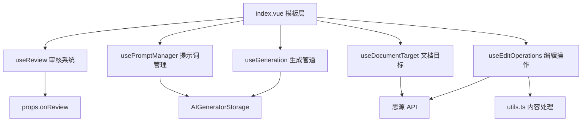

## 用户需求

对 `src/features/aiContentGenerator/index.vue`（1536行）进行深度代码审查与重构。排查逻辑漏洞与边界异常，合并冗余逻辑与重复代码，优化性能瓶颈。所有修改须严格对齐 AGENTS.md / CODEBUDDY.md 编码规范。

## 核心问题清单

### P0 - 行数严重超限

index.vue 共 1536 行，远超项目规定的 500 行硬阈值和 1000 行必须重构阈值。须拆分为多个 composable 与工具函数，目标将 index.vue 降至 350 行以内。

### P0 - 跨功能直接导入违规

`utils.ts` 第3行 `import { AI_TOOLS } from "@/features/skillsViewer/modules/SkillsViewerManager"` 直接导入另一个 feature 的内部模块，违反 CODEBUDDY.md 跨功能联动规则（必须通过事件总线 + App.vue 调度）。

### P1 - useReview composable 未集成

`composables/useReview.ts` 已封装审核状态（enableReview / isReviewing / reviewResult / isAutoFixing / autoFixCount / fixHistory / needsFix / resetReview / recordFixEntry），但 index.vue 第158-164行完全重复定义了这些状态变量及常量，useReview 从未被调用。

### P1 - 系统提示词重复构建（4处）

`handleAutoFix`(658行)、`handleFixIssue`(710行)、`aiEditAction`(1123行)、`handleCustomEdit`(1174行) 中构建 skill system prompt 的逻辑高度相似，应提取为公共函数。

### P1 - buildGenerateOptions 每次创建新闭包

`onSearchStart / onSearchResults / onSearchError` 三个回调每次调用 `buildGenerateOptions` 都重新创建（462-470行），应提取为稳定引用避免不必要的闭包分配。

### P2 - 状态重置逻辑分散

`resetAllGenerationStates`(293行) 与 `handleStop`(590行) 重复重置 isGenerating / abortController；`clearContent`(794行) 与 `startGeneration`(262行) 有部分字段重置重叠。

### P2 - 工具函数内联在 Vue 组件中

`removeFrontmatter`、`processContentByType`、`convertToSiyuanMarkdown`、`splitMarkdownBlocks`、`getCurrentBlockId`、`getDocIdByBlockId` 等纯工具函数内联在 index.vue 中，应迁移到 utils.ts。

### P2 - emoji 违规

`modules/AIContentGenerator.ts` 第148行 `showMessage` 使用了 emoji 图标，违反项目图标规则。

### P2 - 脆弱的哨兵值

`generationStartTime` 使用 `0` 作为"未开始"标识，依赖 falsy 检查（`!generationStartTime`），语义模糊且脆弱。

## 技术方案

### 重构策略：按职责拆分为 4 个新 Composable + 增强现有 Composable

**index.vue 保留职责**：模板层（组件组合 + props 传递）、全局生命周期（onMounted/onUnmounted）、设置防抖保存 watch。

**新 composable 提取**：

```
aiContentGenerator/
├── composables/
│   ├── useGeneration.ts        # [NEW] 生成管道（核心引擎）
│   ├── useReview.ts            # [MODIFY] 增强：集成审核/修正逻辑
│   ├── useEditOperations.ts    # [NEW] 编辑操作（apply/undo/insert/copy/clear）
│   ├── useDocumentTarget.ts    # [NEW] 文档/块选择目标管理
│   ├── usePromptManager.ts     # [NEW] 提示词 CRUD 管理
│   └── useSkillsLoader.ts      # [不变] 技能加载
├── utils.ts                    # [MODIFY] 迁移工具函数 + 修复跨功能导入
├── index.vue                   # [MODIFY] 大幅精简至 ~350 行
├── modules/
│   └── AIContentGenerator.ts   # [MODIFY] 修复 emoji 违规
```

### 数据流



### Composable 职责划分

| Composable | 行数估计 | 导出内容 |
| --- | --- | --- |
| useGeneration | ~200 行 | 生成生命周期、流式缓冲、对话历史、buildGenerateOptions、executeGeneration |
| useEditOperations | ~180 行 | applyEdit、undoEdit、insertSubDocument、copyContent、clearContent |
| useDocumentTarget | ~140 行 | selectTargetDocument、selectTargetBlock、loadTargetDocument、clearTargetDocument |
| usePromptManager | ~100 行 | saveCurrentPrompt、loadPrompt、deletePrompt、clearCurrentPrompt、onPromptNameFocus |
| useReview（增强） | ~160 行 | performReview、handleAutoFix、handleReReview、handleFixIssue + 现有状态 |


### 性能优化要点

1. **稳定回调引用**：将 `onSearchStart/onSearchResults/onSearchError` 提取为 composable 内的稳定闭包（通过 `useCallback` 等效模式），避免每次 `buildGenerateOptions` 重新分配。
2. **系统提示词缓存**：提取 `buildSkillSystemPrompt(skill, fallback)` 函数，消除 4 处重复字符串拼接。
3. **conversationHistory 操作原子化**：将 push + slice 封装为 `addConversationTurn(role, content)` 一次性完成，避免中间态响应式触发。
4. **generationStartTime 哨兵优化**：改用 `null` 代替 `0` 作为未开始标识，语义明确。

### 跨功能导入修复

`utils.ts` 中的 `AI_TOOLS` 从 `skillsViewer` 导入违反了跨功能零依赖规则。修复方案：在 `utils.ts` 中内联一份精简的 ToolMeta 映射（仅含 id/name/color），或改为通过 `@/config` 公共层导出共享常量。考虑到 `getSourceDotColors` 和 `getSourceHintText` 只需要工具的 id→name/color 映射，采用**本地内联常量**方案，数据量小（<1KB），不影响 skillsViewer 独立性。