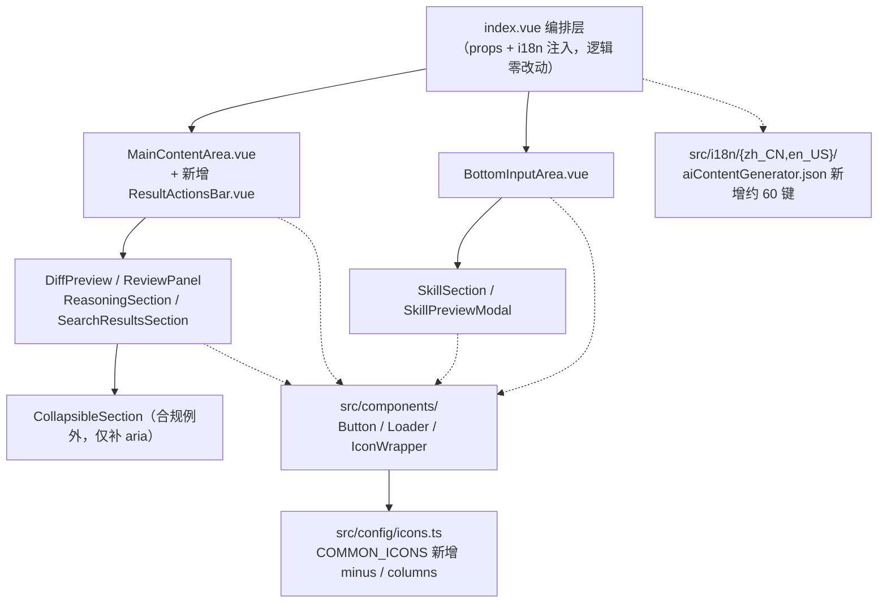

## 产品概述

对 siyuanPluginVueSN 插件的「AI 内容生成」功能模块（`src/features/aiContentGenerator`）执行一次共享组件合规审查，并按项目规则逐项改造。产出分两步：先落一份可追溯的审查报告（问题清单 + 规则依据 + 改造映射），再把模块内自建的按钮、表单控件、图标渲染统一替换为 `src/components/` 共享组件与 `src/config/icons.ts` 图标注册体系，最后补齐文件头注释与 i18n 文案。

## 核心功能

- 审查报告：逐条列出违规点（文件:行号 + 违反规则 + 建议改法），并显式标注「判定为合规例外」的项，避免过度改造
- 按钮统一：分段切换、筛选 chip、footer 操作、快捷动作、纯图标按钮等 10 处自建 `<button>` 改用共享 `Button`
- 表单控件统一：模型选择 / 思考强度下拉改 `Select`，自定义模型名输入改 `Input`，联网 / 思考 / 审核三处复选框改 `Switch`，技能选择自建下拉改 `Select(filterable)`
- 图标统一：删除与共享 `IconWrapper` 职责重叠的 `SvgIcon.vue` 与自定义 sprite 注入，模块内 29 处内联 `<svg><use>` 全部改走 `IconWrapper` + `IconKey`
- 文案与注释：约 60 处硬编码中文改走 i18n 分片（zh_CN / en_US 同步），补模板中文注释与缺失的文件头注释
- 结构调整：清理替换后废弃的 SCSS 类，拆分超 300 行警戒线的 `MainContentArea.vue`，同步模块 `README.md`

## 视觉影响（预期变更）

- 图标由思源内置 sprite（描边风格）变为 Iconify mdi（填充风格），图形观感变化
- 联网 / 思考 / 审核由「图标+文字胶囊」变为标准开关（Switch）形态
- 分段切换（预览/对比/审查、合并/分栏、严重度筛选）由高亮胶囊变为 `Button` 的 `text` 外观 + 主色/中性色区分，分组容器保留原布局
- 其余布局、间距与交互流程保持不变

## 技术栈

沿用项目现有技术栈，不引入任何新依赖：

- 构建：Vite + Vue 3（`<script setup>` + TypeScript）
- 样式：SCSS + 项目设计 Token（`@use "@/index.scss" as *`）
- 图标：`@iconify/vue`（mdi 图标集已由 `setupIconifyOffline()` 离线预加载，断网可用）
- 共享组件：`src/components/`（14 个，本次只消费不扩展）
- 文案：思源 `plugin.i18n`（分片 `src/i18n/{zh_CN,en_US}/*.json`，由 `pnpm i18n:merge` 合并）

## 实现方案

### 总体策略

以「**映射表驱动 + 分批替换 + 每批独立可验证**」的方式做纯替换式改造，不改任何业务逻辑、props 数据流与组件职责边界：

1. **先审后改**：先把所有违规点固化为一张「文件:行号 → 违反规则 → 目标共享组件」的映射表（报告落盘），再按映射表分批改。避免边审边改导致漏项或重复劳动。
2. **图标体系统一优先**：图标是本次改造的地基——`Button` 的 `icon` prop 只接受 `IconKey`，表单控件的 `prefixIcon/suffixIcon` 同理，因此必须先把 29 处内联 `<svg><use xlink:href="#iconXxx">` 换成 `IconWrapper`，其余替换才有统一的图标表达。
3. **不扩展共享组件**：经核对，`Button`（`variant`/`severity`/`outlined`/`text`/`rounded`/四档 `size`/`icon`/`iconPosition`/`loading`/`title`/`ariaLabel`）、`Select`（`filterable`/`clearable`/`isGroup` 分组）、`Input`（`textarea`/`autosize`/`prefixIcon`）、`Switch`（`xsmall`/默认 slot）已覆盖本模块全部需求，**不改 `src/components/` 任何 props**，从而不触发 `componentPreview/previewData` 同步要求，把改动半径锁死在 `aiContentGenerator` 内。
4. **保留合规例外**：`CollapsibleSection.vue` 判定为「纯展示的局部布局容器」例外（全项目仅此一处使用，Rule of Three 未满足，不提升为共享组件），仅补 `aria-expanded`/`aria-controls`；`Dock` 页签图标（`addDock({ icon: "iconSparkles" })`）依赖思源 sprite，属框架约定，保留不动。

### 关键决策与取舍

| 决策点 | 选择 | 理由 |
| --- | --- | --- |
| 分段切换（预览/对比/审查、合并/分栏、严重度筛选） | 保留分组容器（纯布局），子按钮换 `Button` + `text` 外观，用 `variant` 在 `primary`/`ghost` 间切换表达选中态 | 共享库无「分段控件」，扩展共享组件会触发预览清单同步；`Button` 现有能力已可表达选中态。取舍：失去相邻按钮的连体胶囊视觉，换取控件来源统一 |
| 联网/思考/审核 | `Switch.vue`（`xsmall` + 默认 slot 放图标+文字） | 语义上是布尔开关，规则明确列出「开关 → Switch」。取舍：由紧凑胶囊变为开关形态，横向占位略增 |
| 技能选择器 | 整体换成 `Select` + `filterable` + `isGroup` | `SkillSection.vue` 自建了「触发器 + 下拉面板 + 搜索框 + 点击外部关闭」共约 90 行，与 `Select` 能力完全重复，属最典型的「feature 内自建同类控件」违规 |
| `ReviewPanel` 的分项评分小节头 | 复用模块内 `CollapsibleSection` 替换 `.subsection-toggle` | 消除模块内重复的折叠实现（DRY），同时消化掉一处自建 `<button>` |
| `MainContentArea.vue`（375 行） | 抽出结果操作按钮组为 `ResultActionsBar.vue` | 触及 300 行警戒线；按 `AGENTS_ARCH.md` 拆分依据执行。预计主文件降至约 255 行 |
| `ACTION_META[].icon` | 由 `#iconXxx` 字符串改为 `IconKey`；`label` 改为 `labelKey` | 该常量被 `BottomInputArea`（渲染）与 `index.vue`（执行+审核）共用，是模块内单一数据源；类型改为 `IconKey` 后由 TS 保证图标合法，文案改 `labelKey` 后由 i18n 单一数据源供给 |


### 图标映射表（sprite → IconKey，已逐一核实存在）

| 现用 sprite | 目标 IconKey | 现用 sprite | 目标 IconKey |
| --- | --- | --- | --- |
| `#iconFile` | `file` | `#iconAdd` | `plus` |
| `#iconEdit` | `edit` | `#iconUndo` | `refreshLeft` |
| `#iconClose` | `close` | `#iconCopy` | `copy` |
| `#iconCloseRound` | `cancel` | `#iconRefresh` | `refresh` |
| `#iconSearch` | `search` | `#iconTrashcan` | `delete` |
| `#iconSparkles` | `sparkles` | `#iconList` | `list` |
| `#iconCheck` | `check` | `#iconTime` | `timerOutline` |
| `#iconRight` | `chevronRight` | `#iconColumns` | `columns`（需新增） |
| `#iconDown` | `chevronDown` | `#iconMin` | `minus`（需新增） |
| `#iconEye` | `eye` |  |  |


`minus`（`mdi:minus`）与 `columns`（`mdi:view-column`）需补入 `src/config/icons.ts` 的 `COMMON_ICONS`；`IconKey = FeatureIconKey | CommonIconKey` 会自动扩展，无需改类型定义。

### 性能与可靠性

- 图标替换后 29 处裸 `<svg><use>` 变为 `IconWrapper` 组件实例（内部为 `@iconify/vue` 的 `Icon`，含 computed）。图标数据已离线预加载，**无网络请求、无新增 IO**；`MainContentArea` 在流式输出期间高频重渲染，组件实例增加会带来少量额外 diff 开销，属规则要求下的可接受代价（项目内 `Button`/`Select`/`Input` 已大量使用同一组件）。
- 表单控件替换后，`Select` 自带 `onMounted/onUnmounted` 的点击外部关闭监听（基于根 ref），替换 `SkillSection` 的手写 `document.addEventListener` 后**监听器数量减少**，属净收益。
- 替换过程不改任何 props 数据流（`BottomInputArea` 继续以 `:model-value` + `@update:xxx` 与父组件通信），因此 `index.vue` 的编排逻辑除新增 i18n 键外零改动，**回归面可控**。
- 已记录的既有性能点（本次不处理，仅写入报告）：`DiffPreview.vue` 的 `diffStats` computed 对全文跑 `diff-match-patch`（O(ND)），大文档下有热点风险。

### 执行注意（防回归）

- `src/components/` **零改动**；若实施中确需扩展共享组件，必须同轮同步 `src/features/componentPreview/previewData/*.ts`（`props` 与 `code` 一致）与 `componentPreview/README.md`。
- i18n 只改分片 `src/i18n/{zh_CN,en_US}/aiContentGenerator.json`，**禁止手改**顶层 `zh_CN.json`/`en_US.json`；键名沿用该 feature 的**扁平无前缀**风格（如 `inputSelectDoc`、`viewModePreview`），新增键必须在 `en_US` 同步，且模板中每处 i18n 使用位置上方补中文 HTML 注释、禁止 `|| '中文兜底'`。
- 删除 `SvgIcon.vue` 与 `registerIcons()`（`plugin.addIcons` 注入 `#iconColumns`）前，须确认全项目无其他引用；`registerIcons()` 删除后 `init()` 只保留 `addDock()`。
- 替换按钮后，原按钮类样式（`.view-mode-btn` / `.mode-btn` / `.issue-filter-btn` / `.fix-issue-btn` / `.review-footer-btn` / `.quick-action-btn` / `.skill-preview-btn` / `.skill-preview-close` / `.skill-preview-btn-close` / `.subsection-toggle`）成为死代码，须同轮从对应 SCSS 删除，避免样式残留与 token 漂移。
- 纯图标按钮必须给 `aria-label` 或 `title`（`Button` 已支持 `ariaLabel`，纯图标时自动回退 `title`）。
- 不触碰其他 feature 的同类遗留（如 `toolCollection` 的 `.mode-tab`）；不改 8 步功能注册清单（该 feature 注册链路完整，仅改造 UI 层）。
- 不执行 `pnpm vite build` / `pnpm lint`；验证由用户运行 `pnpm lint`、`pnpm i18n:verify`、`pnpm validate:icons`、`npx tsc --noEmit`。

## 架构设计

不新增架构模式，沿用现有分层：`modules/AIContentGenerator.ts`（Dock 注册 + AI 调用）→ `index.vue`（编排层，注入 `i18n`）→ `components/*.vue`（展示层）→ `styles/*.scss`（样式层）。本次改造**只作用于展示层与图标/文案资源层**，数据流方向与组件职责边界不变。



## 目录结构

```
siyuanPluginVueSN/
├── docs/
│   └── ai-content-generator-component-audit.md   # [NEW] 审查报告。含：违规清单（文件:行号 + 违反规则 + 建议改法）、图标映射表（sprite→IconKey）、控件替换映射表、判定为「合规例外」的项及理由、本次不处理的既有问题（如 DiffPreview 的 diff 计算热点）
├── src/
│   ├── config/
│   │   └── icons.ts                              # [MODIFY] 在 COMMON_ICONS 新增 minus: "mdi:minus"、columns: "mdi:view-column"；IconKey 自动扩展，不改类型定义
│   ├── i18n/
│   │   ├── zh_CN/aiContentGenerator.json         # [MODIFY] 现有 27 个 review* 键基础上新增约 60 个键：文档选择器、快捷动作（润色/扩写/精简/纠错/改写/总结）、模型选择、思考与审核开关、视图 Tab、Diff 工具栏、技能选择器、空状态三步说明、弹窗按钮等；扁平无前缀风格
│   │   └── en_US/aiContentGenerator.json         # [MODIFY] 与 zh_CN 严格一一对应（pnpm i18n:verify 校验）
│   └── features/aiContentGenerator/
│       ├── index.vue                             # [MODIFY] 补文件头注释（当前首行直接是 <template>）；编排逻辑零改动，仅在需要时透传新增 i18n 键
│       ├── README.md                             # [MODIFY] 更新组件清单（移除 SvgIcon.vue、新增 ResultActionsBar.vue）、记录「已统一走共享组件库」与图标注册约定
│       ├── types/index.ts                        # [MODIFY] EditActionMeta.icon: string → IconKey；label: string → labelKey: string（6 个动作改为 edit/plus/minus/check/refresh/list 与对应 i18n 键名）
│       ├── modules/AIContentGenerator.ts         # [MODIFY] 删除 registerIcons() 及 init() 中的调用（#iconColumns 自定义 sprite 不再需要）
│       ├── components/
│       │   ├── SvgIcon.vue                       # [DELETE] 与共享 IconWrapper.vue 职责完全重叠，且接受任意 #iconXxx 字符串绕过 IconKey 注册体系
│       │   ├── ResultActionsBar.vue              # [NEW] 从 MainContentArea.vue 抽出的结果操作按钮组（停止/应用/插入子文档/撤回/复制/直接审查/清空对话/清除）。纯展示组件，props 收按钮可用性布尔值 + i18n，emit 对应动作，保持原 emit 名称不变
│       │   ├── MainContentArea.vue               # [MODIFY] 视图 Tab 三个自建 button → Button(text + variant 切换)；14 处内联 svg → IconWrapper；抽出 ResultActionsBar 后降至约 255 行
│       │   ├── BottomInputArea.vue               # [MODIFY] 模型下拉与思考强度下拉 → Select（分组用 isGroup）；自定义模型名 → Input；联网/思考/审核复选框 → Switch(xsmall + slot)；6 个快捷动作按钮 → Button(ghost + icon)；7 处内联 svg → IconWrapper
│       │   ├── SkillSection.vue                  # [MODIFY] 自建「触发器+下拉面板+搜索框+外部点击关闭」整体替换为 Select(filterable)；技能预览纯图标按钮 → Button(text) + ariaLabel；3 处内联 svg → IconWrapper
│       │   ├── SkillPreviewModal.vue             # [MODIFY] 关闭纯图标按钮与「关闭」按钮 → Button；内联 svg → IconWrapper
│       │   ├── ReviewPanel.vue                   # [MODIFY] SvgIcon → IconWrapper；分项评分小节头改用 CollapsibleSection；筛选 chip 组与 footer 操作（重新审核/自动修复）→ Button
│       │   ├── DiffPreview.vue                   # [MODIFY] 合并/分栏分段按钮 → Button(text)
│       │   ├── CollapsibleSection.vue            # [MODIFY] 内联 svg → IconWrapper；补 aria-expanded / aria-controls（保留原生 button，判定为布局容器例外）
│       │   ├── ContentAreaEmpty.vue              # [MODIFY] 补文件头注释；内联 svg → IconWrapper；三步说明文案 i18n 化
│       │   └── styles/*.scss                     # [MODIFY] 删除替换后废弃的按钮类样式，保留分组容器与布局类；BottomInputArea.scss / SkillSection.scss / SkillPreviewModal.scss / DiffPreview.scss / CollapsibleSection.scss / ContentAreaEmpty.scss 同步清理
│       └── styles/
│           ├── MainContentArea.scss              # [MODIFY] 清理 .view-mode-btn 系列；新增 ResultActionsBar 所需布局类（或按需新建 ResultActionsBar.scss）
│           ├── ReviewPanel.scss                  # [MODIFY] 清理 .subsection-toggle / .issue-filter-btn / .fix-issue-btn / .review-footer-btn
│           └── index.scss                        # [MODIFY] 共享 .dot-flashing / .markdown-preview 等保留；核对无废弃类
```

## 关键代码结构

模块内共享常量的类型收敛（`types/index.ts`，被 `BottomInputArea.vue` 与 `index.vue` 共同消费，改后由 TS 保证图标合法、由 i18n 保证文案单一数据源）：

```ts
import type { IconKey } from "@/config/icons"

export interface EditActionMeta {
  /** 快捷按钮文案的 i18n 键名（如 "actionPolish"） */
  labelKey: string
  /** 已注册的图标键（替代原思源 sprite "#iconXxx" 字符串） */
  icon: IconKey
  /** 发送给 AI 的编辑指令 */
  prompt: string
  /** 审核阶段理解"用户需求"的指令描述 */
  reviewLabel: string
}
```

## Agent Extensions

### SubAgent

- **code-explorer**
- Purpose: 跨 12 个 `.vue` + 9 个 `.scss` + `types`/`modules` 全量定位原生 `<button>` / `<select>` / `<input>` / 内联 `<svg><use>` / 硬编码中文文案的确切位置与行号，并核实 `SvgIcon.vue`、`registerIcons()`、`ACTION_META.icon` 的全部引用点
- Expected outcome: 输出完整、可核对的行号级清单，作为审查报告的原始素材与后续分批替换的验收基准

### Skill

- **universal-arch-skill**
- Purpose: 按「功能模块化、统一入口、设计 Token、注册完整性」等架构原则对本模块做规范校验，产出结构化审查结论与改造建议
- Expected outcome: 一份带规则依据与优先级（P0/P1/P2）的审查报告，并明确列出判定为「合规例外」的项，避免过度改造
- **lsp-code-analysis**
- Purpose: 删除 `SvgIcon.vue`、`registerIcons()`、`ACTION_META[].icon` 前做引用影响分析（find references / call hierarchy），确认无遗漏调用点
- Expected outcome: 每个待删除符号的引用清单为空或已全部迁移，杜绝 `tsc` 报 MISSING_EXPORT 或运行时图标空白