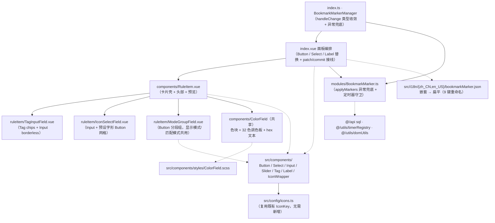

## Product Overview

对思源笔记插件「书签标记」（`src/features/bookmarkMarker`）执行一次全面的共享组件合规审查，并按项目规则逐项改造。产出分两步：先落一份可追溯的审查报告（问题清单 + 规则依据 + 改造映射 + 合规例外判定），再按图表逐项替换自建控件、修复运行时缺陷、收敛类型与数据流、拆分超长文件、统一 i18n 结构。

## Core Features

- **审查报告**：逐条列出违规点（文件:行号 + 违反规则 + 建议改法），显式标注「判定为合规例外」的项与「本次不处理」的项，避免过度改造
- **共享控件统一**：面板内 3 个原生 `<button>`、1 个原生 `<select>`、7 个原生 `<input type="radio">`、1 个原生 `<input type="range">`、6 个原生 `<input type="text"/"color">`、8 个裸 `<label>` 全部改用共享 `Button` / `Select` / `Input` / `Slider` / `Tag` / `Label` / `ColorField`
- **修复取色器缺陷**：文字色/背景色当前用原生 `<input type="color">`，在思源 Electron 环境下点击不弹取色器（用户只能手输 hex）。把 `generalSettings` 内已验证可用的自绘调色板组件提升为共享 `ColorField` 供两处复用
- **规则卡片拆分**：`RuleItem.vue` 422 行（超 300 警戒线）拆为「卡片壳 + 3 个子字段组件」，每文件回落至 300 行以内
- **运行时缺陷修复**：书签查询异步链路补异常处理（消除 unhandled rejection）；透明度滑块拖动时不再逐像素写盘与弹提示；规则列表改用对象身份作 key，避免删除中间项时的组件状态错位；`hexToRgba` 支持 3 位 hex
- **类型与数据流收敛**：`any` 全部消除；`resolveMode` 返回具名联合类型；`RuleItem` 不再直接改写父级传入的规则对象，改为「局部更新 + 显式提交」双事件契约
- **注释与 i18n 对齐**：文件头注释移到文件顶部（`index.vue`、`RuleItem.vue`）；i18n 分片由嵌套结构改为扁平结构，与其它功能模块风格一致

## Visual Effect

- 显示模式（文字标签/仅图标/图标+背景/字体背景）与匹配模式（精确/前缀/包含）由隐藏 radio 的胶囊样式改为分段按钮组，选中态以主色文字标识
- 透明度由浏览器原生滑块改为统一档位滑块，并在右侧内联显示百分比
- 文字色/背景色由「原生色块（点不开）+ hex 文本框」改为「可点击色块 + 展开 32 色调色板 + hex 文本框」，取色能力恢复可用
- 书签名标签由手写 chip 改为标准标签控件（可关闭）；按钮、下拉、输入框的圆角/高度/悬停反馈统一为共享组件样式
- 面板整体布局、分区顺序、规则卡片结构保持不变

## 技术栈

沿用项目现有技术栈，不引入任何新依赖：

- 构建：Vite + Vue 3（`<script setup>` + TypeScript），样式 SCSS + 项目设计 Token
- 共享组件：`src/components/`（当前 14 个，本次消费并新增 1 个 → 15 个）
- 图标：`@iconify/vue`（mdi 离线预加载），图标键统一取 `src/config/icons.ts`
- 文案：思源 `plugin.i18n`（分片 `src/i18n/{zh_CN,en_US}/*.json`，由 `pnpm i18n:merge` 合并）
- 存储/定时器：`@/utils/typedStorage`（`TypedStorage`）、`@/utils/timerRegistry`（`TimerRegistry`）
- 样式注入：`@/utils/domUtils` 的 `injectStyle` / `removeStyle`

## 实现方案

### 总体策略

以「**映射表驱动 + 按依赖分层推进 + 每层独立可验证**」的方式改造，不动书签查询、DOM 标记算法、观察器/重试/防抖机制等业务逻辑：

1. **先审后改**：先把违规点固化为「文件:行号 → 违反规则 → 目标共享组件」映射表并落盘，再按表分批改，避免漏项与重复劳动。
2. **共享组件能力先行**：`ColorField` 提升与 `Input` 的 `borderless` 扩展是控件替换的前置条件，必须先完成并同步预览清单，再改业务组件。
3. **控件的「分段组」处理沿用已验证先例**：与 `aiContentGenerator` 改造一致——分段切换（显示模式/匹配模式）保留分组容器（纯布局），子按钮用共享 `Button` 的 `text` 外观 + `variant` 在 `primary`/`ghost` 间切换表达选中态。共享库无「分段控件」，扩展共享组件需同步预览清单且收益低于成本。
4. **数据流采用「局部更新 + 显式提交」双事件契约**：子组件只 emit 单字段补丁（`patch(payload)`）与「需落盘」信号（`commit()`），由父组件在**自己拥有**的规则对象上 `Object.assign`。既不直接改写 props（用户点名项），也不 emit 全量表单数据（`AGENTS.md § 子组件数据流规则` 明令禁止）。附带收益：滑块拖动只 `patch`、松手才 `commit`，一举消除「逐像素写盘 + toast 刷屏」缺陷。
5. **保留合规例外**：规则卡片的 emoji 预设图标面板——emoji 是**用户可选的标记字形（业务数据）**，最终由 `createMarkerElement` 以 `textContent` 写进思源文件树/文档标题，不是插件 UI 图标；改为 Iconify 需把标记渲染从文本改为 SVG 挂载，属功能重设计。但**选择项本身改走共享 `Button`**（emoji 作为按钮文本内容），因此「按钮必须用共享组件」仍被满足。

### 关键决策与取舍

| 决策点 | 选择 | 理由与取舍 |
| --- | --- | --- |
| 取色器（文字色/背景色） | 把 `generalSettings/components/ColorField.vue` + 其 SCSS **提升**为 `src/components/ColorField.vue`，`generalSettings` 6 处 import 同步改路径并删除本地副本 | 规则明确「缺能力时先扩展/提升共享组件」；跨 feature 导入被禁止，自建副本则构成复制粘贴。**这是本方案改动半径最大的一环**（触及 6 个 generalSettings 文件），取舍是修掉一个用户可见的功能缺陷并消除重复，代价是跨模块 import 路径调整。备选（把改动锁在 bookmarkMarker 内、仅在报告中记为待办）会保留「点不开取色器」的缺陷 |
| 显示模式/匹配模式 | 原生 radio → `Button` 分段组（`text` + `variant` 切换选中态） | 同 aiContentGenerator 已验证做法；保留分组容器。取舍：失去「点击区域整体高亮」的观感，换取控件来源统一 |
| 书签名 chips 内联输入框 | 共享 `Input` **新增可选属性 `borderless?: boolean`**（默认 `false`，向后兼容）+ 共享 `Tag closable` 作 chip | chips 需要「外框内嵌输入框」，`Input` 现有 wrapper 自带边框会导致双层边框。扩展共享组件而非自建，符合规则；需同步 `previewData/*.ts` 与 `componentPreview/README.md` |
| 透明度滑块 | 共享 `Slider`（`min=0 max=1 step=0.05` + `show-value` + `formatValue`） | 共享库已有滑块；`formatValue` 直接产出百分比文本，可删掉手写的 `.alpha-value` |
| `RuleItem` 数据流 | `patch(payload)`（只改父级对象）+ `commit()`（落盘 + 通知 Manager + 提示） | 消除 props 直改；且把「持续输入」与「提交」解耦，修掉滑块写盘/提示刷屏 |
| 规则列表 key | `:key="index"` → `:key="rule"`（对象身份），`remove` 事件携带 `rule` 对象，父级用 `indexOf` 定位 | 无需改持久化 schema；引入含内部状态的 `ColorField`（调色板开合）后，索引 key 会导致删除中间项时弹层状态错位 |
| i18n 结构 | `{ bookmarkMarker: { ...29 键 } }` → **扁平**，其中 9 个与他分片重名的键重命名 | 与 `aiContentGenerator`/`s3Backup` 等较新模块风格对齐，并消除 `index.ts` 的双重断言。已实测 9 个重名键：`title`、`displayMode`、`updateInterval`、`interval30min/1hour/2hour/4hour`、`msgEnabled`、`msgDisabled` |
| `MutationObserver` 观察根 | **不改**，仅写入报告的建议项 | `document.body` + `subtree` + `attributeFilter: ["data-node-id"]` 已收窄，回调用 `mutations.some()` 提前短路；收窄到 `.layout__center` 收益不确定且有破坏检测的风险 |


### 性能与可靠性

- **消除 unhandled rejection**：`applyMarkers()` 是 async，内部 `loadBookmarkCache()` 的 `await sql(...)` 可能抛错，当前 4 个调用点（定时刷新、`updateOptions`、`start()`、`index.ts` 的 `handleChange`）均未 catch。改为：`loadBookmarkCache` 内 try-catch 记日志并把缓存标记为「未加载」，`applyMarkers` 整体兜底，所有 fire-and-forget 调用点统一 `void fn().catch(logger)`。
- **消除写放大与提示刷屏**：滑块当前 `@input` → 父级 `await save()` + `showMessage()`；改造后拖动只 `patch`，`@change`（松手）才 `commit`，磁盘写入次数与提示次数从「每像素一次」降到「每次操作一次」。
- **DOM 遍历无新增开销**：`applyMarkersFor` 的单次 `querySelectorAll` + 线性匹配保持不变；本次不引入额外的全量扫描。
- **组件实例化开销**：分段按钮与图标选择项由原生元素变为 `Button` 实例（图标数据已离线预加载，无网络与 IO）。规则卡片数量级为个位数，开销可忽略。
- **i18n 扁平化后**：`plugin.i18n` 整对象透传，取值仍为 O(1) 属性访问，并去掉一次双重类型断言的运行时无意义转换。

### 实现注意（防回归）

- **共享组件扩展必须同轮同步**：`Input` 的 `borderless`、新增的 `ColorField` 需同步 `src/features/componentPreview/previewData/*.ts`（`props` 与 `code` 一致）+ `componentPreview/README.md`，并更新 `AGENTS.md § 共享组件库使用规则` 的「组件清单（14 个）」表为 15 个。
- **不得跨 feature 导入**：提升后 `generalSettings` 的 6 处 import 必须同轮改为 `@/components/ColorField.vue`，并删除本地 `components/ColorField.vue` 与 `styles/ColorField.scss`，否则会残留两份副本。
- **`ColorField.vue` 头部注释里写明**「思源 Electron 不弹原生 `input[type=color]`」的关键结论，避免后续被误改回原生控件。
- **卡片内子组件不还原成 props 直改**：所有字段编辑一律走 `patch` + `commit`，禁止退回 `v-model="rule.xxx"`。
- **i18n 只改分片**：顶层 `zh_CN.json`/`en_US.json` 由 `pnpm i18n:merge` 生成；重命名后须重新跑一次跨分片重名检查，确认新键名（如 `bookmarkMarkerTitle`、`markerDisplayMode`、`markerInterval30min`、`bookmarkMarkerMsgEnabled`）无冲突。
- **纯图标按钮必须给 `aria-label`**（`Button` 纯图标场景可从 `title` 自动派生，但改名按钮、删除按钮务必显式给）。
- **emits 一律 camelCase**（`patch` / `commit` / `remove` / `change` / `close`）。
- **不触碰 8 步注册清单**（已核对完整：`features/index.ts` 导出与 `_Registered`、`src/index.ts` 注册项与 `DESTROYABLE_KEYS`、`settings.ts`、`config.ts`、`icons.ts`、i18n 分片均在位），不改 `modules/BookmarkMarker.ts` 的查询语句与标记算法。
- **不执行** `pnpm vite build` / `pnpm lint` / `npx tsc --noEmit`；`pnpm i18n:merge` 属生成步骤可执行。验证由用户运行 4 项检查。

## 架构设计

不新增架构模式，沿用现有分层：`index.ts`（Manager：设置加载 / 变更调度 / Modal 挂载 / 自挂载 `__bookmarkMarker`）→ `index.vue`（面板编排）→ `components/*.vue`（展示层）→ `styles/*.scss`（样式层）；`modules/BookmarkMarker.ts` 独立负责 DOM 标记运行时。本次改造只作用于**展示层、共享组件库、类型/文案资源层**与**异步异常处理**，数据流方向与组件职责边界不变。



## Directory Structure

```
siyuanPluginVueSN/
├── docs/
│   └── bookmark-marker-component-audit.md            # [NEW] 审查报告：违规清单（文件:行号 + 规则依据 + 目标组件）、控件替换映射表、合规例外判定、本次不处理项、改造结果、验收清单
├── AGENTS.md                                          # [MODIFY] 「共享组件库使用规则」组件清单表：14 个 → 15 个（补 ColorField 行）
├── src/
│   ├── components/
│   │   ├── ColorField.vue                             # [NEW] 从 generalSettings 提升：色块按钮 + 32 色自绘调色板弹层 + hex 文本双向联动；点击外部/Esc 关闭。头部注释必须写明「思源 Electron 不弹原生 input[type=color]，故自绘」的结论
│   │   ├── styles/
│   │   │   └── ColorField.scss                        # [NEW] 原样迁移（仅依赖 @/variables.scss 通用 Token，无 feature 专属内容）
│   │   ├── Input.vue                                  # [MODIFY] 新增可选 prop `borderless?: boolean`（默认 false），驱动 wrapper 去边框去底色；其余行为零改动
│   │   └── styles/Input.scss                          # [MODIFY] 新增 `&--borderless { .si-input__wrapper { border: none; background: transparent; border-radius: 0; } }`
│   ├── features/
│   │   ├── generalSettings/
│   │   │   ├── components/
│   │   │   │   ├── ColorField.vue                     # [DELETE] 已提升为共享组件
│   │   │   │   ├── TableStyleSettings.vue             # [MODIFY] import 路径 → @/components/ColorField.vue
│   │   │   │   ├── ListStyleSettings.vue              # [MODIFY] 同上
│   │   │   │   ├── HighlightSettings.vue              # [MODIFY] 同上
│   │   │   │   ├── HeadingSettings.vue                # [MODIFY] 同上
│   │   │   │   ├── DocCountSettings.vue               # [MODIFY] 同上
│   │   │   │   └── CodeBlockSettings.vue              # [MODIFY] 同上
│   │   │   └── styles/
│   │   │       └── ColorField.scss                    # [DELETE] 已提升为共享样式
│   │   ├── componentPreview/
│   │   │   ├── previewData/
│   │   │   │   ├── colorField.ts                      # [NEW] ColorField 分组：基础用法 / 带 placeholder / 只读展示；props 与 code 必须一致
│   │   │   │   ├── index.ts                           # [MODIFY] 聚合 `colorFieldPreviewGroups`
│   │   │   │   └── input.ts                           # [MODIFY] 新增「无边框（borderless）」示例（用于 chips 内联输入场景）
│   │   │   └── README.md                              # [MODIFY] 覆盖组件数 14 → 15；补 ColorField 能力与 Input `borderless` 说明；「具名插槽」表无需变更
│   │   └── bookmarkMarker/
│   │       ├── index.vue                              # [MODIFY] 文件头注释移至文件顶部；close-btn/add-rule-btn → Button；interval-select → Select；interval-label → Label；规则列表 key 改对象身份；removeRule 改按对象定位；接线 patch/commit
│   │       ├── index.ts                               # [MODIFY] `handleChange` 改判别联合签名（`BookmarkMarkerAction`）+ 类型化 payload；i18n 由双重断言改为 `BookmarkMarkerI18n` 类型 + 扁平兜底；`start()` 调用改 `void ... .catch(...)`
│   │       ├── README.md                              # [MODIFY] 更新目录树（子组件、提升后的 ColorField）、共享组件约定、合规例外（emoji 字形）说明
│   │       ├── components/
│   │       │   ├── RuleItem.vue                       # [MODIFY] 文件头注释移至文件顶部；拆出 3 个子组件；所有字段改 patch/commit；颜色行用 ColorField；滑块用 Slider；标签用 Label；删除按钮用 Button；降至 300 行以内
│   │       │   └── ruleItem/
│   │       │       ├── TagInputField.vue              # [NEW] 书签名多标签输入：Tag(chips, closable) + Input(borderless)；回车/逗号添加、输入为空时退格删除末项、去重
│   │       │       ├── IconSelectField.vue            # [NEW] 图标文本输入（Input）+ 预设字形网格（Button text + 选中态 variant）
│   │       │       └── ModeGroupField.vue             # [NEW] 通用单选分段组（Button 分组，显示模式带 icon / 匹配模式不带），由父级传入 options
│   │       ├── modules/
│   │       │   └── BookmarkMarker.ts                  # [MODIFY] `loadBookmarkCache` 异常兜底 + 查询上限提为常量；定时器回调与 `updateOptions` 的 fire-and-forget 补 catch；`setUpdateInterval` 加等值变化守卫
│   │       ├── composables/
│   │       │   └── useBookmarkMarkerSettings.ts       # [MODIFY] 类型化（`BookmarkMarkerI18n`/`BookmarkMarkerSettings`），`save` 失败时提示语义化错误；形状与返回值不变
│   │       ├── types/
│   │       │   ├── index.ts                           # [MODIFY] 提为具名 `DisplayMode` / `MatchMode` / `BookmarkMarkerAction` / `BookmarkMarkerI18n`；`BookmarkMarkerActionPayload` 判别联合
│   │       │   └── storage.ts                         # [MODIFY] 仅类型标注收敛（默认值内容不变）
│   │       ├── utils.ts                               # [MODIFY] `normalizeRules(rules: unknown[])` + 类型守卫；`resolveMode` 返回 `DisplayMode`；`hexToRgba` 兼容 3 位 hex；行内样式常量提取
│   │       └── styles/
│   │           ├── index.scss                         # [MODIFY] 清理 `.close-btn` / `.add-rule-btn` / `.interval-select` 死代码，保留壳层与分区布局
│   │           ├── RuleItem.scss                      # [MODIFY] 收敛为卡片壳/头部/字段行/预览；删除被共享组件替代的控件样式
│   │           ├── RuleItemTagInput.scss              # [NEW] chips 容器与内联输入布局
│   │           ├── RuleItemIconField.scss             # [NEW] 图标输入 + 预设字形网格
│   │           └── RuleItemModeGroup.scss             # [NEW] 分段组布局（子按钮外观由共享 Button 提供）
│   └── i18n/
│       ├── zh_CN/bookmarkMarker.json                  # [MODIFY] 嵌套 → 扁平；9 个重名键重命名；键值内容不变
│       ├── en_US/bookmarkMarker.json                  # [MODIFY] 与 zh_CN 严格一一对应（pnpm i18n:verify 校验）
│       ├── zh_CN.json                                 # [MODIFY] 由 `pnpm i18n:merge` 生成，禁止手改
│       └── en_US.json                                 # [MODIFY] 同上
```

## Key Code Structures

子组件与父组件之间的双事件契约（`RuleItem.vue` ↔ `index.vue`）——替代原先的 props 直改：

```ts
// types/index.ts（新增，供 RuleItem 与其子组件、index.vue 共用）
export type DisplayMode = "bg" | "icon" | "icon-bg" | "row"
export type MatchMode = "exact" | "prefix" | "contains"

/** 规则卡片向父级提交的单字段补丁（禁止回传全量规则对象） */
export type RulePatch = Partial<Pick<
  BookmarkRule,
  "bookmarkNames" | "color" | "backgroundColor" | "icon" | "displayMode" | "alpha" | "matchMode"
>>

// RuleItem.vue 的 emit 契约
// patch  → 父级 Object.assign 到自有规则对象（仅在内存中生效）
// commit → 父级落盘 + 通知 BookmarkMarkerManager + 提示（滑块仅在松手时触发）
// remove → 携带规则对象本身，父级用 indexOf 定位，配合 :key="rule" 保持身份稳定
```

Manager 变更动作判别联合（`index.ts` / `index.vue` 共用，消除 `data?: any`）：

```ts
export type BookmarkMarkerAction = "toggle" | "rulesChanged" | "intervalChanged"

export type BookmarkMarkerActionPayload =
  | { action: "toggle"; enabled: boolean; rules: BookmarkRule[]; updateInterval: number }
  | { action: "rulesChanged"; rules: BookmarkRule[] }
  | { action: "intervalChanged"; updateInterval: number }
```

## Agent Extensions

### SubAgent

- **code-explorer**
- Purpose: 跨 `index.vue` / `index.ts` / `components/RuleItem.vue` / `modules/BookmarkMarker.ts` / `utils.ts` / `types/*` / `composables/*` / `styles/*` 全量定位原生 `<button>`/`<select>`/`<input>`/`<label>` 与硬编码值、文件头注释位置、`any` 使用点、异步调用点，并核实 `ColorField` 的全部 6 处引用与 `bookmarkMarker` 的 8 步注册链路
- Expected outcome: 一份行号级、可核对的问题清单与引用清单，作为审查报告原始素材与后续分批替换的验收基准

### Skill

- **universal-arch-skill**
- Purpose: 按「功能模块化、统一入口、设计 Token、注册完整性、单文件行数、共享组件复用」等架构原则对本模块做规范校验，产出结构化审查结论
- Expected outcome: 一份带规则依据与优先级（P0/P1/P2）的审查报告，并明确区分「必须改」「合规例外」「本次不处理」三类，避免过度改造
- **lsp-code-analysis**
- Purpose: 在删除 `generalSettings/components/ColorField.vue`、迁移其 SCSS、修改 6 处 import，以及拆分 `RuleItem.vue` 前做引用影响分析（find references / call hierarchy）
- Expected outcome: 每个被迁移/删除符号的引用清单为空或已全部切换，杜绝 `tsc` 报 `MISSING_EXPORT` 或运行时组件缺失