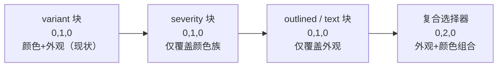

## 产品概述

以 PrimeVue 5.0.1 的 Button 组件为参照，对项目共享组件库的 `Button`（`src/components/Button.vue` + `styles/Button.scss`）做一次全面优化：修复 5 个真实缺陷、补齐颜色与外观两个正交的表达维度、统一交互反馈、完善无障碍与 API 表达力。改动全部落在组件层，不迁移任何调用点。

## 核心功能

### 一、缺陷修复

1. **键盘焦点可见**：当前 `outline: none` 却无 `:focus-visible`，键盘 Tab 到任何按钮都没有视觉反馈（全项目 16 个组件 SCSS 中仅 Switch / Select 有）。补上焦点环。
2. **loading 不再压字**：spinner 绝对居中叠加在居中文案上，生产环境已有实证（`imageCompressor/index.vue:126` 的"压缩中…"）。改为加载期间用 `visibility: hidden` 隐藏图标与文案——保留占位，按钮宽度在加载前后零跳变。
3. **block 按钮文案居中**：`&__text { flex: 1 }` 吃掉全部剩余空间使 `justify-content: center` 失效，标签实际贴左。全项目 0 处使用 `block`，仅在预览面板暴露。
4. **图标随档位缩放**：spinner 已按档位 12/14/16/18 缩放，但图标恒为 16px。xsmall（22px 高 / 10px 字号）图标明显过大且与同档 spinner 不一致。
5. **色值 Token 化与深色主题**：`#ef4444`、`#dc2626`、`rgba(239,68,68,*)`、`rgba(0,0,0,0.08)` 等硬编码；其中 ghost 的 `:active` 用黑色透明度，深色主题下"再暗 8%"肉眼不可见。

### 二、表达力与一致性

6. **颜色与外观解耦**：现状 `danger` 实为"描边红"、`ghost` 实为"中性纯文本"，无法表达"描边 primary""文本 danger"。新增颜色轴 `severity` 与外观轴 `outlined` / `text`，且保证 187+ 处既有调用渲染结果完全不变。
7. **交互反馈统一**：primary / secondary / success 走 `interactive-raised`（亮度 + 1px 位移），danger / ghost 自写 hover 且无过渡；位移在密集工具栏还会引起抖动。统一到同一 mixin。
8. **补 info / warning 颜色变体**：语义 Token 已存在，按钮层此前无法表达"提示 / 警告"。
9. **补显式 `type` prop**：模板硬编码 `type="button"`，表单需要 `submit` 时只能依赖隐式 attr 透传。
10. **纯图标按钮无障碍命名**：PrimeVue 明确要求 icon-only 提供 `aria-label`；当前既未声明该 prop，全项目也仅 24 处使用。新增 `title` / `ariaLabel` prop，自动从 `title` 派生 `aria-label`，并在开发环境对两者皆缺的纯图标按钮告警。
11. **`iconPosition` 扩展为四向**：`left` / `right` / `top` / `bottom`，支持图标在上/下方的垂直堆叠。
12. **`rounded` 修饰**：圆形纯图标按钮（`$radius-full`）。

### 三、规范澄清

13. **图标按钮尺寸边界**：`AGENTS_STYLE.md` 规定图标按钮固定 26×26，但共享 `<Button icon-only>` 是分档 API（22/28/36/44，默认 28）。澄清 26px 仅适用于 feature 自建 `.icon-btn`，分档组件随 `size` 走，避免误判违规。

## 视觉边界

不改变任何既有 `variant` 值的渲染结果；新增能力均为显式传参才生效。不引入 `badge` / `ButtonGroup` / `as`·`asChild` 多态 / `fluid` 别名。

## 技术栈

- Vue 3 + TypeScript（既有，零新依赖）
- SCSS + 设计 Token（`src/_variables.scss` 提供 `$color-*` / `$spacing-*` / `$font-size-*` / `$radius-full`）
- 组件样式分离在 `src/components/styles/Button.scss`，共享 mixin 在 `styles/_mixins.scss`
- 图标经 `IconWrapper`（`@iconify/vue`）渲染，`IconKey` 由 `src/config/icons.ts` 集中注册

## 实现方案

### 1. 类名解析：增量前缀化，零破坏

核心决策：**新增类名一律加前缀**（`si-button--severity-*`、`si-button--outlined`、`si-button--text`、`si-button--rounded`、`si-button--icon-top` / `--icon-bottom`），不复用也不改写既有 `--primary` / `--secondary` / `--success` / `--danger` / `--ghost` 五个类。

理由：`variant="ghost"` 有 104+ 处、`variant="danger"` 14 处、其余 69 处，任何语义改写都是破坏性变更。前缀化后新旧类互不干扰，新能力必须显式传参才生效。

覆盖顺序（同特异性靠源码顺序）：



关键点：`--outlined` / `--text` 需要按颜色分别定义（否则"描边 primary"会得到透明底 + 白字而不可见），因此用 `.si-button--outlined.si-button--primary` 这类复合选择器（0,2,0），天然胜过单类变体（0,1,0）；其 hover / active 复合后为 0,5,0，胜过 `interactive-raised` 生成的 0,4,0，无需依赖源码顺序。

### 2. 图标尺寸：档位查表 + 显式优先

`iconSize` 默认值由 `16` 改为 `undefined`，解析为 `props.iconSize ?? TIER_ICON_SIZE[props.size]`，表值 `{ xsmall: 12, small: 14, medium: 16, large: 18 }`——与 SCSS 中已存在的 spinner 尺寸表严格一致。已有 3 个文件共 11 处显式传入 `iconSize`（flashcardReading 的 `TypingPractice` / `SingleCardView` / `CardList`，值 12/14/16），显式传入优先级最高，行为不变。

同步在 TS 表与 SCSS spinner 声明处互相加注释，避免两处尺寸表漂移。

### 3. loading 保宽：visibility 而非 display

`m.btn-spinner` 是 `position: absolute` 居中，文案同样居中，二者重叠。方案：模板中图标条件由 `v-if="icon && !loading"` 改为 `v-if="icon"`（不再在加载时移除图标），改由 `.si-button--loading` 对 `__icon` 与 `__text` 施加 `visibility: hidden`。`visibility` 保留盒模型占位，因此加载前后按钮宽度完全一致，spinner 落在空白区居中。这比 PrimeVue「用 spinner 替换内容」更优——后者会导致按钮宽度塌缩。

### 4. 交互反馈统一

`interactive-raised` 经全项目 grep 确认**仅被 Button.scss 的 3 处调用**，改动影响面完全封闭。为其增加 `$lift` 参数并统一各颜色变体：所有变体共用同一 hover / active（`filter: brightness()` + `border-color`），去掉 `transform: translateY(-1px)`——消除密集工具栏并排时的 1px 抖动，并让 danger / ghost 获得与其它变体一致的反馈与 `transition: all 0.12s`。

### 5. 色值 Token 化

`src/_variables.scss` 已提供精确对应：`$color-danger-bright: hsl(0 84.2% 60.2%)` ≡ `#ef4444`，`$color-danger: hsl(0 72% 51%)` ≡ `#dc2626`（精确等值）。半透明用 Sass 的 `rgba($sass-color, $alpha)`（Sass 自动将 hsl 转 rgba）。深色主题下 ghost 的 `:active` 改用主题变量 `var(--b3-theme-surface-light, …)`（比 hover 的 `--b3-theme-surface-lighter` 深一档），与 `Select.scss` 使用 `var(--b3-theme-hover, …)` 的既有范式对齐。

### 6. 焦点环方案

`_mixins.scss` 的 `focus-ring` 仅改 `border-color`，而 `.si-button` 的 border 是 `1px solid transparent`、primary 变体不设 border-color——单用该 mixin 在实底按钮上不可见。故采用与 `Switch.scss` 一致的 `outline` 方案，且不触碰项目「禁止 box-shadow」硬规则：

```
&:focus-visible {
  outline: 2px solid var(--b3-theme-primary);
  outline-offset: 1px;
}
```

`outline-offset` 取 1px（Switch 用 2px），避免在密集工具栏中被相邻元素裁切。

### 7. 无障碍命名

声明 `title?: string` 与 `ariaLabel?: string` 两个 prop（此前只能靠隐式 attr 透传），根元素绑定 `:aria-label="ariaLabel || title"`——这样 187+ 处已传 `title` 的纯图标按钮自动获得可访问名称。另在 `onMounted` 中对「纯图标 + 两者皆缺」的情况在 `import.meta.env.DEV` 下 `console.warn`。注意 `import.meta.env` 在 `src/` 下此前无使用先例，属 Vite 标准能力，构建期静态替换，无运行时开销。

### 8. 纵向图标布局

`iconPosition` 扩为四向后：`--icon-top { flex-direction: column }`、`--icon-bottom { flex-direction: column-reverse }`；并需覆盖 `&__text { flex: none }`——纵向布局下 `flex: 1` 会撑高错位。`iconPosition` 在 feature 侧 0 处使用，无外部影响。

### 9. 图标按钮尺寸边界（不破坏现状）

`AGENTS_STYLE.md:98` / `:187` 的 26×26 源自 `docs/codex-ui-reference.html` 的 `.icon-btn`（feature 自建、无档位）。共享 `<Button icon-only>` 是分档 API，默认 `small` = 28px，与文字按钮 `min-height: 28px` 对称。**采用规范澄清路线**：在 AGENTS_STYLE 明确「26px 仅适用于自建 `.icon-btn`；共享 `<Button>` 纯图标模式随 size 档位 22/28/36/44」，而非把 small 改成 26px（属破坏性视觉变更，会影响所有纯图标按钮）。

> 若需实际对齐 26px，备选改动为 `.si-button--icon-only.si-button--small { --button-size: 26px }`，需在确认阶段明确指定。

## 性能与可靠性

- 纯静态 CSS + 一个 O(1) 的 class 计算 computed，无运行时开销、无新增嵌套深度、无重排风险。
- 逐项独立，可按文件回滚；不涉及状态、存储、生命周期与异步流程，无数据风险。
- 新增选择器约 60 行，`Button.scss` 由 189 行增至约 290 行，仍在 300 行警戒线内；若超线，优先把颜色块与外观块拆为 `styles/_button-variants.scss` 并以 `@use` 引入（项目 SCSS partial 命名规则允许 `_` 前缀）。

## 实施要点

- 只改样式声明与组件 API，**不得顺手改动** padding / min-height / gap / 字号阶梯（10/12/14/16）等刚统一的值。
- 新增 `icon` 示例必须使用 `src/config/icons.ts` 已注册的 `IconKey`，否则 `pnpm validate:icons` 报错。
- `Button.vue` 顶部补文件头注释（`<!-- ... -->`，10~30 字），当前缺失，违反项目硬规则。
- feature 侧仅 3 处覆盖 `.si-button`（`video/styles/VideoToolbar.scss:77,91`、`pageLock/styles/index.scss:61`、`shortcut/styles/PanelHeader.scss:42`），均不针对 variant 类，新增类名安全。
- AI 不执行 `pnpm vite build` 与 `pnpm lint`；改完提示用户跑 `pnpm lint` / `npx tsc --noEmit` / `pnpm validate:icons`，并在组件预览面板逐项目视。

## Agent Extensions

### Skill

- **universal-arch-skill**
- Purpose: 对本次组件层改动执行「模式 C 代码架构审查」——核验设计 Token 合规（无硬编码颜色 / 字号 / 字重 / 行高）、样式分离（`.vue` 内仅 `@use`）、组件 API 向后兼容性（既有 5 个 variant 渲染不变）、无障碍属性完整性，以及新增选择器是否引入特异性冲突。
- Expected outcome: 输出一份逐文件审查报告，列出每处颜色 / 尺寸声明的 Token 来源与 `si-button--*` 类名清单，明确标注是否存在硬编码、特异性覆盖失效或破坏性变更，确保改动可通过后续审查。