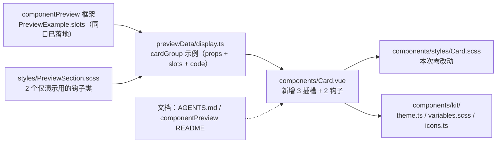

## 产品概述

对项目共享组件库中**既有的** `Card.vue` 做一次**纯增量对齐增强**：把 PrimeVue Card 的官方插槽契约补齐到本项目卡片上，并补上官方已有的容器扩展钩子。不重构 DOM、不改视觉、不动任何调用点。

## 核心功能

- **三个具名插槽（对齐官方，均无作用域参数）**
- `title`：覆盖标题内容，仍渲染在标题样式容器内（可放图标 + 文本等富内容，而非只能是纯文本）
- `subtitle`：覆盖副标题内容，同上
- `content`：覆盖卡片主体内容；不传时**自动回落默认插槽**，因此官方写法 `#content` 可原样照搬
- **两个容器类名钩子（对齐官方的容器扩展口）**
- `contentClass`：作用于卡片主体容器，供调用方传入自己的类名做受支持的样式定制，不必再硬钻组件内部选择器
- `captionClass`：作用于「标题 + 副标题」所在的标题区容器
- 二者均为可选、可与既有 `bodyNoPadding` 等修饰并存，不传时输出完全不变
- **顺带修正一处既有缺陷**：标题区此前仅在「传了 `title` 或用了 `header` 插槽」时才渲染，导致「只传 `subtitle`」时标题区整块消失、副标题被丢弃；修正后 `subtitle` 单独使用也能正常显示（现有调用点都没用到这两个属性，零影响）
- **预览可见**：组件预览面板的 Card 分区新增三张示例卡片 —— 具名插槽写法、底部工具栏（官方典型用法：footer 内放按钮组）、容器钩子（用演示类把两个钩子的**作用位置可视化**，否则快照与默认观感一模一样，等于没演示）
- **文档同步**：组件清单与预览文档补齐新插槽 / 新钩子的说明，并显式登记本项目与官方的三处语义差异（本项目 `header` 是带下边框的标题栏、官方是正文之外的通栏区；本项目对应官方通栏的是 `cover`；本项目主体容器同时承担官方 `body` 与 `content` 两个角色），避免后续照搬官方示例时误用

## 视觉效果

- **零视觉变化**：既有 8 张示例卡片与 4 处业务调用点（脚本启动器、单词阅读四个视图）的外观与行为完全不变；卡片不新增任何样式规则
- 新增的钩子示例仅通过**预览沙箱内的演示类**呈现效果：标题区出现主题色强调与间距、主体区出现弱底色 + 虚线边框 + 内边距，直观说明类名挂载到了哪一层容器
- 具名插槽示例展示「标题容器里放图标 + 文本」的富内容形态，底部工具栏示例展示「标题 / 副标题 / 正文 / 按钮组」的完整四段式卡片

## 技术栈选择

无新增依赖，全部复用现有栈：

| 项 | 选择 |
| --- | --- |
| 框架 | Vue 3 + TypeScript（`<script setup>` + `withDefaults`，与 Card 现状及全库一致） |
| 样式 | SCSS，强制分离；本次**组件本体不新增任何样式**（钩子类名由调用方提供，组件只负责挂载） |
| 设计 Token | 真源 `src/components/kit/variables.scss`，预览演示类用短名（`$s-*` / `$t-*` / `$r-*`） |
| 预览 | 复用现有 `componentPreview` 框架；**具名插槽渲染能力已于同日落地**（`PreviewExample.slots` + `PreviewStage.namedSlots`），Card 插槽无作用域参数，工厂直接忽略入参 |


## 实现方案

### 核心策略

把「插槽优先、prop 兜底」做进既有元素内部，而不是新加分支：

- `title` / `subtitle`：既有 `<h3 class="si-card__title">` / `<p class="si-card__subtitle">` 内改为 `<slot name="title">{{ title }}</slot>`，元素条件放宽为 `v-if="title || $slots.title"` —— 用**插槽默认内容承载 prop**，避免 `v-if/v-else` 双分支与重复标记。
- `content`：主体容器内写 `<slot name="content"><slot /></slot>`，以嵌套插槽实现「具名不存在时回落默认插槽」，**不引入任何 `$slots` 判断**，默认插槽路径保持原样。
- 两个钩子走 `:class` **数组合并**（钩子类与 `--no-padding` 修饰类并存），零 SCSS 改动。

### 关键决策与理由

1. **不新建 `__content` 层**：本项目 `.si-card__body` 同时承担官方 `body`（内边距容器）与 `content`（内容容器）两个角色。若为对齐官方 DOM 而插入新层，会直接打断三处既有 `:deep(.si-card__body)` 定制（`SingleCardView.scss:26`、`StatisticsView.scss:97,111`、`index.scss:319`），属于为对齐而制造回归。`contentClass` 因此挂在 `__body` 上，语义与官方 `contentClass` 对齐（作用于内容容器），落点在本项目唯一的内容容器上。
2. **`captionClass` 挂 `.si-card__header-content`**：该元素正是「标题 + 副标题」的父容器，与官方 PassThrough 的 `caption` 元素一一对应；官方只经 PT 暴露 caption、没有同名 prop，本项目补一个轻量 class 钩子即可达成同等可控性。
3. **`header` 插槽维持既有语义**：它是「整块替换标题栏（caption + header-extra）」，与官方「通栏区」不同。本次**不改**，但必须在文档登记差异，否则后续开发者照搬官方示例会把通栏图片塞进标题栏。官方通栏在本项目由 `cover` 插槽承担。
4. **顺带修正标题区渲染条件**（`$slots.title || $slots.subtitle || subtitle`）：不修则「只传 `subtitle`」静默丢内容，而新插槽 `subtitle` 正好会踩这个坑 —— 属本次改动**引入前就存在、但会被新能力放大**的缺陷，一并修掉的成本是 1 行。
5. **不做的事（YAGNI）**：不加 `titleClass` / `subtitleClass`（`title` / `subtitle` 插槽已能自定义样式）；不引入官方 `pt` / `unstyled`（本项目未采用 PT 体系）；不改 `variant` / `size` 视觉、不把 `footer` 移入主体、不去掉 `footer` 上边框、不迁移 4 处调用点。
6. **钩子示例必须可视化**：类名钩子在快照里若用「无样式的类名」，渲染结果与默认完全一致，读者无法确认钩子挂在哪一层 ⇒ 在预览沙箱样式表中加两个**仅供演示**的类（带注释声明「真实项目请用你自己的类名」），分别作用于 caption 与 content 容器。

### 性能与可靠性

- 渲染代价：`content` 的嵌套插槽与 `title` / `subtitle` 的插槽兜底均由编译器静态解析，**不新增响应式计算、无新增 VNode 层**（元素层级与数量与改动前完全一致）。
- 兼容性：全部为可选 props + 新增插槽，未传即输出与改动前**逐字节一致**；4 处调用点只传 `variant` / `size` / `class` + 默认插槽，不受影响。
- 组件库零 i18n、零 plugin / siyuan 依赖，本次不产生任何 i18n 分片改动。

## Implementation Notes

### 必须遵守的项目硬规则

- **文件头注释（强制）**：`Card.vue` 当前首行直接是 `<template>`，**缺** `<!-- ... -->` 职责注释（10~30 字）。本次修改既有文件，顺带补上。
- 样式分离：`Card.vue` 的 `<style scoped>` 只允许 `@use './styles/Card.scss';`（本次不新增规则，保持原样）。
- **禁止猜 props**：预览示例只使用已核对过的共享组件 props（`Button` 的 `variant` / `text`）；图标只能取 `kit/icons.ts` 已注册的 `IconKey`。
- 预览数据文件超 300 行需另建文件：`display.ts` 现 194 行，新增 3 例后预计约 270 行，仍在阈值内，**不拆文件**。
- 短名 Token 优先：预览演示类用 `$s-*` / `$t-*` / `$r-*`；无对应 Token 的几何量按既有惯例加 `// 无对应 Token` 注释。
- 预览沙箱样式经 `PreviewSection.vue` 的**非 scoped** `<style lang="scss">` 全局引入，演示类可直接生效（与既有 `.cp-card__stage--speeddial` 同机制）。

### 变更半径控制

- 仅修改 5 个文件（1 个组件 + 1 个预览数据 + 1 个预览样式 + 2 份文档），**无新增文件**。
- 不触碰 `src/components/styles/Card.scss`（零新增样式）、i18n 分片、`icons.ts`、`settings.ts`、`features/config.ts`；组件总数保持 **27**，故根 `README.md`、`kit/README.md`、迁移指南的计数**无需改动**。
- 不迁移、不改写任何业务调用点。

### 文档同步的判定依据

项目规则明确：**新增/修改共享组件的 props、行为、具名插槽或事件契约后，必须同步 `previewData/*.ts` 与 `componentPreview/README.md`**。Card 的命名插槽此前**从未登记**（`header` / `header-extra` / `cover` / `footer` 都缺行），本次一并补齐 7 行，其中 4 行为补登记、3 行为新增能力；同时把既有但从未登记的 `click` 事件契约补上（仅在 `clickable` 且非 `disabled` / `loading` 时派发原生 `MouseEvent`）。

## Architecture Design

依赖方向不变，仍是「预览清单 → 共享组件 → kit 支撑」的单向链，无新增模块：



卡片内部 DOM 结构**保持不变**，仅在既有元素上新增挂载点：

```text
.si-card[--variant][--size][--clickable|--active|--loading|--rounded|--has-cover]
  .si-card__header            (v-if header 插槽 或 title / subtitle)
    .si-card__header-content  ← captionClass 挂这里；内含 header 插槽兜底 = h3(title) + p(subtitle)
       └ title / subtitle 插槽现可覆盖各自文本
    .si-card__header-extra
  .si-card__cover
  .si-card__body              ← contentClass 挂这里（+ --no-padding 修饰）
       └ content 插槽（默认回落默认插槽）
  .si-card__footer
  .si-card__loading-overlay
```

## Directory Structure

本次改动共 5 个文件，**无新增文件**：

```text
siyuanPluginVueSN/
├── src/
│   ├── components/
│   │   └── Card.vue                                   # [MODIFY] 补文件头注释；新增 title / subtitle / content 具名插槽
│   │                                                  #          （title/subtitle 用「插槽默认内容承载 prop」的写法，
│   │                                                  #          content 用 <slot name="content"><slot /></slot> 回落默认插槽）；
│   │                                                  #          标题区渲染条件放宽为 header 插槽 / title / subtitle 三选一；
│   │                                                  #          新增 contentClass（挂 .si-card__body）与
│   │                                                  #          captionClass（挂 .si-card__header-content）两个可选 props，
│   │                                                  #          经 :class 数组合并与既有修饰类并存；不新增任何样式
│   └── features/
│       └── componentPreview/
│           ├── previewData/
│           │   └── display.ts                          # [MODIFY] cardGroup 新增 3 例：具名插槽（title/subtitle/content，
│           │                                          #          title 用 IconWrapper + 文本演示富内容）；底部工具栏
│           │                                          #          （footer 放 Button 组，官方典型用法）；容器钩子
│           │                                          #          （contentClass / captionClass + 演示类）；同步更新 summary
│           ├── styles/
│           │   └── PreviewSection.scss                 # [MODIFY] 新增 2 个「仅预览演示」的钩子类（注释声明真实项目请自备类名）：
│           │                                          #          .cp-hook-caption（caption 区强调色 + 间距）、
│           │                                          #          .cp-hook-content（主体区弱底色 + 虚线边框 + 内边距）；
│           │                                          #          全部用短名 Token，无对应 Token 的几何量加注释
│           └── README.md                               # [MODIFY] 「具名插槽」表新增 7 行 Card 条目（header / header-extra /
│                                                      #          cover / footer 为补登记，title / subtitle / content 为新增，
│                                                      #          并登记三处与官方的语义差异与差异原因）；
│                                                      #          「事件契约」表新增 Card.click 行
└── AGENTS.md                                           # [MODIFY] § 3 组件清单的 Card.vue 行：职责列补三个具名插槽与
                                                        #          「content 回落默认插槽」，关键 props 列补
                                                        #          contentClass / captionClass（注明对应官方 contentClass 与 PT caption）；
                                                        #          组件总数 27 不变
```

**明确不改动**：`src/components/styles/Card.scss`（钩子类由调用方提供，组件本体零新增样式）、根 `README.md` / `src/components/kit/README.md` / `src/components/docs/components-vue3-migration-guide.md`（组件计数未变）、`src/i18n/**`、`src/config/icons.ts`、`src/config/settings.ts`、`src/features/config.ts`、4 处业务调用点。

## Key Code Structures

1）插槽与钩子的落点（`src/components/Card.vue`，仅签名与结构，避免实现歧义）：

```html
<!-- 标题区：插槽默认内容承载 prop，插槽存在时优先 -->
<h3 v-if="title || $slots.title" class="si-card__title">
  <slot name="title">{{ title }}</slot>
</h3>
<p v-if="subtitle || $slots.subtitle" class="si-card__subtitle">
  <slot name="subtitle">{{ subtitle }}</slot>
</p>

<!-- 主体：具名 content 优先，未传时回落默认插槽（零 $slots 判断） -->
<div class="si-card__body" :class="[{ 'si-card__body--no-padding': bodyNoPadding }, contentClass]">
  <slot name="content"><slot /></slot>
</div>
```

2）新增 props（`interface Props` 内，保持全部可选、向后兼容）：

```ts
/** 主体容器的附加类名（对应官方 contentClass） */
contentClass?: string
/** 标题 + 副标题所在标题区容器的附加类名（对应官方 PT 的 caption 元素） */
captionClass?: string
```

3）预览示例的具名插槽写法（`previewData/display.ts`，Card 插槽无作用域参数，工厂忽略入参、每次调用新建 VNode）：

```ts
slots: {
  title: () => h("div", null, [h(IconWrapper, { name: "check", size: 14 }), " 具名插槽标题"]),
  content: () => "用 content 插槽承载正文，与官方写法一致。",
}
```

## Agent Extensions

### MCP

- **Context7**
- Purpose: 在动手改 `Card.vue` 前，再核对一次 PrimeVue Card 的权威契约 —— 5 个插槽名与是否携带作用域参数、`CardProps` 是否真的没有功能性 props、PassThrough 元素清单里 `caption` 的确切位置（用于确认 `captionClass` 的语义落点与文档措辞）。
- Expected outcome: 产出一份可对照的官方契约结论，确认「新增 3 插槽 + 2 钩子」不偏离官方语义（尤其 `caption` 与 `contentClass` 的对应关系），避免凭记忆写文档导致后续开发者误用。

### Skill

- **universal-arch-skill**
- Purpose: 用其「模式 C：代码架构审查」清单审查本次改动 —— 文件头注释是否补齐、`.vue` 是否仍然只 `@use` 一份样式、预览数据是否遵循「props 与 code 同源」、是否引入重复常量或过度抽象（Rule of Three）、组件库是否仍零 i18n / 零 plugin 依赖。
- Expected outcome: 输出逐条对照的审查结论与需修正项清单；若发现违规，当场修正后再交付用户执行 `pnpm lint` / `pnpm i18n:verify` / `pnpm validate:icons` / `npx tsc --noEmit` 四道验证。