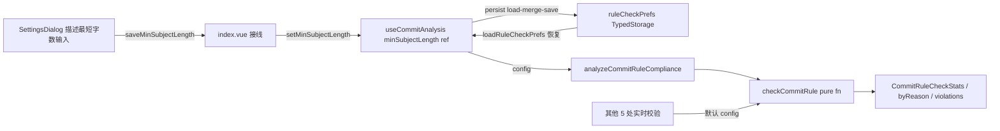

## 用户需求

在 gitPush 模块的「提交规则检查」（CommitRuleCheck）功能中，审查并扩展现有提交信息规则。当前已有 7 条规则（首尾空白、缺 type、type 非法、scope 为空、分隔符错误、描述为空、描述非中文），需在保持现有规则不变的基础上新增 4 条规则，并使其中「描述过短」的字数阈值支持用户自定义。

## 核心功能

1. **新增「描述过短」规则**：冒号后描述字数低于阈值时判为违规；默认阈值 15 字，用户可在 gitPush 设置中自定义。
2. **新增「描述以句号结尾」规则**：描述以英文句点 `.` 或中文句号 `。` 结尾时判为违规（参考 GitHub/Pro Git 建议）。
3. **新增「scope 格式非法」规则**：scope 仅允许小写字母、数字、连字符（`a-z0-9-`），含大写、中文或特殊字符时判为违规。
4. **新增「正文与标题未空行」规则**：多行提交信息中，body 第一行与 subject 之间缺少空行时判为违规；单行提交不受影响。
5. **阈值可配置**：在 gitPush 设置弹窗的「常规」分区新增「描述最短字数」输入框（数字输入 + 保存按钮），保存后规则检查面板按新阈值判定。
6. **启发式修正适配**：修正弹窗/批量修正的启发式修正需能自动去掉句号、规范化 scope；描述过短与正文未空行无法确定性修正时交由 AI 生成。

## 视觉与交互效果

- 违规类型分布条形图新增 4 类原因，颜色/标签与现有样式一致。
- 不合规提交列表每行原因徽章显示新原因中文标签。
- 设置弹窗「常规」分区在并发数、网络超时下方新增一行「描述最短字数」输入 + 保存按钮，沿用现有表单样式。
- 规则提示文案更新，说明新增规则。

## 技术栈选择

- 前端框架：Vue 3 + TypeScript（沿用现有技术栈）
- 规则引擎：纯函数 `checkCommitRule`（现有 `src/features/gitPush/commitRuleChecker.ts`，零依赖可测试）
- 状态与存储：`useCommitAnalysis` composable + `TypedStorage`（沿用现有 `ruleCheckPrefs` 槽位）
- 样式：Codex 设计 Token + 独立 SCSS（不新增样式文件，复用现有 SettingsDialog 样式类）

## 实现方法

采用「可选参数 + 默认值」方式扩展纯函数签名，实现向后兼容与最小改动：

- `checkCommitRule(message, config = DEFAULT_COMMIT_RULE_CONFIG)` 增加可选配置参数，缺省使用默认阈值 15。现有 5 处实时校验调用（提交阻断、commit log 标记、修正校验、批量修正校验、AI 生成校验）无需改动即可自动获得 4 条新规则（句号/scope/空行为确定性格式规则，阈值默认 15）。
- `analyzeCommitRuleCompliance(entries, config)` 透传配置，仅在 `useCommitAnalysis.commitRuleStats` 中传入用户配置的 `minSubjectLength`，使规则检查面板的「描述过短」阈值可调。
- 配置持久化复用现有 `RuleCheckPrefs`（`git-push-rulecheck-prefs` 槽位），扩展 `minSubjectLength` 字段；`useCommitAnalysis` 维护响应式 `minSubjectLength` ref，设置面板通过 index.vue 接线读写。

### 关键决策

- **向后兼容**：`checkCommitRule` 第二参为可选参数，避免破坏 6 处调用点；`analyzeCommitRuleCompliance` 仅一处调用，显式传配置即可。
- **规则判定顺序**：`notChinese` 优先于「描述过短/句号结尾」，避免英文描述误报为「过短」而非「非中文」；`invalidScopeFormat` 紧跟 `invalidScope`；多行空行判定放在 subject 校验之后。
- **subject 提取**：将冒号后内容按首个换行符拆分为 subject（首行）与 body（后续），长度/句号/中文判定只作用于 subject，避免多行消息的 body（可能含代码）干扰判定。
- **启发式修正边界**：句号结尾与 scope 格式为确定性可修；描述过短、正文未空行无法确定性修复，返回空串交由 AI 生成，避免生成仍违规的修正结果。

## 实现细节

### 规则判定（commitRuleChecker.ts）

- 新增 `SCOPE_FORMAT_REGEX = /^[a-z0-9-]+$/` 校验 scope。
- 新增句号判定：`/[.。]$/` 匹配 subject 末尾。
- 新增过短判定：`subject.length < config.minSubjectLength`（中文单字计 1，沿用 UTF-16 length）。
- 新增空行判定：`body` 非空且 `body` 首个换行前的首行去空白后非空 → `missingBlankLine`（即 subject 后直接跟正文、未空行）。
- `fixCommitMessageHeuristically`：对 scope 执行 `trim().replace(/[^a-z0-9-]/g, "-").toLowerCase()` 规范化，结果为空则省略 scope；对 subject 执行 `.replace(/[.。]+$/, "")` 去句号。

### 配置数据流

- `types/meta.ts`：`CommitRuleReasonKey` 增加 `subjectTooShort | subjectEndsWithPeriod | invalidScopeFormat | missingBlankLine`；`COMMIT_RULE_REASON_META` 增加 4 个 labelKey；新增 `CommitRuleConfig`、`DEFAULT_COMMIT_RULE_CONFIG`；`RuleCheckPrefs` 增加 `minSubjectLength`。
- `types/storage.ts`：`DEFAULT_RULE_CHECK_PREFS` 增加 `minSubjectLength`（引用 `DEFAULT_COMMIT_RULE_CONFIG.minSubjectLength` 避免魔法数字重复）；新增 `MIN_SUBJECT_LENGTH_MIN/MAX` 与 `clampMinSubjectLength`（与 `clampGitConcurrency` 同模式）。
- `types/index.ts`：重导出 `CommitRuleConfig` 类型、`DEFAULT_COMMIT_RULE_CONFIG` 常量、`clampMinSubjectLength`。
- `useCommitAnalysis.ts`：`minSubjectLength` ref（默认 15）；`loadRuleCheckPrefs` 恢复该值；新增 `setMinSubjectLength(n)`（load-merge-save 到 `ruleCheckPrefs`，保留 `projectId`）；`commitRuleStats` 传 `{ minSubjectLength: minSubjectLength.value }`；`setRuleCheckProject` 改为 load-merge-save 避免覆盖 `minSubjectLength`。

### 设置面板（SettingsDialog.vue + index.vue）

- `SettingsDialog` 新增 prop `minSubjectLength` 与 emit `saveMinSubjectLength`；general 分区参考「网络超时」行新增「描述最短字数」`Input`（`type="number"`、`size="xsmall"`）+ 保存按钮 + 提示文案。
- `index.vue` 从 `useCommitAnalysis` 解构 `minSubjectLength`、`setMinSubjectLength`，接线 SettingsDialog 的 prop 与 `@save-min-subject-length`；进入面板/打开设置时加载配置。

### i18n 与文档

- 仅修改分片 `src/i18n/zh_CN/gitPush.json`、`src/i18n/en_US/gitPush.json`；新增 4 个 reason labelKey、设置项 `ruleCheckMinSubjectLength`、`ruleCheckMinSubjectLengthHint`，并更新 `ruleCheckHint` 文案；禁止修改顶层合并 JSON。
- 同步更新 `src/features/gitPush/README.md` 的规则检查章节。

## 架构设计

规则引擎保持「纯函数 + 显式配置注入」，不引入模块级可变状态。数据流如下：



## 目录结构

```
src/features/gitPush/
├── types/
│   ├── meta.ts                  # [MODIFY] 扩展 CommitRuleReasonKey(+4)、COMMIT_RULE_REASON_META(+4)、新增 CommitRuleConfig/DEFAULT_COMMIT_RULE_CONFIG、RuleCheckPrefs.minSubjectLength
│   ├── storage.ts               # [MODIFY] DEFAULT_RULE_CHECK_PREFS 增加 minSubjectLength；新增 MIN_SUBJECT_LENGTH_MIN/MAX + clampMinSubjectLength
│   └── index.ts                 # [MODIFY] 重导出 CommitRuleConfig/DEFAULT_COMMIT_RULE_CONFIG/clampMinSubjectLength
├── commitRuleChecker.ts         # [MODIFY] checkCommitRule 新增 4 条规则 + config 可选参数；analyzeCommitRuleCompliance 透传 config；fixCommitMessageHeuristically 适配句号/scope
├── composables/
│   └── useCommitAnalysis.ts     # [MODIFY] 维护 minSubjectLength ref、loadRuleCheckPrefs 恢复、setMinSubjectLength、commitRuleStats 传 config、setRuleCheckProject 改 load-merge-save
├── components/
│   └── common/
│       └── SettingsDialog.vue   # [MODIFY] general 分区新增「描述最短字数」输入行；新增 prop minSubjectLength 与 emit saveMinSubjectLength
├── index.vue                    # [MODIFY] 解构/接线 minSubjectLength、setMinSubjectLength；SettingsDialog 传 prop + 处理 emit
├── README.md                    # [MODIFY] 更新提交规则检查说明
src/i18n/
├── zh_CN/gitPush.json           # [MODIFY] 新增 4 个 reason labelKey + 设置项键 + 更新 ruleCheckHint
└── en_US/gitPush.json           # [MODIFY] 同上英文文案
```

## 关键代码结构

```ts
// types/meta.ts
export type CommitRuleReasonKey =
  | "whitespace" | "missingType" | "invalidType" | "invalidScope"
  | "invalidScopeFormat" | "badSeparator" | "emptySubject" | "notChinese"
  | "subjectEndsWithPeriod" | "subjectTooShort" | "missingBlankLine"

export interface CommitRuleConfig {
  minSubjectLength: number
}
export const DEFAULT_COMMIT_RULE_CONFIG: CommitRuleConfig = { minSubjectLength: 15 }

// commitRuleChecker.ts
export function checkCommitRule(
  message: string,
  config: CommitRuleConfig = DEFAULT_COMMIT_RULE_CONFIG,
): CommitRuleReasonKey | null
export function analyzeCommitRuleCompliance(
  entries: CommitAnalysisEntry[],
  config: CommitRuleConfig = DEFAULT_COMMIT_RULE_CONFIG,
): CommitRuleCheckStats
```