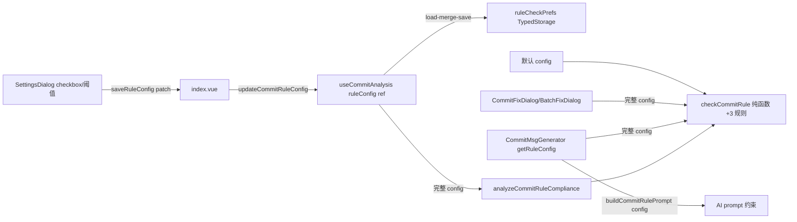

## Product Overview

在 gitPush「提交规则检查」现有 11 条规则基础上，新增 3 条可选规则，每条可在设置弹窗中单独开关，默认开启。规则来源为 Chris Beams《How to Write a Git Commit Message》与 commitlint `config-conventional` 业界惯例。

## Core Features

- **描述首字母大写**（默认开）：仅当描述以小写英文字母开头时判违规（`subjectNotCapitalized`）；中文/数字/大写/符号开头天然合规，不与「描述须含中文」冲突
- **WIP 临时提交检测**（默认开）：描述以 `wip`/`todo`/`fixme`/`tbd` 等临时标记开头判违规（`wipSubject`），针对 `feat: WIP xxx` 这类（`wip: xxx` 已被现有 missingType 拦截）
- **正文行长限制**（默认开，阈值默认 72 可配）：多行消息 body 每行超过阈值判违规（`bodyLineTooLong`），空行不违规
- **设置面板开关**：常规分区新增 2 个 checkbox（首字母大写/WIP，切换即时保存）+ 1 组「正文行长限制」checkbox + 阈值数字输入（保存按钮/Enter），统一走 `saveRuleConfig` patch 事件
- **AI 生成同步**：AI prompt 按开关动态拼接规则约束，生成后校验与用户配置同口径

## Tech Stack Selection

沿用现有栈：Vue 3 + TypeScript + SCSS 设计 Token；规则引擎为纯函数 `checkCommitRule`（`commitRuleChecker.ts`），配置经 `TypedStorage`（`git-push-rulecheck-prefs` 槽位）持久化。无新增依赖。

## Implementation Approach

完全复用上一轮建立的「可选参数 + 默认值」扩展模式，零签名破坏：

1. **配置对象扁平扩展**：`CommitRuleConfig` 增加 4 个字段（`requireCapitalizedSubject` / `detectWipSubject` / `bodyLineLimitEnabled` 均 boolean 默认 true；`maxBodyLineLength` 默认 72）。`checkCommitRule(message, config = DEFAULT_COMMIT_RULE_CONFIG)` 的 6 处调用点（WorkingTreePanel/ProjectCard/CommitFixDialog/BatchFixDialog/CommitMsgGenerator/useCommitAnalysis）无需改签名，默认全开自动生效
2. **向后兼容读取**：`RuleCheckPrefs` 增加 4 个可选字段（`?`），所有读取点逐字段 `??` 回退默认值（与 `minSubjectLength` 同模式），旧数据零迁移
3. **单值 ref 升级为整对象**：`useCommitAnalysis` 的 `minSubjectLength` ref 升级为 `ruleConfig: Ref<CommitRuleConfig>`，`setMinSubjectLength` 升级为 `updateCommitRuleConfig(patch)`（load-merge-save），未来加规则只改 config 对象
4. **判定顺序**：`notChinese` 之后插入 `subjectNotCapitalized` → `wipSubject`；`bodyLineTooLong` 放链尾（`missingBlankLine` 之后）。WIP 用 `/^(wip|todo|fixme|tbd)\b/i`（`\b` 在字母→中文边界成立，`WIP登录` 可命中）
5. **AI prompt 单一事实源升级**：`buildCommitRulePrompt(config: CommitRuleConfig)` 改接收完整 config 按开关拼接（中文开头天然满足大写无需文案；WIP 开启追加禁用临时标记；正文行长开启追加行宽要求）；`CommitMsgGenerator.getRuleConfig()` 返回完整 config，生成后校验与 heuristic 终验自动同口径
6. **设置 UI 统一入口**：SettingsDialog 常规分区在「描述最短字数」行后新增开关区，全部 emit `saveRuleConfig: [patch: Partial<CommitRuleConfig>]`，checkbox 即时保存（同 pushBranchMode 模式），阈值输入走保存按钮/Enter（同 minSubjectLength 模式）

### 性能与可靠性

- 规则判定为 O(n) 单次遍历字符串，n 为消息长度，无性能风险
- 所有配置读取为逐字段 `??` 回退，不存在 undefined 泄漏到判定逻辑
- 默认全开使 WorkingTreePanel/ProjectCard（默认 config）与规则检查面板自动一致，无阈值漂移

### 架构



## Directory Structure Summary

```
src/features/gitPush/
├── types/
│   ├── meta.ts                  # [MODIFY] CommitRuleReasonKey +3（subjectNotCapitalized/wipSubject/bodyLineTooLong）、COMMIT_RULE_REASON_META +3、CommitRuleConfig +4 字段、DEFAULT_COMMIT_RULE_CONFIG 同步、RuleCheckPrefs +4 可选字段
│   ├── storage.ts               # [MODIFY] DEFAULT_RULE_CHECK_PREFS 增加新字段默认值
│   └── index.ts                 # [MODIFY] 重导出（类型清单追加，无新常量）
├── commitRuleChecker.ts         # [MODIFY] checkCommitRule 新增 3 条判定（大写/WIP/正文行长）；buildCommitRulePrompt 签名改为接收完整 CommitRuleConfig 按开关拼接
├── managers/
│   └── CommitMsgGenerator.ts    # [MODIFY] getRuleConfig 返回完整 config（读 4 个新字段逐字段回退）
├── composables/
│   └── useCommitAnalysis.ts     # [MODIFY] minSubjectLength ref 升级为 ruleConfig 整对象；loadRuleCheckPrefs 逐字段恢复；新增 updateCommitRuleConfig(patch)（load-merge-save）；commitRuleStats 传完整 config
├── components/
│   ├── common/
│   │   ├── SettingsDialog.vue   # [MODIFY] 常规分区新增规则开关区：2 checkbox 即时 + 正文行长 checkbox + 阈值输入组；props 升级为 ruleConfig，emit saveRuleConfig patch
│   │   ├── CommitFixDialog.vue  # [MODIFY] minSubjectLength ref 升级为 ruleConfig ref（init 恢复全部字段）
│   │   └── BatchFixDialog.vue   # [MODIFY] 同上
│   └── ...
├── index.vue                    # [MODIFY] 解构 ruleConfig/updateCommitRuleConfig，SettingsDialog 接线改 saveRuleConfig
└── README.md                    # [MODIFY] 规则清单补充 3 条可选规则与开关说明
src/i18n/
├── zh_CN/gitPush.json           # [MODIFY] +3 reason labelKey、设置开关文案约 6 键
└── en_US/gitPush.json           # [MODIFY] 同步英文
```

### 关键代码结构

```ts
// types/meta.ts
export type CommitRuleReasonKey =
  | ... // 现有 11 个
  | "subjectNotCapitalized"
  | "wipSubject"
  | "bodyLineTooLong"

export interface CommitRuleConfig {
  minSubjectLength: number
  /** 描述首字母大写（仅小写英文字母开头判违规） */
  requireCapitalizedSubject: boolean
  /** WIP 临时提交检测（wip/todo/fixme/tbd 开头） */
  detectWipSubject: boolean
  /** 正文行长限制开关 */
  bodyLineLimitEnabled: boolean
  /** 正文单行最大字符数（默认 72） */
  maxBodyLineLength: number
}
```