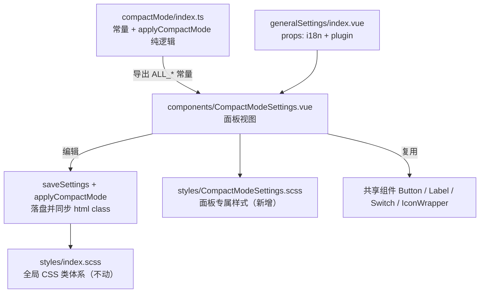

## 用户需求

对 `src/features/compactMode` 模块做一次「通用（共享）组件使用 + 编码规范」合规审查：先给出违规清单与规则依据，随后直接落地修复，最终由用户自行跑验证命令。

## 产品概述

compactMode 是「紧凑模式」功能模块，由三部分组成：一份全局 CSS 类体系（在 `<html>` 上切换密度/字号/区域类，Sass 编译期乘法计算）、一段应用逻辑、以及嵌入「常用设置」面板的一个设置页。本次不改功能语义与视觉档次，只把设置面板中「不按项目规则写」的部分拉回统一规范。

## 核心功能

- **审查与列出违规项**：覆盖共享组件库规则（原生控件、自建同类控件）、样式外置规则、设计 Token 规则、i18n 规则、死代码与文档漂移五类。
- **共享组件替换**：面板中的原生单选 chip 组改为共享 `Button` 分组（选中态主色 text 外观），原生标签改为共享 `Label`，开关继续沿用共享 `Switch`。
- **样式外置与 Token 化**：面板内嵌样式提取为独立 SCSS，字号/字重/行高/圆角/间距走设计 Token，颜色改为「思源变量 + 设计色」双保险，去掉发光阴影、装饰性字距与不合规过渡。
- **i18n 修正**：订正中文错别字，为密度档位文案补充中英分片键，保证中英键对齐。
- **死代码与注释、文档订正**：清理无引用导出、修正与实现不符的档位注释、更正 README 中样式引入方式的错误描述。

## 视觉与行为效果

设置页外观与交互结构保持现状：主开关行、密度档位行、字号档位行、生效区域开关行自上而下排布；档位由「自绘 chip」变为与项目其它模块一致的分段按钮（选中项主色文字、未选中灰色文字），在 360px 宽面板下自动换行；区域开关行标签与开关左右对齐不变；面板底色与卡片层级沿用现有 gitPush 范式。

## 技术栈

- 沿用现有工程：Vite + Vue 3（`<script setup>` + TS）+ SCSS（`src/_variables.scss` 设计 Token 单一来源）+ 思源插件 API，**不引入任何新依赖**。
- 复用既有共享组件：`Button.vue`、`Label.vue`、`Switch.vue`、`IconWrapper.vue`；复用既有先例 `bookmarkMarker/components/ruleItem/ModeGroupField.vue`（Button 单选分组）。

## 实现策略

按「逻辑层 → 视图层 → 样式层 → 文案层 → 文档层」五步推进，全部改动收敛在 compactMode 目录与 2 个 i18n 分片，不触碰宿主 `generalSettings/index.vue`、不改 `styles/index.scss` 的 CSS 类体系、不改 `settings.ts` 默认值。

关键决策与理由：

1. **chip 单选组 → 共享 `Button` 分组**（用户已确认方案）

- 依据：共享组件库无 Radio 组件，而项目既有先例 `ModeGroupField.vue` 用 `Button` + `text` 外观实现同样语义，且已在 bookmarkMarker 通过审查。
- 写法：`variant="primary"`（选中）/ `variant="ghost"`（未选中）+ `text` + `size="xsmall"` + `:aria-pressed`，容器 `flex-wrap` 保证字号 6 档在 360px 面板内可换行。
- 收益：删掉 `.chip-option`、`.hidden-radio` 两类唯一自绘样式与隐藏 radio 的 DOM 结构，同时自动获得键盘可达性与选中态语义。

2. **原生 `<label>` → 共享 `Label`**：`Label` 自带 `icon`/`iconSize`/`size`/`width`/`align`，可直接吸收现有 `IconWrapper + 文案` 组合；区域行标签用 `size="small"`，与项目其它设置面板一致。

3. **内嵌样式外置**：新建 `styles/CompactModeSettings.scss`（组件专属，PascalCase），`.vue` 内只保留 `<style scoped lang="scss">@use ...</style>`。这是硬规则，且外置后 scoped 编译带自身 `data-v`，避免后续父组件样式穿透问题。

4. **常量单一来源**：`index.ts` 导出 `ALL_DENSITIES` / `ALL_FONT_SCALES` / `ALL_AREAS`，视图层直接从此派生「密度选项表 / 字号选项表 / 区域初始值」，消除同一份名单在两处硬编码的复制粘贴。

5. **死代码与注释**：删除零引用的 `getCompactModeState()`（已 grep 确认全项目无调用），修正 `index.ts` 顶部与实际不符的字号档位注释。保留 `applyCompactMode` 签名与 `import "./styles/index.scss"` 不变（`src/main.ts` 与 `src/index.ts` 依赖）。

6. **i18n**：只改分片 `src/i18n/{zh_CN,en_US}/compactMode.json`。订正 `compactMode` 值的中文错别字；新增密度 3 档文案键（中英对齐）。区域标签键 `compactArea*` 已存在于 `common.json`，保持现有读取方式不动。顶层合并 JSON 由 `pnpm i18n:merge` 生成，禁止手改。

7. **类型收紧**：`plugin?: any` 改为 `import type { Plugin } from "siyuan"` + `plugin?: Plugin`，与兄弟面板（`ListStyleSettings.vue` 等）对齐。

## 性能与可靠性

- 无运行时热路径变化：本次均为模板/样式/文案层替换，`applyCompactMode` 的 DOM class 切换逻辑零改动，启动链路开销不变。
- 组件行数由 343 行降至约 200 行（样式外置 100+ 行），远离 500 行硬阈值；单一函数均 ≤30 行。
- 行为兼容：`Switch` 的 `v-model` + `@change="save"` 写法保留（该组件确实同时 emit `update:modelValue` 与 `change`）；区域开关仍走 `update:model-value` 即改即存；默认值与 `DEFAULT_SETTINGS` 一致，不改动。
- 风险控制：`getCompactModeState` 若被插件外部脚本经 `window` 间接引用理论上会失效，但项目内无任何引用，且该模块未对外暴露命名空间，判定为安全删除。

## 影响面与不变量

- **保持不动**：`styles/index.scss`（全局类体系，质量良好）、`applyCompactMode` 签名、`import "./styles/index.scss"`、`IconWrapper` 的 `:size="14"` 用法（项目普遍写法）、文件归属（组件仍留在 compactMode，`generalSettings` 的导入路径不变）、`settings.ts` 默认值。
- **不越界**：不修改 `generalSettings` 其它面板，不处理 `video/CompressDialog`、`wordQuery`、`gitPush` 三 Dialog 中遗留的原生 radio（仅作为背景在报告中提及，不计入本次工期）。
- **验证交给用户**：AI 不执行 `pnpm vite build` / `pnpm lint`；用户执行 `pnpm lint`、`pnpm i18n:verify`、`pnpm validate:icons`、`npx tsc --noEmit`。

## 架构设计

模块保持三层职责不变，仅让视图层回归「只做模板与状态」：



## 关键实现约定

- 颜色一律 `var(--b3-theme-*, $color-*)` 双保险；`--b3-theme-primary` 的 fallback 按项目历史约定用 `$color-danger`，勿"修正"。
- 过渡统一 `0.12s ease`；删除 `box-shadow` 描边与 `letter-spacing`；圆角用 `$radius-sm` / `$radius-base`。
- 字号两级制：标题/正文基准 `$font-size-xs`(12px)，辅助文字/描述/标签 `$font-size-2xs`(10px)；原 13px、11px 不再保留（档位按钮字号由 `Button` 的 `xsmall` 档自带）。
- 每个 `.ts` / `.vue` 顶部必须有 10~30 字文件头注释（`.vue` 用 `<!-- -->` 置于 `<template>` 前），`.scss` 不需要。

## 目录结构

```
src/features/compactMode/
├── components/
│   └── CompactModeSettings.vue   # [MODIFY] 面板视图。改造点：补文件头注释；原生 radio chip 组→共享 Button 分组（选中 primary/未选中 ghost + text + xsmall + aria-pressed，容器 flex-wrap）；原生 label→共享 Label（含 icon/width 用法）；plugin 由 any 收紧为 siyuan 的 Plugin 类型；密度/字号/区域选项表改由 index.ts 导出的 ALL_* 常量派生，消除重复；内嵌 style 全部移出，仅留 @use。保持 v-model + @change 保存链路与区域即改即存行为不变。
├── styles/
│   ├── index.scss                # [KEEP] 全局 CSS 类体系（177 行，Sass 编译期乘法计算），本次不动
│   └── CompactModeSettings.scss  # [NEW] 面板专属样式。承载原 .vue 内嵌的 107 行：根容器内边距、主开关行、副标题、密度/字号分组容器（flex + wrap + gap）、区域行左右布局、描述文字。要求：全部走设计 Token（字号/字重/行高/圆角/间距）；颜色 var(--b3-theme-*, $color-*) 双保险；删除 box-shadow 描边与 letter-spacing；过渡统一 0.12s ease；不再定义 chip/hidden-radio 类。
├── index.ts                      # [MODIFY] 导出 ALL_DENSITIES / ALL_FONT_SCALES / ALL_AREAS 三个常量（供视图派生选项与初始值）；修正顶部注释中与实现不符的字号档位（现写 80/85/90/95/100，实为 100/98/96/94/92/90）；删除零引用导出 getCompactModeState()。applyCompactMode 签名与样式 import 保持不变。
├── README.md                     # [MODIFY] 更正"样式通过 src/index.scss 的 @use 引用"的错误描述（实为 index.ts 内 import）；补充组件与样式文件清单说明；档位/区域清单与实现对齐。
└── (无新增文件)
src/i18n/
├── zh_CN/compactMode.json        # [MODIFY] 订正 "compactMode": "紧洛模式" → "紧凑模式"；新增密度三档文案键（适中/紧凑/极简）
└── en_US/compactMode.json        # [MODIFY] 同步新增对应英文键，保证与 zh_CN 键集完全对齐
```

## Key Code Structures

i18n 新增键命名（与既有 `compactMode*` / `compactArea*` 前缀风格一致，中英同名同序，禁止与 `common.json` 已有键重名）：

```
compactDensityModerate   // zh: 适中      en: Moderate
compactDensityCompact    // zh: 紧凑      en: Compact
compactDensityExtreme    // zh: 极简      en: Extreme
```

档位分组视图结构（循 `ModeGroupField.vue` 先例，容器样式在 CompactModeSettings.scss）：

```
<Button
  v-for="opt in fontScaleOptions"
  :key="opt.value"
  :variant="fontScale === opt.value ? 'primary' : 'ghost'"
  text
  size="xsmall"
  :aria-pressed="fontScale === opt.value"
  @click="selectFontScale(opt.value)"
>{{ opt.desc }}</Button>
```

## 交付与验证

1. 对话正文先输出审查报告：违规项清单（含文件与行号、规则依据）→ 修复动作 → 修复后对照。
2. 用户侧验证四连：`pnpm lint`、`pnpm i18n:verify`、`pnpm validate:icons`、`npx tsc --noEmit`。
3. 目视回归：打开「常用设置 → 紧凑模式」，确认主开关、密度 3 档、字号 6 档、区域 5 开关的选中态与生效结果与改造前一致（html 上的 `siyuan-compact-mode` / `compact-density-*` / `compact-font-*` / `compact-area-*` class 切换结果不变）。