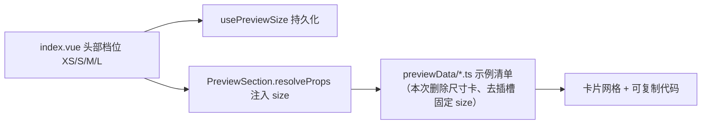

## 产品概述

组件预览面板（`src/features/componentPreview/`）头部工具栏已提供 XS / S / M / L 四档全局尺寸切换，可对所有支持 `size` 的组件示例统一注入档位并持久化。因此各分区卡片里再单独摆一张「尺寸」演示卡属于重复入口，需要清理。

## 核心功能

- **删除分区内的尺寸演示卡**：移除所有以「尺寸」为标题、专项演示某档 `size` 的示例卡（Button 的 xsmall/small/medium/large 四张、Toolbar 的 large、以及 Avatar 的「尺寸 / 尺寸 xlarge」等），尺寸演示仅保留头部档位切换这一个入口；卡片对应代码块一并消失。
- **插槽内子控件不再固定档位**：Panel 操作区/切换按钮/页脚按钮、Card 页脚按钮、Timeline 标记 Avatar 不再显式传 `size="xsmall"`，改为跟随各自默认档位。
- **要点迁移而非丢失**：Toolbar「容器档位不会注入插槽，内部控件需自行传同档 size」这一说明从卡片迁到分区说明与机制文档中。
- **视觉与交互不变**：面板结构、头部档位按钮、卡片网格与代码展开交互均保持原样，只是卡片数量减少；对不受头部档位注入的组件（如示例自身组合中的子控件），其显示尺寸回到组件默认值。

## 技术栈

沿用项目现有技术栈，不引入任何新依赖：Vite + Vue 3 + TypeScript（`<script setup>`）+ SCSS。本次改动集中在**纯数据清单文件** `src/features/componentPreview/previewData/*.ts` 与两处文档/注释，属于"减面"型清理，无新组件、无新 API、无新样式、无 i18n 新键。

## 实施方案

数据驱动 + 单一尺寸入口原则：把"尺寸演示"收敛到头部 `cp-size` 档位切换（`index.vue` → `usePreviewSize` → `PreviewSection.resolveProps` 注入链路），卡片只负责演示**其它能力轴**。

关键决策与理由：

1. **只删示例数据，不动注入机制**。`resolveProps` 中 `group.sizeable === true` 且示例未显式声明 `size` 时注入全局档位的逻辑保持不变；其中 `base.size !== undefined` 的兜底分支**保留**（`PreviewExample.props.size` 仍是合法 API，保留可避免将来新增显式 size 示例被静默覆盖），仅改写其 JSDoc 说明文字，使其不再引用已删除的"尺寸对比用例"。
2. **删除顺序与边界（防止误删，本次最重要的正确性约束）**：

- 删：标题含「尺寸」且目的是演示档位的 25 张卡（Button 4 张；Checkbox / RadioButton / Switch(control) / DatePicker / Textarea / Toolbar / ToggleButton / Paginator / Timeline / Tabs / SpeedDial / Tooltip / Dialog / Drawer / ConfirmDialog / ConfirmPopup / FileUpload 各 1 张；Avatar 2 张；MegaMenu 2 张），每张连同 `props`、`slotText`/`slots`、`code` 整块删除（`props` 与 `code` 必须同源）。
- 保留：`splitter.ts` 的「尺寸持久化（stateKey）」（是面板尺寸持久化，不是档位演示）；`button.ts` 中 IconWrapper 的「默认尺寸 / 自定义尺寸」与 `divider.ts` 的 `IconWrapper size: 14`（像素尺寸，非档位）；所有 **动态** `size: p.size` / `exampleProps.size` / `props.size` 透传（Toolbar 多处、Dialog/Drawer 的 `footerButtons`、ConfirmDialog/ConfirmPopup/FileUpload demo 包装、`input.ts` 的 Switch、`inputGroup.ts`）——这些正是"内部控件同档"的落地点，删掉会让档位切换在复合示例中失效。
- 同步去掉：`panel.ts`（icons / togglebutton / footer 共 4 处）、`display.ts`（Card footer 2 处）、`timeline.ts`（`renderIndexMarker` 的 Avatar 1 处）插槽内子控件的固定 `size: "xsmall"`，并逐处改对应 `code` 文本块。

3. **工具性验证（不使用自动化测试框架，因此以可执行静态检查兜底）**：

- 删除后需确认受影响的 20 个分区**全部** `sizeable: true`（已核对：Button/Checkbox/RadioButton/Switch/DatePicker/Textarea/Toolbar/ToggleButton/Paginator/Timeline/Tabs/Avatar/MegaMenu/SpeedDial/Tooltip/Dialog/Drawer/ConfirmDialog/ConfirmPopup/FileUpload 均标记，档位切换依旧覆盖它们的每个剩余示例）——这是"删除后尺寸仍可达"的充分条件，必须复核。
- 删除后全目录再扫一次 `size: "(xsmall|small|medium|large|xlarge)"`，剩余命中只应出现在"保留清单"（IconWrapper 像素 size 为数字不入此列、splitter 无、toolbar 为 `p.size`）中。

4. **性能与风险**：示例卡减少 → 预览面板渲染节点数与数据体积下降，无新增运行时开销，无回流风险；不触碰注册链条、组件数、i18n 键、样式文件。
5. **技术债**：不新增模式，完全沿用 `previewData` 清单 + `PreviewSection` 渲染的既有分层；不顺手重构无关示例。

## 执行要点

- `props` 与 `code` 必须同源：删卡时两处一起删，去 `size` 时 `h()` 调用与模板字符串一起改，否则文档即失真。
- 文件头注释需同步：`toolbar.ts` 文件头"注 2"已写「工厂第二参…使容器与内部控件同档」，卡片删除后需确认该要点完整（把"尺寸对比示例"的说法改为"分区说明"口径），避免注释指向不存在的示例。
- 破坏半径控制：不改 `PreviewSection.vue` 的渲染逻辑（只改注释），不改 `index.vue` / `types/size.ts` / `usePreviewSize.ts`，不改 `README.md` 之外的机制文档。
- 验证由用户执行 `pnpm lint`、`pnpm vite build`（AI 不执行）；AI 可执行 `read_lints` 与 `npx tsc --noEmit`。

## 架构设计

分层维持不变，本次只在最外层数据清单与说明文档做删减：



## 目录结构

```
src/features/componentPreview/
├── previewData/
│   ├── button.ts            # [MODIFY] 删除「尺寸 xsmall/small/medium/large」4 张卡（仅删卡，IconWrapper 像素尺寸示例保留）
│   ├── checkbox.ts          # [MODIFY] 删除「尺寸」卡
│   ├── radioButton.ts       # [MODIFY] 删除「尺寸」卡
│   ├── control.ts           # [MODIFY] 删除 Switch 分区「尺寸」卡
│   ├── datePicker.ts        # [MODIFY] 删除「尺寸」卡
│   ├── textarea.ts          # [MODIFY] 删除「尺寸 - large」卡
│   ├── toolbar.ts           # [MODIFY] 删除「尺寸 - large（内部控件同档）」卡；summary 与文件头注 2 补入「容器档位不注入插槽，内部控件需自行传同档 size」要点；保留全部 p.size 动态透传
│   ├── toggleButton.ts      # [MODIFY] 删除「尺寸 - large」卡
│   ├── paginator.ts         # [MODIFY] 删除「尺寸 - large」卡
│   ├── timeline.ts          # [MODIFY] 删除「尺寸 - large」卡；renderIndexMarker 的 Avatar 去掉 size:"xsmall" 并同步 code
│   ├── tabs.ts              # [MODIFY] 删除「尺寸 - large」卡
│   ├── tagAvatar.ts         # [MODIFY] 删除 Avatar「尺寸」与「尺寸 xlarge」2 张卡（xlarge 不再进快照）
│   ├── megaMenu.ts          # [MODIFY] 删除「尺寸 - large」与「尺寸 - xsmall」2 张卡
│   ├── speedDial.ts         # [MODIFY] 删除「尺寸 - large」卡
│   ├── tooltip.ts           # [MODIFY] 删除「尺寸 - large」卡（含其「四档字号」文案）
│   ├── dialog.ts            # [MODIFY] 删除「尺寸 - large」卡；保留 footerButtons(exampleProps.size)
│   ├── drawer.ts            # [MODIFY] 删除「尺寸 - large」卡；保留 footerButtons(exampleProps.size)
│   ├── confirmDialog.ts     # [MODIFY] 删除「尺寸 - large」卡；保留 demo 包装的 props.size 透传
│   ├── confirmPopup.ts      # [MODIFY] 删除「尺寸 - large」卡；保留 demo 包装的 props.size 透传
│   ├── fileUpload.ts        # [MODIFY] 删除「尺寸 - large」卡；保留 demo 包装的 props.size 透传
│   ├── panel.ts             # [MODIFY] icons / togglebutton / footer 插槽内 4 个 Button 去掉 size:"xsmall"，同步 code 文本
│   └── display.ts           # [MODIFY] Card footer 插槽内 2 个 Button 去掉 size:"xsmall"，同步 code 文本
├── components/
│   └── PreviewSection.vue   # [MODIFY] 仅改写 resolveProps 的 JSDoc（去掉「尺寸对比用例保持原样」表述），逻辑分支不变
└── README.md                # [MODIFY] 「组件尺寸档位」段改写为「档位切换是唯一尺寸演示入口，各分区不再单独设尺寸卡」；Toolbar 段确认「档位传不进插槽 + p.size 对齐」要点完整保留
```