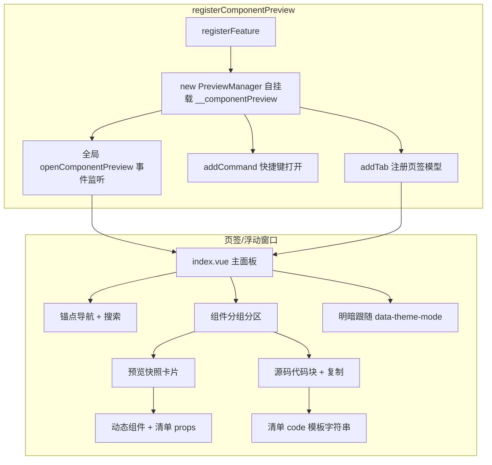

## 用户需求

为 `src/components/` 下的共享 Codex 风格 UI 组件库新增一个「组件预览」功能：在一个独立窗口内展示全部 14 个组件的各种典型用法（props 组合快照），并附带可复制的使用代码片段，方便组件开发者查看效果、修改后快速回归验证。视觉布局参考 `docs/codex-ui-reference.html` 的分区 + 锚点导航 + 明暗切换风格。

## 产品概述

插件内新增一个名为「组件预览」的独立窗口功能（注册为新 feature，含设置开关）。窗口以「主窗口页签 / 独立浮动窗口」双形态承载（addTab + openTab + openWindow 模式），在思源内渲染真实组件源码，组件改动后重新加载即可看到最新效果。

## 核心功能

- 双形态承载：主窗口页签（openTab）⇄ 独立浮动窗口（openWindow），头部工具按钮支持在两种形态间切换；浮动窗口隐藏重复面板标题
- 预览内容：覆盖 14 个组件（Avatar/Badge/Button/Card/Chart/FormField/IconWrapper/Input/Label/Loader/Select/Slider/Switch/Tag），每个组件一个分区，展示多种典型 props 组合的静态快照（尺寸/变体/状态/图标/禁用/加载等）
- 源码复制：每个预览示例配对应可复制的组件用法代码片段（模板字符串 + 复制按钮 + 复制成功反馈）
- 导航与检索：左侧/顶部锚点导航（按组件跳转）+ 组件搜索过滤，兼容超长内容滚动
- 明暗主题：面板内明暗切换按钮，切换跟随思源明暗模式（渲染基于 `data-theme-mode="dark"` 与思源 b3 CSS 变量，天然适配）
- 示例清单以结构化数据驱动渲染（一份清单 + 通用渲染器），扩展新组件/新用法只需在清单中追加

## 技术栈

- 沿用项目现有技术栈：Vue 3 `<script setup lang="ts">` + Vite + TypeScript + SCSS（Token 化 Codex 风格）
- 承载模式复用 `src/features/minimalBrowser/` 的 addTab + openTab + openWindow 双形态模式（官方 API，无新依赖）
- 预览渲染直接 import `@/components/*.vue` 真实组件，保证所见即源码；明暗适配跟随思源 b3 CSS 变量体系，无需引入主题库
- 组件库自身已依赖 Chart.js（`src/components/Chart.vue`），本功能不新增第三方依赖

## 实现思路

预览页通过「结构化示例清单 + 通用渲染器」驱动：feature 内维护一份声明式组件清单（组件名/分组/每组的标题、props 组合对象、代码片段模板字符串），渲染器统一遍历清单渲染快照卡片与可复制代码块。新增组件或新用法只需在清单追加条目，无需改动渲染框架，契合「手写示例可靠可控 + 便于持续补充」的确认方向。

- **快照渲染**：清单条目记录目标组件与 props，模板中用动态组件 `<component :is>` + 局部 ref 状态批量渲染；复制代码内容从清单的 `code` 字段（模板字符串）直接取用，与渲染保持一致（同一数据源，杜绝漂移）
- **窗口承载**：Manager 类放 `types/index.ts`（模块级 `tabRegistered` 防重复注册，`plugin.addTab` 注册页签模型 + `open()`/`openFloating()` 切换），`registerFeature` 内部自挂载 `(plugin as any).__componentPreview` 并实现 `destroy()`；入口加 `addCommand`（openTab 打开）与浮动切换按钮
- **明暗适配**：不自行造主题切换——组件样式全部消费思源 `--b3-theme-*` 变量，面板仅检测 `document.documentElement.getAttribute("data-theme-mode")`（参考 `src/features/themeColor/index.ts` 的 `isDarkMode()` 模式）通过 `isFloating`/主题无关逻辑零改动，保证明暗天然随思源主题
- **UI 精简**：浮动窗口（`getFrontend() === "desktop-window"`）隐藏重复面板标题，逻辑零改动（复用 minimalBrowser 已落地规则）
- **性能**：清单一次加载、分区懒渲染不必要（单次打开渲染 <2KB 组件实例，成本可忽略）；代码高亮不做运行时高亮库，代码块用等宽字体 + 单色样式，避免引入依赖

## 实现注意

- **文件头注释**：每个 `.ts`/`.vue` 顶部 10~30 字功能说明（.scss 不适用）
- **样式分离**：`.vue` 仅允许 `@use './styles/index.scss'`（index.vue）或双行导入（子组件）；禁 box-shadow（用边框）、禁用装饰性 letter-spacing；间距/圆角/字号/字重全部走 `$spacing-*`/`$radius-*`/`$font-size-*`/`$font-weight-*`/`$line-height-*`/`$color-*` Token
- **i18n**：只写分片 `src/i18n/{zh_CN,en_US}/componentPreview.json`；禁止 `{{ i18n.xxx || '中文兜底' }}`；模板中每处 i18n 键上方加中文注释标明实际文案；结构区块加中文注释；emit 事件 camelCase
- **图标**：禁止 emoji；使用 `@/config/icons.ts` 中 COMMON_ICONS/FEATURE_ICONS 已注册的 Iconify 图标（本功能用到的示例图标须已在 icons.ts 注册，缺失则补充注册）
- **子组件数据流**：预览子组件自包含，不搞父传全量 props + emit 回父的中间人模式；父（index.vue）只分发分组与复制工具函数
- **注册链条**：8 步注册缺一不可（index.ts/types/features/index.ts 导出与 _Registered/src/index.ts registerFeatures/settings.ts/i18n 分片/config.ts FEATURE_CONFIG/icons.ts FEATURE_ICONS），含 `DESTROYABLE_KEYS` 添加 `__componentPreview`；无缩写词 ID，无需 FEATURE_ID_TO_KEY_MAP 映射
- **行数红线**：单文件 ≤300 行警戒、500 硬阈值；组件清单数据量大时拆为 `previewData/` 多个分组数据文件（每文件一个组件分组）
- 禁止 AI 执行 `pnpm lint` / `pnpm vite build`；用户自行跑 `pnpm lint`、`pnpm i18n:verify`、`pnpm validate:icons`、`npx tsc --noEmit` 验证
- 模块内代码分层：共享类型/常量（组件名、分组元数据、代码模板）抽到 `types/` 或 `previewData/`，禁止复制粘贴

## 架构设计

### 系统架构



### 模块划分

- **Manager（types/index.ts）**：`PreviewManager` 管理 addTab 模型注册、主窗口/浮动窗口开合、Vue 挂载/卸载、destroy；`TAB_TYPE`、模块级 `tabRegistered` 防重复
- **注册入口（index.ts）**：`registerComponentPreview(plugin)` 实例化并自挂载 + addCommand；导出 show 函数供事件总线打开
- **示例数据（previewData/）**：按组件分组的清单文件（如 `buttons.ts`、`inputs.ts` 等或单文件 `index.ts`），导出 `PreviewGroup[]`——含组标题、组件标识、示例条目（标题/说明/props/插槽文本/code）
- **渲染器（components/）**：`PreviewSection.vue`（单组件分区：快照网格 + 源码块）、`CodeBlock.vue`（等宽字体代码展示 + 复制按钮）、`NavSidebar.vue`（锚点导航 + 搜索过滤）
- **主面板（index.vue）**：组合渲染所有分组 + 头部（标题隐藏于浮动形态）+ 浮动窗口切换按钮；本地 ref 状态管理分组折叠/搜索
- **类型（types/index.ts）**：`PreviewExample`（title/i18n 键/props/code）等清单数据结构

### 数据流

清单（previewData/*.ts）→ index.vue 读取 → PreviewSection 遍历示例 → 动态组件渲染快照 + CodeBlock 展示对应 code 字符串 → 复制按钮调 `copyToClipboard`（@/utils/domUtils）→ 反馈状态

## 目录结构

```
src/features/componentPreview/
├── index.ts                          # [NEW] 注册入口：registerComponentPreview(plugin)。实例化 PreviewManager 并自挂载 (plugin as any).__componentPreview；plugin.addCommand 注册打开命令；re-export showComponentPreview
├── index.vue                         # [NEW] 主面板：头部（含浮动窗口切换按钮，isFloating 时隐藏标题行）+ NavSidebar + 各 PreviewSection 分区。接收 plugin/i18n props，实现分组折叠、搜索过滤、滚动定位
├── types/
│   └── index.ts                      # [NEW] PreviewManager 类（addTab 模型注册 + open/openFloating + mountPanel/unmountPanel + destroy，参考 minimalBrowser/types/index.ts）+ PreviewExample/PreviewGroup 类型 + TAB_TYPE + 模块级 tabRegistered
├── previewData/
│   └── index.ts                      # [NEW] 结构化组件预览清单（14 组件全量数据，按组件分组，可拆多文件再聚合）。每组含组件标识、快照示例数组（title/props/插槽/code 模板）、示例用到的本地 ref 状态声明
├── components/
│   ├── PreviewSection.vue            # [NEW] 单组件分区渲染：分区标题 + 快照卡片网格（动态组件 + props 组合）+ 对应 CodeBlock。props: group/本地状态；emit: 无（自包含）
│   ├── CodeBlock.vue                 # [NEW] 代码块组件：等宽字体展示 code 字符串 + 复制按钮（copyToClipboard）+ 已复制反馈。props: code/language
│   └── NavSidebar.vue                # [NEW] 锚点导航侧栏：组件列表 + 搜索过滤框。props: groups/activeId；emit: navigate/select（camelCase）
├── styles/
│   ├── index.scss                    # [NEW] 面板布局样式：分区/网格/导航/头部（Token 化，Codex 风格，过渡 0.12s）
│   ├── PreviewSection.scss           # [NEW] PreviewSection 组件样式
│   ├── CodeBlock.scss                # [NEW] CodeBlock 样式
│   └── NavSidebar.scss               # [NEW] NavSidebar 样式
└── README.md                         # [NEW] feature 文档：承载模式、清单扩展指南、注册位置
```

## 修改文件（注册 8 步）

| 文件 | 变更 |
| --- | --- |
| `src/features/index.ts` | [MODIFY] `export { registerComponentPreview, showComponentPreview } from "./componentPreview"`；_Registered 联合类型追加 `"componentPreview"` |
| `src/index.ts` | [MODIFY] import registerComponentPreview；`DESTROYABLE_KEYS` 追加 `"__componentPreview"`；`registerFeatures()` 追加 `if (s.enableComponentPreview) registerComponentPreview(this)` |
| `src/config/settings.ts` | [MODIFY] PluginSettings 接口加 `enableComponentPreview: boolean`；DEFAULT_SETTINGS 加默认 `true` |
| `src/config/icons.ts` | [MODIFY] FEATURE_ICONS 加 `componentPreview: { icon: "mdi:...", color: "#..." }` 并补充清单示例所需新图标（如 mdi:palette/mdi:content-copy 若未注册） |
| `src/features/config.ts` | [MODIFY] FEATURE_CONFIG 数组加 componentPreview 条目（id/defaultTitle/defaultDesc/actions） |
| `src/i18n/zh_CN/componentPreview.json` | [NEW] 中文翻译分片（标题/搜索/复制等 + 各分组标题） |
| `src/i18n/en_US/componentPreview.json` | [NEW] 英文翻译分片（键对齐） |


## 关键代码结构

清单数据结构（预览数据与代码片段共用同一数据源，避免漂移）：

```ts
// src/features/componentPreview/types/index.ts
/** 组件预览分组：一个组件一个分组，含多个用法示例 */
export interface PreviewGroup {
  /** 分组 id（锚点用，如 "button"） */
  id: string
  /** 组件对象引用（来自 @/components） */
  component: Component
  /** 标题 i18n 键（回退用默认标题） */
  titleKey: string
  /** 默认标题（i18n 缺省时显示） */
  defaultTitle: string
  /** 用法示例列表 */
  examples: PreviewExample[]
  /** 示例需要的响应式状态声明（供 v-model 类组件复用） */
  state?: () => Record<string, any>
}

/** 单个用法示例 */
export interface PreviewExample {
  /** 示例标题 */
  title: string
  /** props 组合（透传给组件） */
  props?: Record<string, any>
  /** 默认插槽内容（文本即可） */
  slotText?: string
  /** 对应可复制代码（模板字符串，与 props 保持同源） */
  code: string
}
```

## 设计概述

组件预览面板的页面设计借鉴 `docs/codex-ui-reference.html` 的分区导航与内容卡片风格，但以思源真实 b3 CSS 变量为配色基底，保证与插件既有 UI 完全一致（明暗随思源主题自动适配，无需自定义主题变量）。

## 布局结构

- 顶部工具条（仅在主窗口形态显示）：左侧标题（面包屑风格小字标签 + 功能名），右侧「打开浮动窗口」按钮与「复制全部」类操作按钮，细边框分隔
- 主体左右分栏：左侧固定宽导航栏（约 180px，可折叠）列出全部组件锚点 + 顶部搜索框过滤；右侧滚动内容区依次排列各组件分区
- 每个组件分区：分区标题（组件名大写等宽标签 + 中文说明）→ 快照卡片网格（`repeat(auto-fill, minmax(220px, 1fr))` 自适应）→ 该组件的汇总用法代码块（可折叠展开）
- 快照卡片：surface 底色卡片，内容区居中或左对齐渲染组件实例，底部细边框区显示示例名（小字 muted 色）

## 视觉语言

- 颜色全部来自思源 b3 变量（背景/表面/边框/文字/主色），保证随思源明暗主题无缝适配
- 卡片间用 1px 边框分隔而非阴影；hover 时边框色加深（Codex 语义）
- 代码块：surface 更浅一档底色 + 等宽字体（`$vp-mono`）+ 右上角复制按钮，hover 显示，点击复制后按钮短暂变 success 态
- 微交互：分区锚点点击平滑滚动；导航项 hover/active 态用背景变化；过渡统一 0.12s ease
- 明暗主题无需自建切换——面板容器直接消费思源 `--b3-theme-*` 变量，思源切明暗即自动生效；如需在面板内独立演示某组件在暗色下的效果，示例区可加局部 `data-theme-mode` 覆盖（可选增强，首版不做）

## 响应式

- 窗口宽度较窄（浮动窗口/窄页签）时：左侧导航自动折叠为顶部横向标签条（flex-wrap），内容网格列数自适应收缩
- 网格 minmax 自适应，避免横向滚动；内容区 max-width 约束保证长行代码可读

## Agent 扩展

### Skill

- **universal-arch-skill**
- Purpose: 校验 componentPreview feature 的文件分层与注册完整性（8 步注册、样式分离、模块内代码分层、文件头注释等架构规范）
- Expected outcome: 实现完成后对 feature 目录执行结构校验，输出违规清单并指导修正，确保符合项目 AGENTS 架构规范