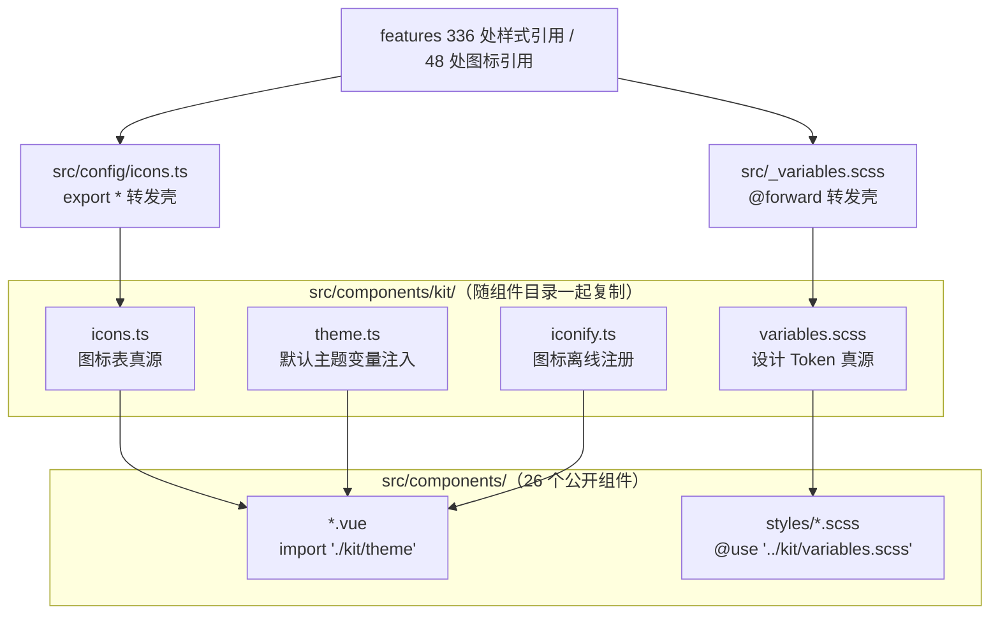

## 产品概述

把 `src/components/` 共享组件库改造为**自包含**的可移植目录，使「搬到另一个普通 Vue 3 项目」从原来的 5 步（复制组件 + 另找 3 个外部文件 + 配 `@` 别名 + 安装依赖 + 引入样式桥接 + 改入口注册图标）压缩为 2 步，并把迁移文档重写成新手照着做就能跑通的形式。

## 核心功能

- **目录自包含**：设计 Token、图标表、默认主题变量、图标离线数据全部随 `src/components/` 一起带走，不再需要到组件目录之外另找文件
- **零配置接入**：目标项目不配 `@` 别名、不新建任何样式文件、不改入口文件，只需「复制目录 + 装依赖」，直接 import 组件即可渲染
- **开箱可用**：默认给出中性配色（沿用现有 fallback 色调），明暗两套自动生效；若宿主自身定义了主题变量，则自动让位给宿主，不覆盖宿主配色
- **图标离线可用**：图标数据随组件包内置，断网、内网环境下图标正常显示（此前会转去请求公共 CDN 并静默空白）
- **本项目零回归**：180+ 组件调用点与 336 处样式引用点的 import 路径保持不变
- **新手文档**：重写为单页版——开头就是跑通步骤和可粘贴示例，随后才是原理、主题定制方法、常见报错对照表与可选裁剪

## 交付物

改造后的组件目录（新增 kit 支撑目录含 5 个文件）、两个兼容转发壳、组件内引用相对路径化、构建脚本与规范文档路径同步，以及重写后的迁移说明文档。

## 技术选型

沿用项目现有技术栈，不引入任何新依赖：Vue 3 + TypeScript、Sass、Vite、`@iconify/vue` + `@iconify-json/mdi`、`chart.js` + `vue-chartjs`（仅 Chart）。

## 现状核实（本轮实测，非记忆推断）

| 项 | 实测值 |
| --- | --- |
| 组件目录文件总数 | 78（根 26 个 `.vue` + `chart.types.ts`；`datePicker/` 7、`select/` 5、`speedDial/` 3、`paginator/` 3、`textarea/` 1、`styles/` 31、`docs/` 1） |
| 公开组件 | **26 个**（新增 `Paginator.vue`） |
| 组件目录内的别名引用 | 只有 3 个前缀：`@/variables.scss` 31 文件、`@/components/X.vue` 17 文件、`@/config/icons` 14 文件 |
| 组件内是否还有其他跨目录依赖 | 无（无 `@/utils`、无 `@/api`、无 store、无 i18n、无 `siyuan`、无 `@/features`） |
| 全项目引用面 | `@/variables.scss` **336 文件**；`@/config/icons` **48 文件**（0 个默认导入、0 个 `import * as`，全为具名 / `import type`） |
| 非 import 语境的消费者 | 仅 2 处：`scripts/validate-icons.mjs:32` 与 `scripts/audit-hardcode.mjs:220/701/703/221/898/36`（读取文件**文本**解析图标与设计 Token），`vite.config.ts` / `release.js` / `eslint.config.mjs` 均无引用 |
| 组件内 `:global()` / `@layer` 先例 | 0 处（新机制无既有先例，需离线验证） |


## 实现方案

### 总体策略

把组件库的「外围依赖」全部收进组件目录内的私有子目录 `src/components/kit/`，组件内部只使用**相对路径**引用，从而彻底摆脱对 `@` 别名的依赖；外部只保留两个**转发壳**维持本项目既有引用点不变。



### 关键决策与取舍

1. **真源移入 kit + 建转发壳（方案 A），而非在 kit 内放副本（方案 B）**

- 方案 B 会产生双份维护（92 行设计 Token + 853 行图标表必然漂移），且图标表若只保留 15 个必需键会让 `IconKey` 类型收窄，目标项目传其它图标键即类型报错。
- 方案 A 零重复：`src/_variables.scss` 改为 `@forward "./components/kit/variables";`，`src/config/icons.ts` 改为 `export * from "@/components/kit/icons"`。经核实 48 个图标引用点全为具名导入（无默认导入、无 `import * as`），`export *` 可完整兼容；336 个样式引用点因路径不变而完全不受影响。
- 代价：2 个构建脚本与若干规范文档里的硬编码路径需同步修改（已全部定位）。

2. **主题默认值用 JS 幂等注入，而非在 scoped 样式中输出 `:root`**

- CSS 方案需要在每个组件的 `<style scoped>` 里用 `:global(:root)` 包裹，且 Sass 的 `@use` 会被 Vite 按 SFC 样式块分别编译，无法跨块去重，最终会重复输出约 31 份；而仓库内 `:global()` / `@layer` **零先例**，风险未经验证。
- JS 方案只输出 1 份样式，且能显式控制顺序，回归风险可控。采用**三层保险**：①`getComputedStyle` 检测宿主是否已定义 `--b3-theme-primary`，已定义则完全不注入（本项目内为纯 no-op）；②注入节点用 `document.head.prepend`，使宿主后加载的样式天然覆盖同名变量；③注入内容外包一层 `@layer`，未分层样式恒优先于分层样式。三层任一失效都不会污染宿主主题。
- 代价：需要在 26 个公开组件的 `<script setup>` 各加 1 行副作用导入（机械改动，无逻辑）。

3. **图标离线注册放在 `IconWrapper.vue` 触发的 `kit/iconify.ts`，而非全局入口**

- `IconWrapper.vue` 是全库唯一图标出口，把注册挂在它身上，可保证 mdi 图标数据**只在使用图标时才进入产物**（若挂在通用模块上，仅用 `Card` 的项目也会被迫打包整套 mdi 数据）。原有项目中 `src/index.ts` 的 `setupIconifyOffline()` 保持不动（它额外注册 ph 图标集，供其它 feature 使用）。

4. **保留组件的 Sass fallback 不动**

- 20 个 `--b3-*` 变量在组件内本就写成 `var(--b3-theme-x, $color-x)`。即使目标项目的浏览器不支持 `@layer`（旧内核）导致默认变量未生效，也会优雅退化到 fallback 色调，不会出现无色/错色。

### 性能与可靠性

- **产物体积**：`kit/theme.ts` 只注入一份约 30 行的变量表，幂等（模块级 flag），零运行时判断开销；mdi 图标数据仅在用到 `IconWrapper` 时打包。
- **运行时开销**：`getComputedStyle` 每页仅调用一次（模块求值期），可忽略。
- **SSR 安全**：`theme.ts` 与 `iconify.ts` 均以 `typeof document === "undefined"` 守卫，服务端渲染时直接跳过。
- **零回归保障**：本项目 336 + 48 个引用点路径不变；26 个组件仅新增副作用导入与路径替换，不改任何 props、事件、样式规则与 DOM 结构。

### 可验证性

- **`@forward` 转发链**：用 Sass 离线编译（自定义 importer 把 `@/` 映射到 `src/`）验证 `@use "@/variables.scss" as *` 仍能取到全部变量与 mixin；
- **`export *` 类型兼容**：`npx tsc --noEmit` 并过滤改动路径，确认 `IconKey` 等类型别名仍可被下游 `import type` 推导；
- **组件可编译**：`@vue/compiler-sfc` 的 `parse` + `compileScript` + `compileTemplate` 端到端抽查 `Button` / `IconWrapper` / `Paginator` / `FormField` / `datePicker/PickerPanel` / `Select`；
- **迁移完整性**：`src/components/**` 内 grep `@/` 必须归零（这是「复制目录即自包含」的判定标准）。

## 实现要点（执行细节）

- **替换必须全量且成对**：三类别名的替换是机械的字符串替换，但**路径深度不同**——根目录组件走 `./X.vue`、`./kit/theme`、`./kit/icons`；私有子目录（`datePicker/`、`speedDial/`）走 `../X.vue`、`../kit/icons`；`styles/*.scss` 走 `../kit/variables.scss`。替换后必须用 grep 复查归零，不能靠肉眼。
- **转发壳只转发变量模块，不得连带转发 `theme` 注入逻辑**：`src/_variables.scss` 只 `@forward` 设计 Token，否则 336 个 feature 样式会各自输出一份默认主题块。
- **脚本同步是本方案最容易漏的回归点**：`audit-hardcode.mjs` 除读取路径外，还有 2 处规则文案与白名单判断（`:701` / `:703`）以及 1 处设计 Token 来源白名单（`:221` / `:898`，需从 `src/_variables.scss` 改为 `src/components/kit/variables.scss`），漏改会导致「设计 Token 被当作硬编码误报」或「图标注册校验失效」。
- **`kit/README.md` 必须写明职责边界**：为什么这些文件在组件目录内、设计 Token 与默认主题表取值需保持一致、改主题应改哪一处（目标项目场景只改 `theme.ts`）。
- **保留 `docs/` 目录**：迁移文档就放在组件目录内，复制时会一起带走，正好充当随身说明书，无需额外排除。

## 架构设计

不新增架构模式，沿用项目既有的「公开组件平铺 + 私有小写子目录」约定，把 `kit/` 作为组件库的私有依赖目录（与 `datePicker/`、`select/` 同级，禁止 feature 直接导入）。

## 目录结构

```
src/
├── _variables.scss                    # [MODIFY] 改为一行 @forward "./components/kit/variables"; 
│                                      #   336 个既有引用点路径不变；不得连带转发主题注入逻辑
├── config/
│   └── icons.ts                       # [MODIFY] 改为 export * from "@/components/kit/icons"
│                                      #   48 个既有引用点路径不变；纯数据无运行时依赖，无循环风险
├── components/
│   ├── kit/
│   │   ├── icons.ts                   # [NEW] 图标表真源（由 src/config/icons.ts 移入）
│   │   │                              #   853 行纯数据 + getIconConfig() + IconKey 类型，零外部依赖
│   │   ├── variables.scss             # [NEW] 设计 Token 真源（由 src/_variables.scss 移入）
│   │   │                              #   92 行纯变量声明、不输出任何 CSS、不 @use 任何外部文件
│   │   ├── theme.ts                   # [NEW] 目标项目默认主题注入
│   │   │                              #   导出幂等的 applyDefaultTheme()：document 不存在则跳过；
│   │   │                              #   getComputedStyle 检测到宿主已有 --b3-theme-primary 则 no-op；
│   │   │                              #   否则把 20 个 --b3-* 变量（明暗两套）包在 @layer 内、以 prepend 注入 head。
│   │   │                              #   两个 *-rgb 变量必须写成逗号分隔；必须补 --b3-theme-outline
│   │   ├── iconify.ts                 # [NEW] 图标离线注册：addCollection(mdiIcons) 模块级幂等，
│   │   │                              #   仅引入 @iconify-json/mdi（组件库只用 mdi，ph 留给本项目入口）
│   │   └── README.md                  # [NEW] 说明 kit 职责、主题定制入口、取值一致性约束
│   ├── docs/
│   │   └── components-vue3-migration-guide.md   # [MODIFY] 重写为新手单页版（见下）
│   ├── *.vue × 26                     # [MODIFY] 三类改动：①`@/components/X.vue` → `./X.vue`
│   │                                  #   ②`@/config/icons` → `./kit/icons` ③新增 1 行 `import "./kit/theme"`
│   │                                  #   IconWrapper.vue 额外新增 1 行 `import "./kit/iconify"`
│   │                                  #   不得改动任何 props / 事件 / 样式 / DOM 结构
│   ├── datePicker/PickerPanel.vue     # [MODIFY] `@/components/IconWrapper.vue` → `../IconWrapper.vue`；
│   │                                  #   `@/config/icons` → `../kit/icons`
│   ├── speedDial/types.ts             # [MODIFY] `@/config/icons` → `../kit/icons`
│   └── styles/*.scss × 31             # [MODIFY] `@use '@/variables.scss' as *` → `@use '../kit/variables.scss' as *`
├── scripts→scripts/
│   ├── validate-icons.mjs             # [MODIFY] 图标表路径改为 src/components/kit/icons.ts
│   └── audit-hardcode.mjs             # [MODIFY] 读取路径 + 规则文案 + 图标白名单 + 设计 Token 来源白名单
└── AGENTS.md / AGENTS_STYLE.md / AGENTS_API.md / README.md
                                       # [MODIFY] 同步设计 Token 与图标表的新路径、组件计数 25 → 26
```

## 关键代码结构

仅列本次新增的、最易写错的两处契约。

```
// src/components/kit/theme.ts —— 契约（不含实现体）
/** 幂等：宿主已定义 --b3-theme-primary 时直接返回；SSR 下直接返回 */
export function applyDefaultTheme(options?: {
  /** 覆盖默认值，键为不含 -- 前缀的变量名 */
  overrides?: Record<string, string>
  /** 暗色选择器，默认 ["@media (prefers-color-scheme: dark)", '[data-theme="dark"]', ".dark"] */
  darkSelectors?: string[]
}): void
```

```
// src/components/kit/iconify.ts —— 契约
/** 幂等注册 mdi 图标集，使 <Icon icon="mdi:*"> 完全离线可用 */
export function setupKitIcons(): void
```

## Agent Extensions

### SubAgent

- **code-explorer**：全量定位组件目录内三类待替换引用的**逐文件逐行**清单（31 + 17 + 14 处），并复查替换后 `src/components/**` 内 `@/` 是否归零，避免漏改或改错相对深度。

### Skill

- **universal-arch-skill**：对「设计 Token 真源迁入组件目录 + 新增 kit 私有目录 + 转发壳」做架构规范审查（目录规范、设计 Token 单一来源、样式分离、统一入口），确认方案不与项目既有 6 大原则冲突。

### MCP

- **Context7**：在动笔前查证 Dart Sass `@forward` 与 `@use ... as *` 的成员可见性语义、以及 Vue SFC scoped 样式下 `:global()` 与 `@layer` 的行为，作为转发壳与主题注入方案的事实依据（因当前环境无法执行命令，需靠文档确认）。

## Agent Extensions

### SubAgent

- **code-explorer**
- Purpose: 全量扫描组件目录内三类别名引用（`@/variables.scss` 31 处、`@/components/X.vue` 17 处、`@/config/icons` 14 处），产出逐文件逐行的替换映射表（含正确的相对深度），并在替换后复查 `src/components/**` 内 `@/` 是否归零
- Expected outcome: 一份可直接照着改的替换清单 + 归零证明，杜漏改、错改相对路径

### Skill

- **universal-arch-skill**
- Purpose: 对本次「设计 Token 真源迁入 `src/components/kit/`、新增私有目录、建立两个转发壳」的改造做架构规范审查
- Expected outcome: 确认设计 Token 单一来源、私有目录隔离、样式分离、统一入口等原则均未被破坏，并给出违规项清单（若有）

### MCP

- **Context7**
- Purpose: 查证 Dart Sass `@forward` 与 `@use "x" as *` 的成员可见性、以及 Vue SFC scoped 样式下 `:global()` / `@layer` 的行为，为转发壳与主题注入方案提供事实依据
- Expected outcome: 确认转发壳机制成立、确认主题注入不需要依赖未经证实的 scoped 全局选择器技巧