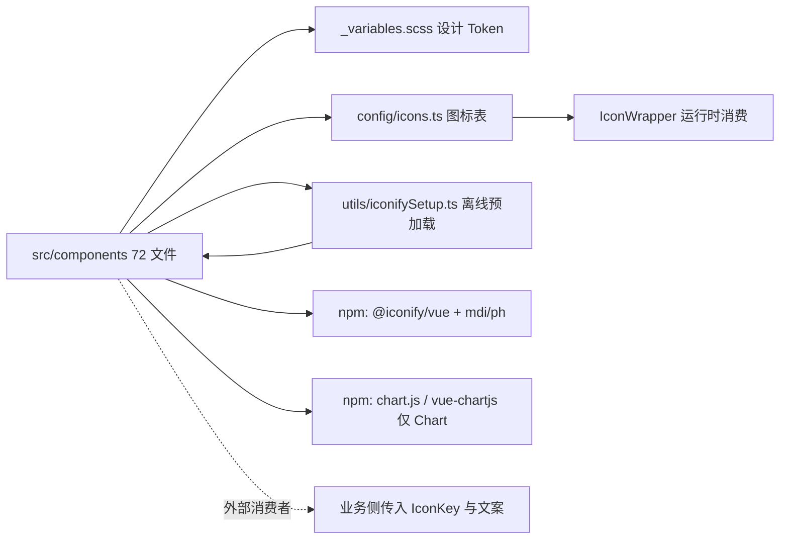

## 产品概述

一份面向「把本项目的共享组件库搬到普通 Vue 3（非思源）项目使用」的迁移说明文档。它回答三个问题：只复制 `src/components/` 够不够、还要补哪些文件与依赖、非思源环境下会出现哪些降级。读者照着文档可以完成从搬运、配置到主题适配的全过程，并能自行复核清单是否过期。

## 核心功能

- **复制清单**：逐项列出必须搬运的文件与目录（含各私有子目录、样式目录、外部配置与工具文件），标注每一项的作用，并区分「必须带」与「按需带」
- **依赖清单**：给出需要安装的 npm 包与构建侧依赖，区分组件运行时必需、单一组件专属、构建工具三类
- **接入步骤**：从文件落位、路径别名配置、图标离线预加载入口，到主题桥接的完整顺序指引
- **主题桥接**：列出组件实际消费的主题变量清单及其语义，提供可直接粘贴的变量映射模板，并说明如何让组件跟随宿主的明暗主题
- **宿主耦合点适配**：逐条指出依赖原宿主环境的写法（主题变量、暗色判定、气泡提示类），给出替代实现思路
- **已知坑与裁剪指南**：汇总环境无关的使用约束、文档化的错误用法，以及「不要某个组件 / 精简图标表」时的具体做法
- **边界说明**：明确哪些内容不需要也不建议一并搬运

## 交付物

新增一份简体中文 Markdown 文档，不修改任何组件源码。

## 技术选型

- **文档形态**：Markdown 单文件，简体中文，与项目 `docs/` 目录既有文档的命名风格（英文 kebab-case）保持一致
- **事实来源**：全部数据以源码实测为准（目录计数、import 全量扫描、CSS 变量提取、图标键字面量提取），不写任何未经核实的内容
- **不改源码**：本次仅产出文档。组件本体保持原样，避免影响本项目内 180+ 处引用带来的回归风险

## 实现方案

核心策略是「可逐项核对」——文档中的每个数字、每个文件名都给出实测值并附复核方式，使文档过期时能被自检发现。分三层组织：

1. **清单层**：以实测数据给出可打勾的复制清单。当前基线为 25 个公开组件 `.vue` + `chart.types.ts` + 4 个私有子目录（`datePicker/` 7 文件、`select/` 5 文件、`speedDial/` 3 文件、`textarea/` 1 文件）+ `styles/` 30 个 `.scss`，合计 72 个文件；另加 3 个组件集外的必需文件（设计 Token、图标表、图标离线预加载）。
2. **依赖层**：区分三类 npm 依赖 —— 组件运行时（`@iconify/vue` + `@iconify-json/mdi` + `@iconify-json/ph`）、单一组件专属（`Chart.vue` 才需要的 `chart.js` + `vue-chartjs`）、构建侧（`sass`）。附目标项目所需的构建别名配置（Vite `resolve.alias` 与 tsconfig `paths`）。
3. **适配层**：给出主题变量桥接方案 —— 要求目标项目提供一份 `bridge.scss` 声明组件消费的 20 个 `--b3-*` 变量，而不是改写 31 个组件 SCSS。

**关键决策与取舍**

- **为什么用「变量桥接」而不是「改写组件样式」**：组件 SCSS 里除了 `var(--b3-*, fallback)`，还大量使用相对颜色语法（如 `hsla(from var(--b3-theme-primary) h s l / 0.12)`）来派生 hover 底色。逐个改写等于把设计系统重写一遍，而注入一份约 20 行的变量声明即可让全部组件跟随目标项目的主题，成本与风险都低一个量级。
- **为什么图标表默认整体复制**：`config/icons.ts` 是纯数据 + 一个查表函数，零外部依赖，整体复制可直接复用 `IconKey` 类型，保证所有组件的图标 prop 类型不破。同时提供「精简路径」：组件自身渲染只用到 14 个键（`x` / `close` / `check` / `minus` / `eye` / `eyeOff` / `calendar` / `chevronUp` / `chevronDown` / `chevronLeft` / `chevronRight` / `chevronDoubleLeft` / `chevronDoubleRight` / `magnify`），其余键由业务侧传入时按需保留。
- **为什么必须强调图标离线预加载**：`IconWrapper` 走 `@iconify/vue` 的 `<Icon>`，若未在入口调用 `addCollection()` 注入 mdi 数据，图标会转而请求公共 CDN，在离线或内网环境下全部空白——这是最容易漏、且症状最迷惑的一步。

**性能与可靠性**：桥接 SCSS 只是变量声明，运行时零开销；`addCollection()` 只在入口执行一次（模块内有 `loaded` 幂等标记），把图标数据内置进产物，换取完全离线可用，代价是包体增大约一份 mdi 图标数据，文档中会点明这一取舍。

## 实现要点（执行细节）

- **所有数值必须实测**：文件数、样式文件数、私有子目录文件数、CSS 变量数、组件数一律以当前仓库实测为准，并在文档中给出对应的 PowerShell 复核命令（`Get-ChildItem -Recurse -File | Measure-Object`、`Select-String -Pattern '--b3-[a-z0-9-]+' -AllMatches`），避免文档随代码漂移而失真。
- **依赖扫描必须覆盖私有子目录的 `.ts` 文件**：`datePicker/`、`select/`、`speedDial/`、`textarea/` 下的纯函数与 composable 不属于 `.vue`，容易被 import 扫描漏掉；这是「复制清单是否完整」的唯一风险点，需在动笔前用 [subagent:code-explorer] 全量核验一次。
- **不得编造目标项目侧的配置**：桥接变量只给语义映射（主色 → 品牌主色、`surface`/`surface-lighter` → 卡片与填充底、`border-color` → 分割线）与示例值，并通过注释明确提示「替换为目标项目的设计 Token 实际取值」，不虚构任何具体框架的 Token 名。
- **降级点必须讲清「症状 + 原因 + 替代做法」**：仅指出耦合位置而无替代方案会让文档失去可执行性。三个耦合点分别是颜色变量 fallback 导致固定亮色、`Chart.vue` 依赖 `html.b3-theme-dark` 判定暗色、`SpeedDial.vue` 依赖宿主内置的 `b3-tooltips` 气泡类。
- **暴露组件已知缺陷而非沉默**：如 `--b3-theme-destructive` 在组件样式中被引用但原项目从未定义（`Tag.scss` 3 处、`Badge.scss` 1 处），迁移时应改用 `--b3-theme-error` 作桥接键，文档需显式提示，避免目标项目照抄后复现同样问题。
- **控制影响范围**：本次只新增 1 个文档文件，不触碰 `src/` 任何源码、不新增依赖、不改构建配置。
- **浏览器能力前提**：相对颜色语法 `hsla(from var(...) h s l / alpha)` 属较新的 CSS 特性，原宿主 Electron 环境满足；文档需提示目标项目若需兼容旧内核，应在桥接层改用 `color-mix()` 或预计算的 `rgba()` 值。

## 架构设计

文档为单文件、线性 8 节结构，前 3 节是「能不能用」，中 2 节是「怎么用起来」，后 3 节是「怎么避坑与裁剪」。复制集与其外部依赖的关系如下：



## 目录结构

本次仅新增一份文档，不新建模块、不改任何源码文件。

```
siyuanPluginVueSN/
└── docs/
    └── components-vue3-migration-guide.md   # [NEW] 组件库迁移到普通 Vue 3 项目的完整说明。
                                             # 职责：告诉使用者「复制哪些文件、装哪些依赖、目标项目怎么配、非思源环境补什么、坑在哪」。
                                             # 内容分 8 节：
                                             # 1) 结论与适用范围 —— 一句话结论 + 适用/不适用场景
                                             # 2) 复制清单 —— 目录树 + 逐项作用说明（25 组件 / chart.types.ts / 4 个私有子目录 / 30 个 scss）+ 实测计数与复核命令
                                             # 3) 必需的外部文件 —— _variables.scss（设计 Token）、config/icons.ts（图标表）、utils/iconifySetup.ts（离线预加载）三者为何不能省
                                             # 4) npm 依赖表 —— 运行时必需 / Chart 专属 / 构建侧三类，含构建别名配置（Vite alias + tsconfig paths）
                                             # 5) 目标项目接入步骤 —— 文件落位 → 配别名 → 入口调用图标预加载 → 注入主题桥接 → 处理 3 处宿主耦合，按顺序编号可直接照做
                                             # 6) 主题桥接 —— 20 个 --b3-* 变量的语义映射表 + 可粘贴的 bridge.scss 模板（含明暗两套取值位）
                                             # 7) 已知坑与通用约束 —— destructive 变量未定义、相邻色不可用于分隔线、弹层被 overflow 裁剪、FormField 多根、Loader 需父高度等
                                             # 8) 可选裁剪与边界 —— 不要 Chart/SpeedDial 时的做法、icons.ts 精简到 14 个必需键、不建议一并搬运的内容（componentPreview 等）
                                             # 要求：所有数值为实测值并附复核命令；桥接模板通过注释标注「按目标项目设计 Token 替换」；不虚构任何目标项目侧框架细节
```

## 关键代码结构（可选）

文档中最容易写错、也最有价值的一段是主题桥接模板。它以「变量声明」而非「改组件」的方式解决非思源环境缺 `--b3-*` 的问题，形态如下（文档中会给完整 20 项，取值位为语义占位而非真实 Token 值）：

```
/* bridge.scss —— 在目标项目全局引入一次（组件样式之前） */
:root {
  --b3-theme-primary: #3b82f6;          /* 品牌主色：聚焦环 / 选中态 / 强调描边 */
  --b3-theme-on-primary: #ffffff;       /* 主色上的文字色 */
  --b3-theme-background: #ffffff;       /* 页面底 */
  --b3-theme-surface: #f7f7f5;          /* 卡片 / 面板底 */
  --b3-theme-surface-light: #efefec;    /* 次级表面 */
  --b3-theme-surface-lighter: #e8e8e4;  /* 开关轨道 / 实底控件填充 */
  --b3-theme-on-background: #1a1a1a;    /* 正文文本 */
  --b3-theme-on-surface: #1a1a1a;
  --b3-theme-secondary: #8a8a8a;        /* 次要文本 / 占位符 */
  --b3-border-color: #e0deda;           /* 分隔线 / 凹槽 / 描边（勿用 surface 代替） */
  --b3-theme-error: #ef4444;            /* 错误态（注意：不要写 --b3-theme-destructive） */
  /* …其余变量同法声明 */
}

[data-theme="dark"] {                   /* 或 .dark / prefers-color-scheme，按目标项目方案二选一 */
  --b3-theme-background: #1c1c1e;
  --b3-theme-surface: #2c2c2e;
  --b3-theme-on-background: #ededed;
  --b3-border-color: #3a3a3c;
  /* … */
}
```

## Agent Extensions

### SubAgent

- **code-explorer**
- Purpose: 在动笔前对 `src/components/**` 做一次全量核验 —— 目录计数、4 个私有子目录下 `.ts` 文件（`datePicker/` `select/` `speedDial/` `textarea/`）的 import 语句、组件间的 `@/components/*` 别名引用，以及是否存在任何未被识别的第三方或跨目录依赖
- Expected outcome: 产出「完整复制文件清单 + 精确外部依赖集（`vue` / `@iconify/vue` / `chart.js` / `vue-chartjs` / `@/config/icons`）+ 任何遗漏项」的核实结论，作为文档第 2、3、4 节的事实依据，确保复制清单不存在漏文件