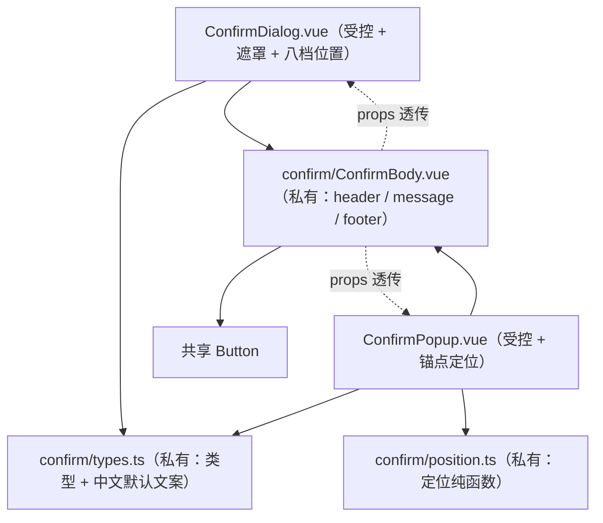

## 产品概述

共享组件库新增「气泡确认」ConfirmPopup，并把既有「确认对话框」ConfirmDialog 升级为官方命名与官方能力，两者共用同一套内容子部件。公开组件数量由 37 增至 38。

## 核心功能

- 确认对话框（升级）：受控显示（`v-model:visible`），官方命名的 `header` / `message` / `icon` / `acceptLabel` / `rejectLabel`；新增八档位置（居中 / 左右 / 上下 / 四角），新增 `closable`（右上角关闭）与 `closeOnEscape`，遮罩点关沿用；确认按钮支持危险 / 主色两档配色与加载态。
- 气泡确认（新增）：受控显示 + `target` 锚点，弹出在触发元素旁边；八向自动定位，空间不足自动翻转，越界时贴边；点击组件外部或按 Esc 关闭；无遮罩（非模态），不阻断页面其他操作。
- 内容插槽（两者一致）：消息内容、图标、确认按钮图标、取消按钮图标、整块内容替换，另有默认插槽用于消息区富内容；默认插槽优先于消息插槽、消息插槽优先于消息字段。
- 文案与无障碍：按钮文案有中文默认值可覆盖；对话框 / 气泡均为 `role="dialog"`，标题与内容建立无障碍关联；打开时聚焦容器（避免回车误触危险操作），关闭时焦点归还触发元素。

## 视觉与交互效果

确认对话框居中或贴指定位置（八档），遮罩半透明压暗背景，卡片为表面底色 + 1px 中性边框 + 6px 圆角，标题区与底部操作区为浅灰底并以细线分隔，0.12s 淡入 + 轻微缩放。气泡确认为一枚附着在触发元素旁的小卡片（表面底色、1px 边框、6px 圆角、带指向锚点的小三角），0.12s 淡入 + 缩放；位置随锚点变化平滑更新，滚动与窗口缩放时保持贴合。两种形态的标题为强调字重、消息为次级文字色、按钮复用共享按钮外观；键盘焦点有清晰反馈，禁用/加载态明确；四档尺寸下字号与内边距成阶梯，明暗主题均正常。

## 范围

组件库改造 + 预览清单 + 文档计数同步 + 调用点迁移：确认对话框改名后，迁移其唯一消费者与三处自建确认弹窗（迁到共享组件并删除自建实现与其样式）；两处形态差异较大的删除确认弹窗本轮不动，登记为后续。

## 技术栈选择

沿用项目既有栈，零新增依赖：Vue 3.5.42（`<script setup lang="ts">`）+ TypeScript + SCSS 短名 Token（`$s-*` / `$t-*` / `$r-*` / `$ff-zh` / `$c-*`），复用 `useId()`、共享 `Button`、`IconWrapper` 与 `kit/icons.ts` 的 `IconKey`。预览复用既有 `PreviewGroup` / `PreviewExample`（`props` / `slots` / `sizeable`）。

## 实现方案

### 总体策略

官方这两个组件都是**命令式服务驱动**（`useConfirm().require({...})`，可见性只是内部 state，`target` / `position` / `acceptProps` 全在 `ConfirmationOptions`），与本项目「组件库零 plugin、零全局服务、整目录复制即可用」冲突。因此采取：**props 名 = 官方 `ConfirmationOptions` 字段名，驱动方式改为受控**；外壳（遮罩 / 定位 / 过渡 / 事件）各写各的，**内容渲染统一走一个私有子部件**。

### 命名映射（旧 → 新）

| 旧 | 新 | 依据 |
| --- | --- | --- |
| `title` | `header` | `ConfirmationOptions.header` |
| `confirmText` / `cancelText` | `acceptLabel` / `rejectLabel` | 官方 `acceptProps.label` / `rejectProps.label` 的扁平化 |
| `danger` | `acceptSeverity: "danger"(默认) \ | "primary"` | 官方走 `acceptProps.severity`；本项目已有先例拒绝 object props 袋（`Panel` 不提供 `toggleButtonProps`），故扁平化，更自由诉求由 `accept` 段插槽兜底 |
| `confirmLoading` | `acceptLoading` | 与 accept / reject 命名统一（官方无此字段，属项目扩展） |
| `closeOnMask` | `dismissableMask` | 官方 Dialog 命名 |
| `visible` / `size` / `message` | 不变 | 受控驱动、项目四档尺寸、官方同名字段 |


新增 Dialog：`icon`、`position`（八档，模板类驱动零 JS）、`closable`（**默认 `false`**：确认框已有「取消」，官方 Dialog 默认 `true` 属有意差异）、`closeOnEscape`（默认 `true`）、`acceptIcon` / `rejectIcon`。
新增 Popup：`target`（`HTMLElement | () => HTMLElement | null`）、`placement`（`auto` 默认 / `top` / `bottom` / `left` / `right` / 四角）、`dismissable`（默认 `true`）、`closeOnEscape`（默认 `true`）、`ariaLabel`。

### 插槽（对齐官方 5 个 + 保留默认插槽）

`message`（作用域给**扁平字段** `{ message, icon }`，官方给 `ConfirmationOptions` 对象，写明差异）、`icon`（`{ class }`）、`accepticon` / `rejecticon`（无作用域）、`container`（作用域 `{ header, message, icon, acceptLabel, rejectLabel, closeCallback, acceptCallback, rejectCallback }`；**不提供官方 `initDragCallback`**，因不做 `draggable`）。保留既有**默认插槽**覆盖消息区。优先级：默认插槽 > `message` 插槽 > `message` prop。

### 关键契约与取舍

1. **官方无 `header` / `footer` 插槽**（澄清阶段的口误，以 d.ts 为准）：`header` / `title` / `headerActions` / `content` / `footer` / `mask` 只是 PT 段落键；`footer` 内容由两个按钮构成，无法从外部替换整体，自由度由 `container` 插槽承担。
2. **事件**：官方两组件**均无自定义事件**；本项目沿用受控语义 —— `update:visible`（Esc / 遮罩 / 点外部 / 取消按钮都派发 `false`）+ `confirm` / `cancel`（确认**不自动关闭**，便于异步；由调用方决定关闭时机）。
3. **定位算法（本轮唯一从零实现的难点，全库无可复用件）**：现有实现均受限（`Select` / `DatePicker` 只做纵向翻转且不 teleport、不监听滚动缩放；`FmContextMenu` / 状态栏菜单只钳制不翻转、依赖常量估算尺寸）。ConfirmPopup 采用 `position: fixed` + 视口坐标（**不 Teleport**，与 Select / DatePicker 的「相对定位」范式一致，避开思源浮动窗口下 Teleport 的复杂度）；`getBoundingClientRect()` 测锚点与气泡 → `auto` = 优先下方、不足上翻、水平居中并钳制；显式 `placement` **只做视口 8px 钳制、不翻转**；监听 `window` 的 `scroll`（`capture: true`，覆盖任意滚动容器）与 `resize`，**rAF 节流**重算；打开时先定位后显示，避免闪跳。定位计算全部外置为**纯函数**（沿用 `splitter/sizes.ts` 先例），组件只做编排。
4. **性能**：定位重算被 rAF 合并（连续滚动/缩放每帧至多一次布局读取）；无 ResizeObserver、无定时器；Dialog 八档位置纯 CSS 类，零 JS。
5. **无遮罩（非模态）**：与官方 ConfirmPopup 一致；点 `dismissable` 区域关闭，不做背景压暗（会显著改变观感与定位交互）。

### 私有模块与样式分离

- `src/components/confirm/types.ts`：`ConfirmPosition` / `ConfirmPlacement` / `ConfirmSize` / `ConfirmSeverity`、共享插槽作用域类型、中文默认文案常量（`DEFAULT_ACCEPT_LABEL = "确定"` / `DEFAULT_REJECT_LABEL = "取消"`，沿用 `Panel` / `Splitter` / `Paginator` 的「中文默认值 + 可覆盖」惯例 ⇒ 零 i18n 分片改动）。
- `src/components/confirm/ConfirmBody.vue`：三段结构（header：`icon` + `header` + 可选关闭按钮；message：按 `\n` 拆行；footer：两个共享 `Button`）。Dialog 与 Popup 只负责外壳。⚠️ **样式必须写在 `styles/ConfirmBody.scss`**（其内部元素带的是它的 scoped 属性 —— 与 `Splitter` 分隔条样式必须落在 `SplitterPanel.scss` 同型坑）。
- `src/components/confirm/position.ts`：定位纯函数（输入锚点/气泡矩形、placement、视口尺寸 → 输出坐标与是否翻转），无 Vue 依赖。

### 预览实现（需一处局部宿主技巧）

ConfirmDialog 分区仍靠 `props: { visible: true }` 静态展示（同现状）。**ConfirmPopup 无法在纯清单数据里表达「按钮 + 锚点 + 开合」** ⇒ 在 `previewData/confirmPopup.ts` 内用 `defineComponent` + `h()` 定义一个**演示宿主**（一个共享 `Button` + 一个 ConfirmPopup，`target` 指向按钮 ref，宿主自持 `visible`），把它作为 `PreviewGroup.component`，示例通过 `props` 组合 `placement` / 文案 / 尺寸。沙箱：Dialog 沿用既有 `.si-confirm-mask` 覆盖；Popup 用 fixed 定位不受卡片 `overflow: hidden` 裁剪，理论上无需覆盖，但需在预览 README 的「弹层类组件的预览沙箱」补一段说明；若目视发现溢出舞台，再按 `--loader` / `--speeddial` 范式追加 `cp-card__stage--confirmpopup`。

### 调用点迁移（破坏兼容，本轮完成；含对前期口述的纠正）

**共享 ConfirmDialog 的真实业务消费者只有 1 处**（`dataSnapshot/index.vue`），另 5 处是 feature 自建弹窗（非共享组件）。

1. `dataSnapshot/index.vue`：`:title`→`:header`、`:confirm-text`→`:accept-label`、`:confirm-loading`→`:accept-loading`（`v-model:visible` / `@confirm` / 默认插槽富内容不变）+ 同步其 README。
2. `gitPush`：调用点换成共享组件并**删除**自建弹窗与其 SCSS；**接受失去「Enter = 确认」**（危险操作不该回车确认，与共享组件刻意聚焦容器一致），迁移说明与 README 记明。
3. `shortcut`：同上（`@close`→`@cancel`）；其自建弹窗原无键盘处理，迁移后**获得** Esc 关闭与焦点归还。
4. `s3FileManager`：同上（`:danger`→`:accept-severity`、`:close`→`:cancel`、去掉外层 `v-if` 改由 `visible` 驱动）；**接受失去 Esc 的 LIFO 层级栈**（`useEscClose` 是 feature 级模块栈，组件库不能 import feature composable）—— 记录为已知差异；`useEscClose` 本身保留（`FmContextMenu` 仍在用）。
5. `prompts` / `skillsViewer` 的 `DeleteConfirmModal`：**本轮不动**（`targetId` 驱动 / `Teleport to body` / 专用富内容，形态差异大），登记为后续。

### 待定结论（方案内已定调）

`closable` 默认 `false`；`acceptSeverity` 只两档；`container` 作用域为扁平字段且无 `initDragCallback`；默认插槽 > `message` 插槽 > `message` prop；Popup `auto` 优先下方 + 上翻 + 水平居中钳制，显式 placement 只钳制不翻转；不做遮罩；不补偿 Enter / LIFO（仅文档记录）；实现阶段再全库扫一次 `role="dialog"` + 「确认 / 取消」按钮组，避免漏网同类弹窗。

## 架构设计



两个公开组件平铺于 `src/components/`，共享内容与类型收在私有目录 `confirm/`（禁止 feature 直接导入）；对外只暴露 `@/components/ConfirmDialog.vue` 与 `@/components/ConfirmPopup.vue`。

## 目录结构

```
src/
├── components/
│   ├── ConfirmDialog.vue                        # [MODIFY] 改名对齐官方（header/message/icon/acceptLabel/rejectLabel/acceptSeverity/acceptIcon/rejectIcon/acceptLoading/dismissableMask/size/visible）、新增 position 八档 + closable(默认 false) + closeOnEscape、5 个官方插槽 + 保留默认插槽（优先级 默认 > message 插槽 > message prop）、aria-labelledby 关联 header，内容渲染改为 ConfirmBody
│   ├── ConfirmPopup.vue                         # [NEW] 受控 + target 锚点（HTMLElement | () => HTMLElement | null）；position: fixed 视口坐标、不 Teleport；auto 优先下方 + 上翻 + 水平居中钳制，显式 placement 只钳制；监听 window scroll(capture)/resize 并 rAF 节流；dismissable/closeOnEscape；打开聚焦容器、关闭焦点归还锚点；非模态无遮罩；role="dialog"
│   ├── confirm/
│   │   ├── ConfirmBody.vue                      # [NEW] 私有内容子部件：header（icon + header + 可选关闭按钮）/ message（按 \n 拆行；message 插槽 / 默认插槽覆盖）/ footer（reject = ghost/secondary、accept = acceptSeverity + acceptLoading，均为共享 Button，accepticon/rejecticon 插槽透传）
│   │   ├── types.ts                             # [NEW] 私有类型与常量：ConfirmPosition / ConfirmPlacement / ConfirmSize / ConfirmSeverity / 插槽作用域类型 / DEFAULT_ACCEPT_LABEL("确定") / DEFAULT_REJECT_LABEL("取消")
│   │   └── position.ts                          # [NEW] 定位纯函数（锚点与气泡矩形 + placement + 视口 → 坐标与是否翻转），零 Vue 依赖，沿用 splitter/sizes.ts 外置先例
│   └── styles/
│       ├── ConfirmDialog.scss                   # [MODIFY] 扩展 position 八档容器对齐、closable 关闭按钮布局；沿用现有 mask/card/fade 与 Token
│       ├── ConfirmBody.scss                     # [NEW] 三段内部元素样式（⚠️ 必须写在此处：ConfirmBody 的内部元素带它自己的 scoped 属性）
│       └── ConfirmPopup.scss                    # [NEW] 气泡卡片 + 指向三角 + 0.12s 过渡；宽度约 320px + max-width: calc(100vw - 16px)（无对应 Token 需行内注明）；边框一律 --b3-border-color
└── features/
    ├── componentPreview/
    │   ├── previewData/confirmDialog.ts         # [MODIFY] 按新命名重写，约 8–10 例：基础 / 危险 / 多行消息 / 图标 / 八档位置对比 / closable / 遮罩点关关闭 / 消息插槽 / container 全替换 / size=large
    │   ├── previewData/confirmPopup.ts          # [NEW] 内联演示宿主（Button + ConfirmPopup + 自身持 visible，target 指向按钮 ref）作为 PreviewGroup.component；示例覆盖 placement 四向与自动、危险配色、acceptLoading、尺寸档位、container 插槽
    │   ├── previewData/index.ts                 # [MODIFY] 聚合入口加入 confirmPopupPreviewGroups
    │   ├── styles/PreviewSection.scss           # [MODIFY] 弹层沙箱章节补 ConfirmPopup 说明（如需舞台高度再追加 cp-card__stage--confirmpopup）
    │   └── components/PreviewSection.vue        # [MODIFY] 仅在确需舞台高度类时按 group.id 追加判定
    ├── dataSnapshot/index.vue                   # [MODIFY] :title→:header、:confirm-text→:accept-label、:confirm-loading→:accept-loading（其余不动）
    ├── dataSnapshot/README.md                    # [MODIFY] 同步二次确认的用法描述
    ├── gitPush/index.vue                        # [MODIFY] 调用点换成共享 ConfirmDialog（:visible/@confirm/@cancel 保持、props 改名）
    ├── gitPush/README.md                        # [MODIFY] 目录树移除自建 ConfirmDialog.vue
    ├── shortcut/index.vue                       # [MODIFY] @close→@cancel、props 改名、可见性改由 visible 驱动
    ├── s3FileManager/index.vue                  # [MODIFY] :danger→:accept-severity、@close→@cancel、去掉外层 v-if 改由 visible 驱动
    └── （删除）gitPush/components/common/ConfirmDialog.vue、gitPush/styles/ConfirmDialog.scss、shortcut/components/ConfirmDialog.vue、shortcut/styles/ConfirmDialog.scss、s3FileManager/components/FmConfirmDialog.vue、s3FileManager/styles/FmConfirmDialog.scss
AGENTS.md                                        # [MODIFY] 计数 37→38（160/168/181/459/497 行）+ 目录树补 ConfirmPopup（465 行）+ 清单表改写 ConfirmDialog 行并新增 ConfirmPopup 行（官方命名 / 五插槽 / 八档 position / 不做 draggable / acceptProps 扁平化 / 受控 vs 命令式差异）+ 优先复用枚举补「气泡确认」（177 行）
README.md                                        # [MODIFY] 147 行 37→38
src/features/componentPreview/README.md          # [MODIFY] 3/8 行计数与全组件清单、功能条改写 ConfirmDialog + 新增 ConfirmPopup、尺寸档位清单、具名插槽表（改写 + 新增 + 登记五个官方插槽与新作用域）、事件契约表（update:visible / confirm / cancel / acceptLoading 语义）、弹层沙箱章节
src/components/kit/README.md                     # [MODIFY] 22 行 37→38
src/components/kit/theme.ts                      # [MODIFY] 14 行「由 37 个公开组件」→ 38
src/components/docs/components-vue3-migration-guide.md  # [MODIFY] 3/62/146 行计数与清单插 ConfirmPopup、基线文件数按实测回写
```

## 关键代码结构

```ts
// src/components/confirm/types.ts（私有：禁止 feature 直接导入）
export type ConfirmPosition =
  | "center" | "left" | "right" | "top" | "bottom"
  | "topleft" | "topright" | "bottomleft" | "bottomright"
export type ConfirmPlacement = "auto" | "top" | "bottom" | "left" | "right"
  | "topleft" | "topright" | "bottomleft" | "bottomright"
export type ConfirmSeverity = "danger" | "primary"
export type ConfirmSize = "xsmall" | "small" | "medium" | "large"

/** Dialog 与 Popup 共用的内容段插槽作用域（扁平字段；官方为 ConfirmationOptions 对象） */
export interface ConfirmBodySlots {
  message: (scope: { message: string; icon?: IconKey }) => VNode[]
  icon: (scope: { class: string }) => VNode[]
  accepticon: () => VNode[]
  rejecticon: () => VNode[]
}

// src/components/confirm/position.ts（纯函数：定位计算，无 Vue 依赖）
export interface PopupGeometry {
  /** 视口坐标（position: fixed 用） */
  top: number
  left: number
  /** 最终采用的 placement（auto 可能翻转） */
  placement: Exclude<ConfirmPlacement, "auto">
  /** 锚点相对气泡的偏移，供指向三角定位 */
  arrowOffset: number
}
export function resolvePopupPosition(input: {
  anchor: DOMRect
  popup: { width: number; height: number }
  viewport: { width: number; height: number }
  placement: ConfirmPlacement
  gap: number
  padding: number
}): PopupGeometry
```

## Agent Extensions

### MCP

- **Context7**
- Purpose: 实现阶段再次核对 ConfirmDialog / ConfirmPopup 的插槽集合与作用域字段（尤其 `container` 的 `closeCallback` / `acceptCallback` / `rejectCallback`，以及两组件的 PT 段落清单），避免凭记忆写错契约。
- Expected outcome: 得到逐条可对照的 props / slots / emits 事实，落实为两个组件的绑定表达式与 `confirm/types.ts` 的作用域类型。

### SubAgent

- **code-explorer**
- Purpose: 全库复核两件事 —— ① 是否还有未被发现的同类确认弹窗（搜索 `role="dialog"` + 「确认 / 取消」按钮组），② `37 个` 等组件计数与清单式引用的完整触点清单与 `src/components` 递归文件数实测值。
- Expected outcome: 给出完整待改文件行号清单与实测基线（含删除 3 个自建弹窗后的净文件数），确保文档计数与迁移无遗漏。

### Skill

- **universal-arch-skill**
- Purpose: 交付前按项目架构规范（模式 C 代码架构审查）审查：私有子部件边界（`confirm/` 禁止 feature 导入）、ConfirmBody 样式归属（scoped 陷阱）、设计 Token 使用（无 Token 值须行内注明）、中文默认文案的零 i18n 惯例、单文件行数。
- Expected outcome: 产出审查结论并据此修正样式归属、Token 与命名细节。