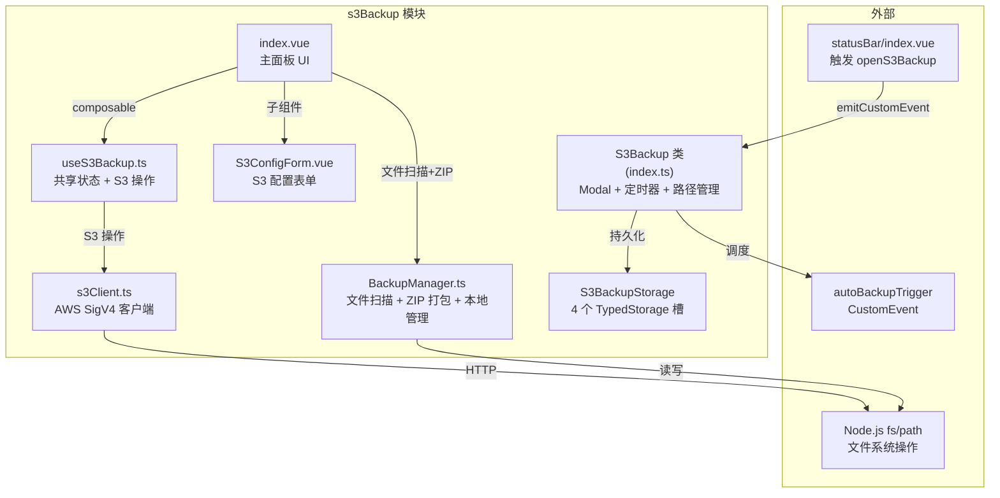

## 用户需求

将 `src/features/dataBackup`（本地压缩备份）功能迁移到 `src/features/s3Backup`（S3 备份）进行合并。

## 产品概述

合并后的 s3Backup 成为一个统一备份中心，同时支持两种备份目标：本地 ZIP 压缩备份和 S3 兼容存储上传。用户可通过多选复选框灵活组合备份方式，并享受自动备份定时调度。

## 核心功能

- **备份模式选择**：多选复选框支持「本地 ZIP 备份」和「上传到 S3」，可单独或组合使用
- **手动备份**：一键触发，根据所选模式自动执行 ZIP 打包和/或 S3 文件上传
- **自动备份定时器**：支持每分钟/每小时/每天三种频率，可设置每日具体时间
- **备份保留策略**：自动清理最旧的本地 ZIP 文件，保持指定份数
- **本地备份历史**：展示 `data-backup/` 目录下所有 ZIP 文件，支持删除操作
- **S3 云端备份列表**：沿用现有功能，支持下载、恢复、删除云端备份
- **工作区路径管理**：自动检测 + 手动选择思源工作区路径
- **S3 配置管理**：沿用现有 S3ConfigForm 表单（Endpoint/AccessKey/SecretKey/Bucket/Region 等 + 连接测试）

## 技术栈

- 前端框架：Vue 3 + TypeScript + Composition API
- 样式：SCSS（Codex UI 风格，全局设计 Token）
- ZIP 打包：JSZip（现有依赖）
- S3 客户端：自研 AWS Signature V4 实现（`types/s3Client.ts`）
- 存储：PluginStorage + TypedStorage 模式
- 事件通信：CustomEvent 事件总线

## 实现方案

### 总体策略

将 dataBackup 的 ZIP 打包能力和自动备份调度器合并到 s3Backup 模块内部，采用"增强型 S3Backup 类 + 统一 BackupManager + 扩展 Storage"架构。dataBackup 模块完全删除，其注册链上的所有痕迹清除。

### 关键技术决策

**1. BackupManager 合并策略**
s3Backup 的 `BackupManager` 当前只做文件扫描。合并后新增 dataBackup 的 ZIP 打包能力，形成统一的 BackupManager：

- 保留 `getWorkspaceFiles()`：S3 逐文件上传时使用
- 新增 `performFullBackup()`：本地 ZIP 打包时使用（JSZip 四阶段）
- 新增 `scanBackupDir()` / `deleteBackupFile()`：管理本地 ZIP 文件
- 两者共用同一个 `scanDirectory()` 实现（当前两个模块的 scanDirectory 逻辑完全一致）

**2. 自动备份定时器集成**
dataBackup 的 `DataBackup` 类中的定时器逻辑（`startAutoBackupTimer` / `stopAutoBackupTimer` / `restartAutoBackupTimer` / `updateLastBackupTime`）迁移到 `S3Backup` 类。触发方式不变：定时回调中 `emitCustomEvent("autoBackupTrigger")`，Vue 面板 `onMounted` 时监听。

**3. 备份模式多选设计**
新增 `backupMode` 对象类型 `{ localZip: boolean; s3Upload: boolean }`，存储两个独立布尔值，通过复选框 UI 控制。手动备份和自动备份都读取这两个标记决定执行路径：

- `localZip === true` → 调用 `performFullBackup()` + 更新本地历史列表
- `s3Upload === true` → 调用现有 `performManualBackup()` 逻辑（逐文件上传）
- 两者都为 true → 顺序执行（先 ZIP 后 S3），统一进度条显示

**4. Storage 扩展**
`S3BackupStorage` 类新增两个 TypedStorage 槽位：

- `autoBackupSettings`: 存储 AutoBackupSettings（autoBackupEnabled/backupFrequency/backupTime/keepBackupCount/backupMode）
- `backupHistory`: 存储本地备份历史列表（LocalBackupInfo[]）
原有的 `s3Config` 和 `backupSettings` 保持不变。

**5. i18n 键复用策略**
s3Backup 已有 54 个 key 中约 20 个与 dataBackup 语义重叠（workspaceInfo/workspacePath/lastBackup 等），直接复用。新增约 23 个本地备份专属 key（中英文各一份），添加到 `src/i18n/{zh_CN,en_US}/s3Backup.json` 分片文件中。

## 实现要点

### 性能注意

- 本地 ZIP 打包时 JSZip 的 DEFLATE 压缩对大文件 I/O 是瓶颈，保持现有 `compressionLevel = 6` 默认值以平衡速度与体积
- S3 逐文件上传在大量小文件时会有多次 HTTP 往返开销，保持现有逐文件上传模式不变
- 自动备份定时器使用 `setInterval(60000)` 每分钟检查，不引入额外开销

### 向后兼容

- 保留 `openS3Backup` 事件名不变（statusBar 已绑定此事件）
- 删除 `openDataBackup` 事件后，statusBar 的 dataBackup 按钮改为触发 `openS3Backup`
- 旧 dataBackup 存储键（`data-backup-settings`、`backup-history`）的数据不做自动迁移——用户需在新面板中重新配置

### 日志

- 复用 console.error 记录备份失败信息
- 进度回调通过 `BackupProgress` 接口传递，不额外引入日志框架

## 架构设计

### 合并后 s3Backup 模块内部架构



### 数据流

```
用户选择备份模式(本地ZIP +/ S3上传) → 点击「立即备份」或自动备份触发
  ↓
若 localZip=true: BackupManager.performFullBackup() → 扫描→打包→压缩→保存到 data-backup/
  ↓（两个分支可顺序执行）
若 s3Upload=true: BackupManager.getWorkspaceFiles() → useS3Backup.uploadFileContent() → S3
  ↓
统一更新进度条 + lastBackupTime → 刷新备份列表
```

## 目录结构

### s3Backup 修改文件（7个）

```
src/features/s3Backup/
├── index.ts              # [MODIFY] S3Backup 类增强：
│                         #   - 新增 autoBackupTimer/autoBackupHandler 字段
│                         #   - 新增 initAutoBackup()/startAutoBackupTimer()/stopAutoBackupTimer()/restartAutoBackupTimer()/updateLastBackupTime() 方法
│                         #   - init() 中调用 initAutoBackup() 并监听 autoBackupTrigger 事件
│                         #   - destroy() 中清理定时器和事件监听器
│                         #   - Storage 改为创建扩展版的 S3BackupStorage（含新槽位）
│
├── index.vue             # [MODIFY] 主面板 UI 合并：
│                         #   - 新增 backupMode ref（{ localZip: boolean; s3Upload: boolean }）
│                         #   - 新增自动备份设置区（autoBackupEnabled/backupFrequency/backupTime/keepBackupCount）模板和 logic
│                         #   - 新增本地备份历史列表区（localBackupList）模板和 logic
│                         #   - 移除"备份所有"和"插件设置备份"按钮
│                         #   - performManualBackup() 改为根据 backupMode 分发到 performLocalBackup() 或 performS3Backup() 或两者
│                         #   - 新增 performLocalBackup() 函数（调用 BackupManager.performFullBackup()）
│                         #   - loadWorkspaceSettings() 扩展加载 autoBackup 相关字段
│                         #   - saveWorkspaceSettings() 扩展保存 backupMode + autoBackup 字段
│                         #   - phaseLabel computed 扩展 scanning/packing/compressing/saving/uploading 五种标签
│                         #   - onMounted 中监听 autoBackupTrigger 事件
│                         #   - watch backupMode/backupFrequency/backupTime/autoBackupEnabled 触发 handleTimerRestart()
│
├── modules/
│   └── BackupManager.ts  # [MODIFY] 合并版 BackupManager：
│                         #   - 构造函数新增 workspaceRoot 参数
│                         #   - 新增 backupDir getter（返回 {workspaceRoot}/data-backup）
│                         #   - 新增 performFullBackup(options) 方法（含 ZIP 四阶段：scanning→packing→compressing→saving）
│                         #   - 新增 scanBackupDir() 方法
│                         #   - 新增 deleteBackupFile() 方法
│                         #   - 新增 BackupInfo/BackupResult 类型（从 dataBackup 迁移）
│                         #   - BackupProgress phase 扩展为 scanning|packing|compressing|saving|uploading
│                         #   - 保留现有 getWorkspaceFiles() 方法不变
│                         #   - 抽取统一的 scanDirectory() 私有方法（两个路径共享）
│                         #   - updateWorkspacePath() 同步 updateWorkspacePaths()（同时更新 workspacePath 和 workspaceRoot）
│
├── types/
│   └── index.ts          # [MODIFY] 类型扩展：
│                         #   - 新增 AutoBackupSettings 接口（autoBackupEnabled/backupFrequency/backupTime/keepBackupCount）
│                         #   - 新增 BackupMode 接口（localZip: boolean; s3Upload: boolean）
│                         #   - 新增 LocalBackupInfo 接口（name/path/time/size）
│                         #   - BackupSettings 接口扩展：新增 autoBackupEnabled/backupFrequency/backupTime/keepBackupCount/backupMode 字段
│                         #   - S3BackupStorage 类新增 autoBackupSettings 和 backupHistory 两个 TypedStorage 槽
│                         #   - 新增默认值常量 DEFAULT_AUTO_BACKUP_SETTINGS
│
├── styles/
│   └── index.scss        # [MODIFY] 样式扩展：
│                         #   - 新增 .backup-mode-section（备份模式选择区样式）
│                         #   - 新增 .auto-backup-section（自动备份设置区样式，复用 dataBackup 的 settings-row 布局）
│                         #   - 新增 .local-backup-list（本地备份历史列表样式，与现有 .backup-list 风格一致）
│
└── composables/
    └── useS3Backup.ts    # [MODIFY] composable 扩展：
                          #   - backupProgress phase 类型扩展
                          #   - phaseLabel computed 扩展 packing/compressing/saving 三种新标签
```

### dataBackup 删除文件（9个）

```
src/features/dataBackup/
├── index.ts              # [DELETE]
├── index.vue             # [DELETE]
├── modules/
│   ├── BackupManager.ts  # [DELETE]（逻辑已迁移到 s3Backup）
│   └── CloudBackupManager.ts  # [DELETE]（丢弃）
├── types/
│   └── index.ts          # [DELETE]
├── styles/
│   └── index.scss        # [DELETE]
└── README.md             # [DELETE]

src/i18n/zh_CN/dataBackup.json  # [DELETE]
src/i18n/en_US/dataBackup.json  # [DELETE]
```

### 外部注册链修改（7个文件）

```
src/features/config.ts          # [MODIFY] 删除 dataBackup FEATURE_CONFIG 条目（第72-78行）
src/config/icons.ts             # [MODIFY] 删除 dataBackup 图标条目（第79-82行）
src/features/index.ts           # [MODIFY] 删除 registerDataBackup 导出行 + _Registered 联合类型中移除 "dataBackup"
src/index.ts                    # [MODIFY] 删除 import { registerDataBackup } + registerDataBackup(this) 调用 + __dataBackup 清理代码
src/features/statusBar/index.vue # [MODIFY] 删除 dataBackup 条目（第248-259行）
src/i18n/zh_CN/s3Backup.json    # [MODIFY] 新增约23个本地备份专属 key
src/i18n/en_US/s3Backup.json    # [MODIFY] 新增约23个本地备份专属 key（英文）
```

## 关键代码结构

### AutoBackupSettings 接口（新增）

```ts
export interface BackupMode {
  localZip: boolean
  s3Upload: boolean
}

export interface AutoBackupSettings {
  autoBackupEnabled: boolean
  backupFrequency: "minute" | "hourly" | "daily"
  backupTime: string          // "03:00" 格式
  keepBackupCount: number     // 默认 7
  backupMode: BackupMode      // 默认 { localZip: true, s3Upload: false }
}
```

### BackupSettings 扩展字段

```ts
export interface BackupSettings {
  lastBackupTime: string
  workspacePath: string
  workspaceRoot: string
  useDateFolder: boolean
  // 新增字段
  autoBackupEnabled: boolean
  backupFrequency: string
  backupTime: string
  keepBackupCount: number
  backupMode: BackupMode
}
```

### S3Backup 类新增方法签名

```ts
class S3Backup {
  // 新增字段
  private autoBackupTimer: number | null
  private lastBackupTimestamp: number

  // 新增方法
  private async initAutoBackup(): Promise<void>
  private startAutoBackupTimer(frequency: string, backupTime: string): void
  private stopAutoBackupTimer(): void
  public restartAutoBackupTimer(enabled: boolean, frequency: string, backupTime?: string): void
  public updateLastBackupTime(timestamp: number): void
}
```

### 合并版 BackupManager 新增方法签名

```ts
class BackupManager {
  // 构造函数变更：新增 workspaceRoot 参数
  constructor(workspacePath: string, workspaceRoot: string)

  // 新增属性
  get backupDir(): string  // {workspaceRoot}/data-backup

  // 保留方法
  updateWorkspacePath(workspacePath: string): void      // 同时更新 workspaceRoot
  getWorkspaceFiles(onProgress?): Promise<WorkspaceFile[]>

  // 新增方法
  performFullBackup(options?: BackupOptions): Promise<BackupResult>
  scanBackupDir(): Promise<LocalBackupInfo[]>
  deleteBackupFile(backupFilePath: string): Promise<void>
}
```

## Agent Extensions

### SubAgent

- **code-explorer**
- 用途：在对 s3Backup 模块进行大规模重构前，深入探索所有关联文件的具体行级细节（特别是 index.vue 的 script 部分和 BackupManager 的复杂逻辑），确保修改方案精确无误
- 预期结果：获取全部需要修改的精确代码行号、导入依赖关系、函数签名等细节，避免手动读取遗漏