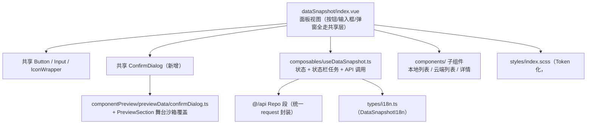

## Product Overview

对「数据快照」（`src/features/dataSnapshot`）做一次「共享组件使用 + 编码规范 + 注册链与 API 统一入口」的合规审查，并直接落地改造：面板原生控件全部换为共享组件，自建二次确认弹窗提升为全项目可复用的共享组件，样式回落到设计 Token 与 gitPush 范式，i18n 去掉硬编码兜底，API 层回归统一请求封装。

## Core Features

- **审查并列出违规项**：共享组件类（原生 button/input、自建 chip/tab/弹窗）、样式规范类（Token/字号/颜色兜底/过渡/遮罩）、i18n 类（硬编码兜底）、类型安全类（`any` 断言）、API 统一入口类，逐项给出文件行号与规则依据。
- **新增共享 ConfirmDialog 组件**：吸收 s3FileManager / gitPush / shortcut 三处先例的能力（`visible` + 标题 + 多行消息 + 危险配色 + 档位 + 遮罩点关 + Esc/Enter 键盘 + 焦点管理），并在组件预览面板新增分区。
- **数据快照面板改造**：刷新/创建/查看/恢复/下载/删除/确认/取消全部改用共享 `Button`，备注输入改用共享 `Input`，页签改用 `Button` text 外观表达选中态，内联二次确认弹窗改用共享 `ConfirmDialog`；按需抽出列表项 / 云端分组 / 详情等子组件，使入口文件回到 300 行以内。
- **样式规范化**：删除自建按钮、输入框、弹窗的整套样式；面板字号回到两级字号制；补齐 `$color-*` 兜底；过渡统一 `0.12s ease`；遮罩改 `rgba(0,0,0,0.5)` + `z-index: 10000`；Dock 根容器补 `padding-right`。
- **i18n 与类型收敛**：为模块 i18n 定义接口类型，移除 `any` 与 `|| "中文兜底"`，补齐缺失文案键（中英对齐）。
- **API 统一入口修复**：快照内容接口改走统一请求封装，去掉多余类型断言。
- **文档与报告**：补全模块 README；输出审查报告（违规清单 → 修复对照 → 不在本次范围的后续迁移清单）。

## 视觉与行为效果

面板外观与信息结构保持不变：顶部「数据快照」标题 + 刷新图标按钮、本地/云端分段页签、创建快照行（备注输入 + 创建按钮）、快照列表（备注、时间、文件数、大小、查看/恢复按钮）、云端标签分组（计数 + 删除）、快照详情（字段列表 + 文件类型分布）、二次确认弹窗（居中卡片 + 半透明遮罩）。变化仅在于：控件外观统一为全项目共享按钮/输入框，确认弹窗与其它模块视觉一致（0.12s 淡入缩放），字号层级与配色更统一。

## 技术栈

- 沿用现有工程：Vite + Vue 3（`<script setup>` + TS）+ SCSS（`src/_variables.scss` 为设计 Token 单一来源）+ 思源插件 API。**不引入任何新依赖**（不自研 Portal/Teleport，弹层沿用 `position: fixed` 遮罩方案）。
- 复用既有共享组件与工具：`Button.vue` / `Input.vue` / `Label.vue` / `IconWrapper.vue`、`@/utils/format`、`@/api` 的 `request` / `requestOrThrow`、`useStatusBarTask`。

## 实现策略

### 1. 新增 `src/components/ConfirmDialog.vue`（公开组件平铺 + 私有子部件另置）

三个 feature 级先例能力不齐（`s3FileManager` 有多行消息与 Esc LIFO 栈、`gitPush` 有 `#message` 插槽与 Enter/Esc、`shortcut` 只有基础形态），共享版取三者并集并保持向后兼容的双事件命名：

```ts
interface Props {
  /** 是否显示（受控） */
  visible: boolean
  /** 标题 */
  title: string
  /** 消息文本，支持 \n 多行 */
  message?: string
  confirmText?: string   // 默认「确定」
  cancelText?: string    // 默认「取消」
  danger?: boolean       // 默认 true：确认按钮用危险配色
  size?: "xsmall" | "small" | "medium" | "large"  // 默认 small，透传内部 Button
  closeOnMask?: boolean  // 默认 true
}
// emits: confirm / cancel / update:visible
// slots: default —— 覆盖消息区（承载富内容，如快照备注与时间）
```

- 键盘与焦点：`visible` 打开时 `window` 上挂 Esc→cancel、Enter→confirm 监听（`watch` 挂载/卸载，**共享组件禁止跨 feature 导入 `useEscClose`**）；打开时聚焦确认按钮、关闭时归还焦点；`role="dialog"` + `aria-modal="true"` + 容器 `tabindex="-1"`。
- 内部实现全部走共享 `Button`（危险操作 `variant="danger"`、取消 `variant="ghost"`），文案零 i18n 依赖（由 props 传入），保持共享层不耦合 feature。
- 样式范式（`src/components/styles/ConfirmDialog.scss`）：遮罩 `rgba(0,0,0,0.5)` + `z-index: 10000`、禁 `backdrop-filter`；卡片 `--b3-theme-background` 底 + 头/脚 `--b3-theme-surface` 凸出 + `1px solid var(--b3-theme-outline, $color-border)` + `$radius-base`；过渡 `0.12s ease`（fade + scale 0.98）；字号 `$font-size-xs` 正文 / `$font-size-2xs` 辅助。

### 2. 组件预览适配（本次关键技术点）

`ConfirmDialog` 遮罩是 `position: fixed; inset: 0`，直接放进预览舞台会铺满整个窗口。方案：给 `PreviewSection.scss` 的 `.cp-card__stage` 加 `position: relative`，并新增作用域覆盖规则把舞台内的 `.si-confirm-mask` 改为 `position: absolute; z-index: 1`（只影响预览沙箱，不改组件本体），同时把该机制登记进 `componentPreview/README.md` 的「预览机制」说明。

### 3. 文档计数（并行会话敏感）

当前共享组件实测为 **19 个**（`Button/Input/Select/DatePicker/InputGroup/InputGroupAddon/…`），新增后为 **20 个**；**实施每一步前先 `list_dir src/components` 实测**，禁止凭记忆改数字。同步位置：`AGENTS.md`（第 160/168/181 行 + 组件清单表 + 第 447 行目录树 + 第 485 行规则索引）、根 `README.md`（第 148 行）、`componentPreview/README.md`（第 3/8/13/14 行 + 具名插槽表 + 事件契约表）。

### 4. `dataSnapshot` 面板改造与拆分

- 控件映射：10 处原生 `<button>` → 共享 `Button`（图标刷新按钮给 `title`/`ariaLabel`；页签用 `text` 外观 + `variant` 在 `primary`/`ghost` 间切换表达选中态，先例 `ModeGroupField.vue`；危险操作 `variant="danger"`；创建按钮用 `loading`）；原生 `<input>` → 共享 `Input`（**必须显式 `size="small"`**，`@keydown.enter` 保留）；`.ds-confirm` → 共享 `ConfirmDialog`（restore / removeTag 两种场景各自传 `title`/`message`/`confirmText`/`danger`）。
- 抽子组件控制行数（入口 358 行 → 300 行内）：建议 `components/LocalSnapshotList.vue` / `components/CloudSnapshotList.vue` / `components/SnapshotDetail.vue`；数据流遵循「父只传最小标识 + composable 实例，子组件直接调用操作函数」，禁止父传全量 props + 子 emit 回传的全量表单模式。
- 模板中去重：`formatSnapshotSize(snap)` 同处调用两次（列表行、详情行）改为局部 `const sizeText = (s) => formatSnapshotSize(s)` 之外的 `computed` 派生或先 `v-if` 判定后展示。

### 5. 样式回归

- 删除 `.ds-btn*`（含 `--primary/--danger/--small/--icon`）、`.ds-create__input`、`.ds-confirm*` 三段自建样式；`.ds-tabs` 仅保留布局容器（按钮本体样式由共享 `Button` 提供）。
- 字号两级制：`.data-snapshot-panel` 基准 `$font-size-xs`；面板标题、列表备注等禁止再用 `$font-size-sm`/`$font-size-base`（层级靠 `$font-weight-semibold` + 颜色弱化表达）。
- 全量补齐 `var(--b3-theme-*, $color-*)` / `var(--b3-border-color, $color-border)` 兜底；过渡统一 `0.12s ease`；根容器补 `padding-right: $spacing-2`；卡片与面板按「底色 background + 卡片 surface」分层。
- 样式引入方式由 `<script>` 里的 `import "./styles/index.scss"` 改为 `<style scoped lang="scss">@use "./styles/index.scss";</style>`（对齐项目主流，仅 `statusBar`/`docNavigation` 仍是旧写法）。

### 6. i18n 与类型收敛

- 新增 `types/i18n.ts` 定义 `DataSnapshotI18n`（键取自现有分片），`types/index.ts` 转出；composable 中 `(plugin.i18n as any)?.dataSnapshot || {}` 改为经 `types/i18n.ts` 的类型化取值函数。
- `index.ts` 的 `title` 去掉 `|| "数据快照"`（`AGENTS_I18N.md` 强制规则：禁止硬编码兜底）。
- 弹窗标题新增 2 键（`restoreTitle` / `removeCloudTagTitle`），中英分片同步；其余文案复用现有键。
- 两个静默 `catch {}`（本地/云端列表加载）补 `console.error`，保持「失败置空列表」的既有容错语义不变。

### 7. API 层统一入口

- `src/api.ts` 的 `getRepoSnapshotContent` 改走 `request` / `requestOrThrow`（保留「失败返回 `[]`」的容错，不再裸 `fetch`）。
- `getCloudRepoTagSnapshots` 去掉 `(snap as any).tag` 多余断言（`SnapshotInfo.tag?: string` 已声明）。

## 性能与可靠性

- 无运行时热路径变化：改造均为模板/样式/文案/类型层面，`useStatusBarTask` 与 API 调用次数不变；子组件拆分不引入额外请求（每个子组件只消费父传入的响应式数据）。
- 消除重复调用：模板中 `formatSnapshotSize()` 的双次调用改为一次性派生，列表 100 条量级下减少一半格式化开销。
- 可靠性：`ConfirmDialog` 的键盘监听在 `watch(visible)` 内成对挂载/卸载，避免常驻监听泄漏；类型化 i18n 使缺失键在编译期可见。
- 文件规模：`index.vue` 目标 ≤300 行；`styles/index.scss` 删除三段自建样式后预计从 365 行降到约 200 行；新增 `ConfirmDialog.scss` 约 90 行。

## 架构设计



## 目录结构

```
src/
├── components/
│   ├── ConfirmDialog.vue                 # [NEW] 公开确认弹窗组件。props（visible/title/message/confirmText/cancelText/danger/size/closeOnMask）+ emits（confirm/cancel/update:visible）+ 默认插槽覆盖消息区；Esc→cancel、Enter→confirm、遮罩点关、打开聚焦确认按钮、关闭归还焦点；role=dialog + aria-modal；内部只用共享 Button，文案零 i18n 依赖。顶部须有 `<!-- ... -->` 文件头注释。
│   └── styles/
│       └── ConfirmDialog.scss            # [NEW] 遮罩 rgba(0,0,0,0.5) + z-index 10000、禁 backdrop-filter；卡片 background + 头脚 surface + 1px 边框 + $radius-base；0.12s ease（fade + scale 0.98）；字号仅 $font-size-xs / $font-size-2xs；颜色全部 var(--b3-theme-*, $color-*) 双保险。
├── features/componentPreview/
│   ├── previewData/confirmDialog.ts      # [NEW] 预览清单：必须同时导出 confirmDialogGroup 与 confirmDialogPreviewGroups（历史上漏导出数组会导致 build 报 MISSING_EXPORT）；示例用 render/VNode 或 slotText 呈现「基础确认」「危险操作」「多行消息」「自定义消息插槽」；标 sizeable: true。
│   ├── previewData/index.ts              # [MODIFY] 追加 import confirmDialogPreviewGroups 并置于聚合数组末尾（display 之后）。
│   ├── styles/PreviewSection.scss        # [MODIFY] .cp-card__stage 加 position: relative；新增作用域规则把舞台内 .si-confirm-mask 覆盖为 position: absolute; z-index: 1（预览沙箱专用，不改组件本体）。
│   └── README.md                         # [MODIFY] 组件数 19→20；覆盖清单加 ConfirmDialog；具名插槽表补「默认插槽=消息区」；事件契约表补 confirm/cancel/update:visible；新增「弹层类组件的预览沙箱覆盖」机制说明；档位清单加 ConfirmDialog。
├── features/dataSnapshot/
│   ├── index.vue                         # [MODIFY] 10 处原生 button → 共享 Button（刷新为纯图标按钮带 title/ariaLabel；页签用 text 外观 + variant 切换；危险操作 variant="danger"；创建按钮 loading）；原生 input → 共享 Input（size="small"）；.ds-confirm → 共享 ConfirmDialog（restore / removeTag 两场景）；去重 formatSnapshotSize 的双次调用；样式引入改为 <style scoped lang="scss"> @use；抽子组件后 ≤300 行。
│   ├── components/                       # [NEW] 抽出的子组件（按需）：LocalSnapshotList.vue / CloudSnapshotList.vue / SnapshotDetail.vue，只收最小标识与 composable 实例，禁止父传全量 props + 子 emit 全量数据回父。
│   ├── index.ts                          # [MODIFY] 去掉 `|| "数据快照"` 硬编码兜底；i18n 读取类型化（经 types/i18n.ts）；保留 addIcons sprite（addDock 需要 sprite id，有 componentPreview 先例）与 createVueDockApp 参数。
│   ├── composables/useDataSnapshot.ts    # [MODIFY] i18n 改类型化取值、移除 any 与空对象兜底；两个静默 catch 补 console.error（保持列表置空语义）；其余操作链路不变。
│   ├── types/i18n.ts                     # [NEW] DataSnapshotI18n 接口（键取自现有分片）+ 类型化取值函数；独立文件避免 types/index.ts 的运行时循环。
│   ├── types/index.ts                    # [MODIFY] 转出 DataSnapshotI18n 与取值函数。
│   ├── styles/index.scss                 # [MODIFY] 删 .ds-btn* / .ds-create__input / .ds-confirm*；transition 统一 0.12s ease；字号回归两级制；补 $color-* 兜底；根容器补 padding-right；卡片 surface 分层；.ds-tabs 只留布局。
│   └── README.md                         # [MODIFY] 补目录结构、共享组件用法（Button/Input/ConfirmDialog）、配置项 enableDataSnapshot、扩展说明与 API 端点表。
├── api.ts                                # [MODIFY] getRepoSnapshotContent 改走 request/requestOrThrow（保留失败返回 []）；去掉 (snap as any).tag 多余断言。
├── i18n/zh_CN/dataSnapshot.json          # [MODIFY] 新增 restoreTitle / removeCloudTagTitle（嵌套结构保留）。
├── i18n/en_US/dataSnapshot.json          # [MODIFY] 同步新增对应英文键，保证键对齐。
├── AGENTS.md                             # [MODIFY] 共享组件计数 19→20（第 160/168/181 行 + 组件清单加 ConfirmDialog 行 + 第 447 行目录树 + 第 485 行规则索引）。
└── README.md                             # [MODIFY] 第 148 行「共享 UI 组件（19 个原子组件）」→ 20。

src/features/{gitPush,shortcut,s3FileManager,passwordVault}/  # [OUT OF SCOPE] 各自的本地确认弹窗迁移仅写入报告的后续清单，本次不动
```

## Key Code Structures

`ConfirmDialog` 是本轮唯一被多个文件依赖的新契约（组件本体、预览清单、`dataSnapshot` 消费方），其 props/emits 必须精确；其余改动沿用既有组件 API，不需要额外代码契约。

## Agent Extensions

### Skill

- **universal-arch-skill**
- **Purpose**：改造完成后对该项目做一次架构合规校验（统一入口、样式分离与 Token、注册完整性、文件头注释、跨功能解耦），覆盖新增的共享 `ConfirmDialog` 与改造后的 `dataSnapshot` 模块。
- **Expected outcome**：输出校验结果（目标 0 错误 0 警告）；若报出问题（如 `.vue` 内出现非 `@use` 样式、硬编码颜色/字号、feature 内自建共享组件已覆盖的控件、绕过统一入口的直调），逐项修复直至通过。