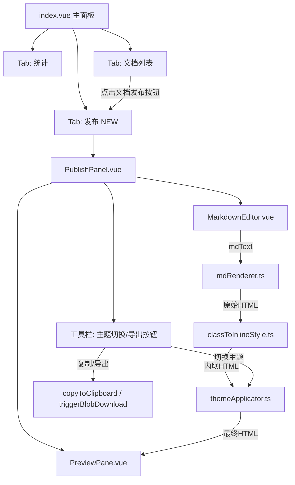

## 产品概述

在 docAnalysis 模块现有双 Tab（统计 / 文档列表）基础上新增第三个「发布」Tab，补齐"分析 → 追踪 → 格式化发布"工作流的最后一环。从 doocs/md 集成 4 个核心排版能力，让用户在思源笔记内直接将 Markdown 排版为适配微信公众号/CSDN/掘金/博客园的格式，一键复制或导出后粘贴到目标平台。

## 核心功能

### 1. 发布页（分屏编辑+预览）

- 新增「发布」Tab，采用左右分屏布局：左侧 Markdown 编辑器（等宽字体、实时编辑），右侧平台样式预览
- 支持两种入口：从文档列表点击"发布"按钮加载该文档 Markdown 原文，或手动粘贴 Markdown
- 左侧编辑实时驱动右侧预览更新（300ms 防抖渲染）
- 空状态引导："从文档列表点击发布按钮，或直接粘贴 Markdown 开始排版"

### 2. 微信公众号排版预览

- 使用 marked 解析 Markdown 为 HTML，再通过后处理将 class 样式转为内联 style 属性（微信编辑器不支持 `<style>` 标签和 class）
- 预览区以白色卡片模拟手机端微信文章效果（宽度 480px，居中显示）
- 支持的 Markdown 元素：标题、段落、加粗/斜体、链接、列表、引用、代码块、图片、表格

### 3. 一键排版（平台主题切换）

- 顶部工具栏提供平台主题下拉选择：微信、CSDN、掘金、博客园
- 切换主题时自动重新渲染预览，应用对应平台的排版规则（字体大小、行高、间距、标题样式、代码块样式）
- 每个主题定义为一套内联样式预设对象，切换即生效

### 4. 内容导出

- **复制 HTML**：将预览区渲染后的内联样式 HTML 复制到剪贴板，可直接粘贴到微信公众号后台
- **复制 Markdown**：复制编辑器中的 Markdown 原文
- **下载 HTML 文件**：将渲染后的完整 HTML 页面（含样式）导出为 .html 文件下载

### 5. 代码高亮主题

- 复用项目已有的 highlight.js，在 marked 渲染阶段对代码块应用语法高亮
- 内置 5 种高亮主题（github/monokai/atom-one-dark/atom-one-light/vs），在渲染管线中将 hljs class 转为内联 style
- 主题随平台主题联动：微信默认 github 浅色主题，掘金默认 atom-one-dark 深色主题

## 技术栈

- **前端框架**：Vue 3 + TypeScript（与项目一致）
- **样式方案**：SCSS 分离（遵循项目强制规范）
- **Markdown 解析**：marked ^17.0.1（项目已有依赖，零新增）
- **代码高亮**：highlight.js ^11.9.0（项目已有依赖，零新增）
- **导出工具**：copyToClipboard / triggerBlobDownload（来自 @/utils/domUtils）
- **图标**：@iconify/vue（MDI 图标集，项目已有）

## 实现方案

### 核心渲染管线

```
Markdown 原文
    ↓  marked.parse() + highlight.js
带 hljs class 的 HTML
    ↓  classToInlineStyle() 后处理器
内联 style 的微信兼容 HTML
    ↓  applyTheme() 注入平台样式
最终渲染 HTML → 预览区展示 + 复制/导出
```

关键设计决策：

1. **使用 marked 而非 markdown-it**：项目已安装 marked 17.x，API 简洁，renderer 扩展机制灵活，无需新增依赖
2. **自建 classToInlineStyle 后处理器**：doocs/md 的核心技术是"类名→内联样式转换"，我们不直接引入其源码，而是在 marked 的 `renderer` 钩子中注入转换逻辑，轻量可控
3. **主题作为样式预设对象**：每个平台主题定义为 `Record<string, Record<string, string>>`（标签→CSS属性→值），切换主题时全量替换，无需 CSS 变量运行时

### 性能考虑

- **防抖渲染**：编辑器输入 → marked 解析 → 内联样式转换 → 预览更新，整条管线设置 300ms 防抖，避免高频输入时重复解析
- **增量更新策略**：内容不变时（如仅切换主题）跳过 marked 解析，直接复用上次 AST 结果重新应用样式
- **highlight.js 优化**：仅注册常见编程语言（减少 wasm 体积），代码块超过 500 行时截断显示并提示

### 架构设计



## 目录结构

```
src/features/docAnalysis/
├── index.vue                          # [MODIFY] 新增第三个 Tab「发布」+ 引入 PublishPanel
├── types/
│   └── index.ts                       # [MODIFY] 新增 PublishTheme、ExportFormat 等类型
├── components/
│   ├── AttrsPanel.vue                 # [MODIFY] "前往发布"按钮改为调用 emitCustomEvent 打开发布页
│   ├── PublishPanel.vue               # [NEW] 发布页主组件：分屏布局容器 + 工具栏
│   ├── MarkdownEditor.vue             # [NEW] Markdown 编辑器：等宽字体 textarea，实时同步 mdText
│   └── PreviewPane.vue                # [NEW] 预览区：渲染内联样式 HTML，模拟手机端微信效果
├── utils/
│   ├── mdRenderer.ts                  # [NEW] marked 封装：parse + highlight.js 代码高亮
│   ├── classToInlineStyle.ts          # [NEW] HTML 后处理器：将 hljs class 转为内联 style
│   ├── themes.ts                      # [NEW] 平台主题定义：微信/CSDN/掘金/博客园的样式预设对象
│   └── themeApplicator.ts             # [NEW] 主题应用器：将主题样式注入 HTML（包装容器+基础样式）
├── styles/
│   ├── index.scss                     # [MODIFY] 新增 publish Tab 按钮样式
│   ├── PublishPanel.scss              # [NEW] 发布页容器、工具栏、导出菜单样式
│   ├── MarkdownEditor.scss            # [NEW] 编辑器样式：等宽字体、灰色背景、聚焦态
│   └── PreviewPane.scss               # [NEW] 预览区样式：白色卡片、手机端模拟、代码块
├── i18n/
│   ├── zh_CN/
│   │   └── docAnalysis.json           # [MODIFY] 新增发布 Tab 相关 i18n 键
│   └── en_US/
│       └── docAnalysis.json           # [MODIFY] 新增发布 Tab 相关 i18n 键
```

## 关键代码结构

### 平台主题类型定义

```typescript
// types/index.ts 新增
export interface PublishTheme {
  id: string
  name: string
  /** 包裹容器内联样式 */
  container: Record<string, string>
  /** 按标签的样式覆盖 (标签 → 样式属性) */
  elements: Record<string, Record<string, string>>
  /** 默认代码高亮主题 */
  codeTheme: "github" | "monokai" | "atom-one-dark" | "atom-one-light" | "vs"
}

export type ExportFormat = "html" | "markdown" | "htmlFile"
```

### mdRenderer.ts 核心接口

```typescript
// 解析 Markdown 为带 hljs class 的 HTML
export function parseMarkdown(mdText: string, codeTheme: string): string

// 将 class 样式转为内联 style（微信兼容）
export function classToInlineStyle(html: string): string

// 应用平台主题样式
export function applyTheme(html: string, theme: PublishTheme): string
```

### PublishPanel 组件数据流

```
props: { docId?: string, initialMd?: string }
  → onMounted: 若 docId 存在 → exportMdContent(docId) → 设置 mdText
  → watch(mdText, 300ms debounce): parseMarkdown → classToInlineStyle → applyTheme
  → PreviewPane 接收 renderedHtml 通过 v-html 渲染
  → 工具栏事件: switchTheme / copyHtml / copyMd / downloadHtml
```

## 发布页 UI 设计

### 整体布局

在现有 docAnalysis 顶部 Tab 栏（统计 | 文档列表）后新增「发布」Tab，点击切换至分屏发布界面。

### Tab 栏

- 新增按钮与现有 Tab 样式一致：圆角 6px、13px 字体、图标+文字、激活态底部 2px 主色下划线
- 按钮文字：📝 发布（图标 mdi:send-outline）

### 顶部工具栏

- 高度 40px，水平排列，左右分布
- 左侧：平台主题下拉选择器（size="small" Select），显示当前主题名称，选项含微信/CSDN/掘金/博客园；切换旁有「一键排版」按钮一键应用当前主题所有排版规则
- 右侧：导出按钮组——"复制 HTML"（主按钮，mdi:content-copy）、"复制 MD"（次按钮，mdi:language-markdown）、"下载 HTML"（次按钮，mdi:download-outline），图标+文字排列

### 左右分屏区

- 左侧编辑器（约 45%）：深灰背景（#1e1e1e），白色等宽字体（Consolas/Monaco/Fira Code），14px 字号，行高 1.6，内边距 16px，聚焦态边框高亮（主色）
- 右侧预览区（约 55%）：浅灰背景（#f5f5f5），居中白色卡片（max-width 480px，模拟手机端宽度），圆角 8px，内边距 24px，渲染内联样式 HTML；卡片外有淡影（0 0 1px rgba(0,0,0,0.1)）分隔背景
- 分隔线：1px 边框色竖线

### 空状态

- 居中大图标 + 引导文字"从文档列表点击发布按钮，或直接粘贴 Markdown 开始排版"
- 文字下方提供一个大的虚线框 textarea，提示"在此粘贴 Markdown..."

### 底部状态栏

- 高度 32px，左右分布：左侧"字数：1,234"（mono 数字），右侧"当前主题：微信"

### 主题切换动画

- 预览区内容以 0.15s 淡入动画过渡，避免闪烁

### 响应式

- Dock 面板宽度 400px 时改为上下排列（编辑区在上，预览区在下，各占 50%）

## 使用的 Agent 扩展

### Skill

- **codex-ui-style-guide**
- 用途：确保新增的 PublishPanel、MarkdownEditor、PreviewPane 及所有 SCSS 文件严格遵循 Codex UI 样式规范（设计 Token、BEM 命名、边框卡片、无 box-shadow、大写标签 10px/700、统一过渡动画等）
- 预期结果：所有新增 SCSS 通过 Codex 规范审查，与现有 docAnalysis 组件风格一致

### Skill

- **universal-arch-skill**
- 用途：在 docAnalysis 模块内新增组件和工具时，校验目录结构、SCSS 分离、i18n 分片是否符合项目架构规范（8 步注册规则、统一入口点原则、零直接功能间依赖）
- 预期结果：架构审查通过，新增文件位置正确，不符合注册规则的项被识别并修正