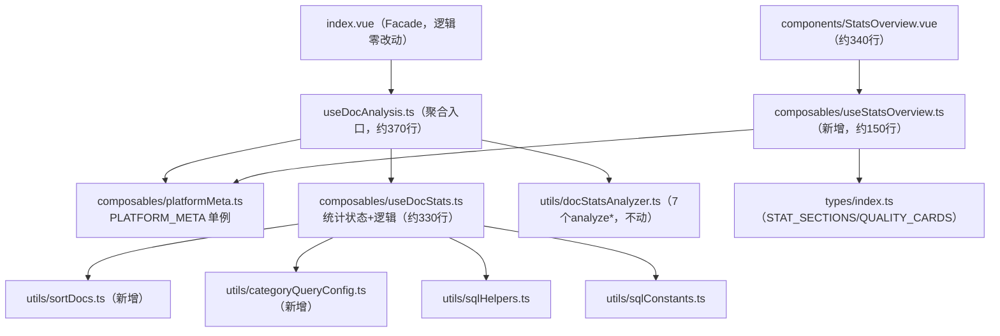

## 产品概述

对 `docAnalysis` 功能模块进行功能分类，并按 AGENTS.md 规则优先重构统计功能，使其符合「单文件行数上限」「功能模块内代码分层」「Composable 复用」等强制规范。

## 核心功能

- **功能分类**：对 `docAnalysis/index.vue` 进行功能分类，识别统计 / 文档列表 / 排版 / 辅助面板 4 类平级功能，并优先深入解析统计功能（上层 Facade、同级功能、下层统计组件与工具函数的层级关系）
- **重构统计功能**：拆分超 500 行硬阈值的 `useDocAnalysis.ts`（643 行）与 `StatsOverview.vue`（518 行）；提取无状态纯函数到 `utils/`；统计逻辑独立为 `useDocStats` composable；统计视图计算逻辑独立为 `useStatsOverview` composable
- **行为等价**：`useDocAnalysis` 对外返回接口保持 28 项不变，`index.vue` 编排逻辑零改动（仅更新 `PLATFORM_META` 导入路径）
- **规则合规**：重构后所有涉及文件行数降至 500 硬阈值以下（目标 300 警戒线附近），遵守文件头注释、SCSS 分离、if 花括号等硬规则

## 技术栈

- 沿用项目现有技术栈：Vue 3 `<script setup>` + TypeScript + Vite 库模式
- 无新增第三方依赖；重构遵循 AGENTS.md 的「功能模块内代码分层」「Composable 复用」规范

## 功能分类结果（先分类，后执行）

`index.vue` 为 Facade 容器组件（640 行），含 4 类平级功能，统计功能为优先分类项：

| 功能 | 构成 |
| --- | --- |
| **统计（优先）** | StatsOverview 视图 + `analyzeDocStats`（9 路并行 SQL）+ `queryByStatsCategory` 卡片下钻 + `fetchBookmarkDetails`/`queryByBookmark` + `docStatsAnalyzer.ts` 7 个 analyze* 函数 + StatCard/StatSection/BarRow/BookmarkDetailModal/DuplicateNameFilterModal + `STAT_SECTIONS`/`QUALITY_CARDS` 元数据 |
| 文档列表 | FilterSettings + DocListItem + IntersectionObserver 分批渲染 + 排序/搜索 |
| 排版 | PublishPanel + MarkdownEditor + PreviewPane |
| 辅助面板 | AttrsPanel（属性加载）+ PlatformManageModal（平台管理） |


## 重构方案

**策略**：无状态纯函数下沉 `utils/` + 统计逻辑与统计视图计算逻辑分别提取为独立 composable + `useDocAnalysis` 降级为聚合入口（行为等价、接口不变）。`PLATFORM_META` 先迁移到独立文件以消除拆分时的循环依赖。

### 架构设计（重构后模块关系）



### 实施要点（执行细节）

1. **`PLATFORM_META` 迁移**（前置步骤）：从 `useDocAnalysis.ts` 移到 `composables/platformMeta.ts`，同步更新 4 个引用文件（index.vue / StatsOverview.vue / PlatformManageModal.vue / AttrsPanel.vue）的导入路径
2. **纯函数提取**：`SORT_CMP`+`sortDocs` → `utils/sortDocs.ts`；`DocQueryConfig` 接口 + `SIZE_CONDITIONS`/`TIME_INTERVALS`/`buildTimeConfig`/`existsCond`/`EXISTS_MAP` → `utils/categoryQueryConfig.ts`
3. **useDocStats 拆分**：迁移统计状态（docStats/depthStats/statsFilter/bookmarkDetails/duplicateGroups/duplicateNameFilter/platformUnpublishedCounts/statsLoading/hasAnalyzed）与私有 ID 集、`analyzeDocStats`/`fetchBookmarkDetails`/`queryByBookmark`/`queryByStatsCategory`/`requireReAnalyze`/`loadDuplicateNameFilter`+watch；依赖通过 `UseDocStatsDeps` 注入（filterOptions/buildNotebookCondition/runDocQuery/setResults/setEmptyState/resetQueryState/onReanalyzeRequired）；`onScopeDispose(() => { analyzeToken++ })` 随迁，因调用链在 index.vue setup 同步执行，effect scope 正确
4. **行为等价性关键点**：`analyzeDocStats` 9 路并行 SQL 顺序、`analyzeToken`/`queryToken` 失效机制、`dupFilterLoaded` 防回写标志、`requireReAnalyze` 的"筛选条件已变化请重新分析"提示必须原样保留
5. **useStatsOverview 提取**：健康度（`_healthBreakdown`/`healthPct`/`healthTooltip`/`hasIssues`）、卡片值（`getCardValue`/`cardLabel`/`pctStr`）、柱状图比例（`maxCount`/`barPct`）、平台分布（`platformEntries`/`docsInSystem`/`avgPlatformsPerDoc`/`coveragePct`）、重名过滤（`effectiveDup*`）、max 计算；`hideZero` 为组件本地 UI 状态，以函数参数传入 `filterVisibleCards(cards, hideZero)`
6. **性能与回归控制**：纯逻辑搬移不改变 SQL 查询次数与执行顺序；不引入新依赖；不改动 index.vue 任何编排函数体；文档列表/排版/辅助面板功能本次不触碰（留待后续按相同模式处理）

## 目录结构

```
src/features/docAnalysis/
├── composables/
│   ├── platformMeta.ts        # [NEW] PLATFORM_META 模块级响应式单例迁移（约8行），消除拆分循环依赖
│   ├── useDocStats.ts         # [NEW] 统计逻辑 composable（约330行）：docStats/depthStats/statsFilter/bookmarkDetails/duplicateGroups 等状态 + analyzeDocStats/fetchBookmarkDetails/queryByBookmark/queryByStatsCategory/requireReAnalyze/loadDuplicateNameFilter；依赖经 UseDocStatsDeps 注入；内部保留 analyzeToken 与 onScopeDispose 失效
│   ├── useStatsOverview.ts    # [NEW] StatsOverview 视图计算 composable（约150行）：健康度/卡片值/柱状图比例/平台分布/重名过滤/max 计算，接收 props 对象
│   └── useDocAnalysis.ts      # [MODIFY] 643→约370行：删除模块级纯函数区与 PLATFORM_META 定义，保留查询执行器/平台操作/笔记本加载，内部调用 useDocStats 聚合，对外返回接口 28 项不变
├── components/
│   ├── StatsOverview.vue      # [MODIFY] 518→约340行：script 计算逻辑改用 useStatsOverview，仅保留模板 + props/emits + 本地 UI 状态（hideZero/activeStatsTab/statsTabs/dupFilterModalVisible）
│   ├── AttrsPanel.vue         # [MODIFY] PLATFORM_META 导入路径改为 ../composables/platformMeta
│   ├── PlatformManageModal.vue# [MODIFY] PLATFORM_META 导入路径改为 ../composables/platformMeta
│   └── （StatCard/StatSection/BarRow/BookmarkDetailModal/DuplicateNameFilterModal 等统计子组件不变）
├── index.vue                  # [MODIFY] 仅 PLATFORM_META 导入路径更新，编排逻辑零改动
└── utils/
    ├── sortDocs.ts            # [NEW] SORT_CMP + sortDocs 纯函数（约25行）
    └── categoryQueryConfig.ts # [NEW] DocQueryConfig 接口 + SIZE_CONDITIONS/TIME_INTERVALS/buildTimeConfig/existsCond/EXISTS_MAP（约70行）
```

## 验证

- AI 侧：`read_lints` 检查编辑文件 0 error；确认 `useDocAnalysis` 返回对象与 index.vue 解构的 28 项字段逐一对应
- 用户侧（AI 不执行）：`pnpm lint` / `pnpm i18n:verify` / `pnpm validate:icons` / `npx tsc --noEmit`

## Agent Extensions

### Skill

- **code-classifier**
- 用途：按技能工作流对 docAnalysis/index.vue 执行功能分类，输出结构化分类结果（上级 Facade / 同级 4 类功能 / 统计功能下级构成），作为重构的先行交付物
- 预期产出：Markdown 分类报告，明确统计功能的层级关系与构成文件，指导后续拆分边界