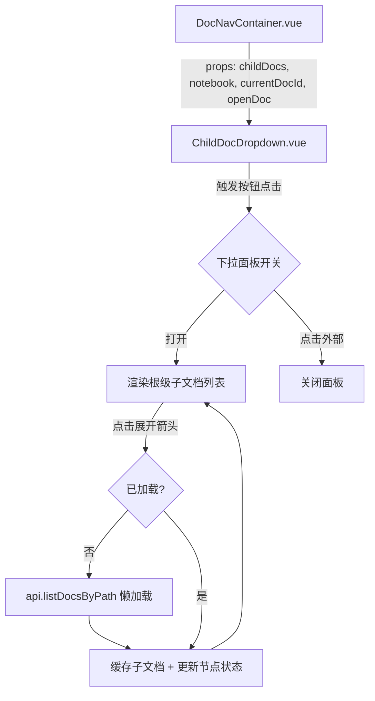

## 用户需求

在 docNavigation 现有导航条基础上，将子文档的内联展开列表改造为"下拉树形面板"，支持跨层级递归浏览下级文档。点击"下级文档 (N)"按钮弹出下拉面板，面板中以树形结构列出直接子文档，每个子文档若有下级（通过思源 API `IFile.subFileCount` 判断）则显示展开箭头，点击箭头懒加载该文档的子文档，实现逐级钻取浏览。

## 核心功能

- **下拉触发**：将当前内联子文档链接替换为"下级文档 (N)"触发按钮，点击弹出/收起下拉面板
- **树形展示**：面板内以缩进层级展示子文档，支持递归展开多级后代文档
- **懒加载**：仅加载当前展开层级的子文档，点击展开箭头时通过 `listDocsByPath` API 按需获取
- **点击外部关闭**：点击面板外部区域自动关闭
- **保留现有能力**：面包屑导航、同级文档切换、父文档链接不变

## 技术方案

### 实现策略

将当前的 `visibleChildren`/`hiddenChildren` + "+N" 内联展开模式替换为按钮触发式下拉树形面板。核心思路：新增 `ChildDocDropdown.vue` 组件，内部维护树节点展开状态，利用 `api.IFile.subFileCount` 判断文件是否有下级（无需额外 API 调用），展开时通过 `listDocsByPath` 懒加载子节点。

### 关键技术决策

1. **数据模型扩展**：`Block` 接口新增 `path`（存储路径，用于构造 `listDocsByPath` 查询参数）和 `subFileCount`（判断是否有下级），更新 `iFileToBlock()` 保留这两个字段。

2. **懒加载策略**：初次加载时仅获取直接子文档（当前已支持的 `fetchDocHierarchy`），不预加载后代。用户展开某节点时，按需调用 `listDocsByPath(notebook, child.path)` 获取其子文档，避免不必要的 API 调用。

3. **点击外部关闭**：参考项目中 `CopyDropdown.vue` 的简洁 `rootRef + document click` 模式（该 feature 不依赖 `useClickOutside` composable，因其在 `superPanel` 内且该 composable 不应跨 feature 引用——但可直接内联相同模式，代码量极小且无依赖）。

4. **组件自包含**：`ChildDocDropdown` 接收最小 props（`childDocs`/`notebook`/`currentDocId`/`openDoc`），内部管理下拉开关、树节点展开状态和懒加载逻辑，符合项目「子组件数据流规则」。

### 性能考量

- 懒加载避免了递归预取所有后代文档的 O(n) API 调用
- 各层级 API 调用独立、并行无依赖，展开延迟受单次 `listDocsByPath` 响应时间（通常 <50ms）限制
- 缓存复用：已加载的子文档列表缓存在组件内 Map 中，避免重复请求

### 实现细节

**Block 类型扩展**（`types/index.ts`）：

- 新增 `path?: string`（存储路径，去除 .sy 后缀）
- 新增 `subFileCount?: number`（子文档数，0 时可隐藏展开箭头）

**iFileToBlock 更新**（`types/storage.ts`）：

- 保留 `file.path`（去除后缀后）和 `file.subFileCount`
- 向后兼容：`fetchDocHierarchy`/`fetchBreadcrumb`/`fetchSiblingDocs` 中已有使用不受影响

**useDocNavigation 简化**（`composables/useDocNavigation.ts`）：

- 移除 `isExpanded`/`visibleChildren`/`hiddenChildren`/`toggleExpand`
- 新增 `notebook` ref（从 `loadHierarchy` 中获取，传给下拉组件）
- 新增 `childCount` computed（`childDocs.value.length`）
- 更新返回类型 `UseDocNavigationReturn`

**DocNavContainer.vue 模板精简**：

- 子文档区域（原 122-183 行）替换为单行 `<ChildDocDropdown>` 组件引用
- 传递 props：`childDocs`、`notebook`、`currentDocId`、`openDoc`

**ChildDocDropdown.vue 新组件**：

- 触发按钮：图标 + "下级文档 (N)" 文案 + 展开箭头图标
- 下拉面板：绝对定位，最大高度限制 + 滚动
- 树节点递归渲染：文档名链接 + 若有 `subFileCount > 0` 则显示展开/折叠箭头
- 点击箭头触发 `toggleNode(nodeId)`：懒加载子文档并切换展开状态
- 点击外部关闭面板

**样式文件**：

- 新增 `styles/ChildDocDropdown.scss`：面板定位、树节点缩进、hover 状态、展开动画
- `styles/index.scss`：移除 `.doc-nav-children-list`/`.doc-nav-link-hidden`/`#doc-nav-hidden-children`/`.doc-nav-expand`，新增下拉触发按钮样式

### 架构设计



### 目录结构

```
src/features/docNavigation/
├── components/
│   ├── DocNavContainer.vue          # [MODIFY] 子文档区域改用 ChildDocDropdown；新增 notebook/childCount 解构
│   └── ChildDocDropdown.vue         # [NEW] 下拉树形子文档面板。管理下拉开关、树节点展开/折叠状态、懒加载缓存 Map。递归渲染树节点，每个节点含文档链接 + 展开箭头（有子文档时）。点击外部关闭面板。
├── composables/
│   └── useDocNavigation.ts          # [MODIFY] 移除 isExpanded/visibleChildren/hiddenChildren/toggleExpand；新增 notebook ref + childCount computed；更新返回接口 UseDocNavigationReturn
├── styles/
│   ├── index.scss                   # [MODIFY] 移除 .doc-nav-children-list/.doc-nav-link-hidden/#doc-nav-hidden-children/.doc-nav-expand；新增 .doc-nav-dropdown-trigger 触发按钮样式
│   └── ChildDocDropdown.scss        # [NEW] 下拉面板样式：定位层 .doc-nav-dropdown-wrapper、面板 .doc-nav-dropdown-panel、树节点 .doc-nav-tree-node、缩进 .doc-nav-tree-indent、展开箭头 .doc-nav-tree-arrow、加载中状态
├── types/
│   ├── index.ts                     # [MODIFY] Block 接口新增 path?: string + subFileCount?: number
│   └── storage.ts                   # [MODIFY] iFileToBlock 保留 file.path（去后缀）和 file.subFileCount
└── README.md                        # [MODIFY] 更新功能描述，体现下拉树形面板能力
```

### i18n 新增键

- `docNavShowChildren`: "下级文档" / "Child Docs"
- `docNavNoChildren`: "无下级文档" / "No child docs"
- `docNavLoading`: "加载中..." / "Loading..."

## 设计风格

延续 Codex 设计语言：等宽字体、大写标签、边框卡片、focus 发光。下拉面板使用半透明深色背景 + 边框（无 box-shadow），与思源编辑器融合。

## 下拉触发按钮

在导航条子文档区域位置渲染一个紧凑按钮：图标（`docNavChildren`） + "下级文档 (N)" 文案 + 小三角箭头。按钮使用浅色背景 `--b3-theme-surface-lighter`，hover 时背景加深，active 时轻微缩放反馈。

## 下拉面板

- 绝对定位在触发按钮下方，宽度自适应（最小 180px，最大 320px）
- 面板背景色 `--b3-theme-background`，边框 `1px solid var(--b3-theme-surface-lighter)`
- 圆角 `$vp-radius`，最大高度 280px，溢出滚动
- 面板内顶部有微弱分隔线

## 树节点

- 每层缩进 16px，通过 `padding-left` 逐级递增
- 节点行高 28px，flex 布局：展开箭头（16px 方形按钮） + 文档链接（flex:1 省略号溢出）
- 文档链接 hover 时文字色变为 `--b3-theme-primary`，背景微亮
- 展开箭头受 `font-size-2xs` 控制大小，仅当 `subFileCount > 0` 时显示
- 展开时箭头旋转 90 度过渡动画
- 无子文档节点不显示箭头，但保留缩进占位保持对齐

## 交互状态

- 展开箭头点击后显示"加载中..."占位（`$font-size-2xs` 灰色斜体），API 返回后替换为子节点列表
- 当前文档高亮（`font-weight-semibold` + 左侧 2px 色条）
- 面板开关带 150ms ease 过渡动画（opacity + transform translateY）