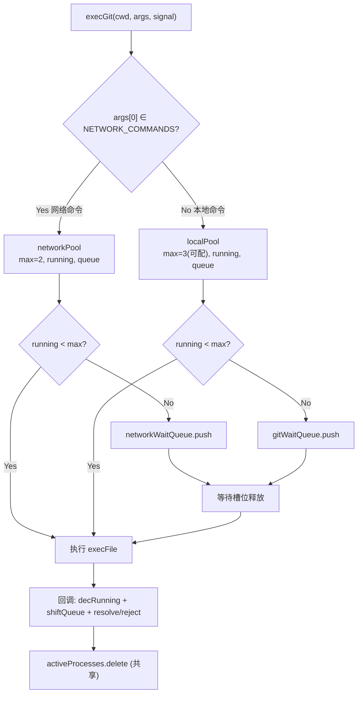

## 需求概述

gitPush 模块刷新时"推送"步骤耗时 9342ms（占比 80%），瓶颈在于 `git fetch` 等网络命令与本地命令共享同一个信号量（`gitMaxConcurrent=3`）。fetch 长时间占用槽位导致本地命令（rev-list/status/log/branch/stash 等）排队等待，拖慢整体刷新速度。

## 核心功能

- 为网络 IO 类 git 命令（fetch/push/pull/clone/ls-remote）建立独立并发池，与本地命令池隔离
- 网络命令不再占用本地命令的并发槽位，本地命令可立即执行无需排队
- 保持 ahead/behind 数据实时性（每次刷新仍执行 fetch，不改 fetchFirst 行为）
- 所有调用点零改动——`execGit` 内部自动识别命令类型并路由到对应池
- 现有 UI 行为不变（`activeGitOps` 仍反映本地池活跃数）

## 技术栈

- 项目现有技术栈：Vite + Vue 3 + TypeScript（思源笔记插件）
- 改动仅涉及 TypeScript 逻辑层，无 UI/样式/i18n 变更

## 实现方案

### 策略

在 `GitPushManager.execGit` 内部根据 `args[0]` 自动识别命令类型，将网络命令路由到独立并发池。整个改动自包含于 `execGit` 方法 + 新增字段，所有调用点（`fetchRemote`、`tryRemoteOp`、`pushTag`、`checkPushStatus` 等）零改动。

### 关键设计决策

1. **自动识别网络命令**：定义 `NETWORK_COMMANDS = new Set(["fetch", "push", "pull", "clone", "ls-remote"])`，在 `execGit` 入口检测 `args[0]`。注意 `stash push` 的 args[0]="stash" 不会误判。

2. **独立池参数**：`networkMaxConcurrent = 2`（常量，网络命令不宜高并发避免被 GitHub/Gitee 限流）、`networkRunning = 0`、`networkWaitQueue = []`。现有 `gitMaxConcurrent`（默认 3，可配置）仅管本地命令。

3. **共享资源不变**：`activeProcesses` Set 保持共享（kill 逻辑统一）；`AbortSignal` 机制不变，abort 时根据命令类型过滤对应队列。

4. **`activeGitOps` getter 保持原样**：仍返回 `this.gitRunning`（本地池活跃数），不改变现有 UI 行为。如未来需显示网络池活跃数可新增 getter。

5. **`execGit` 重构方式**：在方法顶部计算 `isNetwork` 布尔值，闭包捕获后在整个 Promise 体内通过条件分支选择正确的 running 计数器、wait queue 和 max concurrent。避免函数复制，保持单一逻辑路径。

### 性能分析

- **优化前**：6 步并行 → 3 个槽位 → fetch 占 1 槽 ~9s → 本地命令排队 → 总耗时 ≈ fetch 耗时（~9.3s）
- **优化后**：本地命令走本地池（3 槽，几百 ms 完成），fetch 走网络池（2 槽，~9s 完成）→ 两者并行不互斥 → 总耗时 ≈ max(本地池, 网络池) ≈ fetch 耗时（~9s），但本地命令不再被阻塞，用户感知的 UI 响应更快
- **空间复杂度**：O(1) 新增字段，无额外内存开销

## 实现注意事项

- `execGit` 中 `onAbort` 回调需要根据 `isNetwork` 过滤正确的 wait queue（当前只过滤 `gitWaitQueue`）
- 回调中 `this.gitRunning--` 和 `this.gitWaitQueue.shift()` 需对应替换为条件分支
- 文件头注释规则：`GitPushManager.ts` 已有文件头注释，本次修改不改变文件职责，无需更新注释内容
- 代码风格：if 语句必须有花括号 `{}`，即使单行

## 架构设计



## 目录结构

仅修改 1 个文件：

```
src/features/gitPush/
└── GitPushManager.ts  # [MODIFY] 新增网络并发池字段 + 重构 execGit 双池路由
```

### GitPushManager.ts 改动详情

**新增字段**（在现有 `gitWaitQueue` 声明附近）：

- `private static readonly NETWORK_COMMANDS = new Set(["fetch", "push", "pull", "clone", "ls-remote"])` — 网络命令识别集合
- `private networkMaxConcurrent = 2` — 网络命令最大并发（常量，不可配）
- `private networkRunning = 0` — 网络命令当前活跃数
- `private networkWaitQueue: { run: () => void, signal?: AbortSignal }[] = []` — 网络命令等待队列

**重构 `execGit`**（line 1052-1106）：

- 入口处计算 `const isNetwork = GitPushManager.NETWORK_COMMANDS.has(args[0])`
- `run()` 内部 `this.gitRunning++` → 条件分支 `isNetwork ? this.networkRunning++ : this.gitRunning++`
- 回调中 `this.gitRunning--` → 条件分支
- 回调中 `this.gitWaitQueue.shift()` → 选择正确队列 shift
- `onAbort` 中 `this.gitWaitQueue = this.gitWaitQueue.filter(...)` → 条件分支过滤正确队列
- 入口处槽位判断 `this.gitRunning < this.gitMaxConcurrent` → 条件分支
- 入口处排队 `this.gitWaitQueue.push(...)` → 条件分支

**不改动**：

- `activeGitOps` getter（line 60）— 保持返回 `this.gitRunning`
- `getGitConcurrency`/`setGitConcurrency`（line 84-93）— 仅管本地池
- 所有调用 `execGit` 的方法（`fetchRemote`、`tryRemoteOp`、`checkPushStatus`、`getWorkingTreeStatus` 等）— 零改动
- `cancelOp`（line 622）— 通过 AbortSignal 触发，机制不变