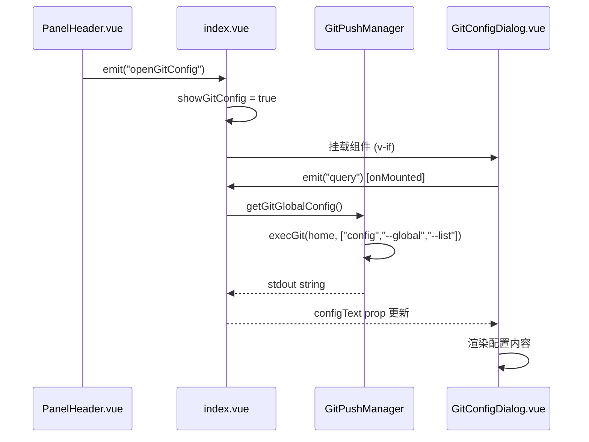

## 用户需求

在 gitPush 面板的 PanelHeader 工具栏中新增一个"本机 Git 配置查询"按钮，点击后在 Modal 对话框中展示本机全局 Git 配置的完整内容。

## 核心功能

- **触发按钮**：PanelHeader 右侧按钮区新增一个齿轮/信息图标按钮，点击触发配置查询
- **Modal 弹窗**：以遮罩弹窗形式展示，参照 MarkdownPreviewDialog 的 v-if 内嵌模式（`gp-mask` + `gp-dialog` 结构）
- **配置展示**：调用 `git config --global --list` 获取完整全局配置，以等宽字体代码块形式展示键值对列表
- **加载状态**：弹窗打开时显示加载中动画，查询失败时显示错误提示
- **复制功能**：底部操作栏提供"复制"按钮，一键复制全部配置到剪贴板

## 技术栈

- 前端：Vue 3 Composition API + TypeScript + SCSS
- Git 命令执行：`GitPushManager.execGit()`（底层 `child_process.execFile("git", ...)`）
- 弹窗模式：参照 MarkdownPreviewDialog 的 v-if 内嵌弹窗
- UI 规范：Codex UI 风格（边框卡片、大写标签、全局 Design Token）

## 实现方案

### 整体策略

遵循 gitPush 模块现有分层架构：

1. **GitPushManager** 新增 `getGitGlobalConfig()` 公开方法，封装 `git config --global --list` 命令
2. **GitConfigDialog.vue** 新建纯展示弹窗组件（加载/错误/空三种状态 + 等宽字体展示）
3. **PanelHeader.vue** 新增按钮 + emit `openGitConfig` 事件
4. **index.vue** 新增 `showGitConfig` ref、调用 manager 方法、渲染弹窗
5. **i18n** 新增中英文翻译键

### 关键技术决策

- **不经过信号量限流**：`git config --global --list` 是纯本地读取操作（不涉及网络 IO），不纳入 `NETWORK_COMMANDS` 分类，自然走本地命令池（默认并发 3），性能无忧
- **cwd 传参**：`--global` 配置与目录无关，传入 `process.cwd()` 或 os.homedir() 均可；为和现有模式保持一致，使用 `getNodeFsPathOs()?.os.homedir()` 作为 cwd
- **弹窗模式**：复用 `gp-mask` 遮罩（已定义于 `styles/Dialog.scss`），弹窗内容自行定义 `gp-gc-dialog` 类，保持与 MarkdownPreviewDialog 一致的视觉风格
- **等宽字体展示**：使用 `$vp-mono` 字体变量，10px 字号，pre 块 + key=value 逐行渲染

## 实现细节

### 数据流

```
PanelHeader 按钮点击 → emit("openGitConfig")
  → index.vue: showGitConfig = true → 挂载 GitConfigDialog
    → GitConfigDialog onMounted: emit("query")
      → index.vue: 调用 manager.getGitGlobalConfig()
        → execGit(os.homedir(), ["config", "--global", "--list"])
          → 返回 stdout → 更新 configText ref
            → GitConfigDialog 渲染配置内容
```

### 性能考量

- 一次 `git config --global --list` 调用，无额外开销
- 配置文本量通常 < 5KB，无需虚拟滚动
- 复制功能使用 `copyToClipboard` 工具函数（已存在）

### 错误处理

- git 未安装：`execGit` 底层 `cp.execFile` 会抛出 ENOENT，catch 后显示"Git 未安装或不可用"
- 超时：30 秒超时（execGit 默认值）
- 空配置：显示"暂未配置全局 Git 信息"提示

## 架构设计



## 目录结构

```
src/features/gitPush/
├── GitPushManager.ts                          # [MODIFY] 新增 getGitGlobalConfig() 方法
├── index.vue                                   # [MODIFY] 新增 showGitConfig ref、handleOpenGitConfig、渲染 GitConfigDialog
├── components/
│   ├── PanelHeader.vue                        # [MODIFY] 新增 git config 查询按钮 + emit openGitConfig
│   └── GitConfigDialog.vue                    # [NEW] Git 配置查询弹窗组件
├── styles/
│   └── GitConfigDialog.scss                   # [NEW] 弹窗样式（等宽字体配置展示、复制按钮等）
src/i18n/
├── zh_CN/gitPush.json                         # [MODIFY] 新增 gitConfig 相关翻译键
└── en_US/gitPush.json                         # [MODIFY] 新增 gitConfig 相关翻译键
```

## 关键代码结构

### GitPushManager 新增方法签名

```ts
// 获取本机全局 Git 配置
async getGitGlobalConfig(): Promise<string>
```

### GitConfigDialog Props/Emits

```ts
interface Props {
  visible: boolean
  configText: string
  loading: boolean
  error: string
  i18n: Record<string, any>
}
// emits: { close: [], query: [], copy: [] }
```

### PanelHeader 新增 emit

```ts
// 在现有 emit 定义中新增：
openGitConfig: []
```