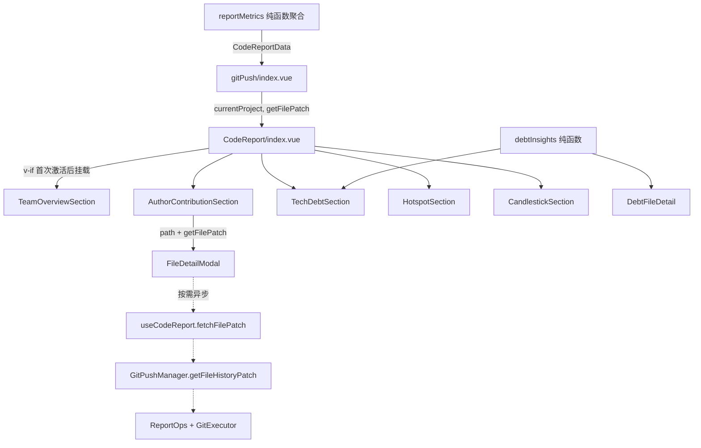

## 产品概述

对 gitPush 功能下的「代码统计报告」（CodeReport）做一轮审查后修复。该面板面向单仓库的项目负责人/开发者，提供项目 + 时间范围选择，自动运行 git 统计并输出四个分区：团队总览（含代码贡献度）、技术债务、代码热点、提交趋势（K 线图 + 提交节奏）。本次不新增功能、不改变页面视觉与信息架构，目标是让现有能力的计算结果正确、运行不卡顿、代码无冗余。

## 核心功能

- **逻辑正确性修正**：文件最后修改时间按真实时刻比较（不再受提交时区差异影响）；7 日均线窗口在任意时区都与日聚合口径对齐；净增为 0 的贡献者不再显示残留进度条；文件详情弹窗的变更内容限定在所选时间范围内；切换项目/时间范围后自动收起展开行并关闭文件详情弹窗。
- **死代码清理**：移除从未被界面消费的热点建议链路（数据字段 + 计算函数 + 中英各 3 条文案）、报告数据中无读取方的项目标识字段、状态层中未被使用的偏好与时间戳导出、以及从未渲染的文件行数预读，同步修正三处与实现不符的注释。
- **性能与交互流畅度**：报告生成不再对每个作者的热门文件同步执行 git 子进程与文件读取（改为打开弹窗时按需加载）；未访问过的分区不在首屏创建图表与计算；技术债务的共变文件改为按日期索引按需取用。
- **结构去重与分层归位**：严重度/热度顺序收敛为单一数据源；重复表达的类型改用派生类型；项目选中回退逻辑只保留一处；纯计算模块从 composables 目录迁出到与同级工具模块并列的位置。
- **可见效果**：报告数值与时区无关且自洽；大仓库生成报告时界面不再长时间无响应；切换范围后不残留上一份报告的展开态与弹窗；代码规模与重复度下降，后续维护只改一处。

## 技术栈

复用项目既有技术栈，不引入新依赖：Vue 3.5（`<script setup>` + TypeScript）、chart.js 4 + vue-chartjs 5（仅提交趋势分区）、SCSS（样式必须外置到 `styles/`）、思源插件运行时（Node/Electron 能力统一走 `@/utils/nodeModules` 与 manager 层异步 git 执行器）。报告数据计算为纯函数层（无 Vue 响应式），视图层由 `useCodeReport` 组合式函数驱动。

## 实现方案

### 总体策略

按「先正确性、再删冗余、后性能」的顺序推进，每个批次内所有落点一次性改完，避免出现无法编译的中间态。核心思路是把报告生成阶段的**同步阻塞 IO 从数据层剥离到交互时刻**，并把散落的多份同类常量/类型/回退逻辑收敛为单一数据源。

### 关键技术决策

**决策一：文件 diff 由「生成期预取」改为「弹窗打开时懒取」，并走 manager 异步 git 通道**
现状 `reportMetrics.ts:484-499` 的 `fetchFileDiff` 用 `execFileSync` 对每个作者的 Top3 文件各跑一次 `git log -p`（20 个作者即约 60 次同步子进程，每次 5s 超时上限），这是界面冻结的主因；而这些内容只有用户点击文件后才可能看到。改为：`ReportOps` 新增异步 `getFileHistoryPatch`（复用现有 `executor.execGit`，与 `getNumstatLog`/`getTrackedFiles` 同一通道，进程在 JS 主线程外执行），`GitPushManager` 加同名委托，`useCodeReport` 暴露按当前项目 + 当前范围取补丁的函数，经 prop 逐级下传到 `FileDetailModal`，弹窗展开时加载并展示加载态。这样生成期零 git 子进程、零大文件读取，交互期只跑一条命令。
配套删除：`FileStatRow.diffContent` 字段（全项目仅 FileDetailModal 读取，改为弹窗本地状态后该字段无消费者）、`fetchFileDiff`、`DIFF_MAX_CHARS`（截断规则迁至 ReportOps，保持 5KB 防撑爆弹窗的既有口径）、`reportMetrics.ts` 的 `getNodeProcessModules` 导入。

**决策二：`fileDetailsMap` 中的行数预读直接删除，而不是懒加载**
`buildReportData` 为 fileDetailsMap 的每个文件调用 `countFileLines`，但 `FileDetailModal` 的六项指标（修改次数/新增/删除/参与作者/净增/最后修改）并不展示行数 —— 这是纯浪费的同步读盘。删掉后 fileDetailsMap 完全由已聚合的 fileMap 派生，零 IO。行数懒加载能力保留在技术债务详情（`DebtFileDetail` 既有模式）与热点榜前 12 条。

**决策三：存在性过滤保留 statSync，只调换判定顺序（`isCodeFile` 廉价判断前置）**
备选方案是用一次 `git ls-files`（manager 已有 `getTrackedFiles`）结果集取代 N 次 statSync，但 `git ls-files` 列出的是索引内文件，工作区已删除的「幽灵文件」仍会被列出，语义不等价，需额外查询 `--deleted` 才能对齐，收益（数千次 statSync 约数十毫秒）低于引入的语义风险。本次只做顺序调换 + 注释说明，把 ls-files 方案列为后续可选优化。

**决策四：日期/时区统一为「本地日历日 + 时间戳比较」双口径**

- 文件最后修改：新增 `FileAgg.lastMs`，用已有的 `parseIsoMs` 比较后回写 `lastIso`，与 `aggregateAuthorStats` 口径一致。
- 7 日均线：`Date.parse("YYYY-MM-DD")` 得到的是 UTC 午夜，在负偏移时区会被 `formatLocalDate` 读成前一天。改为从日期字符串拆出年/月/日后用 `new Date(y, m - 1, d - offset)` 本地构造再格式化，与 dailyStats 的建键口径完全对齐。

**决策五：Tab 由「全量常驻」改为「首次激活后挂载」**
`v-show` 让图表实例与全部派生计算在首屏执行。改为 `v-if="activeTab === id || visited.has(id)"` 负责挂载时机 + `v-show="activeTab === id"` 负责显隐与状态保留；`visited` 在 `activeTab` 变化时写入。仅切换挂载条件，不改动四个分区内部实现。

**决策六：分层归位采用「与 reportMetrics 同级的纯函数模块」**
`composables/useDebtInsights.ts` 不含任何组合式函数，却被三个组件 import。备选：并入 `reportMetrics.ts`（767 行，已超 500 行硬阈值，会加剧问题）或新建 `utils/` 目录（与项目「feature 根目录放 utils.ts」的既有布局不一致）。采用新建 `src/features/gitPush/debtInsights.ts`，与同层的 `reportMetrics.ts` 对称，改动仅三处 import。

**决策七：顺序常量以元数据键序为唯一源**
在 `types/report.ts` 由 `DEBT_SEVERITY_META` / `HOTSPOT_LEVEL_META` 的键序派生 `DEBT_SEVERITY_ORDER` / `HOTSPOT_LEVEL_ORDER`，`reportMetrics.ts` 内私有的 `SEVERITY_ORDER`（Record）与 `HOTSPOT_LEVEL_ORDER` 一并删除，排序改用 `indexOf`。同时把 `reportMetrics.ts:698-703` 依赖下标取 hot/warm 占比的写法改为按等级名查找，消除下标与顺序的隐式耦合。

**决策八：类型重复按收益分级处理**
`CoupledFile` 与 `DebtFileRow` 字段完全重叠且仅描述「债务文件的投影」，改为 `Pick` 派生；`SeverityDistItem` 与 `HotspotLevelSummary` 虽结构同构但分属「严重度分布」与「热度等级分布」两个语义域，且各自只有一处使用，按 Rule of Three 保留独立定义并在注释中标注差异，不为两处使用引入泛型抽象。

### 性能与复杂度

- 报告生成：从「O(文件数) 次 statSync + O(作者数×3) 次同步 git 子进程 + 同等次数同步读盘」降为「O(文件数) 次 statSync（廉价判断前置后更少）+ 12 次读盘」，dominant cost 回归到一次 `git log --numstat`。
- 共变文件映射：从「每个债务文件一次全量 filter + sort」的 O(n² log n) 降为「一次建日期索引 O(n) + 展开行 O(k) 取值」。
- 首屏：由「4 个分区全量计算 + 图表实例」降为「仅团队总览分区」，其余在首次点击时支付。

## 执行要点

- **引用验证先行**：删除 `adviceKey` / `diffContent` / `debtMinModCount` / `projectId` / `projectName` 前，必须做一次全仓库引用扫描（含 `.vue` 模板与 i18n 分片），确认零消费者后再删，避免漏改导致类型报错。
- **i18n 只改分片**：删除的 6 条文案只动 `src/i18n/zh_CN/gitPush.json` 与 `src/i18n/en_US/gitPush.json`；顶层 `zh_CN.json` / `en_US.json` 是 `pnpm i18n:merge` 产物，禁止手改。新增的加载态文案复用分片中已有的 `loading` 键，不新增键。
- **数据流约束**：`FileDetailModal` 属于对话框类子组件，父级只传最小标识与取数函数，不得反向把整份报告塞给它；函数 prop 命名 camelCase（`getFilePatch`）。
- **样式约束**：弹窗加载态新增样式放 `styles/FileDetailModal.scss`，颜色/字号一律用设计 Token，禁止 box-shadow 与硬编码值；Vue 文件内只允许 `@use`。
- **注释与文件头**：所有被修改的 `.ts` / `.vue` 必须同步更新顶部 10~30 字功能说明；模板中每处 i18n 渲染点上方保留中文注释标明实际文案，新增区块补中文区块注释。
- **存量注释漂移一并修正**：`CodeReport/index.vue:150`（写「3 分区 Tab」实为 4 个）、`types/report.ts:225`（写升序，实现为降序）、`AuthorContributionSection.vue:235`（注释与实现不符）。
- **兼容性**：`buildEmptyReport` 删除项目形参后，调用方 `useCodeReport` 中 `{ id: "", name: "" } as GitProject` 的空对象构造一并删除；`buildReportData` 的债务门槛参数在偏好删除后无调用方传值，直接删除该参数并改用 `DEBT_MIN_MOD_COUNT` 常量。
- **验证由用户执行**（AI 不运行）：`pnpm lint`、`pnpm i18n:verify`、`pnpm validate:icons`、`npx tsc --noEmit`。

## 架构设计

改动集中在 gitPush 功能内部，不跨功能、不改注册清单、不新增模块注册。数据流变化只有两处：项目实例由父组件统一下传（消除组件内第二份回退逻辑）；文件补丁由数据层预取改为交互期按需取（新增一条异步取数通道）。



## 目录结构

本次共涉及 16 个文件（1 新建、1 删除/迁移、14 修改），其中 `TeamOverviewSection.vue`、`HotspotSection.vue` 仅因分区挂载条件与 import 调整连带确认，无逻辑改动。

```
src/features/gitPush/
├── reportMetrics.ts                    # [MODIFY] 修 lastModified 用 parseIsoMs 比较（FileAgg 增 lastMs 字段）；重写 calcMovingAverage7 为本地日期构造；fetchFileDiff 删除（改为异步懒取）；fileDetailsMap 去掉行数预读与 diff 预取；存在性过滤改为 isCodeFile 先行；私有 SEVERITY_ORDER / HOTSPOT_LEVEL_ORDER 删除改用 types 派生的 ORDER；热点占比改为按等级名查找；私有 heatLevel 改名 hotspotLevel；删除 DIFF_MAX_CHARS 与 getNodeProcessModules 导入；文件头注释同步
├── debtInsights.ts                     # [NEW] 由 composables/useDebtInsights.ts 整体迁入的纯函数模块：趋势推断、共变索引、严重度分布、优先治理；buildCoupledMap 重构为 createCoupledIndex（O(n) 建索引 + get(path) 按需取）；CoupledFile 改为 Pick 派生
├── composables/
│   └── useDebtInsights.ts              # [DELETE] 迁移至 debtInsights.ts，文件内无任何组合式函数，留在 composables 目录违反分层规范
├── types/
│   ├── report.ts                       # [MODIFY] 删除 HotspotFileRow.adviceKey、FileStatRow.diffContent、CodeReportData.projectId/projectName、CodeReportPrefs.debtMinModCount；新增由 META 键序派生的 DEBT_SEVERITY_ORDER / HOTSPOT_LEVEL_ORDER；修正 debtFiles 排序注释（降序）
│   └── index.ts                        # [MODIFY] 在类型导出之外补两条 ORDER 常量的值导出，供组件从 ../../types 统一导入
├── composables/
│   └── useCodeReport.ts                # [MODIFY] 删除 debtMinModCount（ref / 载入 / 钳位）与 generatedAt 导出；新增 fetchFilePatch(path)（按当前项目 + 当前范围经 manager 取补丁，失败返回空串）；currentProject 对外接线；buildEmptyReport 调用去掉空项目构造
├── managers/
│   ├── ReportOps.ts                    # [MODIFY] 新增异步 getFileHistoryPatch(projectPath, file, since?)：git log -p -5，since 非空时追加 --since，沿用 quotepath=false，5KB 截断，超时 10s
│   └── GitPushManager.ts               # [MODIFY] 新增同名委托方法，风格与既有 getTrackedFiles 委托一致
├── index.vue                           # [MODIFY] 解构并下传 currentProject、getFilePatch 两个 prop 给 CodeReportPanel
├── README.md                           # [MODIFY] 同步 CodeReport 章节的模块清单（debtInsights.ts 新位置）与数据结构说明（删除字段）
├── components/CodeReport/
│   ├── index.vue                       # [MODIFY] 新增 currentProject / getFilePatch props，删除本地回退实现；Tab 改为 visited 集合控制的 v-if + v-show 组合；向下传递 getFilePatch；修正文件头「3 分区」注释
│   ├── AuthorContributionSection.vue   # [MODIFY] netBarWidth 补零值分支并删除无样式的 gpr-net-bar--zero；watch 报告变化时重置 expanded / selectedFile；内联 netClass 薄封装；向弹窗传递 getFilePatch
│   ├── FileDetailModal.vue             # [MODIFY] 变更内容改为本地异步加载：watch fileStat 触发 getFilePatch，加载中复用 i18n.loading，失败静默隐藏 diff 区块；不再读取 props.fileStat.diffContent
│   ├── TechDebtSection.vue             # [MODIFY] watch 报告变化时重置 expandedPath；共变映射改为索引按需取；严重度分组由四次 filter 改单次分桶；趋势由父级 trendMap 下传，子组件不再重复推断；DEBT_SEVERITY_ORDER 改从 types 导入
│   ├── DebtFileDetail.vue              # [MODIFY] 接收父级下传的 trend，删除本地 inferDebtTrend 调用；import 路径改 debtInsights
│   ├── DebtSummaryBar.vue              # [MODIFY] import 路径改 debtInsights
│   ├── CandlestickSection.vue          # [MODIFY] scroll 监听清理改 onBeforeUnmount（Vue 3.5 下 unmounted 时模板 ref 已被置空，现有移除会静默失效）；工作底色绘制的边界判定改 == null，避免 left 为 0 被误判为缺失
│   ├── TeamOverviewSection.vue         # [MODIFY] 仅确认挂载条件变更后的可用性，无逻辑改动
│   └── HotspotSection.vue              # [MODIFY] 仅确认挂载条件变更后的可用性，无逻辑改动
└── styles/
    └── FileDetailModal.scss            # [MODIFY] 新增 diff 加载态样式（复用既有 token，禁止硬编码与阴影）
src/i18n/
├── zh_CN/gitPush.json                  # [MODIFY] 删除 reportHeatAdviceHot / Warm / Cool
└── en_US/gitPush.json                  # [MODIFY] 删除同三键，提交前需与中文分片键对齐
```

## 关键代码结构

```ts
// types/report.ts —— 顺序常量以元数据键序为唯一源（消除三处重复）
export const DEBT_SEVERITY_ORDER = Object.keys(DEBT_SEVERITY_META) as DebtSeverity[]
export const HOTSPOT_LEVEL_ORDER = Object.keys(HOTSPOT_LEVEL_META) as HotspotLevel[]

// debtInsights.ts —— 共变类型改为派生，索引化取用替代 O(n²) 预计算
export type CoupledFile = Pick&lt;DebtFileRow, "path" | "modCount" | "riskScore" | "severity"&gt;
export function createCoupledIndex(files: DebtFileRow[]): { get(path: string): CoupledFile[] }
```

```ts
// ReportOps / GitPushManager —— 异步取补丁（替代原同步 execFileSync）
async getFileHistoryPatch(projectPath: string, file: string, since?: string): Promise&lt;string&gt;

// FileDetailModal 契约 —— 父级只传最小标识 + 取数函数
defineProps&lt;{
  i18n: Record&lt;string, any&gt;
  fileStat: FileStatRow | null
  getFilePatch: (path: string) =&gt; Promise&lt;string&gt;
}&gt;()
```

## Agent Extensions

### Skill

- **lsp-code-analysis**
- Purpose：在删除 `adviceKey` / `diffContent` / `debtMinModCount` / `projectId` / `projectName` 之前，用 find references 做全量引用扫描（含 `.vue` 模板与 i18n 分片），确认零消费者
- Expected outcome：输出每个待删字段/函数的完整引用清单，证明删除安全，避免漏改导致 `npx tsc --noEmit` 报错

### SubAgent

- **code-explorer**
- Purpose：跨目录核对 `useDebtInsights` 的三处 import 落点、`DEBT_SEVERITY_ORDER` / `HOTSPOT_LEVEL_ORDER` 的全部消费者、以及 `buildEmptyReport` / `buildReportData` 的调用点，保证迁移与改名不留残链
- Expected outcome：给出需同步修改的文件与行号清单，作为批次改动的检查表