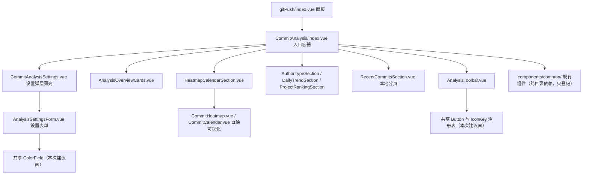

## 产品概述

对 gitPush「提交分析」视图的 12 个组件做一次按项目规则的合规审查，产出一份可执行的审查报告文档，供后续按目录逐批整改直接照做。本轮只交付报告，不改任何代码。

## 核心功能

- 逐文件通读 `src/features/gitPush/components/CommitAnalysis/` 全部 12 个 `.vue`，按项目强制规则（共享组件复用、统一入口、样式与 Token、i18n 与类型、架构分层与行数上限）产出审查报告。
- 报告包含：分级违规清单（每条含 `路径:行号` 证据、违反条款、目标改法、迁移陷阱）、逐文件处置表、假阳性排除与允许自建例外登记、整改分批建议与风险点。
- 已知 3 处真违规：分析按钮与分析设置齿轮按钮仍是自建按钮体系（`.vp-btn`），热力色字段仍是原生取色器输入（在思源 Electron 下不弹窗，属功能性缺陷）。
- 已核实合规项（无统一入口违规、无 i18n 硬编码兜底、样式无硬编码字号字重行高、无超 500 行文件）在报告中作为假阳性排除列出，避免后续批次重复排查。
- 报告需指出该目录的结构性特征：几乎未使用共享组件库（全目录仅引入共享 `Loader`），控件载体合规度明显低于已整改的 `ListView` 与 `CommitRuleCheck`。

## 技术栈

沿用项目现有栈，不引入任何新依赖：Vite + Vue 3 `script setup` + TypeScript + SCSS（设计 Token 短名制），共享组件库 `src/components/` 为唯一 UI 控件来源，图标真源 `src/components/kit/icons.ts`。
本轮为纯文档产出，涉及工具仅 `read_file` / `search_content` / `read_lints`（只读）。

## 实现方案

### 总体策略

先取证、后成文。以「真违规 / 模块范式 / 允许自建例外」三分法定性，所有结论必须带 `路径:行号` 与源码原文，禁止凭记忆断言共享组件能力（`interface Props` 与 `componentPreview/previewData/*.ts` 是唯一依据）。

### 关键决策与理由

1. **本轮不改代码**（用户已选「先出全量审查报告，再分批整改」）：报告的「改法建议」按可执行粒度写（逐处目标写法 + 落点文件 + 特异性档位），使后续批次可零调研直接实施。
2. **同口径复用前两轮结论**：不重复排查已定性项——覆写共享组件样式抬到 (0,3,0)～(0,4,0)（padding/圆角必须 (0,4,0)）；`@use` 双行、「`i18n: Record<string, any>` 透传」、「`usePagedList` + `LoadMoreButton`」为模块范式只登记；纯展示容器（`gpa-*` 卡片、自绘热力图与日历、区块标题）登记为允许自建例外。
3. **判定基准的横向对齐**：对每一项判断都要与 `docs/gitPush-listview-controls-review.md`、`docs/gitPush-commitrulecheck-controls-review.md` 的既有定性比对，避免同一写法在两份报告里得出不同结论。
4. **跨目录依赖只登记不改**：被本目录消费的 `components/common/` 组件（`EmptyState` / `CommitCountSelect` / `LoadMoreButton` / 弹窗类）自身若仍含自建控件，写入「待办登记」而非违规清单。

### 性能与可靠性

本轮不产生运行时改动，无性能影响。报告质量风险点在于「行号漂移」与「props 误判」，故要求：取证与成文分两步；成文后回读文件逐条核对引用行号；共享组件能力一律标注来源文件与行号。

## 实现注意事项

1. 共享组件 `ColorField` 是颜色字段的唯一合法载体（Electron 下原生取色器不弹窗，禁止用原生）；迁移须先读其真实 props（`v-model` 形态、是否受控、是否支持 `placeholder`）与预览用法，禁止猜 props。
2. `Button.icon` 只接受 `IconKey`（注册表键名，不是 `mdi:` 字符串）；纯图标按钮不得把图标组件放进默认插槽（会让纯图标判定恒假，尺寸档位与无障碍名派生全部失效）。齿轮按钮所需图标须先核实注册状态，未注册则记入「能力缺口 + 补登清单」。
3. 分析按钮与已整改的 `RuleCheckToolbar.vue` 是同一段代码，改法可直接沿用（紧凑按钮修饰 + 内置 loading 承担转圈与禁用），报告中注明「可复用既有改法」以免二次设计。
4. 自建浮层（设置弹层的 popover 容器 + 文档级外部点击关闭）需核实共享库是否有可比肩的公开组件（注意 `tooltip` / `overlay` 为私有目录，feature 禁止直接导入）；若无可比肩组件则按 `ListView` 报告对下拉浮层的既有定性登记为例外，并把 a11y 缺口（无 Esc 关闭、无 aria 展开态、无焦点管理）作为独立条目记录。
5. 明确「自绘数据可视化」的定性：热力图与日历属纯展示可视化原语，与共享 `Chart` 的能力边界需核实后判定，不得默认要求迁移。
6. 验证纪律：AI 不执行 `pnpm lint` 与 `pnpm vite build`（由用户执行）；不新建临时校验脚本；共享组件能力必须以源码为准。

## 架构设计

本次为「已有模块的目录级合规审查」，不新增层次、不改变任何调用关系与数据流：



变更面仅为「新增报告文档 + 文档内引用的既有文件行号」，父子契约与数据流零改动。

## 目录结构

```text
siyuanPluginVueSN/
├── docs/
│   └── gitPush-commitanalysis-controls-review.md   # [NEW] 审查报告。结构对齐前两份报告：一、规则依据表（AGENTS.md 共享组件库使用规则/统一入口/分层/图标只传 IconKey；AGENTS_STYLE.md 按钮交互与无障碍、字号层级、SCSS 分离；AGENTS_I18N.md；AGENTS_ARCH.md 行数上限；componentPreview 真实 props）；二、结论总览（按高/中/低分级 + 数量 + 12 文件逐文件处置表）；三、违规清单逐类（证据含路径行号 → 违反条款 → 目标写法 → 迁移陷阱）；四、假阳性排除与允许自建例外登记（含已核实合规项、@use 双行范式、i18n 透传范式、加载更多分页、自绘可视化、热力色阶图例色块、跨目录依赖待办）；五、整改建议与分批次序（逐文件可执行清单 + 风险点 + 特异性档位）；六、验证方式说明（纯文档交付，如实说明无增量校验）。
└── src/features/gitPush/components/CommitAnalysis/   # [REFERENCE] 只读审查对象，本轮不修改任何文件
    ├── AnalysisToolbar.vue               # [REFERENCE] 自建分析按钮（1 处违规）
    ├── CommitAnalysisSettings.vue        # [REFERENCE] 自建齿轮按钮 + 自建浮层（2 处待定性）
    ├── AnalysisSettingsForm.vue          # [REFERENCE] 原生取色器输入（1 处违规）
    ├── CommitHeatmap.vue / CommitCalendar.vue   # [REFERENCE] 自绘可视化（预计登记例外）
    └── 其余 7 个 .vue                     # [REFERENCE] 逐文件复核，预计以合规/例外为主
```

## 关键契约（仅列出必须精确的来源）

- 共享组件的 props 与语义：以 `src/components/` 下各组件 `interface Props` 与 `componentPreview/previewData/*.ts` 为准，报告每条改法须标注来源。
- 图标可用性：以 `src/components/kit/icons.ts` 的注册表为准（`IconKey` 自动派生），结论须区分「已注册 / 未注册需补登」。
- 既有定性口径：以 `docs/gitPush-listview-controls-review.md` 与 `docs/gitPush-commitrulecheck-controls-review.md` 为准，保证三份报告结论一致。

## Agent Extensions

### SubAgent

- **code-explorer**
- Purpose: 完成报告中所有需实证的取证：共享 `ColorField` / `Button` / `Tag` / `Checkbox` / 图表类组件的真实 `interface Props` 与预览用法；`src/components/kit/icons.ts` 中齿轮图标等键的注册状态与补登点；共享库对自建浮层（popover）是否有可比肩公开组件及私有目录边界；`CommitAnalysis/` 12 个文件的逐文件复核（含预扫描未覆盖的自建分段切换、折叠区、裸图标按钮可访问名、受控写法混用等）；`components/common/` 被消费组件的跨目录依赖清单。
- Expected outcome: 产出带 `路径:行号` 的已核实事实清单，明确区分真违规 / 模块范式 / 允许自建例外 / 跨目录待办，作为报告唯一依据，不得凭记忆断言 props。

### Skill

- **universal-arch-skill**
- Purpose: 以架构规范视角对 12 个组件做结构校验与代码审查，覆盖统一入口、设计 Token、样式分离、目录与分层规范、可维护性硬约束（行数上限、文件头注释、提取规则）。
- Expected outcome: 输出架构维度的违规判定与改进建议，补入报告的「规则依据」与「违规清单」章节，并交叉验证 code-explorer 的事实结论，确认报告未把模块范式误判为违规。