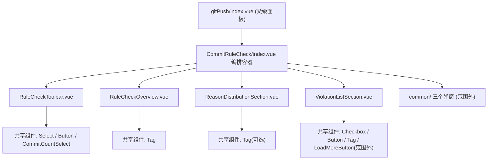

## 产品概述

对 gitPush「提交规则检查」视图的 5 个组件做一次**按项目规则的合规审查**，并当场完成控件层修复，使它们与同模块 ListView 已完成的做法保持一致。改动只涉及代码结构与交互载体，**页面视觉观感与业务行为保持等价**。

## 核心功能

- 逐文件通读 `components/CommitRuleCheck/` 全部 5 个 `.vue`，按项目强制规则（共享组件复用、样式与 Token、i18n 与类型、架构分层与行数上限）产出**审查报告文档**，含违规清单、逐处位置、改法建议、迁移陷阱与假阳性排除说明。
- 按报告把**自建按钮**迁移到共享按钮组件（分析按钮、批量修正按钮、行内修正/删除图标按钮）。
- 把**原生复选框**迁移到共享复选框（列表全选、行内多选），保留受控回写与阻止冒泡行为。
- 把可一对一表达的**手写徽标**迁移到共享标签组件；登记无法一对一表达的徽标为允许例外。
- 消除同一文件内重复的**违规行唯一键拼接**，提取为单一事实源。
- 清理被共享组件接管后遗留的**死样式**，并把必要的样式覆写特异性抬到规范要求档位。

## 边界

- 审查与改动范围严格限定为 `src/features/gitPush/components/CommitRuleCheck/` 下 5 个 `.vue`，以及迁移必然牵动的 `styles/CommitRuleCheckPanel.scss` 对应选择器。
- 不重构 `styles/` 目录整体，不改动 gitPush 其余目录（CommitAnalysis / StatsView / CodeReport / LogPanel / LineStats / common）。
- 模块级既定写法（i18n 逐层透传、每个组件各自引入共享样式分片、加载更多分页）经横向核实属全模块范式，本轮仅登记不改，避免制造目录间不一致。

## 一、技术栈

沿用项目现有栈，不引入任何新依赖：

- Vite + Vue 3 `<script setup>` + TypeScript，`.vue` 单文件组件
- SCSS（Sass `@use` 模块化，设计 Token 短名制 `$s-*` / `$t-*` / `$r-*` / `$fw-*` / `$lh-*` / `$ff-*`）
- 共享组件库 `src/components/`（唯一 UI 控件来源）与图标注册表 `src/components/kit/icons.ts`
- 校验入口：`read_lints`（IDE 诊断）、`pnpm typecheck`（vue-tsc）、`pnpm validate:icons`、`pnpm i18n:verify`

## 二、实现方案

### 总体策略

以「先审查取证、后按报告修复」两步走。取证阶段横向比对共享组件**真实 props** 与全模块同类写法的既定范式，把「真违规」与「模块约定」「允许自建例外」分开定性，避免把范式当违规改掉（这是本类任务最大的返工源）。

### 关键决策与理由

1. **按钮迁移目标形态**：统一 `<Button variant="ghost" size="xsmall" dense>`。`dense`（仅与 `xsmall` 协同）就是为替代原 `.vp-btn--sm` 紧凑几何而新增的修饰，与 ListView 已迁移文件的写法完全一致，可保证观感不变。
2. **图标必须走 `IconKey`**：共享 `Button` 的 `icon` 是 `IconKey`（注册表键名，如 `pencilOutline` / `deleteOutline` / `sparkles`），**不是 `mdi:*` 字符串**，不能原样搬运 `mdi:pencil-outline`。经查 `mdi:clipboard-check-outline` 在注册表中**无对应键**，而该图标被分析按钮使用 ⇒ 需在 `src/components/kit/icons.ts` 新增一个键（共享库真源已有 feature 专属键先例，如 `docNavKeywordEdit`），并跑 `pnpm validate:icons`。
3. **复选框迁移**：`Checkbox` 为**纯受控**组件，显示完全取自 `modelValue`，必须 `:model-value` + `@update:model-value`，且 handler 内先回写状态（现有 `toggleSelect` / `toggleSelectAll` 已是回写式，改造量小）。`Checkbox` 的 props 表**没有 `title`**，有 `aria-label` ⇒ 无障碍名走 `aria-label`，`title` 作为透传属性保留在外层（先验证根元素单根可透传，不可透传则移到外层包裹元素）。
4. **徽标迁移取「能一对一才迁」原则**：`.grc-section-count`（标题计数）与 `.grc-item-reason`（违规原因）可一对一表达为 `Tag`（`variant="primary"` / `"warning"`）；`.grc-reason-chip`（文案+计数复合 chip）与 `.grc-select-count`（按钮内计数）无等价形态，登记为「纯展示容器 / 组件库缺口」允许自建例外，与 ListView 报告的登记口径一致。
5. **KPI 卡片保留自建**：`.grc-card` 是「居中数值 + 标签」的纯展示布局容器，共享 `Card` 的 header/body 结构与尺寸档位覆盖不了该形态且会引入大量覆写 ⇒ 登记为允许自建例外，不迁移。
6. **「加载更多」不换分页器**：`usePagedList` + `LoadMoreButton` 是 g模块内 4 处共用的既定「渐进加载」模式（CommitAnalysis / LogPanel / RepoCleanPanel 同款），与「页码分页器」不是同一交互场景 ⇒ 维持现状，报告写明判据。
7. **键拼接去重**：`ViolationListSection.vue` 内 3 处 `${projectId}-${hash}-${reason}` 收敚为单一函数。落位遵循分层规则：先核实同构键是否被 `common/` 下弹窗消费；被 2 个以上文件使用则提到 `src/features/gitPush/utils/` 合适模块，仅本文件使用则留在组件内的小函数。

### 性能与可靠性

- 迁移为纯控件替换，**不新增响应式依赖、不新增 watch、不改变渲染次数**；`ViolationListSection` 的行 key 仍由 `pagedRows` computed 一次性预计算，禁止把拼接挪回模板 `:key` 表达式（会造成每次渲染重算）。
- `Checkbox` 替换原生 input 后，`selectedKeys` 仍以 `Set` + 整体替换方式更新，保持响应式触发正确；`allSelected` 判据不变。
- 不触碰分页、分析触发、弹窗回调等业务链路，回归面可控。

### 架构一致性

- 不新增目录、不新增注册项；组件文件功能注释（`.vue` 顶部 `<!-- ... -->` + `<script setup>` 内一行）在修改时保持/补齐。
- 样式仍在 `styles/` 外置，组件内 `<style lang="scss">` 只保留 `@use` 引入。

## 三、实现注意事项（防回归）

1. **删除 `import { Icon } from "@iconify/vue"` 前必须 grep 模板中的 `<Icon`**：残留时 lint 与 typecheck 都不报错，属静默漏改。本目录 2 个文件含该导入（`RuleCheckToolbar.vue`、`ViolationListSection.vue`），两处迁完后才可删。
2. **覆写共享组件样式的特异性**：共享组件自身 scoped 为 (0,2,0)，`.grc-item-fix` / `.grc-item-drop` 现为 (0,1,0) 的 `opacity` / `padding` / `border-radius` 覆写迁移后会失效 ⇒ 抬到 (0,3,0)～(0,4,0)（含 `padding` / `border-radius` 时必须 (0,4,0)），写法与 ListView 迁移后一致。
3. **`@change` ≠ `@update:model-value`**：原生 checkbox 用 `@change`，共享 `Checkbox` 用 `@update:model-value`，载荷为 boolean；`Select` 载荷为 `string | number | boolean | null`。`RuleCheckToolbar` 现有 `Select` 用法（受控 + handler 内 `typeof v === "string"` 判断后 emit）已正确，**不改**。
4. **纯图标按钮无障碍**：共享 `Button` 纯图标场景必须给 `title` 或 `aria-label`（现两处已有 `title`，迁移后保留）。
5. **禁止顺手改的「假阳性」**：①5 个组件各自 `@use "../../styles/CommitRuleCheckPanel.scss"` 与 `"../../styles/index.scss"` —— 全模块范式（CommitAnalysisPanel 9 处、StatsPanel 10 处、LogPanel 5 处、LineStatsPanel 4 处、index.scss 67 文件），**保持不动**；②`i18n: Record<string, any>` 逐层透传 —— 全模块 90+ 处既定模式，本轮只登记不改；③`complianceRate` 无除零兜底 —— 父级保证 `totalCommits > 0` 才渲染，非缺陷。
6. **跨目录依赖只登记不修改**：`components/common/LoadMoreButton.vue` 自身仍是 `.vp-btn`，属本目录消费但**不在审查范围**；`Tag` 迁移引起的观感微差（现为 warning-lightest 底 + warning-lighter 描边，`Tag` 为 10% 浅底 + 20% 描边）需在报告中显式标注。
7. **验证纪律**：AI 不执行 `pnpm vite build` / `pnpm lint`（由用户验证）；不新建临时校验脚本；类型检查只用 `pnpm typecheck`，禁用 `npx tsc --noEmit`。若确需新增 i18n 键（预计不需要，`ruleCheckSelectAll` / `ruleCheckBatchFix` 已存在），改完分片必须 `pnpm i18n:merge` 再 `pnpm i18n:verify`。

## 四、架构设计

本次为**已有模块内的组件级替换改造**，不新增层次、不改变调用关系与数据流：



- 数据流不变：父级 `stats` / `projects` / `projectId` 单向传入，子组件只 emit（`runAnalysis` / `updateCount` / `updateProject` / `viewProject` / `openFix` / `openDrop` / `openBatchFix`）。
- 变更集中在**模板控件替换 + 同目录样式选择器调整 + 报告文档新增**三个面，父子契约零改动。

## 五、目录结构

```text
siyuanPluginVueSN/
├── docs/
│   └── gitPush-commitrulecheck-controls-review.md   # [NEW] 审查报告。结构对齐 docs/gitPush-listview-controls-review.md：一、规则依据表（AGENTS.md / AGENTS_STYLE.md / AGENTS_I18N.md / AGENTS_ARCH.md / componentPreview 逐条列条款）；二、结论总览表（按高/中/低分级 + 数量 + 说明）；三、违规清单逐类（证据 → 违反条款 → 逐文件位置表 → 目标写法 → 迁移陷阱）；四、假阳性排除与允许自建登记（含 @use 范式、i18n 透传范式、KPI 卡、LoadMoreButton/usePagedList、跨目录依赖）；五、改动清单与验证记录。
├── src/components/kit/
│   └── icons.ts                                     # [MODIFY] 新增 mdi:clipboard-check-outline 的 IconKey（供迁移后的分析按钮使用）。须跑 pnpm validate:icons 验证；键名遵循既有 camelCase 约定，插入位置按注释分区归类。
└── src/features/gitPush/
    ├── README.md                                    # [MODIFY] 若组件职责/结构有变则同步 CommitRuleCheck 小节描述；无结构变化则仅确认无需改动，并在报告中说明。
    ├── components/CommitRuleCheck/
    │   ├── index.vue                                # [MODIFY] 纯编排容器。核对：文件头注释、emit 契约不变、无自建按钮（现为 0 处）；保持 @use 两个样式分片不改。
    │   ├── RuleCheckToolbar.vue                     # [MODIFY] 第 25-36 行自建 <button class="vp-btn vp-btn--ghost vp-btn--sm"> + 裸 Icon + gp-spin 旋转 → <Button variant="ghost" size="xsmall" dense :icon="分析图标 IconKey" :loading="analyzing" :disabled="analyzing">；加载态改由 Button 的 loading（保宽，spinner 绝对居中）承担。迁移后确认模板无 <Icon 残留再删 @iconify/vue 导入。Select / CommitCountSelect / analysisStatusText 用法保持不动。
    │   ├── RuleCheckOverview.vue                    # [MODIFY] 3 个 .grc-card KPI 卡保留自建（登记例外）；规则提示 .grc-hint 内插值不变；将可一对一表达的计数徽标（若存在）改 Tag；根元素裸 div 可保留（纯展示容器）。
    │   ├── ReasonDistributionSection.vue            # [MODIFY] .grc-reason-chip（文案 + 计数复合 chip）无 Tag 等价形态 ⇒ 保留自建并登记例外；仅核实文案仍走 i18n[COMMIT_RULE_REASON_META[...].labelKey]（模块层零文案模式）不被破坏。
    │   └── ViolationListSection.vue                 # [MODIFY] 核心改动文件：①第 11-17 行原生 checkbox 全选 → 共享 Checkbox（:model-value="allSelected" + @update:model-value="toggleSelectAll" + :aria-label="i18n.ruleCheckSelectAll" + :label 提供行内文案），替换 <label class="grc-select-all"> 包裹；②第 44-50 行原生 checkbox 行内多选 → 共享 Checkbox（:model-value="selectedKeys.has(row.key)" + @update:model-value="toggleSelect(row.key)" + :aria-label + class="grc-item-check"，保留阻止冒泡）；③第 20-32 行批量修正按钮 → 共享 Button（icon="sparkles" + :disabled + 默认插槽内保留计数徽标）；④第 59-73 行两个纯图标按钮 → 共享 Button（icon="pencilOutline" / "deleteOutline" + title + @click.stop）；⑤消除 3 处 ${projectId}-${hash}-${reason} 拼接为单一键函数；⑥watch(pagedSource) 重置分页 + 清空选中的行为保持不变。
    └── styles/
        └── CommitRuleCheckPanel.scss                # [MODIFY] 仅删改被共享组件接管的选择器：删除 .grc-select-all input[type="checkbox"]、.grc-item-check 的原生样式，改为承载共享 Checkbox 的必要尺寸/间距；.grc-item-fix / .grc-item-drop 的 opacity/padding/border-radius 覆写抬到 (0,3,0)～(0,4,0)；新增 Tag 迁移对应的观感对齐（如确需）；不做全量重构、不新造 Token。
```

## 六、关键写法对照（仅核心契约，避免返工）

```
<!-- 迁移目标：紧凑按钮 + 注册表 IconKey + 受控 Checkbox -->
<Button
  variant="ghost" size="xsmall" dense
  :icon="analyzing ? 'loading' : 'clipboardCheckOutline'"
  :loading="analyzing" :disabled="analyzing"
>{{ analyzed ? i18n.auditRerun : i18n.auditRun }}</Button>

<Button variant="ghost" size="xsmall" dense icon="sparkles" :disabled="selectedCount === 0">
  {{ i18n.ruleCheckBatchFix }}
</Button>

<Checkbox
  :model-value="selectedKeys.has(row.key)"
  size="xsmall"
  :aria-label="i18n.ruleCheckBatchFix"
  @update:model-value="toggleSelect(row.key)"
/>
```

> `icon` 只接受 `src/components/kit/icons.ts` 已注册的 `IconKey`；`Checkbox` 为纯受控组件，handler 内必须回写状态。

## Agent Extensions

### SubAgent

- **code-explorer**
- Purpose: 在修复前完成取证：核对共享 `Button` / `Checkbox` / `Tag` / `Card` 的真实 `interface Props` 与 `previewData` 用法示例；横向比对 gitPush 全模块（ListView / CommitAnalysis / StatsView / LogPanel / CodeReport / LineStats）的同类既定写法；确认 `docs/gitPush-listview-controls-review.md` 的判定口径；核实违规行唯一键是否被 `common/` 下弹窗消费，以决定键函数落位。
- Expected outcome: 产出「已核实事实清单」——每条结论带文件路径与行号，明确区分真违规 / 模块范式 / 允许自建例外 / 跨目录依赖，作为报告与修复的唯一依据（不得凭记忆猜 props）。

### Skill

- **universal-arch-skill**
- Purpose: 以架构规范视角对 5 个组件执行结构校验与代码审查，覆盖统一入口、设计 Token、样式分离、目录与分层规范、注册清单完整性等原则，交叉验证 code-explorer 的事实结论。
- Expected outcome: 输出架构维度的违规判定与改进建议，补充进审查报告的「规则依据」与「违规清单」章节，并确认本次改动不违反分层与统一入口原则。