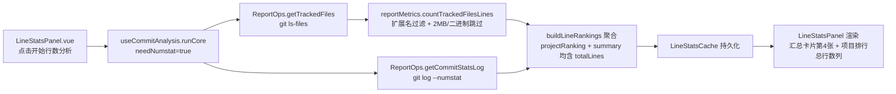

## 产品概述

在 gitPush 行数统计面板中新增「当前总行数」指标，用于展示当前工作区已跟踪文件的实际代码行数（存量口径），与现有的「新增 / 删除 / 净增」（增量口径，来自 git log --numstat）完全分离、互不干扰。

## 核心功能

- **汇总卡片加第 4 张卡片**：在「总新增 / 总删除 / 总净增」三张卡片后新增「当前总行数」卡片，显示所有项目合计的当前实际行数，并用中性色与增量指标区分。
- **项目排行加列**：项目代码行数排行每行末尾新增「总行数」列，展示单个项目当前实际行数；作者排行不加（总行数是项目属性）。
- **统计口径统一**：跟随现有 `selectedExtensions` 扩展名过滤，并排除二进制文件与超过 2MB 的超大文件，与「新增 / 删除 / 净增」口径一致。
- **旧缓存兼容**：旧版本缓存无 `totalLines` 字段时自动降级为 0，不产生 NaN 或渲染异常。

## 技术栈

- 复用项目现有技术栈：Vue 3 + TypeScript + SCSS（Vite 构建）
- git 命令统一走 `GitExecutor` / `ReportOps`（自带并发限流），禁止组件内直接 `child_process` 执行 git
- Node 模块统一走 `@/utils/nodeModules`（`getNodeFsPathOs` / `getNodeProcessModules`）
- 样式沿用 Codex 设计语言 + 设计 Token（`$font-size-*` / `$spacing-*` / `$vp-mono`），禁止硬编码 px/字号

## 实现策略

「当前总行数」是存量统计，与现有 numstat 增量链路完全独立：新增 `git ls-files` 获取已跟踪文件列表，再用 Node fs 逐个统计行数并聚合。统计结果并入行数统计的既有分析流程（点击「开始行数分析」时一并计算），随 `lineStatsCache` 持久化，旧缓存加载时降级兜底。

### 关键决策

1. **数据获取用 `git ls-files` 而非直接遍历目录**：只统计已跟踪文件，自动排除未跟踪/被 .gitignore 的文件（如 node_modules），口径准确且与仓库一致。
2. **行数统计复用 `countFileLines` 的既有阈值**：2MB 上限 + 二进制/读失败跳过，控制 I/O 开销，避免读取压缩包、锁文件等。
3. **总行数在 `runCore(needNumstat=true)` 分支与 numstat 并行抓取**：复用既有「开始行数分析」按钮与并发流程，不新增独立触发入口。
4. **`totalLines` 字段可选化（`ProjectLineRankItem`）**：保证旧缓存反序列化后不报错，加载时统一降级为 0。

### 性能说明

- `git ls-files`：单次 git 命令，O(文件数)，走 GitExecutor 并发池。
- 行数统计：O(文件数 × 平均行数)，fs 同步读受每文件 2MB 上限与二进制跳过约束；与 numstat 抓取在 `Promise.allSettled` 中并行。
- 结果随 `lineStatsCache` 持久化，重开面板复用缓存，不必每次重算；瓶颈集中在大仓库首次分析，可通过 2MB 上限缓解。

## 架构设计



## 目录结构

```
src/features/gitPush/
├── types/meta.ts                         # [MODIFY] LineStatsSummary 新增 totalLines:number；ProjectLineRankItem 新增 totalLines?:number
├── managers/ReportOps.ts                 # [MODIFY] 新增 getTrackedFiles(projectPath) 执行 git ls-files
├── GitPushManager.ts                     # [MODIFY] 新增 getTrackedFiles 门面方法（转发 reportOps）
├── reportMetrics.ts                      # [MODIFY] 新增 countTrackedFilesLines 批量统计当前行数
├── composables/useCommitAnalysis.ts      # [MODIFY] runCore 并行抓取 totalLines、buildLineRankings 聚合、deriveSummary/load 缓存降级
├── components/analysis/LineStatsPanel.vue# [MODIFY] 汇总卡片第4张 + 项目排行加总行数列 + 表头加列
└── styles/LineStatsPanel.scss            # [MODIFY] grid 3列→4列 + 总行数列样式 + 中性色卡片

src/i18n/
├── zh_CN/gitPush.json                    # [MODIFY] 新增 lineStatsTotalLines / analysisLineTotal / lineStatsTotalHint
└── en_US/gitPush.json                    # [MODIFY] 对应英文文案
```

## 关键代码结构

```ts
// types/meta.ts
export interface LineStatsSummary {
  added: number
  deleted: number
  net: number
  /** 当前工作区已跟踪文件总行数（存量，与增删增量解耦） */
  totalLines: number
}

export interface ProjectLineRankItem extends LineRankBase {
  id: string
  name: string
  /** 当前项目实际总行数（旧缓存无此字段时为 undefined，渲染时降级 0） */
  totalLines?: number
}

// managers/ReportOps.ts
async getTrackedFiles(projectPath: string): Promise<string[]>

// reportMetrics.ts
function countTrackedFilesLines(project: GitProject, files: string[], extensions?: string[]): number
```

## 实现注意事项

- **缓存兼容**：`loadLineStatsCache` / `loadCachedAnalysis` / `deriveSummary` 三处加载旧缓存时统一兜底 `totalLines ?? 0`；`LineStatsSummary` 的 `totalLines` 必须为必填 number（新写入的缓存一定含该字段），仅 `ProjectLineRankItem.totalLines` 为可选以兼容旧数据。
- **逻辑不冲突**：`totalLines` 计算独立于 `added/deleted/net`，不改动现有 numstat 聚合链路；汇总卡片「总净增」保持原有增量语义，新增「当前总行数」卡片用中性色 + tooltip 明确其为存量。
- **统一入口**：git 命令走 `ReportOps.getTrackedFiles`（复用 executor 并发限流），fs 读取复用 `reportMetrics` 内已有 `getNodeFsPathOs` + 2MB 常量，不新开 `child_process` 或直接 `fetch`。
- **UI 与样式**：项目排行的「总行数」列放在「占比」列之后（行末尾），等宽字体右对齐、中性色；表头同步加列保证右对齐。作者排行不新增列。
- **i18n**：只改分片 JSON，顶层合并 JSON 由 `pnpm i18n:merge` 生成；禁止模板中 `|| '中文兜底'` 硬编码。

## 推荐扩展

### Skill

- **codex-ui-style-guide**
- 用途：校验 LineStatsPanel.scss 新增的汇总卡片第 4 列、项目排行「总行数」列等样式是否符合 Codex 规范（设计 Token、禁止 box-shadow、字号层级、BEM 命名）。
- 预期结果：新增 SCSS 全部使用 `$font-size-*` / `$spacing-*` / `$vp-mono` 等 Token，无硬编码 px/字号，无 box-shadow，通过样式合规检查。