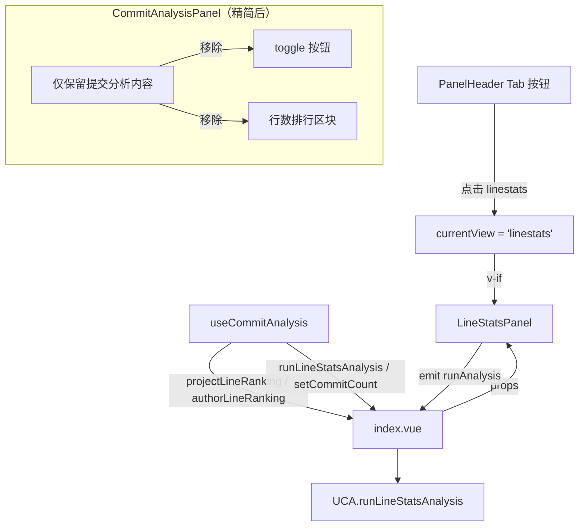

## 用户需求

1. **将行数统计独立为新 Tab 页面**：目前行数统计内嵌在 CommitAnalysisPanel 中（工具栏 toggle 开关 + 底部双栏排行区块），将其独立为一个新的顶部 Tab 页面（与 list/stats/log/analysis/report 同级）。新 Tab 有自己的「开始行数分析」按钮和条数选择器（30/50/100/200），始终抓取 numstat 数据，不再需要 toggle 开关控制。

2. **修复行数显示 bug**：行数统计的数字显示异常，三列数字（+新增 / -删除 / 净增）粘连在一起，表现为 `+19323232-213123432213`。需要确保三列数字之间有明确视觉间距，并用 `toLocaleString()` 为每个数字添加千位分隔符（如 `19,323,232`）。

## 核心功能

- 头部视图切换按钮组新增「行数统计」Tab（`mdi:code-tags` 图标，tooltip "行数统计/Line Stats"）
- LineStatsPanel 独立页面：工具栏含条数选择器（30/50/100/200）+「开始行数分析」按钮 + 分析状态文字
- 双栏排行：左侧「项目代码行数排行」、右侧「作者代码行数排行」
- 每行显示：项目名/作者名 + 条形（按新增行相对最大宽度，净增正绿负红着色）+ 三列格式化数字（+新增绿 / -删除红 / 净增正绿负红零灰）
- 行数排行数据随提交分析缓存持久化，切换视图直接复用
- 从 CommitAnalysisPanel 中移除行数 toggle 按钮和底部双栏排行区块

## 技术栈

- 语言：TypeScript + Vue 3（Composition API）
- 样式：SCSS（Codex 设计 Token，与 CommitAnalysisPanel 共用 bar-list/bar-row/bar-fill 等公共样式）
- 数据源：复用 `useCommitAnalysis` 中的 `projectLineRanking`/`authorLineRanking` ref
- 持久化：行数排行数据随 `commitAnalysisCache` 持久化（已有，无需新增槽位）

## 实现方案

### 核心策略

将行数统计从 CommitAnalysisPanel 的"可选子区域"提升为独立的顶层 Tab。useCommitAnalysis 新增 `runLineStatsAnalysis()` 方法（始终抓取 numstat，无需 toggle），原 `runAnalysis()` 保持不变（仅抓取 commit log，不再包含 numstat 逻辑）。LineStatsPanel 通过 props 接收排行数据和自己独立的分析控制。

### 架构设计



### 关键设计决策

1. **useCommitAnalysis 新增 `runLineStatsAnalysis()` 方法**：与 `runAnalysis()` 同构但始终启用 numstat（移除 `enableLineCount` 条件判断）。`runAnalysis()` 恢复为仅抓取 commit log（移除 numstat 分支）。两个方法共享 `entries`、`failedCount`、`analyzedAt`、`analyzed` 等基础状态，各自写入各自的排行 ref。

2. **LineStatsPanel 数据流**：接收 `projectLineRanking`/`authorLineRanking`/`analyzing`/`analyzed`/`analyzedAt`/`commitCount` 六个 props，发出 `runAnalysis`/`updateCount` 两个事件。比 CommitAnalysisPanel 更简洁（无需 `stats` 聚合对象、`viewSettings` 热力图设置、`enableLineCount` 开关）。

3. **数字粘连 bug 修复**：CSS 层面——`.gpa-line-nums` 保留 `display: flex; gap: $spacing-2`，同时给每个 `.gpa-line-num` 增加 `margin-left: 6px` 作为 fallback（当 flex gap 不生效时仍能有间距）；`min-width` 从 44px 放宽至自适应（移除固定 min-width，依赖 `flex-shrink: 0` + `white-space: nowrap` + 数字自然宽度）。模板层面——用 `row.added.toLocaleString()` 格式化数字。

4. **PanelView 类型扩展**：新增 `"linestats"` 字面量，`PanelHeader.vue` 的 `defineModel<PanelView>` 自动接受新值，无需额外类型适配。

5. **Bar 样式复用**：LineStatsPanel 使用与 CommitAnalysisPanel 相同的 `.gpa-bar-list`/`.gpa-bar-row`/`.gpa-bar-label`/`.gpa-bar-track`/`.gpa-bar-fill` 类名体系（定义在 LineStatsPanel.scss 中重新声明，或通过 SCSS mixin 共享）。`gpa-net--pos`/`gpa-net--neg`/`gpa-net--zero` 语义色类从 CommitAnalysisPanel.scss 迁移到 LineStatsPanel.scss。

### 实现注意事项

- **向后兼容**：`runAnalysis()` 移除 numstat 分支后，`CommitAnalysisStats.projectLineRanking`/`authorLineRanking` 字段仍需保留（类型不变），但因不再写入，始终为空数组。CommitAnalysisPanel 移除 `enableLineCount` prop/emit 后无需引用行数数据。
- **缓存一致性**：`loadCachedAnalysis()` 仍恢复 `projectLineRanking`/`authorLineRanking`（旧缓存可能含行数数据），但提交分析视图不再展示它们。行数统计视图可以复用缓存数据（无需重新分析）。
- **watch 分支**：`index.vue` 的 `watch(currentView)` 新增 `"linestats"` 分支，切换到行数统计视图时自动调用 `loadCachedAnalysis()`（复用已有缓存），首次无缓存时需用户手动点击「开始行数分析」。
- **i18n 新增**：仅需 1 个新键 `lineStatsView`（"行数统计"/"Line Stats"），用于 PanelHeader Tab 按钮 tooltip。LineStatsPanel 内部复用已有的 6 个行数排行键（`analysisLineProjectRanking` 等）。
- **CommitAnalysisPanel.scss 清理**：移除 `.gpa-line-toggle`、`.gpa-line-nums`、`.gpa-line-num*`、`.gpa-net--*` 样式块（迁移到 LineStatsPanel.scss）。

## 目录结构

所有修改均在 `src/features/gitPush/` 下：

```
src/features/gitPush/
├── types/
│   └── meta.ts                          # [MODIFY] PanelView 新增 "linestats"
├── composables/
│   └── useCommitAnalysis.ts             # [MODIFY] 新增 runLineStatsAnalysis()；runAnalysis() 移除 numstat 分支；导出 lineRanking refs + commitCount + setCommitCount
├── components/
│   ├── common/
│   │   └── PanelHeader.vue              # [MODIFY] 新增第 6 个 Tab 按钮（mdi:code-tags）
│   └── analysis/
│       ├── CommitAnalysisPanel.vue      # [MODIFY] 移除 toggle 按钮 + 行数排行区块；移除 enableLineCount prop/emit
│       └── LineStatsPanel.vue           # [NEW] 行数统计独立 Tab 组件（工具栏 + 双栏排行）
├── styles/
│   ├── CommitAnalysisPanel.scss         # [MODIFY] 移除 gpa-line-toggle / gpa-line-nums / gpa-net-* 样式
│   └── LineStatsPanel.scss              # [NEW] 行数统计独立样式（复用 bar-list/bar-row 模式）
├── index.vue                            # [MODIFY] 新增 v-if + props + watch 分支
├── i18n/
│   ├── zh_CN/gitPush.json              # [MODIFY] 新增 lineStatsView
│   └── en_US/gitPush.json              # [MODIFY] 新增 lineStatsView
└── README.md                            # [MODIFY] 更新视图列表 + 组件目录
```