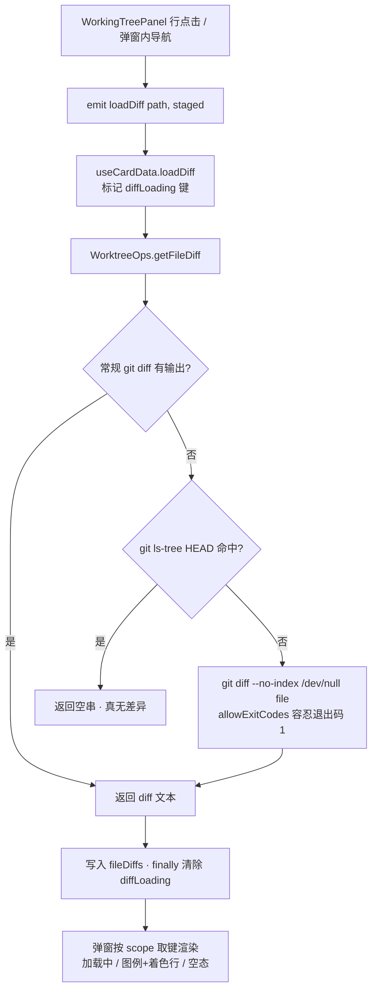

## 用户需求

在工作区变更面板（CHANGES Tab）点击某个文件查看差异时，**未跟踪的新增文件（状态标记 `?`）弹窗内没有任何内容信息**，这不可接受，必须显示该文件的完整内容（按新增行着色呈现）。

## Product Overview

gitPush 功能的「工作区差异查看弹窗」补齐新增文件的内容展示能力，并顺带修正该弹窗在加载、状态表达、操作便利性与键盘行为上的若干不足；弹窗的整体布局、视觉风格、父组件只管开关与数据下发的分层保持不变。

## Core Features

- **新增文件差异可见**：未跟踪（`?`）或已暂存新增的文件，点击后展示完整文件内容（等价于与空文件比较的全新增差异，逐行带 `+` 标记与新文件行号）；确认无差异的普通文件仍显示空态，不会被误报成「整文件新增」。
- **加载态区分**：取差异期间显示「加载中…」的旋转图标，不再复用「暂无差异内容」空态，避免误导；加载完成后才渲染图例与着色行。
- **标题信息补全**：长路径支持悬停查看完整路径；标题旁展示文件状态徽章（新增 / 已修改 / 已删除 / 重命名 / 未跟踪 / 已复制 / 冲突，语义与列表 tooltip 同源）、暂存状态徽章与增删行数；重命名文件额外显示「← 旧路径」。
- **差异范围切换**：「已暂存且工作区又改动」的文件（如 AM / MM）历史上只能看到暂存那一份差异，现提供「已暂存 / 未暂存」两档切换，可分别查看两份差异；切换瞬时（另一份差异后台预取），不改变文件的暂存状态。
- **一键复制**：头部提供「复制差异全文」与「复制文件路径」按钮，复制成功有 2 秒「已复制」图标/提示反馈；无差异内容时复制按钮禁用。
- **键盘与可访问性**：Esc 关闭、←/→ 切换文件改为捕获阶段拦截并阻止事件继续派发，避免按键穿透触发下层监听；弹窗补充对话框语义与分段切换的按下态语义。
- **状态归属修正**：同一文件同时有暂存与工作区改动时（如 AM），列表中不再被笼统标成「已修改」，而是按其真实新增/修改语义显示，与新徽章文案保持一致。

## Tech Stack

沿用项目现状，不引入任何新依赖：

- Vue 3 (`<script setup lang="ts">`) + TypeScript + SCSS（设计 Token 短名制）
- 图标：`@iconify/vue` 的 `Icon` 直传 `mdi:*`（本弹窗既有写法，不受 `IconKey` 白名单约束）
- 数据层：`GitPushManager` 门面 → `WorktreeOps` → `GitExecutor`（唯一接触 `child_process` 的类）
- 剪贴板：`@/utils/domUtils` 的 `copyToClipboard`（统一入口，禁止 `navigator.clipboard`）
- i18n：`src/i18n/{zh_CN,en_US}/gitPush.json` 分片文件（合并由构建脚本自动执行）

## Implementation Approach

### 根因与核心策略

`git diff [--cached] -- <file>` 对**未跟踪文件**恒为空（该文件不在 index 中）；对「已暂存但 HEAD 中不存在」的新增文件，`--cached` 正常有内容，但现状用硬编码中文 `（无差异）` 兜底，掩盖了真正的空内容语义。

策略：把「无差异」与「新增文件不可见」两种情形在数据层分开——先取常规 diff，**仅当结果为空**且该文件确实不在 `HEAD` 中时，回退到 `git diff --no-index --text -- /dev/null <file>` 展示完整内容；同时把中文兜底文案从数据层移除（模块层零文案），由视图层用 i18n 呈现空态/加载态。

关键决策与取舍：

1. **用 `git diff --no-index` 而非自行读文件拼 diff**：不必自造 diff 格式、自带二进制与换行处理，输出格式与普通 diff 完全一致（已实测同机验证：`diff --git` / `new file mode` / `index `/`--- /dev/null `/ `+++ b/...` 均命中既有 `DIFF_META_PREFIXES`，可被 `parseDiffLines` 正确解析）。
2. **必须容忍退出码 1**：`git diff --no-index` 发现差异时退出码为 1（等同 `--exit-code` 语义），现状会被 `execGit` 判为失败。故在 `execGit` 的 `options` 上扩展 `allowExitCodes?: number[]`，且**仅当 `typeof error.code === "number"` 且命中白名单**时才视为成功——`ENOENT`（字符串码）、`ERR_CHILD_PROCESS_STDIO_MAXBUFFER`（超大输出）仍照常 reject，不会静默吞错。
3. **用 `git ls-tree HEAD -- <file>` 作为「是否已在 HEAD 中」的判据**：只在常规 diff 为空时额外跑一次（命中率低，不增加常态开销）；命令失败/无 HEAD（未提交仓库）一律按「不在 HEAD」处理，从而新仓库首提交前的新增文件同样可见。
4. **不采用 `git add -N`（intent-to-add）**：会写入 index，污染用户仓库状态，属不可接受的副作用。
5. **`allowExitCodes` 收敛在 `GitExecutor` 的现有 `options` 形参内**：向后兼容（唯一既有 `{ env }` 调用点不受影响），不新增并行 API。

### 性能与可靠性

- 常态路径不增加子进程：未跟踪/新增文件的兜底仅在「常规 diff 返回空」时触发，最多多一次 `ls-tree` 与一次 `diff --no-index`。
- 差异缓存沿用既有 `fileDiffs`（键 `"s::" | "u::" + path`，`pruneRecordCache(·, 30)` 上限 30 条）；范围切换命中缓存即瞬时返回，未命中时由预取提前填充。
- 加载标记与缓存同键同构（`Record<string, boolean>`），在 `finally` 中删除，只在飞请求期间存在，不会泄漏。
- 复制反馈定时器为组件内原生定时器 + 卸载清理（遵循共享组件/弹窗既有约定，不用 feature 侧 `TimerRegistry`）。
- 超大文件（>10MB 输出）仍会因 `maxBuffer` 触发 reject → 数据层返回空串 → 视图层显示空态，属可接受的已知边界。

## Architecture Design

不新增任何架构模式，完全沿用既有分层：卡片自持数据（`useCardData`）→ 面板编排（`WorkingTreePanel`）→ 弹窗自含渲染（`WorkingTreeDiffDialog`）→ 弹窗内按键/工具条；取数仍经 `GitPushManager` 门面。



新增/复用的横切能力：`utils.ts` 新增 `diffCacheKey(path, staged)`，作为 `fileDiffs`、`diffLoading`、面板预取三处共用的键生成器（消除第 3 处字符串拼写重复，符合「同一常量被 2 个以上文件使用必须提取」规则）。

## Directory Structure

本次改动均在 `src/features/gitPush/` 及 i18n 分片内，无新增文件：

```
src/
├── features/gitPush/
│   ├── managers/
│   │   ├── GitExecutor.ts                    # [MODIFY] execGit 的 options 新增 allowExitCodes?: number[]；错误分支中「数字型退出码命中白名单」时改走 resolve(stdout)（与成功分支同样做尾部换行裁剪），其余错误保持原 reject 逻辑不变。仅服务 diff --no-index。
│   │   └── WorktreeOps.ts                    # [MODIFY] getFileDiff 重写：去掉 "（无差异）" / "（无法获取差异）" 硬编码中文（空/失败一律返回 ""）；常规 diff 为空且文件不在 HEAD 时回退 --no-index 兜底；新增私有 isFileInHead()。getWorkingTreeStatus 的 porcelain 解析加固：先按 X 位再回退 Y 位判定 status，显式识别 unmerged 组合（DD/AU/UD/UA/DU/AA/UU），并把工作区侧改动落到 FileChange.unstaged。
│   ├── types/
│   │   └── storage.ts                        # [MODIFY] FileChange 新增可选字段 unstaged?: boolean（工作区侧也存在改动；与 staged 同时为 true 表示两份差异），附 JSDoc。既有消费方不受影响。
│   ├── utils.ts                              # [MODIFY] 新增 diffCacheKey(filePath, staged): string，作为差异缓存/加载标记/预取的统一键生成器（"s::" / "u::" 前缀）。
│   ├── composables/
│   │   └── useCardData.ts                    # [MODIFY] 新增 diffLoading = ref<Record<string, boolean>>({})；loadDiff 改用 diffCacheKey，并加 try/finally 维护加载标记（成功才写缓存 + pruneRecordCache）；在返回对象中导出 diffLoading。
│   └── components/ListView/
│       ├── ProjectCard.vue                   # [MODIFY] 向 WorkingTreePanel 透传 :diff-loading="diffLoading"（从 useCardData 解构）。
│       ├── WorkingTreePanel.vue              # [MODIFY] 新增 prop diffLoading: Record<string, boolean> 并透传给弹窗；toggleDiff 中当 file.staged && file.unstaged 时后台补发另一 scope 的 loadDiff（预取，切范围瞬时）。
│       └── WorkingTreeDiffDialog.vue         # [MODIFY] 主体改造：新增 diffLoading prop；本地 scope 状态与 scope 感知的 diffKey/diffText；加载中渲染 spinner 分支（隐藏图例）；标题补 :title、状态徽章、oldPath、复制按钮；新增分段范围切换与 requestDiff emit；键盘改捕获阶段 + stopImmediatePropagation；根节点补对话框语义。
├── features/gitPush/styles/
│   └── WorkingTreeDiffDialog.scss            # [MODIFY] 新增 .wt-diff-loading（居中 spinner + 文案，对齐 CommitFileDiffDialog.scss 的 cdf-loading 观感）、.wt-diff-scope-row / .wt-scope-btn（含 active 与 aria-pressed 视觉）、.wt-diff-old、复制按钮的已复制反馈态；沿用既有 Token 与 --gp-diff-* 变量，不写死颜色。
├── features/gitPush/README.md                # [MODIFY] 同步本次行为变化（新增文件差异兜底、加载态、范围切换、复制、键盘捕获），并在组件说明处补一句 working-tree 差异弹窗能力。
└── i18n/
    ├── zh_CN/gitPush.json                    # [MODIFY] 新增 copyDiff / copyPath / copied / diffScope；微调 diffEmpty 文案（加载中已由独立加载态承担）。
    └── en_US/gitPush.json                    # [MODIFY] 与中文同步的 4 个新键 + diffEmpty 文案，保持键对齐。
```

## Key Code Structures

1) `GitExecutor.execGit` 选项扩展（仅签名，实现为在 error 分支前置的退出码白名单判定）：

```ts
async execGit(
  cwd: string,
  args: string[],
  signal?: AbortSignal,
  timeoutMs?: number,
  onOutput?: (chunk: string) => void,
  options?: {
    env?: Record<string, string>
    /** 视为成功的退出码白名单（如 git diff --no-index 有差异时退出码 1）；仅匹配数字型 code，spawn/缓冲区错误不受影响 */
    allowExitCodes?: number[]
  },
): Promise<string>
```

2) `WorktreeOps.getFileDiff` 的判定骨架（不含实现体细节）：

```ts
/** 获取文件差异；常规 diff 为空且文件不在 HEAD 时用 --no-index 兜底展示完整新增内容；失败返回空串（不产出文案） */
async getFileDiff(projectPath: string, file: string, staged = false): Promise<string>
/** 文件是否已存在于 HEAD（无 HEAD / 命令失败按 false，使新仓库同样可见新增内容） */
private async isFileInHead(projectPath: string, file: string): Promise<boolean>
```

3) `FileChange` 新增字段与统一缓存键：

```ts
export interface FileChange {
  path: string
  status: FileChangeStatus
  staged: boolean
  oldPath?: string
  /** 工作区侧也存在改动（porcelain Y 位非空格）；与 staged 同为 true 表示暂存区与工作区各有一份差异 */
  unstaged?: boolean
}

/** 差异缓存键（fileDiffs / diffLoading / 预取共用同一键空间） */
export function diffCacheKey(filePath: string, staged: boolean): string
```

## Implementation Notes

- **模块层零文案**：`WorktreeOps` 只返回 diff 文本或空串，不得再产出面向用户的文案；`（无差异）`/`（无法获取差异）` 一并移除，空态与加载态统一由弹窗经 i18n 呈现。
- **不破坏既有分层与调用链**：弹窗仍旧「只管开关与数据下发」之外的自含渲染；diff 取数仍唯一走 `useCardData`（新增范围切换不得绕开卡片缓存直接调 manager）。
- **样式必须外置**：新增样式全部落在 `styles/WorkingTreeDiffDialog.scss`（该 scss 由弹窗与共享 `DiffLines` 共同 `@use`，非 scoped），`.vue` 的 `<style>` 仅保留 `@use`；覆盖定宽行号列等既有规则时注意特异性，不改动既有 `.wt-dl-*` 行为。
- **范围切换语义**：仅当 `file.staged && file.unstaged` 时显示切换；切换只改变查看对象，不触发 stage/unstage；弹窗内暂存切换后由 `file.staged` 变化驱动 scope 重置，避免停留在已空的 scope 上。
- **i18n 只改分片文件**：不手改合并后的 `zh_CN.json` / `en_US.json`（构建时由 `pnpm i18n:merge` 生成），新增键语义前缀与既有键（`legendAdd`、`diffEmpty`、`loading`、`staged`/`unstaged`）保持同一命名风格，中英同步。
- **图标**：复制/已复制用 `mdi:content-copy` / `mdi:check`，与既有 `kit/icons.ts` 中 `copy`、`contentCopy` 指向的图标一致，不引入未注册资源；离线预加载集覆盖范围内。
- **键盘**：改捕获阶段后需同步卸载（`removeEventListener(..., true)`），并在 `handleKeydown` 内对命中键先 `stopImmediatePropagation()`，与 `CommitFileDiffDialog.vue` 完全对齐。
- **验证口径**：AI 只执行 `read_lints` / `pnpm typecheck` / `pnpm i18n:verify`；`pnpm lint` 与 `pnpm build` 由用户执行；不新建任何临时校验脚本；`read_lints` 偶发陈旧诊断需回读代码核对。

## Agent Extensions

### Skill

- **universal-arch-skill**
- Purpose: 在收尾阶段对本模块改动做架构规范复核，覆盖本次触及的强约束：模块层零文案与统一入口（剪贴板走 `copyToClipboard`）、样式外置（`.vue` 仅 `@use`）、i18n 分片同步、feature 内分层（types / utils / composables / components）与缓存键提取是否到位。
- Expected outcome: 输出针对 `src/features/gitPush/` 本次改动范围的规范比对结论与需修正项清单；确认无新增违规（无新增临时脚本、无越层直接调用 siyuan/child_process、无硬编码文案与颜色）后收尾，剩余项并入验证任务一并处理。