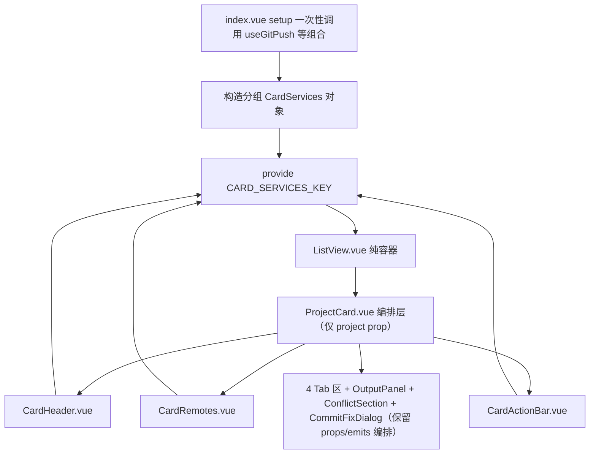

## 用户需求

对 gitPush 功能模块做文件分类重构，本次先重构列表视图：把列表视图相关代码从 1047 行的 index.vue 中剥离，统一收进语义明确的独立文件夹 components/ListView/（由现有 components/list/ 重命名），使列表视图的全部关联组件集中一处、一眼可定位。

## 已确认的重构力度

- 抽取列表视图容器 ListView.vue，替换 index.vue 中的列表视图模板块。
- 拆分 1024 行的 ProjectCard.vue 为编排层 + 三个区块组件（顶栏、远程状态、操作栏）。
- 把 40+ props / 40+ emits 下沉到 provide/inject（扩展 CardServices），卡片收敛为仅 project prop + 0 emits。
- 保持功能与视觉零变化，统计/日志/分析/报告等其他视图不动。

## 核心目标

1. index.vue 从 1047 行瘦身，列表视图块替换为一行 ListView。
2. ProjectCard.vue 从 1024 行拆分为编排层 + CardHeader + CardRemotes + CardActionBar。
3. 列表视图全部组件集中在 components/ListView/ 目录，内部平铺。
4. 卡片数据流从 props 透传改为分组注入 + computed 派生。

## 技术栈

- Vue 3 script setup + TypeScript + Composition API
- provide/inject 依赖注入（InjectionKey + Symbol）
- SCSS 独立文件 + @use 导入
- 遵循项目 AGENTS.md / AGENTS_RULES.md 硬规则

## 实现方案

### 核心策略：props 透传改为分组注入 + computed 派生

当前 index.vue 是唯一状态持有者（useGitPush 只调用一次），ProjectCard 通过 40+ props 接收父层 Record 切片、40+ emits 回传操作。重构后：

1. 扩展 CardServices 接口为 5 个分组：manager、shared、records、derived、ops，避免扁平 40 项接口。
2. 新建 useCardServices composable：封装 inject + 按 project.id 派生单项目 computed，供卡片及区块组件复用。
3. 重命名 components/list 为 components/ListView，并新建 ListView.vue 视图容器。
4. 拆分 ProjectCard：CardHeader（顶栏）、CardRemotes（远程状态+冲突警告）、CardActionBar（拉取/推送操作栏）拆出；4 Tab 区及 OutputPanel/ConflictSection/CommitFixDialog 保留在编排层维持现有 props/emits 模式。

### 关键决策与理由

- useGitPush 绝不在新组件重复调用（会产生独立状态副本），provide 仅在 index.vue setup 构造一次。
- provide 对象在 setup 创建一次，ref 引用稳定，generatingMsgs/tagPushLoading 整体重赋 value 不影响响应式。
- 冗余 props（platformMeta/remotes）直接删除，卡片内部已 import PLATFORM_META/REMOTES。
- 4 Tab 子组件不强行下沉，控制爆炸半径。
- 重命名文件夹仅改 index.vue 2 处 import，list 内部相对引用（./xxx、../analysis、../../types）无需改动。

### 性能说明

下沉后 useCardServices 用 computed 派生单项目值，仅对应 Record 条目变化时触发，跨卡片 re-render 范围收敛到单个卡片；ListView 是纯渲染容器，无新增响应式状态。

## 架构设计



## 目录结构

```
src/features/gitPush/
├── types/
│   └── cardServices.ts                          # [MODIFY] 扩展 CardServices 为 manager/shared/records/derived/ops 五分组
├── composables/
│   └── useCardServices.ts                       # [NEW] inject + 按 project.id 派生单项目 computed
├── components/
│   └── ListView/                                # [RENAME from list/] 列表视图全部组件集中于此
│       ├── ListView.vue                         # [NEW] 列表视图容器：工具栏 + 加载态 + 空态 + 分组循环卡片
│       ├── ProjectCard.vue                      # [MODIFY] 收敛为编排层：仅 project prop + 0 emits
│       ├── CardHeader.vue                       # [NEW] 顶栏：信息区 + 操作按钮区（分类/平台/IDE/刷新/编辑/Git配置/删除）
│       ├── CardRemotes.vue                      # [NEW] 远程状态 + 冲突警告区
│       ├── CardActionBar.vue                    # [NEW] 拉取/推送操作栏（单远程/推送全部/强制推送/Fetch 菜单）
│       ├── ListViewToolbar.vue                  # [保留] 列表工具栏
│       ├── BranchCommitList.vue                 # [保留] 提交历史
│       ├── ConflictSection.vue                  # [保留] 冲突区
│       ├── MarkdownFileBadge.vue                # [保留] Markdown 文件标记
│       ├── OutputPanel.vue                      # [保留] 命令输出面板
│       ├── AiErrorAnalysisDialog.vue            # [保留] AI 错误分析弹窗
│       ├── StashSection.vue                     # [保留] Stash 管理区
│       ├── TagPanel.vue                         # [保留] 标签面板
│       ├── WorkingTreePanel.vue                 # [保留] 工作区变更面板
│       └── WorkingTreeDiffDialog.vue            # [保留] 差异查看弹窗
├── index.vue                                    # [MODIFY] 构造分组 provide + 列表块替换为 ListView，瘦身
├── styles/
│   ├── CardHeader.scss                          # [NEW] 从 index.scss 提取 .gp-card-top/.gp-card-info/.gp-card-actions/.gp-ide-*/.gp-platform-*/.gp-refresh-* 等
│   ├── CardRemotes.scss                         # [NEW] 从 index.scss 提取 .gp-remotes/.gp-conflict-warn/.gp-status-badge 等
│   ├── CardActionBar.scss                       # [NEW] 从 index.scss 提取 .gp-actions-bar/.gp-actions-section/.gp-inline-menu-* 等
│   └── index.scss                               # [MODIFY] 移除已提取到新 SCSS 的卡片区块样式
└── README.md                                    # [MODIFY] 更新目录结构说明
```

## 关键代码结构（文字描述）

### CardServices 扩展接口

在 types/cardServices.ts 中将 CardServices 从现有 4 成员扩展为五分组：

- manager：GitPushManager 门面，保持现状。
- updateProjectMeta / cardRefreshSignals / recordCommitActivity：保持现状，平铺在顶层。
- shared 分组：i18n、categories、detectedIdes、customIdes、commitTemplates、searchQuery（均为 Ref 或普通值，跨卡片共享）。
- records 分组：pushStatuses、workingTrees、committing、stashLoading、pushOutputs、pullOutputs、commitOutputs、generatingMsgs、gitOpLoading、genStashDescLoading、generatedStashMsg、tagPushLoading、fetching、remoteStatusLoading、refreshingWorkingTree、refreshing（父层响应式 Record，卡片经 useCardServices 派生单项目值）。
- derived 分组：getPushStatus、isPulling、isPushing、statusLabel、statusBadgeClass、needsPushFor、hasBehind（原函数 props）。
- ops 分组：toggleStar、moveProject、switchBranch、handleRemove、openEditDialog、openMarkdownPreview、openProjectGitConfig、handleOpenIde、handleOpenCustomIde、showIdeDialog、removeCustomIdeByName、handleRefresh、handleRefreshWorkingTree、handleRefreshRemoteStatus、handleGitOp、stageItem、unstageItem、stageAllItems、unstageAllItems、handleCommit、handleGenerateMsg、clearOutput、handleDiscard、handleStashConfirmMsg、handleGenStashDesc、handleStashPop、handleStashApply、handleStashDrop、handleCreateTag、handlePushTag、handleDeleteTag、handleResolveConflict、handleAbortMerge、confirmPullSingle、pushSingle、pushToAll、handleForcePushToAll、cancelPush、handleFetchAll、openRepoWebUrl、openLocalPath（覆盖原 40+ emits）。

### useCardServices 函数签名

接收 project 访问器函数，返回 services 引用 + 派生 computed：pushStatus、workingTree、committing、stashLoading、pullOutputs、pushOutputs、commitOutput、generatingMsg、gitOpLoading、tagPushLoading、genStashDescLoading、generatedStashMsg、fetching、remoteStatusLoading、refreshingWorkingTree、isRefreshing。

## 实现注意事项

- provide 对象在 index.vue setup 一次性构造，不在渲染函数或 watch 内重建。
- generatedStashMsg 是全局单值，保持直接透传，不按 id 派生。
- CardHeader/CardRemotes/CardActionBar 拆出后，卡片内联菜单 openMenu 等本地状态随所属区块迁移，不留在编排层。
- ListView.vue 不持有领域状态，仅通过 props 接收 loading/projects/filteredGroups 等渲染数据，卡片操作全部走 inject。
- 样式拆分时保持 @use "@/index.scss"、_mixins.scss、Buttons.scss 的依赖关系，设计 Token 与 .vp-btn 按钮体系可用。
- 验证由用户执行：pnpm lint、pnpm i18n:verify、pnpm validate:icons、npx tsc --noEmit；AI 不执行 build 和 lint。