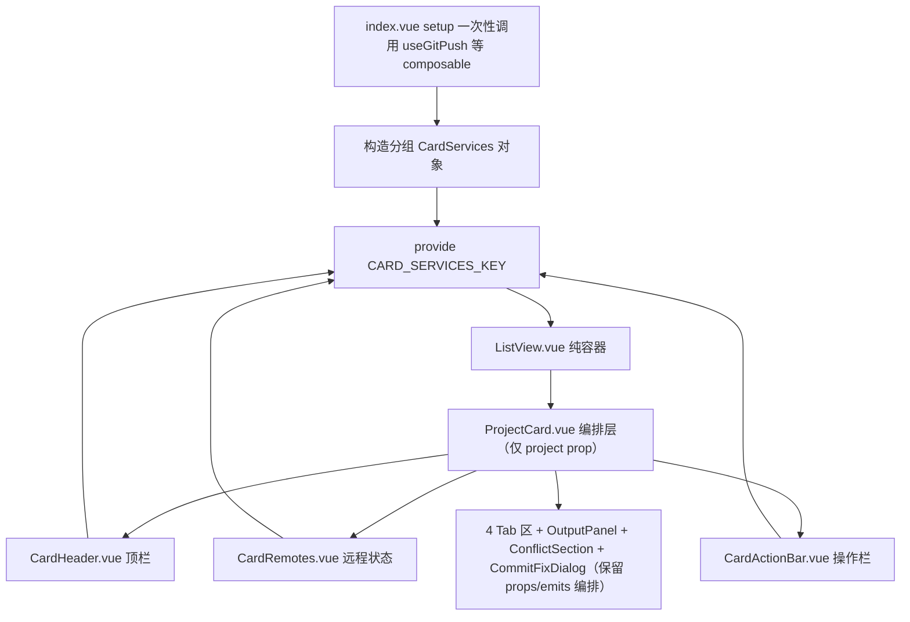

## 用户需求

对 `gitPush` 功能模块做文件分类重构，本次先重构列表视图，解决"看着很乱"的问题。核心诉求是：列表视图相关代码集中到语义明确的独立文件夹，一眼能定位全部功能；同时严格区分「功能专属」与「复用」，复用组件和复用逻辑不应放在功能文件夹下。

## 已确认的重构决策

1. **重构力度**：最彻底——抽取列表视图容器、拆分 `ProjectCard` 巨无霸、把 40+ props/emits 下沉到 `provide/inject`，消除中间人透传。
2. **文件夹组织**：列表视图专属组件统一收进 `components/ListView/`（由现有 `components/list/` 重命名）。
3. **复用区分**（三层边界）：

- 功能专属组件 → `components/ListView/`
- 复用组件（被 ≥2 个视图引用）→ `components/common/`
- 复用逻辑 → `composables/`

## 核心目标

1. `index.vue` 从 1047 行瘦身，列表视图块替换为一行 `<ListView>`。
2. `ProjectCard.vue` 从 1024 行拆分为编排层 + `CardHeader` + `CardRemotes` + `CardActionBar`。
3. 卡片从 40+ props + 40+ emits 收敛为仅 `project` prop + 0 emits。
4. 复用组件 `CommitFixDialog` 归位到 `common/`。
5. 功能与视觉零变化，统计/日志/分析/报告等其他视图不动。

## 技术栈

- Vue 3 `<script setup lang="ts">` + Composition API
- `provide/inject` 依赖注入（`InjectionKey` + `Symbol`）
- SCSS 独立文件 + `@use` 导入
- 遵循项目 AGENTS.md / AGENTS_RULES.md 硬规则（单文件行数上限、模块内分层、文件头注释、设计 Token）

## 实现方案

### 核心策略：props 透传改为分组注入 + computed 派生

当前 `index.vue` 是唯一状态持有者（`useGitPush` 只调用一次），`ProjectCard` 通过 40+ props 接收父层 `Record<projectId, T>` 切片、40+ emits 回传操作。重构后数据流如下：



### 关键决策与理由

- **`useGitPush` 绝不在新组件重复调用**：重复调用会产生独立状态副本导致不同步。`provide` 仅在 `index.vue` setup 构造一次，`ListView` 只渲染、不持有领域状态。
- **provide 对象在 setup 创建一次**：对象内引用的 `ref` 变量引用稳定，`generatingMsgs`/`tagPushLoading` 等整体重赋 `.value` 的 ref 不影响响应式。
- **冗余 props 直接删除**：`platformMeta`（PLATFORM_META）和 `remotes`（REMOTES）卡片内部已 import，下沉时删除。
- **4 Tab 子组件不强行下沉**：WorkingTreePanel/BranchCommitList/StashSection/TagPanel 维持现有 props/emits 模式，由 ProjectCard 编排层派生后传入，控制爆炸半径。
- **复用组件归位**：`CommitFixDialog.vue` 从 `analysis/` 移到 `common/`，与 `EmptyState`、`LoadMoreButton` 等复用组件先例一致。

### 性能说明

下沉后 `useCardServices` 用 `computed(() => records.xxx[id])` 派生单项目值，仅对应 `Record` 条目变化时触发，跨卡片 re-render 范围收敛到单个卡片。`ListView` 是纯渲染容器，无新增响应式状态。

## 目录结构

```
src/features/gitPush/
├── types/
│   └── cardServices.ts                          # [MODIFY] 扩展 CardServices 为 manager/shared/records/derived/ops 五分组
├── composables/
│   └── useCardServices.ts                       # [NEW] inject + 按 project.id 派生单项目 computed
├── components/
│   ├── common/
│   │   └── CommitFixDialog.vue                  # [MOVE from analysis/] 复用组件（被 list 和 analysis 两视图引用）
│   ├── analysis/
│   │   └── CommitRuleCheckPanel.vue             # [MODIFY] import 路径改为 ../common/CommitFixDialog.vue
│   └── ListView/                                # [RENAME from list/] 列表视图专属组件集中地
│       ├── ListView.vue                         # [NEW] 列表视图容器：工具栏 + 加载态 + 空态 + 分组循环卡片
│       ├── ProjectCard.vue                      # [MODIFY] 收敛为编排层：仅 project prop + 0 emits
│       ├── CardHeader.vue                       # [NEW] 顶栏：信息区 + 操作按钮区
│       ├── CardRemotes.vue                      # [NEW] 远程状态 + 冲突警告区
│       ├── CardActionBar.vue                    # [NEW] 拉取/推送操作栏
│       ├── ListViewToolbar.vue                  # [保留] 列表工具栏
│       ├── BranchCommitList.vue                 # [保留] 提交历史
│       ├── ConflictSection.vue                  # [保留] 冲突区
│       ├── MarkdownFileBadge.vue                # [保留] Markdown 文件标记
│       ├── OutputPanel.vue                      # [保留] 命令输出面板
│       ├── AiErrorAnalysisDialog.vue            # [保留] AI 错误分析弹窗
│       ├── StashSection.vue                     # [保留] Stash 管理区
│       ├── TagPanel.vue                         # [保留] 标签面板
│       ├── WorkingTreePanel.vue                 # [保留] 工作区变更面板
│       └── WorkingTreeDiffDialog.vue            # [保留] 差异查看弹窗
├── index.vue                                    # [MODIFY] 构造分组 provide + 列表块替换为 <ListView>
├── styles/
│   ├── CardHeader.scss                          # [NEW] 提取 .gp-card-top/.gp-card-info/.gp-card-actions/.gp-ide-*/.gp-platform-*/.gp-refresh-* 等
│   ├── CardRemotes.scss                         # [NEW] 提取 .gp-remotes/.gp-conflict-warn/.gp-status-badge 等
│   ├── CardActionBar.scss                       # [NEW] 提取 .gp-actions-bar/.gp-actions-section/.gp-inline-menu-* 等
│   └── index.scss                               # [MODIFY] 移除已提取到新 SCSS 的卡片区块样式
└── README.md                                    # [MODIFY] 更新目录结构说明
```

## 关键代码结构

### CardServices 五分组接口（核心契约）

在 `types/cardServices.ts` 中将 CardServices 从现有 4 成员扩展为：

- **顶层（保持现状）**：manager / updateProjectMeta / cardRefreshSignals / recordCommitActivity。
- **shared 分组**：i18n、categories、detectedIdes、customIdes、commitTemplates、searchQuery（跨卡片共享）。
- **records 分组**：pushStatuses、workingTrees、committing、stashLoading、pushOutputs、pullOutputs、commitOutputs、generatingMsgs、gitOpLoading、genStashDescLoading、generatedStashMsg、tagPushLoading、fetching、remoteStatusLoading、refreshingWorkingTree、refreshing（父层响应式 Record）。
- **derived 分组**：getPushStatus、isPulling、isPushing、statusLabel、statusBadgeClass、needsPushFor、hasBehind（原函数 props）。
- **ops 分组**：toggleStar、moveProject、switchBranch、handleRemove、openEditDialog、openMarkdownPreview、openProjectGitConfig、handleOpenIde、handleOpenCustomIde、showIdeDialog、removeCustomIdeByName、handleRefresh、handleRefreshWorkingTree、handleRefreshRemoteStatus、handleGitOp、stageItem、unstageItem、stageAllItems、unstageAllItems、handleCommit、handleGenerateMsg、clearOutput、handleDiscard、handleStashConfirmMsg、handleGenStashDesc、handleStashPop、handleStashApply、handleStashDrop、handleCreateTag、handlePushTag、handleDeleteTag、handleResolveConflict、handleAbortMerge、confirmPullSingle、pushSingle、pushToAll、handleForcePushToAll、cancelPush、handleFetchAll、openRepoWebUrl、openLocalPath。

### useCardServices 函数签名

接收 `project: () => GitProject` 访问器，返回 `services` 引用 + 派生 computed：pushStatus、workingTree、committing、stashLoading、pullOutputs、pushOutputs、commitOutput、generatingMsg、gitOpLoading、tagPushLoading、genStashDescLoading、generatedStashMsg、fetching、remoteStatusLoading、refreshingWorkingTree、isRefreshing。

## 实现注意事项

- `provide` 对象在 `index.vue` setup 一次性构造，不在渲染函数或 watch 内重建。
- `generatedStashMsg` 是全局单值，保持直接透传，不按 id 派生。
- CardHeader/CardRemotes/CardActionBar 拆出后，卡片内联菜单 `openMenu` 等本地状态随所属区块迁移，不留在编排层。
- `ListView.vue` 不持有领域状态，仅通过 props 接收 loading/projects/filteredGroups 等渲染数据，卡片操作全部走 inject。
- 样式拆分时保持 `@use "@/index.scss"`、`_mixins.scss`、`Buttons.scss` 的依赖关系，确保设计 Token 与 `.vp-btn` 按钮体系可用。
- 重命名文件夹仅影响 `index.vue` 2 处 import；`CommitFixDialog` 移动影响 2 处 import（`CommitRuleCheckPanel.vue`、`ProjectCard.vue`）。
- 验证由用户执行：`pnpm lint`、`pnpm i18n:verify`、`pnpm validate:icons`、`npx tsc --noEmit`；AI 不执行 build 和 lint。