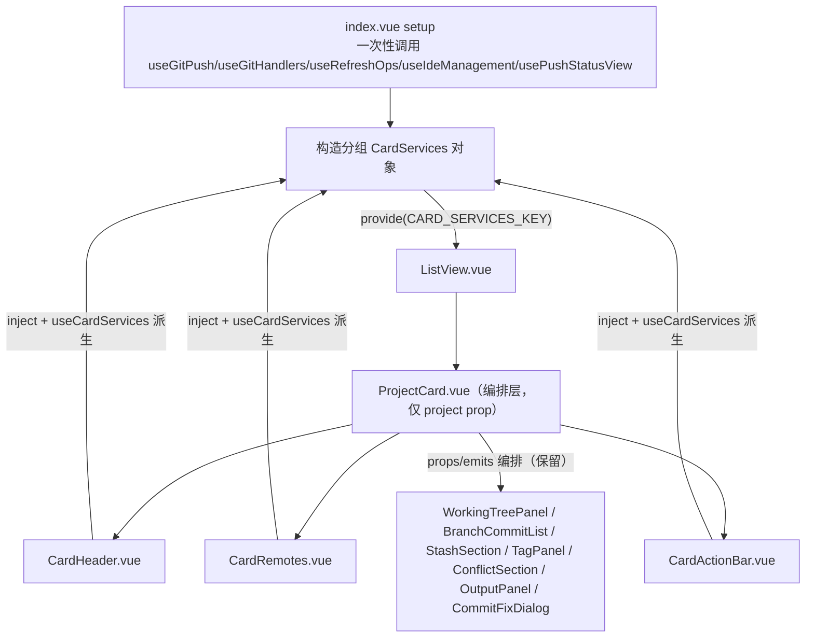

## 用户需求

对 `gitPush` 功能模块做文件分类重构，本次**先重构列表视图**：把列表视图相关代码从 1047 行的 `index.vue` 中剥离，组织到 `components/list/` 目录下并按组件职责清晰区分，解决"看着很乱"的问题。

## 已确认的重构力度（用户拍板）

- **最彻底方案**：抽取列表视图容器 + 拆分 1024 行的 `ProjectCard.vue` + 把 40+ 个 props/emits 下沉到 `provide/inject`，消除中间人透传。
- **文件夹组织**：`components/list/` 保持平铺（不新增子文件夹），仅新增 `ListView.vue` 视图容器。

## 核心目标

1. `index.vue` 从 1047 行瘦身，列表视图块（130~242 行）替换为一行 `<ListView>`。
2. `ProjectCard.vue` 从 1024 行拆分为编排层 + 3 个区块组件（顶栏 / 远程状态 / 操作栏）。
3. 卡片从 40+ props + 40+ emits 收敛为仅 `project` prop + 0 emits，数据经 `CARD_SERVICES_KEY` 注入下沉。
4. 保持功能与视觉零变化，其他视图（统计/日志/分析/报告）不动。

## 边界

- 仅重构 `gitPush` feature 内部，不涉及跨 feature 导入。
- 统计/日志/分析/规则检查/行数统计/报告等视图本次不动。

## 技术栈

- Vue 3 `<script setup lang="ts">` + Composition API
- `provide/inject` 依赖注入（`InjectionKey` + `Symbol`）
- SCSS 独立文件 + `@use` 导入（不写内联样式）
- 遵循项目 AGENTS.md / AGENTS_RULES.md 硬规则（单文件行数上限、模块内分层、文件头注释、设计 Token）

## 实现方案

### 核心策略：把卡片数据流从「props 透传」改为「分组注入 + computed 派生」

当前 `index.vue` 是唯一状态持有者（`useGitPush(props.manager)` 只调用一次），`ProjectCard` 通过 40+ props 接收父层 `Record<projectId, T>` 的切片和 40+ emits 回传操作。重构后：

1. **扩展 `CardServices` 接口**：从当前 4 个成员扩展为 5 个分组（`manager` + `shared` / `records` / `derived` / `ops`），避免扁平 40 项接口。
2. **新建 `useCardServices` composable**：封装 `inject(CARD_SERVICES_KEY)` + 按 `project.id` 派生单项目值的 `computed`，供卡片及其拆分出的区块组件复用，杜绝每个组件重复写 inject/computed。
3. **新建 `ListView.vue`**：列表视图纯容器（工具栏 + 加载态 + 空态 + 分组循环卡片），`index.vue` 只保留 `<ListView v-if="currentView === 'list'">`。
4. **拆分 `ProjectCard.vue`**：顶栏 → `CardHeader.vue`；远程状态+冲突警告 → `CardRemotes.vue`；拉取/推送操作栏 → `CardActionBar.vue`。4 Tab 区（WorkingTreePanel/BranchCommitList/StashSection/TagPanel）+ ConflictSection + OutputPanel + CommitFixDialog 保留在 ProjectCard 编排层，维持其现有 props/emits 模式（它们已是良好子组件，收益有限、改动风险大）。

### 关键决策与理由

- **`useGitPush` 绝不在新组件里重复调用**：它是聚合入口，重复调用会产生独立状态副本导致不同步。因此 `provide` 必须在 `index.vue` setup 中构造一次，`ListView` 只渲染、不持有领域状态。
- **provide 对象在 setup 创建一次**：对象内引用的 `ref` 变量引用本身不变，`generatingMsgs`/`tagPushLoading` 等用 `= {...}` 整体重赋 `.value` 的 ref 不影响响应式。
- **冗余 props 直接删除**：`platformMeta`(PLATFORM_META) 和 `remotes`(REMOTES) 卡片内部已 `import`，属冗余透传，下沉时直接删。
- **4 Tab 子组件不强行下沉**：本次保留其 props/emits 模式，由 ProjectCard 编排层派生后传入，控制爆炸半径。

### 性能说明

- 下沉后卡片不再因父层 40 个 props 全量传递而重复触发子组件更新；`useCardServices` 用 `computed(() => records.xxx[id])` 派生，仅当对应 `Record` 条目变化时触发，跨卡片 re-render 范围收敛到单个卡片。
- `ListView` 是纯渲染容器，无新增响应式状态，无额外开销。

## 架构设计

### 重构后数据流



## 目录结构

```
src/features/gitPush/
├── types/
│   └── cardServices.ts                          # [MODIFY] 扩展 CardServices 接口为 5 分组（manager/shared/records/derived/ops）
├── composables/
│   └── useCardServices.ts                       # [NEW] 卡片服务 composable：inject + 按 project.id 派生单项目 computed + 暴露服务分组
├── components/list/
│   ├── ListView.vue                             # [NEW] 列表视图容器：ListViewToolbar + 加载态 + 空态 + 分组循环 ProjectCard
│   ├── ProjectCard.vue                          # [MODIFY] 收敛为编排层：仅 project prop + 0 emits，编排 4Tab 区与各区块
│   ├── CardHeader.vue                           # [NEW] 卡片顶栏：信息区（星标/名称/路径/md/branch/note）+ 操作按钮区（分类/平台/IDE/刷新/编辑/Git配置/删除）
│   ├── CardRemotes.vue                          # [NEW] 远程状态 + 冲突警告区
│   └── CardActionBar.vue                        # [NEW] 拉取/推送操作栏（含单远程/推送全部/强制推送/Fetch 菜单）
├── index.vue                                    # [MODIFY] 构造分组 provide + 列表块替换为 <ListView>，瘦身
├── styles/
│   ├── CardHeader.scss                          # [NEW] 从 index.scss 提取 .gp-card-top/.gp-card-info/.gp-card-actions 等顶栏样式
│   ├── CardRemotes.scss                         # [NEW] 从 index.scss 提取 .gp-remotes/.gp-conflict-warn 样式
│   ├── CardActionBar.scss                       # [NEW] 从 index.scss 提取 .gp-actions-bar/.gp-actions-section 等样式
│   └── index.scss                               # [MODIFY] 移除已提取到新 SCSS 的卡片区块样式
└── README.md                                    # [MODIFY] 更新目录结构说明
```

## 关键代码结构

### CardServices 扩展接口（核心契约）

```typescript
// types/cardServices.ts
import type { InjectionKey, Ref } from "vue"
import type { GitPushManager } from "../GitPushManager"
import type { GitProject, ProjectCategory, PushStatusInfo, WorkingTreeInfo, PlatformKey } from "./storage"
import type { PushOutputEntry } from "../composables/useGitOps"

export type CardDataDomain = "log" | "branches" | "stash" | "tags" | "conflicts"
export type CardRefreshSignals = Record<string, Partial<Record<CardDataDomain, number>>>

export interface CardServices {
  manager: GitPushManager
  updateProjectMeta: (id: string, patch: Partial<Pick<GitProject, "name">>) => Promise<GitProject | null>
  cardRefreshSignals: Ref<CardRefreshSignals>
  recordCommitActivity: (id: string, isoTime: string) => Promise<void>

  /** 跨卡片共享数据（原 ProjectCard props 的静态/共享类） */
  shared: {
    i18n: Record<string, any>
    categories: Ref<ProjectCategory[]>
    detectedIdes: Ref<{ name: string, icon: string, path?: string }[]>
    customIdes: Ref<{ name: string, path: string }[]>
    commitTemplates: Ref<{ id: string, name: string, pattern: string, builtin?: boolean }[]>
    searchQuery: Ref<string>
  }

  /** 父层响应式 Record（原 props 的切片类，卡片经 useCardServices 派生单项目值） */
  records: {
    pushStatuses: Ref<Record<string, PushStatusInfo>>
    workingTrees: Ref<Record<string, WorkingTreeInfo>>
    committing: Ref<Record<string, boolean>>
    stashLoading: Ref<Record<string, boolean>>
    pushOutputs: Ref<Record<string, PushOutputEntry[]>>
    pullOutputs: Ref<Record<string, PushOutputEntry[]>>
    commitOutputs: Ref<Record<string, string>>
    generatingMsgs: Ref<Record<string, { generating: boolean, text: string }>>
    gitOpLoading: Ref<Record<string, boolean>>
    genStashDescLoading: Ref<Record<string, boolean>>
    generatedStashMsg: Ref<string>
    tagPushLoading: Ref<Record<string, string>>
    fetching: Ref<Record<string, boolean>>
    remoteStatusLoading: Ref<Record<string, boolean>>
    refreshingWorkingTree: Ref<Record<string, boolean>>
    refreshing: Ref<string | null>
  }

  /** 派生函数（原函数 props，来自 usePushStatusView / useGitPush） */
  derived: {
    getPushStatus: (id: string, key: string) => string | undefined
    isPulling: (id: string, key?: string) => boolean
    isPushing: (id: string) => boolean
    statusLabel: (id: string, key: string) => string
    statusBadgeClass: (id: string, key: string) => string
    needsPushFor: (id: string, key: string) => boolean
    hasBehind: (id: string) => boolean
  }

  /** 卡片操作函数（原 40+ emits 对应的 handler 集群） */
  ops: {
    toggleStar: (id: string) => void
    moveProject: (id: string, categoryId: string) => void
    switchBranch: (id: string, branch: string) => Promise<void>
    handleRemove: (project: GitProject) => void
    openEditDialog: (project: GitProject) => void
    openMarkdownPreview: (project: GitProject, fileName: string) => void
    openProjectGitConfig: (id: string) => void
    handleOpenIde: (path: string, ide: { name: string, path?: string }) => void
    handleOpenCustomIde: (path: string, name: string) => void
    showIdeDialog: () => void
    removeCustomIdeByName: (name: string) => void
    handleRefresh: (id: string) => void
    handleRefreshWorkingTree: (id: string) => void
    handleRefreshRemoteStatus: (id: string) => void
    handleGitOp: (label: string, fn: () => Promise<void>, id: string) => Promise<void>
    stageItem: (id: string, file: string) => Promise<void>
    unstageItem: (id: string, file: string) => Promise<void>
    stageAllItems: (id: string) => Promise<void>
    unstageAllItems: (id: string) => Promise<void>
    handleCommit: (id: string, msg: string) => Promise<void>
    handleGenerateMsg: (id: string) => void
    clearOutput: (id: string) => void
    handleDiscard: (id: string, file: string, staged: boolean, status: string) => void
    handleStashConfirmMsg: (id: string, msg: string) => void
    handleGenStashDesc: (id: string) => void
    handleStashPop: (id: string, index: number) => void
    handleStashApply: (id: string, index: number) => void
    handleStashDrop: (id: string, index: number) => void
    handleCreateTag: (id: string, name: string, message?: string) => void
    handlePushTag: (id: string, tag: string) => void
    handleDeleteTag: (id: string, tag: string) => void
    handleResolveConflict: (id: string, file: string, strategy: "theirs" | "ours") => void
    handleAbortMerge: (id: string) => void
    confirmPullSingle: (id: string, key: PlatformKey) => void
    pushSingle: (id: string, key: PlatformKey) => Promise<void>
    pushToAll: (id: string) => Promise<void>
    handleForcePushToAll: (id: string) => void
    cancelPush: (id: string) => Promise<void>
    handleFetchAll: (id: string) => void
    openRepoWebUrl: (url: string) => void
    openLocalPath: (path: string) => void
  }
}

export const CARD_SERVICES_KEY: InjectionKey<CardServices> = Symbol("gitPushCardServices")
```

### useCardServices 函数签名

```typescript
// composables/useCardServices.ts
export function useCardServices(project: () => GitProject): {
  services: CardServices
  pushStatus: ComputedRef<PushStatusInfo | undefined>
  workingTree: ComputedRef<WorkingTreeInfo | undefined>
  committing: ComputedRef<boolean>
  stashLoading: ComputedRef<boolean>
  pullOutputs: ComputedRef<PushOutputEntry[]>
  pushOutputs: ComputedRef<PushOutputEntry[]>
  commitOutput: ComputedRef<string>
  generatingMsg: ComputedRef<{ generating: boolean, text: string }>
  gitOpLoading: ComputedRef<boolean>
  tagPushLoading: ComputedRef<string>
  genStashDescLoading: ComputedRef<boolean>
  generatedStashMsg: ComputedRef<string>
  fetching: ComputedRef<boolean>
  remoteStatusLoading: ComputedRef<boolean>
  refreshingWorkingTree: ComputedRef<boolean>
  isRefreshing: ComputedRef<boolean>
}
```

## 实现注意事项

### 性能与响应式

- `useCardServices` 的所有单项目派生值用 `computed` 实现，避免在组件内重复写 `records.xxx.value[project().id]`。
- `provide` 对象在 `index.vue` setup 中一次性构造，不要在渲染函数或 watch 内重建。
- `generatedStashMsg` 是全局单值（非按 id），保持 `ComputedRef<string>` 直接透传，不按 id 派生。

### 爆炸半径控制

- 仅修改列表视图相关文件；统计/日志/分析/报告视图的 `pushStatuses`/`workingTrees` 复用路径不受影响（`useGitPush` 返回的 ref 引用不变，只是额外被注入卡片服务）。
- `CardHeader/CardRemotes/CardActionBar` 拆出后，`ProjectCard` 内原有的 `openMenu`（卡片内联菜单开关）等本地状态随所属区块迁移，不留在编排层。
- `ListView.vue` 不持有领域状态，仅通过 props 接收 `loading/projects/filteredGroups` 等渲染所需数据，卡片操作全部走 inject。

### 样式拆分

- 样式源位于 `styles/index.scss`（`.gp-card` 从 86 行起，含 `.gp-card-top/.gp-card-info/.gp-card-actions/.gp-remotes/.gp-actions-bar` 等约 1000+ 行）。拆分时按新组件边界提取对应选择器到独立 SCSS，新组件用 `@use "../../styles/CardHeader.scss"` 导入。
- 拆分 SCSS 时注意 `@use "@/index.scss" as *` 和 `_mixins.scss`/`_buttons.scss` 的依赖关系，保持设计 Token 与 `.vp-btn` 按钮体系可用。

### 验证（由用户执行，AI 不执行）

- `pnpm lint`（ESLint 0 error）
- `pnpm i18n:verify`（键对齐，本次未新增 i18n 键，应无变化）
- `pnpm validate:icons`（本次未新增图标，应无变化）
- `npx tsc --noEmit`（TypeScript 类型检查通过）