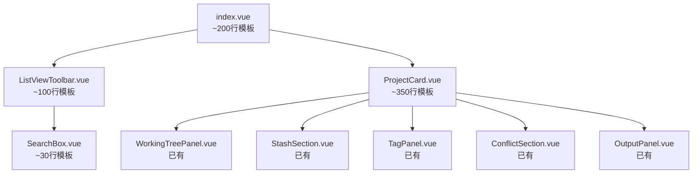

## 产品概述

对 gitPush/index.vue 第 67-778 行的列表视图模板进行组件化拆分，将 711 行内联模板提取为 3 个独立子组件，将 index.vue 模板从 ~800 行缩减至 ~200 行，同步提取对应 SCSS 样式到独立文件。

## 核心功能

- **ListViewToolbar**：整合筛选工具栏（视图模式切换、归档/暂停 toggle）、标签筛选条、分类 TAB 导航、搜索框
- **ProjectCard**：提取完整的项目卡片模板（卡片头部信息、远程仓库状态、冲突警告、已组件化的子面板、拉取/推送操作栏）
- **SearchBox**：独立搜索框组件（含搜索图标、输入框、清除按钮）

## 技术栈

- Vue 3 Composition API + `<script setup>` + TypeScript
- SCSS 分离（每个组件对应独立 .scss 文件）
- 遵循现有 `defineProps` + `defineEmits` 显式声明模式

## 实现方案

### 整体策略

将列表视图模板按功能边界拆分为 3 个独立组件，从外到内逐层封装：

### 拆分策略

#### 1. SearchBox（最低风险，先提取）

- **模板行数**：~26 行（153-178）
- **Props**：`modelValue: string`，`placeholder: string`，`visible: boolean`
- **Emits**：`update:modelValue`，`clear`
- **收益**：独立复用，2 个 props + 2 个 emits

#### 2. ListViewToolbar（中等风险）

- **模板行数**：~84 行（68-151）= 过滤栏 + 标签筛选 + 分类 TAB
- **Props**：`projects`, `groupedProjects`, `allTags`, `viewMode`, `activeCategory`, `showArchived`, `gitOpsPaused`, `searchQuery`（8 个）
- **Emits**：`update:viewMode`, `update:showArchived`, `update:gitOpsPaused`, `update:activeCategory`, `update:searchQuery`, `toggle-tag-filter`（6 个）
- **收益**：将 3 个独立功能块从 index.vue 中剥离

#### 3. ProjectCard（核心拆分，最大收益）

- **模板行数**：~400 行（去除已有子组件后的净模板）
- **Props 分组设计**：

| 分组 | Props | 数量 |
| --- | --- | --- |
| 基础 | `project`, `i18n` | 2 |
| 每项目状态 | `branches`, `pushStatuses`, `workingTrees`, `stashEntries`, `stashLoading`, `conflicts`, `commitOutputs`, `pullOutputs`, `pushOutputs`, `committing`, `generatingMsgs`, `gitOpLoading`, `commitLogLoading`, `tagsCache`, `tagLoading`, `tagPushLoading` | 16 |
| 共享配置 | `detectedIdes`, `customIdes`, `platformMeta`, `remotes`, `statusMeta`, `statusCycle` | 6 |
| 编辑状态 | `editingNameId`, `editingNameInput`, `refreshing`, `fetching`, `openIdeMenu`, `confirmingDelIdx` | 6 |
| 计算辅助 | `statusBadgeClass`, `statusLabel`, `hasBehind`, `fileDiffsForProject`, `commitLogForProject`, `hasAnyRemote`, `getProjectUrl`, `resolvedPath`, `relativeTime`, `activityLevel` | 10 |
| 推送状态 | `isPulling`, `isPushing`, `needsPushFor`, `getPushStatus`, `tagPushLoading` | 5 |
| **合计** |  | **45** |

- **Emits 分组设计**：

| 分组 | Emits | 数量 |
| --- | --- | --- |
| 卡片交互 | `refresh`, `toggle-star`, `cycle-status`, `start-name-edit`, `name-edit-save`, `toggle-tag-filter`, `switch-branch`, `remove`, `open-edit-dialog`, `move-project` | 10 |
| URL/IDE | `open-web`, `copy-url`, `open-path`, `open-ide`, `open-custom-ide`, `toggle-ide-menu` | 6 |
| 工作区 | `stage-file`, `unstage-file`, `stage-all`, `unstage-all`, `commit`, `generate-msg`, `load-diff`, `discard`, `expand` | 9 |
| Stash | `stash-confirm-msg`, `gen-stash-desc`, `stash-pop`, `stash-apply`, `stash-drop` | 5 |
| Tag | `create-tag`, `push-tag`, `delete-tag` | 3 |
| 冲突 | `resolve-conflict`, `abort-merge` | 2 |
| 推送/拉取 | `confirm-pull`, `push-single`, `push-to-all`, `cancel-push`, `fetch-all`, `copy-output` | 6 |
| **合计** |  | **41** |

- **设计权衡**：Props + Emits 合计 86 个，数量较大但遵循了项目中 WorkingTreePanel（~25 个）的既有模式。通过分组注释降低理解成本，不引入抽象层过度设计。

### SCSS 拆分方案

从 `styles/index.scss`（~1550 行）中提取以下样式到独立文件：

| 新文件 | 提取内容 | 预计行数 |
| --- | --- | --- |
| `styles/SearchBox.scss` | `.gp-search-wrap`, `.gp-search-icon`, `.gp-search-input`, `.gp-search-clear` | ~50 |
| `styles/ListViewToolbar.scss` | `.gp-filter-bar`, `.gp-view-modes`, `.gp-vm-btn`, `.gp-filter-toggles`, `.gp-ft-btn`, `.gp-tag-filter`, `.gp-tag-chip`, `.gp-tabs`, `.gp-tab`, `.gp-tab-dot`, `.gp-tab-count` | ~200 |
| `styles/ProjectCard.scss` | `.gp-card`, `.gp-card-top`, `.gp-card-info`, `.gp-card-name`, `.gp-card-name-input`, `.gp-card-name-row`, `.gp-card-note`, `.gp-card-path`, `.gp-card-meta`, `.gp-card-tags`, `.gp-card-tag`, `.gp-card-tag-more`, `.gp-card-actions`, `.gp-star-btn`, `.gp-project-status-btn`, `.gp-archived-tag`, `.gp-branch-row`, `.gp-branch-tag`, `.gp-remotes`, `.gp-remote-item`, `.gp-remote-none`, `.gp-status-badge`, `.gp-conflict-warn`, `.gp-actions-bar`, `.gp-actions-section`, `.gp-actions-label`, `.gp-actions-btns`, `.gp-actions-sep`, `.gp-action-btn`, `.gp-action-btn--ok`, `.gp-action-btn--fail`, `.gp-action-btn--active`, `.gp-ide-wrap`, `.gp-ide-popover`, `.gp-ide-item`, `.gp-ide-item--none`, `.gp-ide-item--custom`, `.gp-ide-item--add`, `.gp-ide-item-del`, `.gp-ide-divider`, `.gp-ide-del-confirm`, `.gp-ide-del-yes`, `.gp-ide-del-no`, `.gp-fetch-btn`, `.gp-multi-path-badge`, `.gp-card-tags`, `.gp-activity`, `.gp-act-hot`, `.gp-act-warm`, `.gp-act-cold`, `.gp-act-dead` | ~700 |

`index.scss` 保留公共基座样式（布局、进度条、加载/空状态、颜色变量等），缩减至 ~700 行。

### 验证策略

分阶段验证，每完成一个组件即运行 `pnpm lint` + `npx tsc --noEmit`，确保不引入回归。

## Agent Extensions

### Skill

- **codex-ui-style-guide**
- 用途：确保新组件和 SCSS 文件严格遵循 Codex UI 风格规范（设计 Token、BEM 命名、组件模式）
- 预期成果：所有新组件样式通过 Codex 规范审查，无硬编码尺寸/颜色