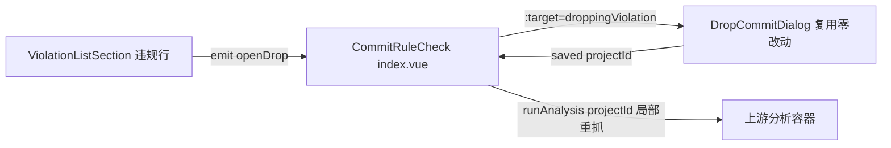

## 产品概述

在 gitPush 提交规则检查视图中复用「删除历史提交」功能。该功能目前仅存在于项目卡片的 LOG Tab（行内删除按钮 → DropCommitDialog 弹窗），本次将其集成到违规列表中，让不合规提交可以在规则检查视图内直接删除。

## 核心功能

- 违规列表每行新增「删除提交」按钮（图标按钮，与现有「修正」按钮并排，位于其后、相对时间之前），常显样式与修正按钮一致（用户偏好：默认显示而非 hover 浮现）
- 点击后打开自包含的 DropCommitDialog 删除弹窗（复用现有组件，零改动）：弹窗内部自行完成 HEAD/merge/祖先/rebase 四态校验、bundle 全量备份（含常驻备份操作条）、commit-tree 删除执行
- 删除成功后关闭弹窗并仅重抓该项目的提交分析数据（局部刷新，与现有修正成功后的刷新模式一致）
- merge 提交/HEAD/rebase 残留等不可删除场景由弹窗内部安全拦截并提示，调用方无需预判

## 技术栈

- 复用现有 Vue 3 + TypeScript 组件体系，不新增依赖

## 实现方案

### 类型兼容性（无需适配层）

- `CommitFixTarget = Pick<CommitAnalysisEntry, "projectId"|"projectName"|"hash"|"message"> & { reason?, isMerge? }`（types/meta.ts L281-286）
- `CommitRuleViolation extends CommitAnalysisEntry`，可直接作为 `target` 传入 DropCommitDialog；`isMerge` 为可选字段，弹窗 init 时会用 git 命令二次校验，类型零改动

### 复用模式（对齐现有范式）

- 弹窗接入完全照抄 `ProjectCard.vue:133-140` 的既有模式（v-if + :i18n + :target + @close + @saved）
- 删除成功回调照抄 `CommitRuleCheck/index.vue` 现有 `handleFixSaved` 模式：关闭弹窗 + `emit("runAnalysis", projectId)` 局部重抓（runAnalysis 已支持单项目 ID 重抓，无性能负担）
- 删除按钮样式直接复用 `styles/CommitRuleCheckPanel.scss` 的 `.grc-item-fix`（常显 opacity 0.6 + hover 增强），无需新增样式规则
- i18n 全部键（dropCommitTitle/dropCommitBlockedMerge 等）已存在，无需新增

### 架构设计

## 执行要点

- ViolationListSection 每行按钮从 1 个变 2 个，纯模板追加 + emits 声明，不影响既有批量勾选/分页逻辑
- 删除操作属危险操作，弹窗内已有完整校验链，违规行不做额外 disabled 预判（保持入口一致，由弹窗统一拦截并给出原因提示）
- 不触碰 DropCommitDialog.vue 本体，避免回归已验证的备份/清理/删除链路