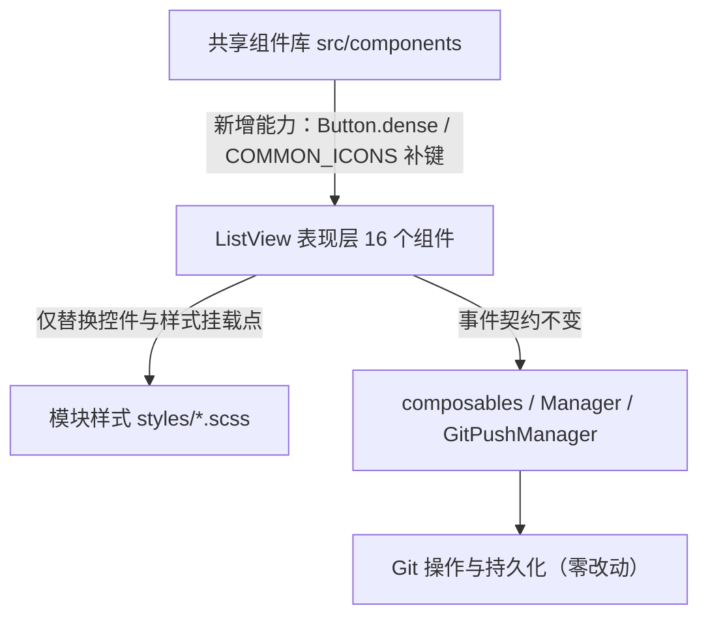

## 产品概述

对思源插件 `gitPush` 功能「项目卡片列表视图」目录下的 16 个界面文件，按项目既有的强制规则做一次**控件层合规审查 + 全量整改**。审查范围严格限定在该目录，不扩散到 `gitPush` 其余目录。

## 核心功能

- **审查报告**：逐条列出违规项，附文件与行号证据、违反的规则出处、建议改法，并把「组件库缺口」类条目单独登记为例外。
- **控件统一**：把目录内自行实现的按钮、下拉选择、搜索输入、多行文本、勾选框、开关、分段切换、标签页、弹窗、折叠区，统一换成项目共享控件库的既有实现。
- **紧凑按钮能力**：为共享按钮新增一个「紧凑」修饰能力，使迁移后的按钮外观与现状（更小的内边距、更矮的高度、更小的圆角）保持一致，**视觉上不放大**。
- **配套清理**：过渡时长、遮罩层级、背景模糊、间距与行高取值统一到项目规范；被硬编码的界面文案改为多语言键；同目录内定时器用法统一。
- **例外登记**：卡片内下拉菜单浮层、空状态、行内二次确认、复合业务卡片容器等共享库暂无对应实现的控件，明确记录为「允许自建」并不改动。

## 视觉与交互效果

- 整改前后**界面像素级观感保持一致**：按钮高度、字号、圆角、间距不变；不引入新的视觉风格。
- 交互一致性提升：开关与分段切换补上按下态语义，标签页与弹窗获得键盘导航与焦点管理，勾选框可被辅助技术识别。
- 不改动任何数据获取、Git 操作、状态流转逻辑，只替换界面控件与其样式。

## 技术栈

**不新增任何依赖**，沿用项目现有栈：

- 构建：Vite + Vue 3（`<script setup>` + TS）
- 样式：SCSS + 设计 Token（`@/variables.scss` 短名制 `$s-*` / `$t-*` / `$r-*` / `$c-*` / `$lh-*` / `$ff-*`）
- 控件来源：`src/components/` 共享组件库（48 个公开组件，本任务消费 `Button` / `Select` / `Input` / `Textarea` / `Checkbox` / `ToggleButton` / `Tabs`+`TabList`+`Tab`+`TabPanels`+`TabPanel` / `Dialog` / `Panel` / `Divider` / `Loader` / `Tag` / `Badge`）
- 验证：`pnpm typecheck`（vue-tsc）、`pnpm i18n:merge|verify`、`pnpm validate:icons`、`read_lints`（`pnpm lint` / `vite build` 由用户执行）

## 实施方案

### 总体策略

分四层推进，每层结束时状态可编译、可目视回归，避免一次性大爆炸式改动：

1. **先落审查基线**：把违规项固化为文档，作为整改清单与验收依据，避免整改过程中遗漏或扩大范围。
2. **先补共享库能力，再迁移消费方**：迁移依赖两个前置能力（紧凑按钮修饰、图标键），必须先落地再改 `ListView`，否则会出现「改到一半发现组件不支持」的返工。
3. **按风险从低到高分批迁移**：原生控件（行为等价、风险最低）→ 弹窗/折叠区（结构变化，行为需保留）→ 自建按钮批量替换（量最大、需靠样式钩子保观感）。
4. **收尾做规范对齐**：样式 Token、过渡时长、遮罩层级、多语言键。

### 关键决策与取舍

| 决策 | 选择 | 理由 |
| --- | --- | --- |
| 紧凑按钮形式 | 共享 `Button` 新增 `dense` 布尔修饰（新类名 `si-button--dense`），不改四档字号阶梯 | 符合「新增能力一律走新类名（`--severity-*` / `--outlined` / `--text`）」既有约定；新增第五档会破坏「四档必须形成肉眼可辨梯度、禁止同号」的硬约束 |
| `Button.icon` 的图标键 | 在 `src/components/kit/icons.ts` 的 `COMMON_ICONS` 补登所需 IconKey（约 25 条，名称保持通用、零业务耦合） | `Button.icon` 只接受 `IconKey`；纯图标按钮**不能**把图标塞进默认插槽（会让 `isIconOnly` 恒假，尺寸/无障碍名派生全部失效） |
| `Buttons.scss` 去留 | **保留**，仅从 `ListView` 模板移除 `vp-btn*` 类 | 模块其余 27 个文件（485 处中的约 305 处）仍在用，删除会造成大面积样式失效 |
| 卡片内下拉菜单浮层、空状态、行内二次确认、复合业务卡片 `.gp-card` | 登记为「允许自建」例外，本轮不改 | 共享库无对应实现；`.gp-card` 是含 11 个子区块的复合业务容器，与 `Card.vue` 的「标题/主体/页脚」三段式结构不匹配 |
| 非 scoped 样式 | 登记为「模块既有范式」，本轮不做 scoped 化 | `AGENTS_STYLE.md` 未明文强制 scoped；且跨组件复用的类（如 `wt-file-status` 定义在 `WorkingTreePanel.scss` 却被 `StashSection.vue` 使用）一旦就地 scoped 化会静默失效 |
| 原生 `:title` 气泡、裸 `<Icon icon="mdi:*">` | 不作为违规 | 前者是全项目通行做法，后者在 87 个 `.vue` 文件中使用，属项目常态（已排除为假阳性） |


### 性能与可靠性

- **CSS 体积**：`dense` 走独立类名而非改写 `--xsmall`，全项目既有 `xsmall` 调用点零回归；`ListView` 迁移后删除其专属的 `.vp-btn` 组合选择器，净增样式量极小。
- **渲染**：标签页迁移必须传 `lazy`，保持「未激活面板不进 DOM」的既有行为，避免四个面板同时挂载带来的额外开销。
- **状态保持**：`Select` / `Input` / `Checkbox` 均为**纯受控**组件（内部只 emit），迁移时必须显式「先写 ref 再比对」，否则出现「选中后文案/勾选态停在旧值」这类静默 bug。
- **稳定性**：所有迁移保持事件契约不变（`defineEmits` 签名、`v-model` 语义、`defineExpose` 暴露的方法），父组件 `ProjectCard.vue` 的编排逻辑零改动。

### 架构设计

只改**表现层**，不动数据层与业务层：



- 组件内数据获取仍经 `useCardServices` / `useCardData` 注入，不新增任何跨功能导入。
- 样式挂载点从 `.vp-btn*` 改挂共享 `Button` 根类 `.si-button`；因 `Button` 自身是 scoped（特异性 0,2,0），在非 scoped 的 feature scss 中覆写需把类名写两遍或嵌套自有根类凑到 (0,3,0)。

## 实施要点

1. **`dense` 与档位协同**：`dense` 只应在 `size="xsmall"` 下生效（几何对齐 `vp-btn--sm`：去 `min-height` 约束、`padding: 2px 5px`、`gap: 3px`、`border-radius: 4px`）；覆写共享按钮尺寸时档位类自带的 `min-height` 必须同时被 `min-height: 0` 抵消，否则高度压不下来。
2. **`ToggleButton` 使用禁忌**：不传 on/off 文案时会退化为方形纯图标按钮（本项目两个开关正是纯图标场景，需显式传 `title`/`ariaLabel`）；不要给它传 `--severity-*`，会污染 `--outlined` 取色。
3. **`v-if` 切换控件必须手动移交焦点**：`TagPanel` / `StashSection` 存在「按钮态 ↔ 输入态」切换，需 `await nextTick()` 后调子组件 `focus()`（`Input` / `Button` 均 `defineExpose({ focus })`），否则键盘输入静默落空。
4. **弹窗迁移**：共享弹层**不用 `Teleport`**（就地 `position: fixed` + 遮罩 `inset: 0`），迁移时移除 `Teleport to="body"` 与自绘遮罩；`Dialog` 的 `dismissableMask` 默认 `false`（与官方一致），需按现有「点遮罩关闭」行为显式开启；键盘 Esc / 焦点归还由 `Dialog` 内建，移除组件内自建的 `window keydown` 监听时注意保留参数化键盘逻辑（`WorkingTreeDiffDialog` 的 ←/→ 文件切换需继续用捕获阶段 `stopImmediatePropagation`，避免按键穿透）。
5. **`Panel` 迁移**：折叠用 `v-show` + 图标 0.12s 旋转（无高度动画），`toggleLabel` 提供切换按钮的可访问名；迁移后需删除 `.gp-ai-errors-toggle` 自建折叠头样式。
6. **多语言**：只改分片 `src/i18n/{zh_CN,en_US}/gitPush.json`，改完**必须**跑 `pnpm i18n:merge` 再 `pnpm i18n:verify`；`BranchCommitList` 的硬编码中文提示可直接复用已有键 `refreshCommitLog`，`CardTabs` 的 `CHANGES/LOG/STASH/TAG` 需新增 4 个带语义前缀的键。
7. **定时器统一入口**：`AiErrorAnalysisDialog` / `WorkingTreeDiffDialog` 的复制反馈 `setTimeout` 改用 `@/utils/timerRegistry`（同目录 `OutputPanel.vue` 已是正例），保持同目录一致。
8. **验证边界**：AI 不执行 `pnpm vite build` / `pnpm lint`；类型检查必须用 `pnpm typecheck`（禁用 `npx tsc --noEmit`，它读不懂 `.vue` 会造出大量假错误并漏掉真实 props 类型错误）；禁止新建 `.tmp-*.mjs` 等一次性脚本。
9. **文档同步面**：`AGENTS.md`（Button 清单表行 + 复用清单 + 4 处组件总数）、`AGENTS_STYLE.md`（「强制规则：按钮交互与无障碍」尺寸章节）、`src/features/componentPreview/previewData/button.ts`（新增 `dense` 示例）、`src/components/kit/README.md`。陈旧数字常埋在表格单元格中间，收尾必须用 `\d+ 个` 全量复扫。
10. **文件头注释**：改动时保留所有 `.vue` / `.ts` 顶部 10~30 字的文件功能说明注释。

## 目录结构

```
siyuanPluginVueSN/
├── docs/
│   └── gitPush-listview-controls-review.md                 # [NEW] 审查报告：违规清单（文件:行号 + 规则出处 + 建议改法）、共享库缺口例外登记表、非 scoped 与裸 Icon 的假阳性排除说明、整改前后对照
├── src/
│   ├── components/
│   │   ├── Button.vue                                      # [MODIFY] 新增 dense?: boolean（withDefaults 默认 false），buttonClasses 追加 si-button--dense；不改既有 variant/size 语义
│   │   ├── styles/Button.scss                              # [MODIFY] 新增 .si-button--dense（仅与 --xsmall 协同：min-height 0、padding 2px 5px、gap 3px、border-radius 4px），放在尺寸档位段之后
│   │   └── kit/icons.ts                                    # [MODIFY] COMMON_ICONS 补登 ListView 迁移所需 IconKey（约 25 条通用命名，如 unfoldMore、cloudRefreshOutline、sourceCommit、archiveOutline、pauseCircle、autoFix、history、tagPlusOutline、applicationBrackets 等），保持零业务耦合
│   ├── features/
│   │   ├── componentPreview/previewData/button.ts           # [MODIFY] 新增 dense 紧凑按钮预览示例（props + code 同源）
│   │   ├── gitPush/components/ListView/
│   │   │   ├── ListViewToolbar.vue                          # [MODIFY] 自建分段切换 gp-vm-btn → Button 组 + aria-pressed；两个 gp-ft-btn 开关 → ToggleButton；自建分类 gp-tab → Tabs 五件套（value 受控，保留分类色点）
│   │   │   ├── CardTabs.vue                                 # [MODIFY] 自建 tab 条 → Tabs/TabList/Tab/TabPanels/TabPanel（必须 lazy，保留计数徽标插槽）；TABS 文案接 i18n
│   │   │   ├── CardHeaderActions.vue                        # [MODIFY] gp-cat-select → Select（受控回写）；顶栏按钮 → Button(dense)；保留菜单浮层与行内二次确认（例外）
│   │   │   ├── CardHeader.vue                               # [MODIFY] 星标/徽章按钮 → Button(dense)、Tag；保留搜索高亮分段逻辑
│   │   │   ├── CardActionBar.vue                            # [MODIFY] 8 处按钮 → Button(dense)，含 primary/danger/ghost 语义与"推送中取消"两态切换；保留内联菜单浮层（例外）
│   │   │   ├── CardRemotes.vue                              # [MODIFY] 刷新按钮 → Button(dense)；gp-status-badge → Tag/Badge
│   │   │   ├── ConflictSection.vue                          # [MODIFY] 3 处按钮 → Button(dense)
│   │   │   ├── BranchCommitList.vue                         # [MODIFY] 裸 input → Input、裸 select → Select（受控回写）；行内按钮 → Button(dense)；tag chip → Tag；硬编码中文 title 接 i18n
│   │   │   ├── WorkingTreePanel.vue                         # [MODIFY] wt-checkbox → Checkbox；wt-template-select → Select；裸 textarea → Textarea；9 处按钮 → Button(dense)；计数徽标 → Tag
│   │   │   ├── WorkingTreeDiffDialog.vue                    # [MODIFY] 自绘遮罩 → Dialog；其余 vp-btn → Button(dense)（已用共享 Button 的 3 处保持不变）；setTimeout → TimerRegistry
│   │   │   ├── AiErrorAnalysisDialog.vue                    # [MODIFY] 自绘遮罩 + Teleport → Dialog；折叠区 → Panel；vp-btn → Button(dense)；setTimeout → TimerRegistry
│   │   │   ├── StashSection.vue                             # [MODIFY] 7 处按钮 → Button(dense)；保留 Input 用法与"按钮态 ↔ 输入态"焦点移交
│   │   │   ├── TagPanel.vue                                 # [MODIFY] 9 处按钮 → Button(dense)；保留 Input 与多远程展开逻辑
│   │   │   ├── OutputPanel.vue                              # [MODIFY] AI 分析按钮 → Button(dense)；保留 TimerRegistry 用法
│   │   │   ├── ProjectCard.vue                              # [MODIFY] 仅同步子组件 props 签名变化；.gp-card 容器保留为登记例外
│   │   │   └── index.vue                                    # [MODIFY] 仅随 model 透传调整（如需）
│   │   ├── gitPush/styles/
│   │   │   ├── Buttons.scss                                 # [保留] 模块其余文件仍在用，不得删除
│   │   │   ├── ListViewToolbar.scss                         # [MODIFY] 删除 gp-vm-btn/gp-ft-btn/gp-tab 自建控件样式（迁至共享组件后）；过渡统一 0.12s；去掉 10px 正文
│   │   │   ├── CardTabs.scss                                # [MODIFY] 自建 tab 样式收窄为配色/计数徽标钩子
│   │   │   ├── CardActionBar.scss                           # [MODIFY] line-height: 1 → Token；.vp-btn 组合选择器改挂 .si-button
│   │   │   ├── BranchCommitList.scss                        # [MODIFY] line-height: 14px → Token；输入/选择器样式改为共享组件钩子；过渡 0.12s
│   │   │   ├── WorkingTreePanel.scss                        # [MODIFY] wt-checkbox/wt-commit-msg/wt-template-select 样式改为共享组件钩子；.vp-btn 组合选择器改挂 .si-button
│   │   │   ├── WorkingTreeDiffDialog.scss                   # [MODIFY] 删除自绘遮罩样式（交由 Dialog）；wt-diff-header-sep → Divider
│   │   │   ├── AiErrorAnalysisDialog.scss                   # [MODIFY] 删除 backdrop-filter、z-index 9999 → 10000、删除自绘遮罩与折叠头样式
│   │   │   ├── CardHeaderActions.scss                        # [MODIFY] 分隔线 → Divider；.vp-btn 组合选择器改挂 .si-button
│   │   │   ├── CardHeader.scss                              # [MODIFY] 过渡 0.15s/0.1s → 0.12s；徽章样式迁至 Tag；.vp-btn 组合选择器改挂 .si-button
│   │   │   ├── CardRemotes.scss                             # [MODIFY] 状态徽章迁至 Tag
│   │   │   └── index.scss                                   # [MODIFY] 逐条核对本轮涉及的共享类，避免与共享组件样式冲突
│   │   └── i18n/
│   │       ├── zh_CN/gitPush.json                           # [MODIFY] 新增 4 个标签页文案键（带语义前缀）；改完必须 merge
│   │       └── en_US/gitPush.json                           # [MODIFY] 同步英文键
│   └── AGENTS.md / AGENTS_STYLE.md                          # [MODIFY] Button 增 dense 说明、组件总数与清单表复扫（文档在仓库根 AGENTS.md / AGENTS_STYLE.md）
```

## 关键代码结构

```ts
// src/components/Button.vue —— 新增属性（其余 props 与既有语义不变）
interface Props {
  /** 紧凑几何修饰：仅与 size="xsmall" 协同时生效（去 min-height、收紧 padding/gap/圆角）。
   *  用于对齐既有紧凑按钮观感，不改四档字号阶梯。 */
  dense?: boolean
}
// withDefaults 中 dense: false
// buttonClasses 追加："si-button--dense": props.dense
```

```
// src/components/styles/Button.scss —— 放在尺寸档位段之后，与 --xsmall 协同
&--dense.si-button--xsmall {
  min-height: 0;        // 必须显式抵消档位自带的 min-height，否则高度压不下来
  padding: $s-px2 $s-px5;
  gap: $s-px3;
  border-radius: $r-sm;
}
```

## Agent Extensions

### Skill

- **universal-arch-skill**
- Purpose: 用其「项目结构校验 / 代码架构审查」能力，把 `AGENTS.md` 的共享组件复用规则、`AGENTS_STYLE.md` 的设计 Token 与按钮无障碍规则转成可核对的检查项；整改完成后再次运行以确认没有引入新的架构违规。
- Expected outcome: 产出违规核对结论（每条违规对应到具体规则条款），并在整改收尾给出「整改前 N 条 → 整改后 0 条」的架构合规对比。

### SubAgent

- **code-explorer**
- Purpose: 在 16 个组件 + 12 个样式文件的范围内，一次性定位全部 `vp-btn*` 调用点、原生控件调用点、`.vp-btn` 组合选择器挂载点、共享类覆写点与 i18n 键引用点，避免人工逐个文件翻查造成遗漏。
- Expected outcome: 输出结构化的改造点清单（文件 : 行号 : 控件类型 : 目标共享组件），作为整改核对表；整改后复扫确认 `ListView` 目录内 `vp-btn` 与原生控件调用点归零。