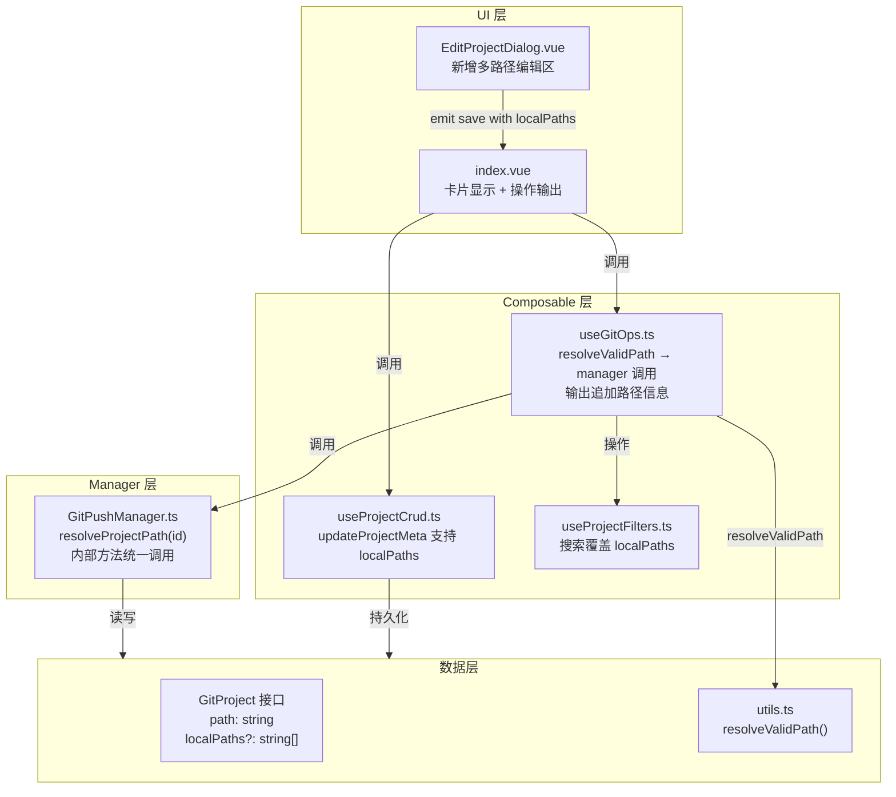

## 用户需求

解决跨电脑项目路径不同导致 Git 操作失败的问题，为 gitPush 功能模块新增"多本地路径"配置能力。

## 核心功能

1. **多本地路径配置**：在项目编辑对话框中新增"多本地路径"管理区域，允许用户为同一项目添加多个设备上的本地仓库路径（如电脑A的 `D:\Projects\repo` 和电脑B的 `/home/user/code/repo`）。支持动态增删路径条目。

2. **自动路径检测**：执行任何 Git 操作时，自动遍历项目配置的所有本地路径（主路径 + 备选路径），使用 Node.js `fs.existsSync` 检测当前设备上实际存在的第一个有效路径，以该路径作为 `cwd` 执行 Git 命令。

3. **路径使用提示**：每次 Git 操作（推送/拉取/提交/暂存等）完成后，在输出区域明确展示本次操作所使用的本地路径，格式为 `[使用本地路径: D:\Projects\repo]`，方便用户确认操作目标。

## 技术栈

- 语言：TypeScript + Vue 3 Composition API
- 持久化：PluginStorage + TypedStorage（项目已有）
- 文件系统检测：Node.js `fs.existsSync`（通过 `getNodeFsPathOs()` 获取）
- 样式：SCSS 分离（项目强制规范）

## 实现方案

### 核心策略

在 `utils.ts` 中新增 `resolveValidPath(project: GitProject): string` 同步工具函数，按优先级依次检测所有路径的有效性。在 `useGitOps.ts` 组合层的所有 Git 操作方法中统一调用此函数，将解析后的有效路径传递给 `GitPushManager` 的方法。输出信息在 `useGitOps.ts` 的 `formatGitOutput` 和各项操作的结果赋值处追加路径前缀。

### 架构设计



### 数据流

1. **配置阶段**：用户在 `EditProjectDialog` 中添加/删除路径 → `emit('save', { ..., localPaths })` → `index.vue` 的 `handleEditSaveFromDialog` 调用 `updateProjectMeta(id, { localPaths })` → 持久化到 `GitPushStorage`
2. **操作阶段**：用户触发推送/拉取等操作 → `useGitOps` 方法调用 `resolveValidPath(project)` → 返回当前设备有效路径 → 传入 `manager` 方法执行 Git 命令 → 输出信息追加 `[使用本地路径: xxx]`

### 关键设计决策

1. **同步检测**：`resolveValidPath` 是同步函数，因为 `fs.existsSync` 是同步的。在 Electron 环境中该调用极快（<1ms），不会阻塞 UI。
2. **优先级策略**：`project.path`（主路径）始终优先检测，之后按 `localPaths` 数组顺序检测。这确保主路径设备上行为不变。
3. **向后兼容**：`localPaths` 为可选字段，未配置时行为与现在完全一致。存量项目自动兼容。
4. **只在 Composable 层解析**：Manager 层保持"接收 path 参数执行命令"的职责，路径解析逻辑集中在 `useGitOps` 层，遵循单一职责原则。

## 实现详情

### 修改文件清单

```
src/features/gitPush/
├── types/storage.ts              # [MODIFY] GitProject 新增 localPaths?: string[]
├── utils.ts                      # [MODIFY] 新增 resolveValidPath() 工具函数
├── GitPushManager.ts             # [MODIFY] 新增 resolveProjectPath(id) 方法
├── composables/
│   ├── useGitOps.ts              # [MODIFY] 所有操作使用 resolvedPath，输出追加路径信息
│   ├── useProjectCrud.ts         # [MODIFY] updateProjectMeta patch 类型增加 localPaths
│   └── useProjectFilters.ts      # [MODIFY] 搜索条件覆盖 localPaths
├── components/
│   └── EditProjectDialog.vue     # [MODIFY] 新增多路径编辑 UI 区域
├── index.vue                     # [MODIFY] 保存/显示逻辑适配多路径
└── styles/
    └── index.scss                # [MODIFY] 新增多路径编辑样式
src/i18n/
├── zh_CN/gitPush.json            # [MODIFY] 新增 i18n 键
└── en_US/gitPush.json            # [MODIFY] 新增 i18n 键
```

### 核心代码结构

```typescript
// types/storage.ts — GitProject 接口新增字段
export interface GitProject {
  // ... 现有字段保持不变
  path: string
  /** 多设备本地路径列表（不含主路径 path） */
  localPaths?: string[]
  // ...
}

// utils.ts — 新增路径解析工具
export function resolveValidPath(project: GitProject): string {
  const modules = getNodeFsPathOs()
  const { fs } = modules || {}
  const allPaths = [project.path, ...(project.localPaths || [])]
  if (fs) {
    for (const p of allPaths) {
      try { if (fs.existsSync(p)) return p } catch { /* skip */ }
    }
  }
  return project.path // 降级：无 fs 或路径全无效时返回主路径
}
```

## Agent Extensions

### Skill

- **codex-ui-style-guide**
- Purpose: 确保 EditProjectDialog 新增的多路径编辑 UI 样式符合项目 Codex UI 规范（边框卡片风格、设计 Token、12px 字体、0.12s 过渡等）
- Expected outcome: 新增 SCSS 样式通过 Codex 规范审查，与现有组件风格一致