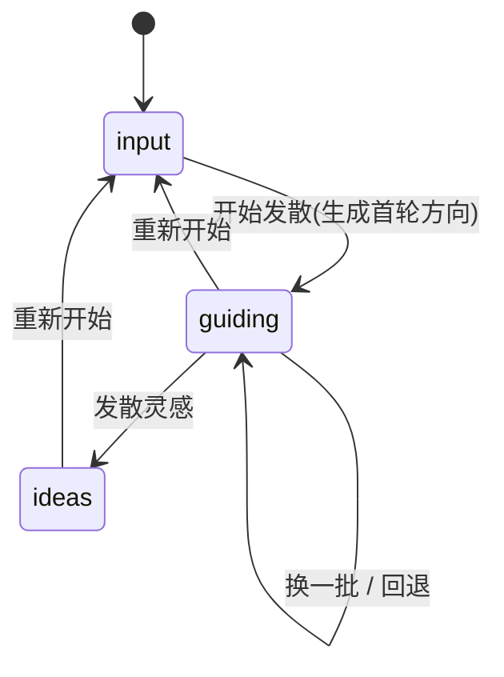

## 产品概述

在现有「灵感生成器」基础上新增「引导发散」模式，与「预设分类一键生成」并存。引导发散采用 AI 动态多轮引导：用户输入一个主题（如"效率工具""笔记助手"），AI 生成若干「发散方向」选项供选择，用户选择后 AI 基于上下文继续生成更深层的方向，逐层收敛，随时可点击「发散灵感」产出具体灵感点子；最终灵感仍支持展开查看、一键复制、AI 细化为完整技术方案。

## 核心功能

- 双模式切换：面板顶部提供「快捷生成」与「引导发散」两个 Tab，保留原有预设分类一键生成作为快捷入口。
- 主题输入：引导发散模式起始于自由文本主题输入，AI 据此生成第一轮发散方向选项。
- 多轮动态引导：每轮 AI 根据「主题 + 已选方向路径」生成 4~5 个方向选项（角度/场景/技术形态等），用户可选择方向继续深挖。
- 引导过程可控：支持「换一批」（重新生成当前轮方向）、「回退一步」（撤销上一次选择）、「重新开始」。
- 随时发散灵感：任意轮次可点击「发散灵感」，AI 基于完整方向路径一次性产出 5 条具体灵感点子。
- 灵感后处理复用：最终灵感列表复用现有卡片展示，支持展开查看、一键复制、AI 流式细化为技术方案。
- 顺带修复上一轮遗留的「右侧内容被遮挡」问题。

## 技术栈

- 前端框架：Vue 3 + TypeScript（复用现有）
- 样式：SCSS + Codex 设计 Token（`$color-*` / `$font-size-*` / `$spacing-*` / `$radius-*`，禁用 box-shadow）
- 窗口承载：复用现有 `IdeaGeneratorManager`（addTab + openWindow 双形态），本次不改动
- AI 调用：`@/utils/aiApi` 的 `callAI`（非流式，用于方向生成与灵感发散）、`callAIStream`（流式，用于技术方案细化）、`getApiConfigFromPlugin`
- 剪贴板：`@/utils/domUtils` 的 `copyToClipboard`

## 实现方式

### 高层策略

本次是对已有功能模块的内部增强，不涉及 8 步注册（开关/图标/配置/导出均已存在）。核心是「模块内三层扩展」：`types/index.ts` 增加引导发散的类型与常量，`utils.ts` 增加方向解析与 prompt 构建纯函数，`composables/` 新增 `useGuideDiverge` 管理引导状态机，`index.vue` 顶部加模式 Tab 切换，并新增 `GuideDiverge`/`DirectionCard` 两个视图组件。

### 关键决策

1. **双模式 Tab 而非替换**：用户明确要求保留快捷生成。主面板用 `activeMode: "quick" | "guide"` 控制两个独立子视图，两者互不共享状态，避免逻辑耦合。
2. **引导发散独立 composable**：新建 `useGuideDiverge` 而不污染现有 `useIdeaGenerator`。复制/细化逻辑可提取为模块内共享函数（放 `utils.ts` 或公共 composable），由两模式复用，避免复制粘贴。
3. **方向与灵感共用解析器**：方向选项和灵感点子结构相似（标题/描述），将 `parseIdeasResponse` 泛化为可复用的「选项列表解析」逻辑，方向解析为 `GuideDirection[]`，灵感解析为 `IdeaItem[]`。
4. **状态机驱动 UI**：`GuideStage = "input" | "guiding" | "ideas"`，配合 `steps`（已选方向历史）与 `directions`（当前轮选项），UI 按状态渲染对应区块，逻辑清晰可测。
5. **AbortController 防竞态**：方向生成、换一批、发散灵感均使用独立 `AbortController`，切换操作或组件卸载时取消进行中的请求。

### 引导发散状态机



### 数据流

用户输入主题 → `useGuideDiverge.startDiverge()` → `callAI` 生成方向 → `parseDirectionsResponse` 解析为 `GuideDirection[]` → 渲染方向卡片 → 用户选择方向 → 追加到 `steps` 并再次 `callAI` 生成下一轮方向 → 用户点「发散灵感」→ `callAI` 基于 `topic + steps` 产出灵感 → `parseIdeasResponse` 解析 → 复用 `IdeaCard`/`IdeaDetail` 展示与细化。

## 实现细节

### 核心目录结构

```
src/features/ideaGenerator/
├── types/
│   └── index.ts                    # [MODIFY] 新增 GuideDirection/GuideStage 类型与常量
├── utils.ts                        # [MODIFY] 新增 buildDirectionsPrompt/buildDivergePrompt/parseDirectionsResponse
├── composables/
│   ├── useIdeaGenerator.ts         # [MODIFY] 提取复制/细化公共逻辑供两模式复用
│   └── useGuideDiverge.ts          # [NEW] 引导发散状态机与 AI 调用
├── components/
│   ├── GuideDiverge.vue            # [NEW] 引导发散主视图（输入区/方向区/灵感区）
│   └── DirectionCard.vue           # [NEW] 发散方向选项卡片
├── index.vue                       # [MODIFY] 顶部加模式 Tab，引入 GuideDiverge
├── styles/
│   ├── IdeaGenerator.scss          # [MODIFY] 修复右侧遮挡（flex-wrap 响应式）
│   ├── GuideDiverge.scss           # [NEW] 引导发散主视图样式
│   └── DirectionCard.scss          # [NEW] 方向卡片样式
└── README.md                       # [MODIFY] 更新模块文档
```

### 关键代码结构

```typescript
// types/index.ts — 引导发散类型与常量
export type GuideStage = "input" | "guiding" | "ideas"

export interface GuideDirection {
  id: string
  label: string
  description: string
}
```

```typescript
// utils.ts — 方向解析与 prompt 构建
export function buildDirectionsPrompt(topic: string, steps: GuideDirection[]): string
export function buildDivergePrompt(topic: string, steps: GuideDirection[]): string
export function parseDirectionsResponse(raw: string): GuideDirection[]
```

```typescript
// composables/useGuideDiverge.ts — 状态机对外接口
export function useGuideDiverge(plugin: Plugin, i18n: IdeaGeneratorI18n) {
  const stage: Ref<GuideStage>
  const topic: Ref<string>
  const directions: Ref<GuideDirection[]>
  const steps: Ref<GuideDirection[]>
  const ideas: Ref<IdeaItem[]>
  // 方法
  startDiverge(): Promise<void>
  selectDirection(dir: GuideDirection): Promise<void>
  regenerateDirections(): Promise<void>
  stepBack(): void
  divergeIdeas(): Promise<void>
  restart(): void
}
```

## 右侧遮挡修复

- `.ig-body` 增加 `flex-wrap: wrap`，窄容器下详情区换行到下方而非溢出被裁切。
- `.ig-detail` 由固定 `width: 300px; flex-shrink: 0` 改为 `flex: 1 1 280px; min-width: 0`。
- 所有滚动容器（`.ig-list`、`.ig-detail-body`）保持 `padding-right ≥ $spacing-2`，符合 AGENTS_STYLE.md 侧边栏间距规则。

## 性能与可靠性

- 方向生成与灵感发散均为单次 `callAI` 非流式，避免多轮串行请求；细化方案流式输出避免长等待空白。
- 每个异步操作绑定独立 `AbortController`，切换模式、重新引导、组件卸载时取消，防止竞态与内存泄漏。
- 解析兜底：AI 输出格式漂移时按行拆分降级，保证界面不空白。

## 设计风格

延续项目 Codex 设计语言与灵感生成器现有深色沉浸式 + 紫色 AI 主题，保持边框卡片、等宽字体、focus 发光、禁用 box-shadow 的视觉基调。本次新增的「引导发散」模式强调「路径感」：顶部用面包屑展示已选方向路径，方向选项以可点击卡片呈现，选中即「收敛」进入下一轮，营造层层深入的发散体验。

## 页面布局

- 顶部模式 Tab：等宽大写标签的「快捷生成 / 引导发散」切换条，当前模式用紫色下划线高亮。
- 引导发散视图按状态三态切换：
- 输入态：居中主题输入框（含占位提示）与「开始发散」主按钮，下方轻量说明文字。
- 引导态：顶部方向路径面包屑（主题 → 已选方向），中间 2~3 列方向卡片网格，底部操作栏（换一批 / 回退 / 发散灵感）。
- 灵感态：复用现有左右分栏——左侧灵感卡片列表、右侧详情与流式技术方案区。
- 方向卡片：细边框、标题 + 一句说明、hover 紫色边框高亮 + 轻微上浮，点击即选中进入下一轮。

## Agent Extensions

### Skill

- **universal-arch-skill**
- 用途：在完成引导发散模式的类型、composable、组件与样式扩展后，对 `src/features/ideaGenerator/` 进行架构审查，校验模块内代码分层（共享常量→types、纯函数→utils）、Codex 样式规范（无 box-shadow/硬编码色值/内联 SCSS）、滚动容器 padding-right 规则与单文件行数上限。
- 预期结果：输出结构化审查结果，确认新增代码符合 6 大架构原则，无遗漏违规项；若发现问题则给出具体文件与修复建议。