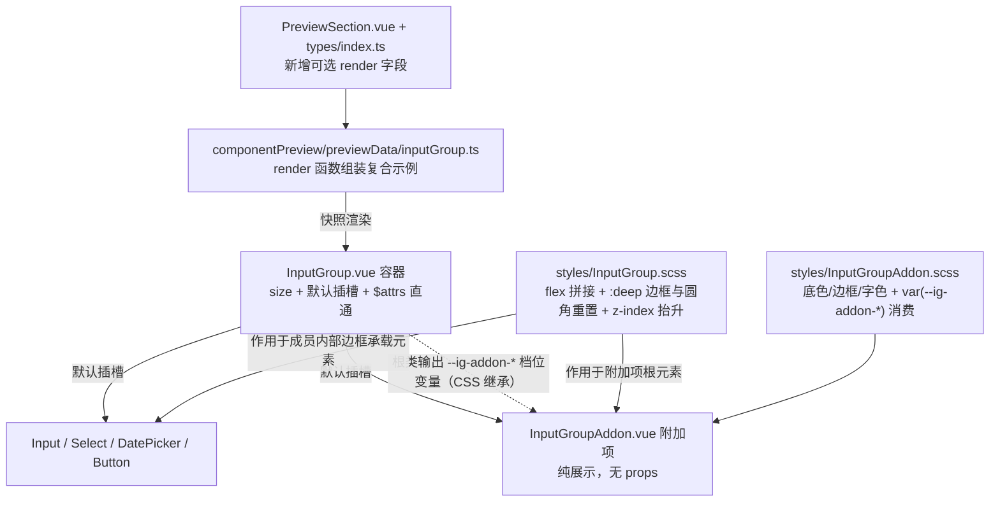

## 用户需求

参考 PrimeVue InputGroup（https://primevue.dev/inputgroup/），为插件的共享组件库新增「输入框组合器」能力：文本、图标、按钮及其他内容可与输入框成组排列。

经澄清确认的 4 项决策：

1. **组件形态**：双组件（对齐 PrimeVue）——新增 `InputGroup` 容器 + `InputGroupAddon` 附加项两个公开组件，支持任意数量、任意顺序的附加项与按钮混排。共享组件总数 17 → 19。
2. **可拼接成员**：`Input`（必选）、`Button`、`Select` / `DatePicker`（不含 `Checkbox`）。
3. **视觉风格**：无缝拼接（PrimeVue 原版）——子元素零间距、相邻边框合并（1px 重叠）、仅最外侧保留圆角，形成一体化控件。
4. **迁移范围**：仅新增组件 + 预览，不改动任何业务功能，只交付组件本体、样式、预览清单与文档同步。

## 产品概述

在组件预览面板中新增「InputGroup」分区，可查看输入框组合器的真实渲染快照与可复制代码；业务侧通过组合 `InputGroup` 与 `InputGroupAddon`，快速构建「域名前缀 / 货币符号 / 单位后缀 / 搜索按钮 / 下拉 + 输入」这类一体化控件，替代目前各处手写的 flex 并排布局。

## 核心功能

- **无缝拼接容器**：横向 flex 布局，组内成员零间距、相邻边框 1px 重叠，首元素保留左圆角、末元素保留右圆角、中间元素圆角归零，整体视觉为一个连续控件。
- **附加项组件**：纯展示的文本/图标附加区，底色为表面色、带 1px 边框，高度与相邻成员自动对齐，字色取次要文本色。
- **任意混排**：同一组内可放多个附加项，位置与数量不限；按钮可位于输入框任意一侧；下拉与日期选择器可与输入框、附加项同组。
- **四档尺寸**：容器具备 xsmall / small / medium / large 四档（默认 small），附加项的内边距、字号、最小高度随档位自动匹配成员控件，无需逐个传参。
- **交互反馈**：成员 hover 与聚焦（`focus-within`）时边框变色，并抬升层级避免边框被相邻元素遮挡；过渡统一 0.12s ease。
- **统一拼接语义**：组内相邻元素只有一条可见边框，鼠标悬停/聚焦的元素边框完整可见，不出现双线或断线。
- **组件预览接入**：预览面板新增分区，含基础前后缀、多附加项、按钮拼接、下拉拼接、日期拼接、尺寸档位等示例，每例附可复制的 Vue 用法代码；分区随面板全局尺寸档位切换同步变化。
- **主题自适应**：全部颜色消费思源 `--b3-theme-*` 变量并按设计 Token 兜底，明暗主题自动切换，不新增硬编码色值。

## 技术栈选择

| 层 | 选型 | 说明 |
| --- | --- | --- |
| 组件实现 | Vue 3 `<script setup>` + TypeScript | 与 17 个既有共享组件完全一致 |
| 样式 | SCSS 外置文件 + 设计 Token | `.vue` 内只保留 `@use`；Token 来自 `src/_variables.scss`（`@/variables.scss`） |
| 组件库 | 项目自建共享组件库，不引入第三方 UI 库 | 现有组件根类为 `si-input` / `si-select` / `si-datepicker` / `si-button` |
| 预览接入 | 复用现有 `componentPreview` 清单驱动框架 | `previewData/*.ts` + `PreviewSection.vue` |


## 实现思路

核心策略：**容器负责拼接几何，附加项负责自身外观，档位经 CSS 自定义属性跨组件继承。**

1. **无缝拼接落点**：成员的边框不在其根元素上——`Input` 在 `.si-input__wrapper`、`Select` 在 `.si-select__trigger`、`DatePicker` 在 `.si-datepicker__wrapper`、`Button` 在根元素 `.si-button`、附加项在其根元素。Vue scoped CSS 只把父 scope 加到子组件**根元素**上，故命中成员**内部**元素必须用 `:deep()`。分工：`margin-left: -1px` 与 flex 伸缩写在成员**根元素**（flex 项）上；圆角重置与 `height: 100%` 写在**内部边框承载元素**上。
2. **档位传递用 CSS 自定义属性**：`InputGroup` 根类按档位输出 `--ig-addon-*` 变量，`InputGroupAddon` 用 `var(--ig-addon-*, 兜底值)` 消费。理由：(a) CSS 变量天然跨组件继承，不需要 `provide/inject` 与额外 `types.ts`；(b) 避免父组件 SCSS 反向书写子组件内部类名，两个组件的样式各自自包含；(c) 沿用 `DatePicker.scss` 在根类上定义 `--dp-*` 档位变量的既有范式（`_variables.scss` 的 Token 为档位值的单一数据源）。
3. **容器属性直通**：`Input` / `Select` / `Slider` 通过 `containerAttrs` 剥离 `class`/`style`（记忆中的既有陷阱），但组容器恰恰需要外部控制宽度，故根元素直接 `v-bind="$attrs"`，不做剥离。
4. **预览框架的最小扩展**：`PreviewSection` 当前只能渲染纯文本默认插槽（`slotText`），复合组件快照必须能渲染子组件。为 `PreviewExample` 增加**可选** `render(props)` 字段（返回子组件 VNode 或数组），`PreviewSection` 用一个内联函数式组件渲染该插槽内容，无 `render` 时回退 `slotText`。纯增量、向后兼容，其它 17 个分区零改动。
5. **明确不做的事**：不改动任何 feature；不迁移现有带 gap 的手写组合布局（`video` 的 `.path-input-group`、`generalSettings` 的 `.input-group` 等）；组容器**禁用 `overflow: hidden`**（`Select` 下拉在 wrapper 内相对定位、未用 Teleport，裁剪会导致下拉不可见）。

关键权衡：不引入 `provide/inject` 与独立类型文件（CSS 变量继承已足够且更少代码，属于 KISS）；不给成员自动注入档位（成员各自持有 `size` prop，隐式注入会造成两套真值来源，违背显式优先原则）。

性能与可靠性：整体为纯 CSS 实现，运行时仅新增一个 `size` class 的 `computed`，无事件监听、无定时器、无新增依赖（打包体积零增长）；档位切换只改根类与自定义属性，不触发子树重算。拼接全部由 CSS 完成，不依赖 JS 测量，无布局抖动。

## 实现说明（执行要点）

- **高度对齐**：四档 min-height 需与成员一致（xsmall 22px / small 28px / medium 36px / large 44px）。`DatePicker` 的 medium 档 min-height 为 32px，与 `Input`/`Button` 的 36px 不同 → 组内需让边框承载元素 `height: 100%` 并配合容器 `align-items: stretch` 拉平；附加项档位变量同样对齐上述四值。
- **成员约束（写入组件头注释与文档）**：组内成员**不得带 `label` / `hint` / `error`**（`Input`/`Select`/`DatePicker` 的 label 由 `FormField` 渲染，会使组内高度错位）；`Input` 的 `borderless` 模式无边框可拼接，不参与组合。
- **按钮边框透明**：`Button.scss` 中填充态（`--primary`/`--success`/`--info`/`--warning`）的 `border-color` 为 `transparent`，`-1px` 重叠后与输入框边框不连续。文档中建议组内按钮使用 `outlined`（有可见边框）或 `secondary`（描边中性面），填充态可用但视觉为「输入框 + 实色块」。
- **焦点可见性**：必须给 `.si-input-group > *:hover` 与 `> *:focus-within` 加 `position: relative; z-index: 1`，否则被 `-1px` 重叠遮住的边框会在聚焦时缺失一段。`focus-ring` mixin 只改 `border-color`，不可用于实底控件的焦点反馈（既有约束）。
- **DatePicker 焦点环归一**：`DatePicker.scss` 用 `outline: 2px solid` + `outline-offset: 2px`，组内会压到相邻成员 → 在组作用域内归一到 `outline-offset: -1px`，不改动 `DatePicker` 自身样式。
- **命名冲突（必须避开）**：`src/features/componentPreview/previewData/input.ts` 已导出 `inputGroup` 常量（指 Input 组件的分区），新文件导出名必须区分，如 `inputGroupPreviewGroups`，内部常量用 `inputGroupComposite`。
- **文档计数**：17 → 19 共 8 处（`AGENTS.md` 160 / 168 / 181 / 445 / 483，根 `README.md` 148，`componentPreview/README.md` 3 / 8），另需同步 `.codebuddy/memory/MEMORY.md` 中的 17。
- **验证边界**：AI 不执行 `pnpm lint` 与 `pnpm vite build`（由用户自行验证）；改完导出边界后可执行只读的 `npx tsc --noEmit` 核对新增文件（ESLint 不查未导出成员与类型）。

## 架构设计



无新增状态流转：数据仍由使用方 `v-model` 绑定在成员上，`InputGroup` / `InputGroupAddon` 无状态、无事件、无副作用。

## 目录结构

整体结构：新增 2 个公开组件 + 2 份外置样式 + 1 个预览数据文件；修改 1 个预览类型、1 个预览渲染组件、1 个预览聚合入口与 3 份文档。不涉及任何 feature 目录、不涉及 i18n（新组件无用户可见文案，预览数据文件按既有约定使用中文字面量）、不涉及功能注册 8 步链路。

```
siyuanPluginVueSN/
├── src/
│   └── components/
│       ├── InputGroup.vue                    # [NEW] 无缝拼接容器公开组件。根元素 si-input-group + si-input-group--{size}，
│       │                                     #   直接 v-bind="$attrs" 允许外部传 class/style 控制宽度；仅一个 size prop
│       │                                     #   （默认 small）+ 默认插槽，无事件、无守卫逻辑；单文件目标 40 行内，
│       │                                     #   头部注释须写明「成员不得带 label/hint/error」与「容器禁 overflow:hidden」。
│       ├── InputGroupAddon.vue               # [NEW] 附加项公开组件。根元素 si-input-group-addon，仅默认插槽用于放文本/图标，
│       │                                     #   无 props、无事件；外观全部来自外置样式，档位经继承的 --ig-addon-* 变量生效。
│       └── styles/
│           ├── InputGroup.scss               # [NEW] 组容器样式（本任务核心）。内容：
│           │                                 #   ① 四档 --ig-addon-pad-y/pad-x/font/min-h 变量（值与 Input 同档一致：
│           │                                 #      2px 6px/10px/22px、2px 6px/12px/28px、6px 10px/14px/36px、10px 14px/16px/44px）
│           │                                 #   ② display:flex + align-items:stretch + width:100% + $font-zh
│           │                                 #   ③ 成员 flex 分配：.si-input 为 1 1 0，Select/DatePicker/Button/Addon 为 0 0 auto，
│           │                                 #      所有直接子元素 min-width: 0（Input 根为 width:100% 的纵向 inline-flex，需 flex:1 才能收缩）
│           │                                 #   ④ :deep() 命中 .si-input__wrapper / .si-select__trigger / .si-datepicker__wrapper
│           │                                 #      与 .si-button / .si-input-group-addon 根元素：圆角归零 + height:100%
│           │                                 #   ⑤ 相邻合并：> * + * { margin-left: -1px }
│           │                                 #   ⑥ 首末圆角：:first-child 左下左上、:last-child 右下右上取 $vp-radius
│           │                                 #   ⑦ :hover / :focus-within 抬升 z-index: 1 + position: relative
│           │                                 #   ⑧ DatePicker 组内 outline-offset 归一为 -1px
│           │                                 #   颜色/间距/字号一律用 Token 与 var(--b3-theme-*, ...) 双保险，硬编码值须加「无对应 Token」注释。
│           └── InputGroupAddon.scss          # [NEW] 附加项样式。display:flex + align-items:center（垂直居中内容）、
│                                             #   flex-shrink:0、white-space:nowrap、背景 var(--b3-theme-surface, $color-surface)、
│                                             #   边框 1px var(--b3-border-color, $color-border)、字色 var(--b3-theme-secondary, $color-muted)、
│                                             #   $font-zh、圆角由容器统一分配故此处默认 $vp-radius（组外单独使用时仍有圆角）；
│                                             #   padding / font-size / min-height 全部走 var(--ig-addon-*, 兜底)。
└── src/features/componentPreview/
    ├── types/index.ts                        # [MODIFY] PreviewExample 追加可选字段
    │                                         #   render?: (props: Record<string, any>) => VNode | VNode[]
    │                                         #   注明：复合组件示例用，入参为 resolveProps 后的实际渲染 props，存在时替代 slotText。
    │                                         #   仅新增字段，不改动 PreviewGroup 与既有分区（向后兼容）。
    ├── components/PreviewSection.vue         # [MODIFY] 模板中在 slotText 分支前追加 render 分支；script 中定义内联函数式组件
    │                                         #   SlotRenderer（props: render 函数 + exampleProps），setup 返回 () => render(exampleProps)；
    │                                         #   渲染为「&lt;SlotRenderer v-if="example.render" :render="example.render"
    │                                         #   :example-props="resolveProps(example)" /&gt;」，else-if 才走 slotText。
    │                                         #   resolveProps 复用既有逻辑（sizeable 时注入全局档位），需调用两次，可先取局部变量避免重复计算。
    ├── previewData/inputGroup.ts             # [NEW] InputGroup 分区数据。导出 inputGroupPreviewGroups（避免与 input.ts 的
    │                                         #   inputGroup 常量重名）。PreviewGroup：id "inputGroup"、name "InputGroup"、
    │                                         #   sizeable: true、importCode 同时给出 InputGroup 与 InputGroupAddon 两行 import、
    │                                         #   summary 说明组合器职责与成员约束。examples 用 render 组装（均以 p.size 透传给成员保证档位一致）：
    │                                         #   基础前后缀（https:// + Input + .com）、多附加项（$ + Input + .00）、
    │                                         #   图标按钮（Button outlined + Input）、尾部按钮（Input + Button outlined）、
    │                                         #   下拉拼接（Select + InputGroupAddon）、日期拼接（DatePicker + InputGroupAddon），
    │                                         #   每例 code 与 render 结构严格一致。render 内用 h(Comp, null, { default: () => ... }) 显式插槽写法。
    ├── previewData/index.ts                  # [MODIFY] 汇聚 inputGroupPreviewGroups，插入 PREVIEW_GROUPS（建议紧跟 inputPreviewGroups 之后）
    └── README.md                             # [MODIFY] L3 与 L8 计数 17 → 19；L8 清单补 InputGroup / InputGroupAddon 并注明两者共用
                                              #   「InputGroup」一个预览分区；「具名插槽」表登记 InputGroup 与 InputGroupAddon 的默认插槽
                                              #   （及其「多个子组件」的语义约束）；「清单扩展指南」补充 render 字段用法；
                                              #   追加一条复合控件内嵌能力说明（无缝拼接容器）。
```

文档同步（组件计数与清单，共 3 份文件）：`AGENTS.md` 160 / 168 / 181（含清单表追加 `InputGroup` 与 `InputGroupAddon` 两行，关键 props 分别为 `size` 与无 props）+ 177 行可复用清单补「输入框组合器」类别 + 445 / 483；根 `README.md` 148；`.codebuddy/memory/MEMORY.md` 中的组件计数与清单。

## 关键代码结构

仅列两处跨模块契约（其余为常规 Vue 组件写法，不赘述）。

```ts
// src/features/componentPreview/types/index.ts —— 预览示例新增可选字段（向后兼容）
export interface PreviewExample {
  title: string
  props?: Record<string, any>
  slotText?: string
  /**
   * 复合组件示例的自定义插槽渲染（入参为 resolveProps 后的实际渲染 props）。
   * 存在时优先于 slotText，用于 InputGroup 这类需要渲染多个子组件的示例。
   */
  render?: (props: Record<string, any>) => VNode | VNode[]
  code: string
}

// src/components/InputGroup.vue —— 容器对外契约
interface Props {
  /** 尺寸档位：驱动附加项的内边距/字号/最小高度（默认 small，与成员同档一致） */
  size?: "xsmall" | "small" | "medium" | "large"
}
```

## 验证

- 结构规范与注册清单完整性由 `[skill:universal-arch-skill]` 审查（目录规范、样式分离、设计 Token、文档同步清单核对）。
- 类型与导出边界：`npx tsc --noEmit`（只读命令，允许执行），过滤新增文件路径。
- `pnpm lint` / `pnpm vite build` 由用户自行执行（项目硬规则，AI 不运行）。

## 设计定位

本次交付物是**设计系统内的一个新控件**（输入框组合器），不是新页面。视觉语言完全沿用项目既有的 Codex 设计系统（暖色中性、边框优先、无发光阴影、0.12s ease 过渡、`--b3-theme-*` 主题自适应），仅新增「无缝拼接」这一种几何规则，不引入新配色与新字体。

## 视觉构成与几何规则

- **一体化轮廓**：整组只呈现一个连续轮廓。组内成员零间距，相邻元素边框按 1px 重叠合并；仅首元素保留左侧上下圆角、末元素保留右侧上下圆角（6px，`$vp-radius`），中间成员四角归零。单成员时首末规则同时命中，四角均为 6px。
- **高度连续**：容器 `align-items: stretch`，成员的边框承载元素 `height: 100%`，四档 min-height 统一为 22 / 28 / 36 / 44px，附加项与成员顶底边严格对齐，不出现阶梯错位。
- **附加项外观**：表面色底（比输入框底色略深一档，形成可辨识的分区但不抢焦点）、1px 常规边框、次要文本色字色、内容垂直居中、不换行、不参与伸缩（`flex-shrink: 0`）。文本内容的内边距与同档输入框一致，使字符基线在同一条水平线上。
- **区域划分**：默认输入区占据剩余宽度（`flex: 1`），附加项与按钮按内容宽度紧贴；下拉与日期选择器按内容宽度参与拼接。
- **成员视觉取舍**：填充态按钮边框为透明，拼接处会呈现「输入框 + 实色块」的效果；文档建议优先使用描边按钮（`outlined` / `secondary`）以获得连续的细边框观感。

## 状态与动效

| 状态 | 表现 |
| --- | --- |
| 默认 | 一条连续 1px 边框，颜色为 `--b3-border-color` |
| hover | 悬停成员自身边框变为主色/信息色，并抬升层级保证边框完整可见；其余成员边框不变 |
| 聚焦（focus-within） | 聚焦成员边框变为主色，附加项与输入区的交界处不出现断线或缺角 |
| 禁用 / 错误 | 沿用成员自身样式（禁用降透明度、错误红边框），拼接几何规则不变 |


过渡统一 `0.12s ease`，仅作用于颜色与背景；无位移、无缩放、无发光阴影，避免密集表单中的抖动。

## 主题与响应式

- 颜色全部走 `var(--b3-theme-*, 设计 Token 兜底)`，明暗主题与思源主题切换自动生效，无新增硬编码色值。
- 宽度默认撑满容器，由外部通过 `class`/`style` 控制；窄容器下输入区优先收缩（`min-width: 0`），附加项与按钮保持完整不挤压换行。
- 四档尺寸覆盖密集工具栏（xsmall）到突出表单（large）场景。
- 无障碍：两个组件均为纯布局容器，不需要额外 role 与 aria 属性；交互能力由内部的输入框、按钮、下拉自身承担（与 PrimeVue 官方说明一致）。

## 组件预览呈现

预览面板新增「InputGroup」分区，尺寸档位切换对分区生效：切换 XS/S/M/L 时，容器的附加项档位与示例内成员档位同步变化，用于目视回归四种档位下的拼接效果。

## Agent Extensions

### Skill

- **universal-arch-skill**
- Purpose: 作为架构规范审查工具，校验本次新增的共享组件是否符合项目结构规范——目录规范（公开组件平铺于 `src/components/`、样式外置到 `styles/`）、样式分离（`.vue` 内仅保留 `@use`）、设计 Token 使用（无硬编码字号/颜色）、以及「注册清单」完整性（组件计数与清单在 8 处文档中的同步是否遗漏）。
- Expected outcome: 输出一份结构合规检查结论，明确列出违规项与缺失的注册/文档同步位置；在补齐前不进入最终交付判定，补齐后复检归零。