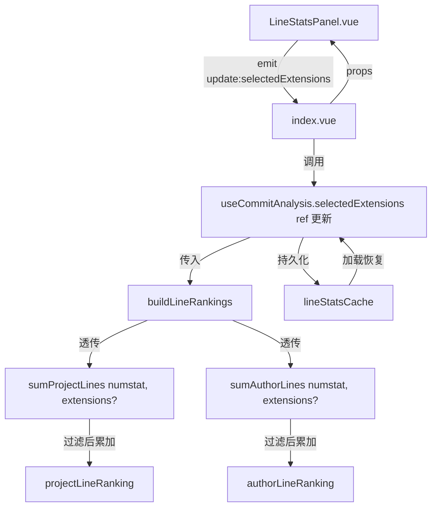

## 用户需求

为行数统计视图增加文件扩展名过滤功能。在工具条新增多选 chip 按钮组，用户可选择要统计的文件扩展名（如 .ts、.vue、.md、.json 等），选定后仅统计匹配文件的行数变化。不选择任何扩展名时不过滤，维持现有全部文件统计的行为。选中状态需持久化到缓存，切换视图后恢复上次选择。

## 核心功能

- 工具条新增文件扩展名多选 chip 按钮组，展示预定义常见扩展名
- 每个 chip 点击切换选中/未选中状态，支持同时选择多个扩展名
- 选中扩展名后重新分析时仅统计匹配文件的增删行数
- 不选择任何扩展名时不过滤（空数组 = 全部文件），维持现有行为
- 分析进行中 chip 按钮组同步禁用
- 选中状态持久化到 lineStatsCache 独立缓存槽位，下次进入视图自动恢复

## 技术栈

- 前端框架：Vue 3 + TypeScript
- 样式：SCSS（独立文件），使用项目全局设计 Token
- 持久化：TypedStorage（lineStatsCache 槽位）

## 实现方案

### 整体策略

过滤发生在聚合层（`sumProjectLines` / `sumAuthorLines`），不修改 git 命令。`getCommitStatsLog` 照常抓取全部文件数据，聚合时根据 `extensions` 参数按文件路径后缀白名单过滤。这样 git 命令零改动，过滤逻辑集中在一处。

### 数据流



### 过滤逻辑

在 `sumProjectLines` 和 `sumAuthorLines` 中增加可选参数 `extensions?: string[]`：

```typescript
function shouldIncludeFile(filePath: string, extensions?: string[]): boolean {
  if (!extensions || extensions.length === 0) return true  // 空 = 不过滤
  const lower = filePath.toLowerCase()
  return extensions.some(ext => lower.endsWith(ext.toLowerCase()))
}
```

- `extensions` 为 `undefined` 或空数组时不执行任何过滤（向后兼容，旧调用点零影响）
- 扩展名比较忽略大小写
- 对 `.vue`、`.ts` 等带点格式输入做 `endsWith` 匹配

### 预定义扩展名列表

在 `useCommitAnalysis.ts` 中定义常量 `LINE_STATS_EXTENSIONS`，覆盖常见前端文件类型：

```typescript
export const LINE_STATS_EXTENSIONS = [
  ".ts", ".vue", ".js", ".jsx", ".tsx",
  ".css", ".scss", ".json", ".md", ".html",
] as const
```

### 缓存持久化

在 `LineStatsCache` 接口新增 `selectedExtensions: string[]` 字段，默认值为 `[]`。`runCore` 成功后将当前 `selectedExtensions` 写入缓存，`loadLineStatsCache` 恢复时同步回填 ref。扩展名变更本身不触发重新分析（仅在下次手动分析时生效），但会即时持久化。

## 实施细节

### 修改文件清单

```
src/features/gitPush/
├── reportMetrics.ts                              # [MODIFY] sumProjectLines/sumAuthorLines 新增可选 extensions 参数 + shouldIncludeFile 辅助函数
├── composables/
│   └── useCommitAnalysis.ts                      # [MODIFY] 新增 selectedExtensions ref + LINE_STATS_EXTENSIONS 常量，buildLineRankings 透传，runCore 持久化，loadLineStatsCache 恢复，return 导出
├── types/
│   └── meta.ts                                   # [MODIFY] LineStatsCache 新增 selectedExtensions: string[] 字段
├── types/
│   └── storage.ts                                # [MODIFY] DEFAULT_LINE_STATS_CACHE 新增 selectedExtensions: []
├── components/analysis/
│   └── LineStatsPanel.vue                        # [MODIFY] 工具条新增扩展名 chip 按钮组，新增 selectedExtensions prop + update:selectedExtensions emit
├── styles/
│   └── LineStatsPanel.scss                       # [MODIFY] 新增 .gls-ext-chips / .gls-ext-chip 样式
├── index.vue                                     # [MODIFY] LineStatsPanel 绑定 selectedExtensions prop + 监听 update:selectedExtensions
├── i18n/zh_CN/gitPush.json                       # [MODIFY] 新增过滤相关中文文案
└── i18n/en_US/gitPush.json                       # [MODIFY] 新增过滤相关英文文案
```

### 性能考量

- 过滤发生在内存聚合阶段，每个文件路径执行一次 `endsWith` 比较，时间复杂度 O(files × extensions)，扩展名列表最大 10 个，无性能瓶颈
- git 命令不变（数据照常抓取），不影响 I/O 耗时
- `buildLineRankings` 仅在 `settled` fulfilled 项上执行，路径数量级通常 < 10K 文件，filter 开销可忽略

### 向后兼容

- `sumProjectLines` / `sumAuthorLines` 的 `extensions` 参数为可选，旧调用点（如代码统计报告的 `buildReportData` 链路）不受影响
- `LineStatsCache` 新增字段为可选（`selectedExtensions?: string[]`），旧缓存数据加载时自动降级为 `[]`
- 默认值 `[]` 表示不过滤，与现有行为完全一致

## 设计风格

沿用 gitPush 模块现有 Codex 风格，chip 按钮组采用与 `<select>` 一致的视觉语言：等宽字体、小号字号（10px）、边框 + focus 光环、选中态用主题色高亮。

## 页面布局

行数统计面板工具条现有布局为 `flex` + `justify-content: space-between`，左侧状态文案，右侧 `<select>` + `<button>`。新增扩展名 chip 组放在右侧 `<select>` 之前，与 `<select>` 等控件保持 `gap: $spacing-1` 间距。

### 工具条区块

- **左侧**：分析状态文案（"分析中..." / "上次分析 xx"），flex:1 占满剩余空间
- **右侧**（gls-toolbar-right）：扩展名 chip 按钮组 → 条数 `<select>` → 分析 `<button>`，gap: $spacing-1

### Chip 按钮组

- 横向排列，每个 chip 为小号按钮，显示扩展名（如 `.ts`、`.vue`）
- 未选中：`background: var(--b3-theme-surface)` + `border: 1px solid var(--b3-border-color)`
- 选中：`background: var(--b3-theme-primary-lightest)` + `border-color: var(--b3-theme-primary)`，文字颜色变为主色
- focus 光环复用 `@include focus-ring` mixin
- 字号 `$font-size-2xs`（10px），等宽字体 `$vp-mono`
- padding: 2px 6px，border-radius: $radius-sm
- 分析中（`:disabled`）整体降低透明度