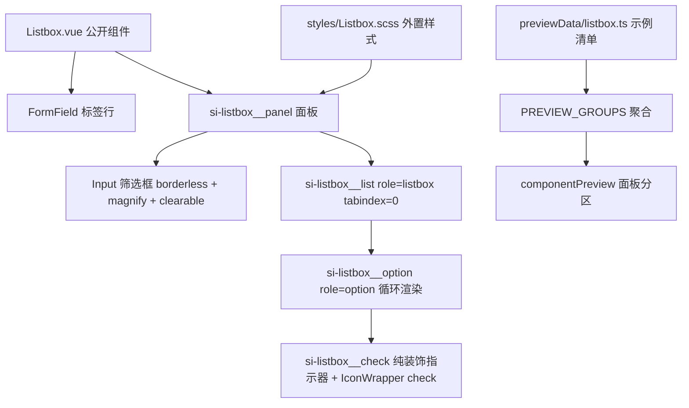

## 产品概述

为共享 UI 组件库新增一个「内联列表选择」控件 Listbox：在页面上直接平铺展示可选项列表，用户通过点击（或基础键盘操作）从中选择一个或多个值。它与现有下拉形态的 Select 互补——Select 适合紧凑表单，Listbox 适合需要「选项全部可见、一眼可比」的场景（多选标签、分组筛选条件、长列表勾选等）。本次只交付组件本体、样式、预览清单与文档，不改动任何业务功能页面。

## 核心功能

- **单选与多选**：默认单选，选中项在同一时刻唯一；开启多选后可在列表中连续勾选多个值，值以数组形式对外输出。
- **复选指示器（checkbox）**：多选场景下每一项左侧常驻一个方形指示框，未选中为空心、选中显示勾选，配合整行高亮一起表达选中态；适用于表单中「从清单里挑若干项」。
- **勾选指示（checkmark）**：选中项仅显示一个勾选图标而不是整行变色，适用于单选列表；也可与「不改变行底色」组合使用，让列表保持素净、仅靠图标标记当前值。
- **高亮开关**：可单独控制「选中是否改变整行底色」。关闭后选中态完全由指示器表达，便于和自定义选项内容搭配。
- **内置筛选**：开启后在列表上方出现一个搜索框，按选项文本实时过滤；列表为空或无匹配结果时显示居中提示文案。
- **三种状态**：整体禁用（不可点击、不可聚焦、整体降透明度）；单项禁用（该项不可选、颜色弱化，其余项仍可正常选择）；校验失败（面板描红外框并在下方显示错误文案）。
- **表单标签一体化**：可选传入标签、必填标记、辅助说明与错误文案，与库内其他表单控件的排版完全一致。
- **基础键盘操作**：Tab 进出列表、上下方向键移动当前项、回车与空格切换选中；鼠标与键盘两种操作方式都能完成选择。
- **自定义选项内容**：提供选项插槽，可把图片、徽标、双行文案等富内容放进列表项。

## 视觉与交互效果

- **外观**：整体为一个带 1px 常规边框、面板圆角的中性面板。选项行按内容高度排布，文字使用次要前景色；悬停时行底色转为弱化表面色，选中时底色转为弱化主色、文字转为常规前景色并适度加粗。
- **指示器**：方形指示框为 1px 描边、面板圆角的小方块，选中后填入主色并对齐显示白色勾选图标；勾选指示模式下不画方框，仅显示勾选图标，图标取主色。
- **筛选区**：位于面板顶部，与列表之间用一条 1px 分隔线切开；搜索框内嵌无边框，左侧带放大镜图标，右侧支持一键清除。
- **面板与滚动**：列表区最高高度受限，超出后在列表内部纵向滚动（细描边滚动条，悬停加深），面板整体轮廓保持不变。
- **状态反馈**：悬停与选中的底色变化统一 0.12 秒缓动；禁用行不响应悬停且降至约六成不透明度；校验失败时边框转为错误色。
- **主题自适应**：明暗主题下换色完全跟随宿主主题，不出现固定色块；错误色在暗色主题下呈更亮的红，与输入框、按钮保持一致。
- **空态**：无数据或无筛选结果时，面板内居中显示一行次要色提示文字，不留空白断层。
- **尺寸四档**：整体提供四档密度，与库内其他控件同档联动——档位越小，选项行高、内边距与字号同步收窄，用于从密集面板到大尺寸突出展示的各类场景。
- **对齐感**：选项内容左对齐、行内垂直居中，指示器与文字之间保持固定间距，多行富内容时指示器与首行文字顶端对齐，不出现错位。

## 技术栈选择

沿用项目既有栈，不引入任何新依赖。

| 层 | 选型 | 说明 |
| --- | --- | --- |
| 组件 | Vue 3 `<script setup>` + TypeScript | 与 `src/components/` 内既有 20 个共享组件一致 |
| 样式 | SCSS 外置文件 + 设计 Token | `.vue` 内 `<style scoped lang="scss">` 只保留 `@use './styles/Listbox.scss'` |
| 复用组件 | `FormField` / `Input` / `IconWrapper` | 标签行、筛选框、勾选图标全部复用共享组件，不自建同类 |
| 选项类型 | 复用 `Select.vue` 导出的 `SelectOption` | `import type` 被擦除、无运行时循环；项目已有 24 处同类先例 |
| 预览 | 既有 `componentPreview` 清单驱动框架 | 新建 `previewData/listbox.ts` 并接入 `PREVIEW_GROUPS` |


## 实现思路

**核心策略：单根面板 + 纯装饰指示器 + 受控值适配层；能力靠可选 props 递进，默认路径即基础单选。**

1. **选项形态统一为 `SelectOption[]`**：用户明确不做字段映射与分组，故复用 `Select.vue` 的 `SelectOption`（`{ value: string | number | boolean, label: string, disabled?: boolean, keywords?: string }`）。收益有三：与库内语义一致、单项禁用直接用 `option.disabled`（无需新增 `optionDisabled` 字段名 prop）、`keywords` 让筛选天然支持「标签之外的别名检索」（与 `Select` 的 `filterable` 行为一致），零新增 API。
2. **校验态用 `error?: string` 而非 `invalid?: boolean`**：项目统一约定（`Input` / `Select` / `DatePicker` / `Checkbox` 全部用 `error`）——该 prop 同时负责描红外框与文案展示，是 PrimeVue `invalid` 的项目化落地。不给两个 prop 表达同一件事，避免 API 冗余。
3. **筛选框复用共享 `Input`**：`<Input v-model="filterQuery" borderless :size="size" prefix-icon="magnify" clearable />`。`Select` 之所以自建筛选输入，是因为它位于绝对定位的下拉浮层内、无法承载 `FormField`；Listbox 是内联形态，没有这个约束，因此必须复用共享组件（`borderless` 负责去边框去底色，焦点反馈交由外层 `:focus-within` 承担）。
4. **指示器自绘（不复用 `Checkbox`），这是唯一的复用例外**：已实测 `Checkbox.vue` 的根是 `<label class="si-checkbox__control">` 内含原生 `<input type="checkbox">`——嵌进 `role="option"` 会造成「option 里又一个 checkbox」的双重语义，且 label 包裹原生的结构会与 option 的点击语义相互触发。PrimeVue 官方 checkbox 模式同样是纯装饰方框。故实现为 `.si-listbox__check`（纯展示 span）+ 复用 `IconWrapper :name="'check'"`（`mdi:check` 已在 `COMMON_ICONS` 注册，零图标新增）。该例外与理由必须写入组件头注释与 `componentPreview/README.md`。
5. **多选/单选由 `multiple` 驱动，值适配收敛在一处**：`multiple` 为真时 `modelValue` 为 `value[]`、否则为 `value | null`；内部统一用 `Set` 做 O(1) 命中判断（避免逐项 `indexOf`），toggle 后返回**全新数组**（非 deep watch 对原地 splice 不触发，项目既有结论）。`checkbox` 仅在 `multiple` 下生效；`checkmark` 独立生效（单选列表的「仅勾选」外观）。
6. **键盘范围严格按用户选择**：仅 `Tab`（进出）/ `↑` `↓`（移动活动项）/ `Enter` `Space`（切换选中）/ `Home` `End`（跳到首尾）。**不做** Shift+方向、`Ctrl+A`、PageUp/PageDown、可打印字符定位、`metaKeySelection`、`selectOnFocus` / `focusOnHover` / `autoOptionFocus`、虚拟滚动。活动项用 `aria-activedescendant` 单点表达（列表容器持 `tabindex="0"`），避免给每个选项加 tabindex 造成 Tab 序列膨胀。
7. **无障碍最小闭环**：容器 `role="listbox"` + 多选时 `aria-multiselectable="true"` + `aria-activedescendant`；选项 `role="option"` + `aria-selected` + `aria-disabled`；`aria-label` 可传入；禁用时容器 `tabindex="-1"` 且 `aria-disabled="true"`。筛选框与列表为兄弟关系，`Tab` 可直接从筛选框进入列表。
8. **有意不做的事**：不改任何 feature（用户明确排除，项目内 59 处原生 label 与各处手写列表选择本轮不动）；不给 `Select` 加多选；不做分组与字段映射；不引入虚拟滚动依赖。

**性能与可靠性**：列表渲染为一次 `v-for`，筛选结果用 `computed` 派生（O(n) 单次遍历，n 为选项数，无嵌套遍历）；命中判断走 `Set` 而非数组 `includes`（多选 n 项时为 O(n) 而非 O(n²)）；无监听器、无定时器、无 DOM 查询、无新增依赖（体积零增长）；`ResizeObserver` / 虚拟滚动一律不引入，滚动交给原生 `overflow-y: auto`。

## 实现说明（执行要点）

- **面板可安全使用 `overflow: hidden`**：与 `Select` / `DatePicker` 不同，Listbox 无绝对定位下拉浮层，不存在被裁剪问题；圆角描边靠面板 `overflow: hidden` 收边即可。**但列表区必须自带 `overflow-y: auto`**，否则超长列表会撑破面板。
- **档位 SCSS 写法**：沿用 `Select.scss` 已验证的形式 `&--xsmall { .si-select__option { … } }`（编译为 `.si-listbox--xsmall .si-listbox__option`，正确）；**不要**写成需要反向选择器的形态。四档字号严格按 `$font-size-2xs/xs/sm/base` = 10/12/14/16，行高与内边距同步递进。
- **错误色一律 `var(--b3-theme-error, $color-danger)`**：`--b3-theme-destructive` 是**未定义变量**（本轮刚在 `Label.scss` 修掉 3 处同类问题，勿再引入）。
- **`previewData/control.ts` 已 297 行**（300 行警戒线），**不可**把 Listbox 分组追加进去；新建 `previewData/listbox.ts` 并导出聚合数组 `listboxPreviewGroups`（与目录内其余文件同一导出契约：分组对象 + 聚合数组两项都要导出，曾因只导出分组对象导致 build 报 `MISSING_EXPORT`）。
- **预览示例需区分 `slotText` 与 `render`**：纯文本示例用 `slotText`；需要多行/富内容或独立开关面板的场景用上一轮新增的 `render` 字段（`PreviewExample.render?: (props) => VNode | VNode[]`，由 `PreviewSection.vue` 的 `SlotRenderer` 承载）。
- **`sizeable: true`**：`PreviewGroup` 上必须标记，使面板的 XS/S/M/L 切换能注入全局档位（未显式指定 `size` 的示例生效）。
- **组件计数 20 到 21，共 7 处**：`AGENTS.md` 的 160 / 168 / 181 行与组件清单表（追加 `Listbox.vue` 行）+ 177 行附近「优先复用」的可复用清单追加「列表选择」+ 448 行目录树注释 + 486 行文档索引表；根 `README.md` 的 148 行；`componentPreview/README.md` 的 3 行与 8 行覆盖清单、14 行 `sizeable` 清单。
- **具名插槽登记**：`option` 为作用域插槽（`{ option, selected }`），快照无法呈现 → 必须在 `componentPreview/README.md` 的「具名插槽」表登记。
- **文件头注释**：`Listbox.vue` 用 `<!-- -->` 置于 `<template>` 前（10 到 30 字，含指示器例外与键盘范围说明）；`Listbox.scss` 首行 `// ========== Listbox.scss ==========`。
- **行数与函数长度**：单文件 300 警戒 / 500 硬阈值，单一函数不超过 30 行；预期 `Listbox.vue` 约 230 行、`Listbox.scss` 约 200 行，均无需拆分。
- **AI 不执行** `pnpm vite build` / `pnpm lint`；`read_lints` 与只读的 `npx tsc --noEmit` 可用；可用本地 `sass` + `@vue/compiler-sfc` 的 `compileStyle({ scoped: true })` 离线核对选择器最终形态（**必须先经 Sass 展平**再喂进去，否则结论失真）。

## 架构设计

无新增架构模式，全部落在既有分层：共享组件层（`src/components/` 组件 + `styles/` 外置样式）到预览层（`previewData/` 清单到聚合到面板渲染）到文档层（`AGENTS.md` 清单表 + `componentPreview/README.md` 机制说明）。无状态流转、无跨功能导入、无事件总线参与、无 i18n 变更、无图标新增、不涉及功能注册八步链路。



## 目录结构

本次新增 3 个文件、修改 6 个文件；不新增目录、不涉及任何 feature。

```
siyuanPluginVueSN/
├── src/
│   ├── components/
│   │   ├── Listbox.vue                        # [NEW] 内联列表选择共享组件（平铺公开入口，保持 import X from "@/components/X.vue" 约定）。
│   │   │                                      #   职责：单选/多选的值适配（multiple 决定 modelValue 形态，内部用 Set 做命中判断，
│   │   │                                      #   toggle 返回全新数组）、筛选过滤（computed 派生，按 label 与 keywords 匹配）、
│   │   │                                      #   活动项管理与基础键盘（Tab / 上下 / 回车 / 空格 / Home / End）、
│   │   │                                      #   aria 属性输出（listbox / multiselectable / option / selected / disabled / activedescendant）。
│   │   │                                      #   模板：FormField 包裹 + 面板 + 筛选区（复用 Input borderless）+ 列表 + 空态；
│   │   │                                      #   指示器为纯装饰 span（不复用 Checkbox，理由见头注释）；option 作用域插槽透出 { option, selected }。
│   │   │                                      #   约束：无任何副作用（无监听器/定时器/DOM 查询）；筛选无结果与无数据共用 emptyText。
│   │   ├── styles/
│   │   │   └── Listbox.scss                   # [NEW] 组件样式（本任务核心，全外置）。内容：
│   │   │                                      #   ① 根容器：inline-flex 列向 + 100% 宽 + $font-zh；
│   │   │                                      #   ② 面板：background 底 + 1px var(--b3-border-color) 边框 + $vp-radius + overflow: hidden；
│   │   │                                      #      错误态边框转 var(--b3-theme-error, $color-danger)；禁用态降不透明度 + not-allowed；
│   │   │                                      #   ③ 筛选区：$spacing-2 内边距 + 底部分隔线（与 Select.scss 的 __filter 同范式）；
│   │   │                                      #   ④ 列表：max-height 由 maxHeight 变量驱动 + overflow-y auto + 细滚动条（样式对齐 Select.scss 的 __options）；
│   │   │                                      #   ⑤ 选项：悬停弱底色、选中弱主色 + 常规前景 + semibold、禁用降透明度且不响应悬停、
│   │   │                                      #      活动项（键盘）用 outline 或弱底环表达且不与选中态冲突；
│   │   │                                      #   ⑥ 指示器：方形描边小方块（checkbox 常驻 / checkmark 仅选中时）与勾选图标着色；
│   │   │                                      #   ⑦ 空态：居中 + 次要色 + 与选项同档字号；
│   │   │                                      #   ⑧ 四档尺寸变体：字号 10/12/14/16、行内边距与最小行高同步递进（写法沿用 Select.scss 的 &--tier 后代链形式）。
│   │   │                                      #   颜色一律 var(--b3-theme-*, $color-*) 双保险；硬编码值须加「无对应 Token」注释。
│   └── features/
│       └── componentPreview/
│           ├── previewData/
│           │   ├── listbox.ts                 # [NEW] Listbox 分区数据。导出 listboxGroup（PreviewGroup：id "listbox"、
│           │   │                              #   name "Listbox"、sizeable: true、importCode 单行、summary 说明单选/多选/指示器/筛选）
│           │   │                              #   与聚合数组 listboxPreviewGroups（两项都要导出，符合目录内导出契约）。
│           │   │                              #   示例覆盖：单选基础、多选、多选 + checkbox、勾选指示（checkmark + highlightOnSelect:false）、
│           │   │                              #   内置筛选、无匹配结果（emptyText）、单项禁用（option.disabled）、整体禁用、错误态、带标签必填与提示、
│           │   │                              #   option 插槽富内容（用 render 字段组装，props 与 code 严格一致）。
│           │   └── index.ts                   # [MODIFY] 汇聚 listboxPreviewGroups 并插入 PREVIEW_GROUPS（建议紧跟 controlPreviewGroups 之后）。
│           └── README.md                      # [MODIFY] 计数 20 到 21 与覆盖清单追加 Listbox；sizeable 清单追加 Listbox；
│                                              #   「具名插槽」表登记 Listbox 的 option（作用域 { option, selected }）；
│                                              #   能力条目补「内联列表选择」并如实写明键盘范围（仅基础键，不做完整矩阵与虚拟滚动）
│                                              #   与指示器自绘例外（role=option 内不得嵌套可交互元素）。
├── AGENTS.md                                  # [MODIFY] 仅同步组件计数与清单，不改架构规则：160 / 168 / 181 行计数 20 到 21，
│                                              #   组件清单表追加 Listbox.vue 行（职责 + 关键 props），177 行附近「优先复用」可复用清单
│                                              #   追加「列表选择」，448 行目录树注释，486 行文档索引表。
├── README.md                                  # [MODIFY] 148 行目录树注释「20 个原子组件」到 21。
└── .codebuddy/memory/
    ├── MEMORY.md                              # [MODIFY] 共享组件库清单追加 Listbox 并补一条组件陷阱（指示器自绘理由、
    │                                          #   error 而非 invalid、键盘范围、面板可用 overflow:hidden、选项复用 SelectOption）。
    └── 2026-09-10.md                          # [MODIFY] 追加本轮小结：能力清单、复用与例外决策、计数同步位置、验证结果。
```

## 关键代码结构

仅列跨模块契约（其余为常规 Vue 组件与 SCSS 写法）。

```ts
// src/components/Listbox.vue —— 对外契约（选项类型复用 Select.vue 导出的 SelectOption）
interface Props {
  /** 单选为 value；多选（multiple 为真）为 value 数组 */
  modelValue?: SelectOption["value"] | SelectOption["value"][] | null
  /** 选项数据（扁平列表，本次不做分组与字段映射） */
  options: SelectOption[]
  /** 多选：modelValue 形态随之切换为数组 */
  multiple?: boolean
  /** 复选指示器：每项常驻方框（仅在 multiple 下生效） */
  checkbox?: boolean
  /** 勾选指示：选中才显示勾选图标（适合单选列表） */
  checkmark?: boolean
  /** 选中是否改变整行底色（默认 true；为 false 时选中态仅由指示器表达） */
  highlightOnSelect?: boolean
  /** 内置筛选框 */
  filter?: boolean
  /** 筛选框占位文案（默认与 Select 一致的「搜索...」） */
  filterPlaceholder?: string
  /** 无数据或无筛选结果时的提示文案（两者共用） */
  emptyText?: string
  /** 尺寸档位（默认 small） */
  size?: "xsmall" | "small" | "medium" | "large"
  /** 整体禁用（不可点击、不可聚焦） */
  disabled?: boolean
  /** 校验失败文案（描红外框并展示，项目统一约定，等价 PrimeVue 的 invalid） */
  error?: string
  /** 行内标签文案 */
  label?: string
  /** 是否必填 */
  required?: boolean
  /** 辅助说明 */
  hint?: string
  /** 列表最大高度（默认 200，与 Select 的 maxHeight 默认值一致） */
  maxHeight?: string | number
  /** 无障碍名称 */
  ariaLabel?: string
}

// emits：update:modelValue（值载荷随 multiple 切换形态）与 change（值 + 命中的选项或 null）
// slots：option（作用域 { option: SelectOption, selected: boolean }），未传入时回退渲染 option.label
```

## 验证

- `read_lints` 覆盖全部新增与改动文件，要求 0 错误
- `npx tsc --noEmit`（只读命令，允许执行）过滤 `Listbox` 与 `previewData` 路径，确认无新增类型错误（全项目既有约 40 行历史噪声不计）
- 设计 Token 自查：`styles/Listbox.scss` 中 `font-size` / `font-weight` / `line-height` / hex / rgba / border-radius / padding / margin 的硬编码数字 grep 应为 0 命中
- 编译自查：Sass 展平后再走 `@vue/compiler-sfc` 的 `compileStyle({ scoped: true })`，确认四档变体与选项状态选择器最终形态正确（不存在永不匹配的 scoped 后代选择器）
- 计数一致性：`AGENTS.md` / 根 `README.md` / `componentPreview/README.md` 三处均为 21，且 `previewData/index.ts` 已聚合 `listboxPreviewGroups`
- 复用合规：`Listbox.vue` 未自建标签容器、筛选输入、勾选图标（分别复用 `FormField` / `Input` / `IconWrapper` 与已注册的 `check`、`magnify`）
- 结构合规由 `[skill:universal-arch-skill]` 审查（目录规范、样式分离、设计 Token、文件头注释、行数、以及「改共享组件 API 必同步预览清单与文档」闭环）
- `pnpm lint` 与预览面板 Listbox 分区逐项目视（四档尺寸、单选/多选/两种指示器、筛选、空态、禁用与错误态）由用户自行执行

## 设计定位

本次交付物是既有 Codex 设计系统内的**一个新控件（内联列表选择器）**，不是新页面、不新增色板与字体。视觉语言完全沿用项目既有 Token 体系：暖色中性、边框优先、无发光阴影、0.12 秒缓动、随思源主题自适应用。仅新增「行内选项状态」这一种新的几何与配色规则，与库内 Select 的下拉选项、Checkbox 的方框指示保持同一套观感。

## 视觉构成与几何规则

- **一体化面板**：整体为一个 1px 常规边框、6px 圆角的中性面板，内部元素不越出轮廓（面板 `overflow: hidden`，列表自带纵向滚动）。面板底色取 background，选项悬停底色取弱化表面色，形成轻微的两级层次。
- **选项行**：整行可点击，行内左对齐、垂直居中；指示器与文字之间保持 6px 固定间距；文字使用次要前景色，选中后转为常规前景色并加适度字重，弱化主色作行底。
- **指示器**：方形描边小方块（1px 描边、4px 圆角），选中后填入主色并居中对齐白色勾选图标；勾选指示模式下不画方框，仅显示主色勾选图标。图标为 12 到 16px，随档位递进。
- **筛选区**：面板顶部独立区块，与列表之间以 1px 分隔线切开；搜索框内嵌无边框，左侧放大镜图标，右侧一键清除。

## 状态与动效

| 状态 | 表现 |
| --- | --- |
| 默认 | 一条连续 1px 边框，选项无底色 |
| 悬停 | 选项行底色转为弱化表面色；禁用项不响应 |
| 选中 | 行底弱化主色 + 前景转常规 + 中度字重 + 指示器勾选（`highlightOnSelect` 为 false 时仅指示器变化） |
| 键盘活动项 | 轻量轮廓或弱底环标记当前项，与选中态可同时存在而不混淆 |
| 禁用 | 整体或单项降不透明度、光标不可用，禁用项不参与悬停 |
| 校验失败 | 面板边框转错误色，下方显示错误文案 |


过渡统一 0.12 秒缓动，仅作用于颜色与背景；无位移、无缩放、无发光阴影，避免密集表单中的抖动。

## 主题与响应式

- 颜色全部走 `var(--b3-theme-*, 设计 Token 兜底)`，明暗主题切换自动生效；错误色在暗色主题下取更亮的红，与输入框、按钮一致。
- 宽度默认撑满容器，列表最大高度可配置，超出在列表内部滚动；四档尺寸覆盖密集面板到大尺寸展示场景。
- 无障碍：容器为 listbox 角色并标明是否多选，选项标记选中与禁用状态，键盘活动项经 activedescendant 表达；标签、禁用与错误文案均可访问。

## 组件预览呈现

预览面板新增「Listbox」分区，尺寸档位切换对该分区生效，可目视回归四档下的行高、字号与指示器尺寸。示例覆盖单选、多选、复选指示、勾选指示、筛选、空态、单项禁用、整体禁用、错误态与富内容插槽。

## Agent Extensions

### MCP

- **Context7**
- Purpose: PrimeVue 官方 Listbox 页面（https://primevue.dev/listbox/）的 API 区块为客户端动态渲染、抓取正文不含完整 props 表；用 Context7 检索 PrimeVue 官方文档库，取回 `checkbox`、`checkmark`、`highlightOnSelect`、`multiple`、`filter` 的确切语义与默认值，以及 listbox 角色的 ARIA 与基础键盘约定。
- Expected outcome: 产出一份 PrimeVue Listbox 关键属性与无障碍语义的核对结论，据此确认本组件的 props 命名（`multiple` / `checkbox` / `checkmark` / `highlightOnSelect` / `filter` 等）与官方语义一致、不凭空设计；对官方存在但本项目不做成的能力（分组、字段映射、完整键盘矩阵、虚拟滚动）明确记录为「本轮不做」并写入文档。

### Skill

- **universal-arch-skill**
- Purpose: 作为架构规范审查工具（模式 C 代码架构审查），校验本轮新增共享组件是否合规——目录规范（公开组件平铺于 `src/components/`、样式外置到 `styles/`）、样式分离（`.vue` 内仅保留 `@use`）、设计 Token（无硬编码字号/颜色/间距/圆角，错误色用已定义的 `--b3-theme-error`）、文件头注释齐备、单文件行数在阈值内、复用合规（未自建 `FormField` / `Input` / `IconWrapper` 已覆盖的能力），以及「改共享组件 API 必同步预览清单与文档」这一强制链条是否完整闭环（含 20 到 21 的计数同步 7 处）。
- Expected outcome: 输出结构化合规检查结论，逐条列出违规项与缺失的同步位置；补齐前不进入最终交付判定，补齐后复检归零。