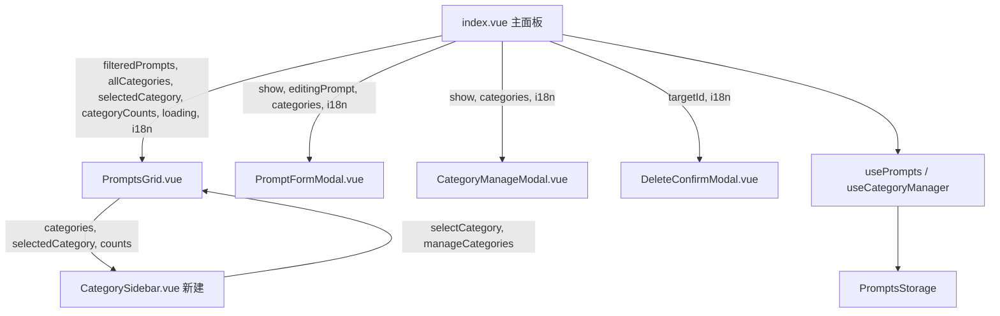

## 产品概述

重构思源笔记插件 prompts（提示词库）模块的 UI 布局，将主面板从「顶部横向分类 chips + 3 列瀑布流」升级为「左侧分类侧边栏 + 右侧内容区」两栏布局，卡片改为统一 Grid 等高网格，并同步统一三个子弹窗的视觉风格，同时清理模块内已发现的冗余代码。

## 核心功能

- **两栏主面板**：左侧垂直分类导航（含"全部"入口、各分类名称、颜色圆点、计数徽章、管理分类入口），右侧为搜索栏 + 新增按钮 + 提示词卡片网格。
- **Grid 等高卡片**：将 CSS columns 瀑布流改为 `display: grid` 固定列网格，卡片高度统一对齐，视觉更整齐；卡片内部保留标题、分类标签、编辑/删除操作、描述、可点击复制内容块。
- **子弹窗视觉统一**：重构 PromptFormModal（表单 + 动态内容块编辑）、CategoryManageModal（分类增删 + 颜色）、DeleteConfirmModal（删除确认），统一间距、圆角、边框、字号层级与操作栏布局。
- **冗余清理**：移除未使用的 `getById` 方法、重复的 `form-control` mixin、重复的表单标签样式、未引用的 `$modal-large-max-width`、无实参的 `label` 参数、透传包装函数与多余的 `emit("close")` 双通道关闭逻辑。

## 视觉要点

- 保持 Codex 设计语言：暖色背景、等宽字体代码块、大写辅助标签、1px 边框分层（无 box-shadow）、0.12s 过渡。
- 侧边栏分类项含选中态高亮（主题色背景 + 计数徽章），hover 时边框高亮。
- 卡片网格在窄屏（≤768px）自动降为 2 列，进一步收窄时降为 1 列；侧边栏在窄屏下收缩或隐藏。

## 技术栈

- 前端框架：Vue 3 + TypeScript（`<script setup lang="ts">`）
- 样式：SCSS（独立 `.scss` 文件 + `@use` 引用，设计 Token 来自 `@/variables.scss`）
- 复用组件：全局 `Button.vue`、`IconWrapper.vue`、`createModalVueApp`、`PluginStorage`/`TypedStorage`
- 不引入任何新依赖

## 实现方案

### 整体策略

保持数据层（`usePrompts` / `useCategoryManager` / `PromptsStorage` / 类型定义）完全不动，仅重构视图层与样式层。核心改动是：

1. 从 `PromptsGrid.vue` 中抽出「分类筛选」部分，新建独立的 `CategorySidebar.vue` 子组件（符合单文件行数上限与组件职责单一原则）。
2. `PromptsGrid.vue` 变为「左侧侧边栏 + 右侧内容区」两栏容器，右侧内容区保留搜索 + 新增 + Grid 卡片网格。
3. 将 `PromptsGrid.scss` 中的 `.vp-category-filter` 样式迁移到新的 `CategorySidebar.scss`，`.vp-grid` 从 `columns: 3` 改为 `display: grid; grid-template-columns: repeat(3, 1fr)`。

### 关键设计决策

- **侧边栏组件化**：分类导航从 `PromptsGrid.vue` 拆分出来。理由：加入侧边栏后 `PromptsGrid.vue` 模板将明显变长（接近 300 行警戒线），且分类导航与网格是两个可复用/独立演进的 UI 单元。子组件通过 props 接收分类列表与选中态，emit `selectCategory` / `manageCategories` 事件，符合项目「子组件数据流」规则（父只传数据 + 接收极简事件）。
- **Grid 等高卡片**：`display: grid` + `grid-template-columns: repeat(3, minmax(0, 1fr))`，每张卡片高度由内容决定但同行等高；卡片内部内容块过长时用 `overflow-y: auto` 限制。相比 CSS columns，Grid 视觉对齐更整齐且无列间断裂问题。
- **分类元数据单一数据源**：删除 `useCategoryManager.getById()`（从未使用），`index.vue` 中的 `categoryMetaMap` computed 继续作为唯一"按 id 查分类名称/颜色"的映射，侧边栏只接收已算好的分类列表，不在子组件内重复构建映射。
- **关闭链路精简**：`index.vue` 的 `closeModal()` 删除冗余的 `emit("close")`（组件由 `createModalVueApp` 创建，外部无 `v-on` 监听），保留 `showModal.value = false` 与 `props.onClose?.()` 两条真实生效的关闭路径。

### 性能与可靠性

- Grid 布局为纯 CSS，无 JS 测量/重排；响应式断点用纯 CSS 媒体查询，不引入 ResizeObserver。
- 分类计数 `categoryCounts` 已在父组件用单次遍历 computed 生成，侧边栏只消费，避免子组件重复遍历 prompts。
- 搜索过滤 `filteredPrompts` 逻辑不变，仅迁移样式，无额外计算开销。
- 数据层 CRUD、旧格式迁移、存储键均保持不变，无数据兼容性风险。

### 实现注意事项

- 严格遵循 Codex 规范：颜色一律 `var(--b3-theme-*)`，禁止硬编码 hex；字号仅用 `$font-size-xs`(12px) 与 `$font-size-2xs`(10px) 两级；间距用 `$spacing-*` 数字后缀 Token；禁止 `box-shadow` 分层（仅 focus ring 允许）。
- 侧边栏与内容区为兄弟元素，父容器 `display: flex`，侧边栏固定宽度（约 180px），内容区 `flex: 1; min-width: 0; overflow-y: auto`。
- 弹窗滚动内容根容器保留右侧 `padding-right`（至少 `$spacing-2`）为滚动条留白。
- 所有 `.ts`/`.vue` 文件顶部保留/更新 10~30 字文件头注释；模板中 i18n 键上方保留中文 HTML 注释。
- 不新增 i18n 键（侧边栏复用 `allCategory` / `manageCategories` / `addPrompt` / `defaultCategory` 等已有键），不新增图标注册（沿用 `tagOutline` / `listBulleted` / `star` 等已注册图标）。

## 架构设计



## 目录结构

```
src/features/prompts/
├── components/
│   ├── CategorySidebar.vue        # [NEW] 左侧分类导航。接收 allCategories/selectedCategory/categoryCounts/i18n，渲染"全部"入口 + 各分类项（颜色圆点 + 名称 + 计数徽章），底部提供"管理分类"入口；emit selectCategory(id) 与 manageCategories 事件。文件头注释 + 模板中文注释。
│   ├── PromptsGrid.vue            # [MODIFY] 两栏容器。移除顶部 .vp-category-filter chips 区块，改为左侧渲染 CategorySidebar、右侧渲染搜索栏 + 新增按钮 + Grid 卡片网格；卡片结构与复制逻辑保留，仅微调类名与结构以适配 Grid。
│   ├── PromptFormModal.vue        # [MODIFY] 表单弹窗视觉统一。删除 createEmptyContentBlock 的 label 参数；表单组、内容块编辑器、操作栏类名不变，样式由重构后的 SCSS 接管，保持动态内容块（上移/下移/删除/新增）逻辑不变。
│   ├── CategoryManageModal.vue    # [MODIFY] 分类管理弹窗视觉统一。新增表单行、颜色选择器、分类列表结构不变，样式统一间距/圆角/边框/字号。
│   └── DeleteConfirmModal.vue     # [MODIFY] 删除确认弹窗视觉统一。文案与操作栏结构不变，样式统一。
├── composables/
│   └── useCategoryManager.ts      # [MODIFY] 删除从未被调用的 getById() 方法及返回类型中的 getById 声明。
├── index.vue                      # [MODIFY] 主面板组装调整。删除 handleCategoryAdd 透传包装（模板改 @add="addCategory"）；closeModal 删除 emit("close")；PromptsGrid 的 props/事件绑定随 CategorySidebar 拆分调整（manageCategories 事件经 PromptsGrid 上抛或改为直接传给侧边栏）。
├── styles/
│   ├── _mixins.scss               # [MODIFY] 删除 $modal-large-max-width；删除 form-control（合并进 form-input 并补 font-family: $font-zh）；新增 @mixin form-label 提取表单标签公共样式。
│   ├── index.scss                 # [MODIFY] 保留模态基座/共享样式；必要时微调 .vp-modal-body 以适配两栏 flex 布局（供 index.vue 与子弹窗共用）。
│   ├── CategorySidebar.scss       # [NEW] 侧边栏样式。含 .vp-sidebar 容器（固定宽度、右侧边框、内部滚动）、.vp-sidebar-item（正常/选中/hover 态）、.vp-sidebar-dot、.vp-sidebar-count、.vp-sidebar-manage 入口，全部用设计 Token。
│   ├── PromptsGrid.scss           # [MODIFY] 删除 .vp-category-filter 与 .vp-chip 系列样式（迁至 CategorySidebar.scss）；新增 .vp-layout 两栏容器；.vp-grid 从 columns 改为 grid 等高卡片；补充窄屏响应式（768px 两列、480px 一列、侧边栏收窄）。
│   ├── PromptFormModal.scss       # [MODIFY] .vp-form-group label 与 .vp-form-label 改用 @include m.form-label；统一表单/编辑器/操作栏间距与视觉。
│   ├── CategoryManageModal.scss   # [MODIFY] 视觉统一，间距/圆角/边框/字号 Token 化。
│   └── DeleteConfirmModal.scss    # [MODIFY] 视觉统一，间距/字号 Token 化。
├── index.ts                       # 不修改（showPromptsModal / registerPrompts 逻辑不变）。
├── types/index.ts                 # 不修改（Prompt / PromptCategory / PromptContent 类型不变）。
├── types/storage.ts               # 不修改（PromptsStorage 存储逻辑不变）。
└── README.md                      # [MODIFY] 更新布局描述："CSS columns 瀑布流布局"改为"左侧分类侧边栏 + Grid 等高卡片布局"。
```

## 关键代码结构

侧边栏组件 props 与事件契约（供 PromptsGrid 集成）：

```ts
// CategorySidebar.vue
defineProps<{
  allCategories: PromptCategory[]        // 含 "all" 入口的完整分类列表
  selectedCategory: string
  categoryCounts: Record<string, number> // 各分类提示词计数
  i18n?: Record<string, string>
}>()

defineEmits<{
  (e: "selectCategory", id: string): void
  (e: "manageCategories"): void
}>()
```

共享表单标签 mixin（供 PromptFormModal.scss 复用）：

```
// _mixins.scss
@mixin form-label {
  display: block;
  font-size: $font-size-2xs;
  font-weight: $font-weight-semibold;
  letter-spacing: 0.04em;
  line-height: $line-height-tight;
  text-transform: uppercase;
  opacity: 0.55;
  color: var(--b3-theme-on-background);
  margin-bottom: $spacing-2;
  font-family: $font-zh;
}
```

## 设计风格

延续项目 Codex 设计语言，采用「暖色极简 + 高密度工作台」风格：暖白背景、暖黑主色、琥珀金点缀，1px 边框分层，无阴影，0.12s 微过渡。主面板升级为经典「侧边栏 + 内容区」双栏资料库布局，提升分类导航效率与卡片视觉整齐度。

## 页面/区块设计

### 主面板（两栏布局）

- **顶部标题栏**：左侧 starCircle 图标 + "提示词库"标题，右侧"管理分类"（listBulleted 图标）与"关闭"按钮，底部 1px 边框分隔。
- **左侧分类侧边栏**（约 180px）：顶部"全部"入口项，下方各分类项（左侧颜色圆点、中间分类名、右侧计数徽章），选中项以主题色背景高亮 + 主题色文字；底部固定"管理分类"入口，右侧 1px 边框与内容区隔开，内部可滚动。
- **右侧内容区**：顶部搜索框（左侧 search 图标，等宽输入）+ "添加提示词"主按钮；下方 3 列 Grid 等高卡片网格，空态显示居中提示文字。

### 卡片（Grid 等高）

- 每张卡片为 1px 边框 + 6px 圆角，标题区（star 图标 + 标题 + 分类 tag）+ 右上编辑/删除图标按钮；正文区含描述与多个可复制内容块（块内等宽字体文本 + 右下"复制"提示，hover 边框高亮）。

### 子弹窗

- **PromptFormModal**：顶部标题 + 关闭按钮；表单区标签为大写 10px 辅助字，输入框统一 1px 边框 + focus 发光环；动态内容块卡片式分组（标签输入 + 文本域 + 右侧上移/下移/删除竖排操作按钮）；底部右对齐"取消/保存"操作栏。
- **CategoryManageModal**：顶部"新增"表单行（名称输入 + 颜色选择 + 添加按钮）；下方分类列表卡片行（颜色圆点 + 名称 + 删除按钮）。
- **DeleteConfirmModal**：顶部 danger 图标 + "确认删除"标题；正文警示文案；底部右对齐"取消/确认删除"按钮。

### 响应式

- ≤768px：侧边栏收窄或折叠，卡片网格降为 2 列，控件纵向堆叠。
- ≤480px：卡片网格降为 1 列。

## 推荐使用的 Agent 扩展

### Skill

- **codex-ui-style-guide**
- 用途：在编写/审查 prompts 模块所有 SCSS（CategorySidebar.scss、PromptsGrid.scss、三个子弹窗 SCSS、_mixins.scss）时，强制校验 Codex UI 规范，确保颜色使用 `var(--b3-theme-*)`、Token 使用 `$spacing-*`/`$radius-*`/`$font-size-*`、禁止 box-shadow 分层、过渡统一 0.12s。
- 预期结果：所有新增/修改的 SCSS 通过 Codex 合规检查，无硬编码 hex/px 色值、无 `$spacing-xs/sm` 等不存在的变量、无 box-shadow 分层违规。