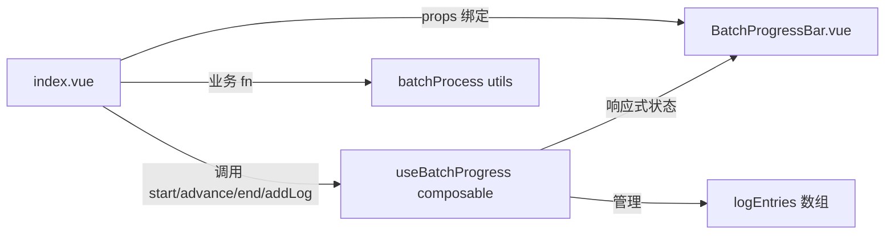

## 用户需求

将 gitPush 主面板中内联的批量加载进度条重构为独立组件，审查冗余代码，并新增可缩放执行日志输出区。

## 产品概览

将 ~40 行内联代码（模板 + 脚本 + SCSS）提取为独立组件 `BatchProgressBar.vue` + composable `useBatchProgress.ts`，使 index.vue 从 1388 行缩减，同时提供可拖拽调整高度的日志面板，让用户在执行批量操作时清晰看到每个项目的执行状态与耗时。

## 核心功能

- 进度条独立组件：显示标签、计数（current/total）、进度填充条、当前项目名、已耗时秒数
- 可缩放日志输出框：每完成一个批处理项追加一条记录（项目名 + 状态图标 + 耗时），默认折叠，有日志后显示展开/折叠按钮
- 日志区可拖拽调整高度（CSS `resize: vertical`），自动滚动到底部
- 异常捕获：若 fn 抛错，标记为 fail 状态，记录错误信息，不影响其余项目继续执行
- 新操作自动清空旧日志

## 技术栈

- Vue 3 Composition API + TypeScript
- SCSS（Codex UI 风格，基于 `$variables.scss` 设计 Token）
- Iconify Vue（`mdi:check` / `mdi:close` 图标）

## 实现方案

### 整体策略

将进度状态管理从 index.vue 提取到 composable `useBatchProgress.ts`，UI 提取到 `BatchProgressBar.vue` 组件。`runBatchWithProgress()` 内部增加 per-item try-catch，调用 composable 的 `addLog()` 记录每项执行结果。

### 冗余审查结论

- `loadProgress` ref 与 `progressTimer` 可合并到 composable 一次性管理
- `startLoadProgress` / `advanceLoadProgress` / `endLoadProgress` 三个函数语义清晰，保留但移入 composable
- `runBatchWithProgress` 保留在 index.vue（它依赖 `batchProcess` 和具体业务 fn），但改为调用 composable API
- onUnmounted 中 progressTimer 清理已在上一轮移除，无需改动

### 关键设计决策

1. **composable 而非自管理组件**：`useBatchProgress` 导出响应式状态 + 操作方法，父组件调用 `start/advance/end/addLog`，组件纯展示。符合项目分层规范（composables 存状态，components 存视图）。
2. **per-item 异常隔离**：`runBatchWithProgress` 内部对每个 item 包裹 try-catch，单项目失败不影响后续批次。当前 `batchProcess` 使用 `Promise.all(batch.map(fn))`，需改为 `Promise.allSettled` 或 per-item try-catch。
3. **日志自动清空时机**：`start()` 中清空 `logEntries`，`end()` 保留日志供用户查看。

### 性能考量

- 日志条目追加使用 `logEntries.value.push()`，Vue 3 响应式对数组 push 开销极低
- 日志区自动滚动通过 `nextTick + scrollTop = scrollHeight` 实现，无性能瓶颈
- 进度条仅更新 ref 数值，无 DOM 遍历

## 架构设计



### 数据流

1. index.vue 调用 composable 的 `start(total, label)` → 设置 visible=true、清空日志、启动计时器
2. batchProcess 中每个 item 完成后 → `advance(projectName)` + `addLog(name, status, elapsed)`
3. 所有 item 完成 → `end()` → 隐藏进度条，日志保留
4. BatchProgressBar 通过 props 接收状态，纯展示

## 目录结构

```
src/features/gitPush/
├── types/
│   └── batchProgress.ts              # [NEW] LogEntry 接口 + LoadProgress 接口（从 index.vue 迁移）
├── composables/
│   └── useBatchProgress.ts           # [NEW] 进度状态管理 composable，导出 state/logEntries/start/advance/end/addLog
├── components/
│   └── BatchProgressBar.vue          # [NEW] 进度条 + 可缩放日志区 UI 组件
├── styles/
│   ├── BatchProgressBar.scss         # [NEW] 进度条与日志区样式（从 index.scss 迁移 + 新增 .gp-batch-log-*）
│   └── index.scss                    # [MODIFY] 移除 L824-L869 的 gp-load-progress-* 样式块
└── index.vue                         # [MODIFY] 移除进度模板/接口/ref/函数，导入 composable + 组件
```

## 关键代码结构

```typescript
// types/batchProgress.ts
export interface LogEntry {
  projectName: string
  status: "ok" | "fail"
  elapsedSeconds: number
  error?: string
}

export interface LoadProgress {
  visible: boolean
  current: number
  total: number
  label: string
  projectName?: string
  elapsedSeconds: number
}
```

```typescript
// composables/useBatchProgress.ts - 对外 API
export function useBatchProgress() {
  const state: Ref<LoadProgress>
  const logEntries: Ref<LogEntry[]>
  function start(total: number, label: string): void       // 设置 visible、清空日志、启动计时
  function advance(projectName?: string): void             // current++、更新 projectName
  function end(): void                                      // 停止计时、visible=false（日志保留）
  function addLog(entry: LogEntry): void                   // 追加日志条目
  return { state, logEntries, start, advance, end, addLog }
}
```

## Agent Extensions

### Skill

- **codex-ui-style-guide**
- 用途：审查 BatchProgressBar.scss 是否符合 Codex UI 规范（设计 Token、BEM 命名、禁止 box-shadow 等）
- 预期结果：样式代码通过 Codex 规范审查，零违规项