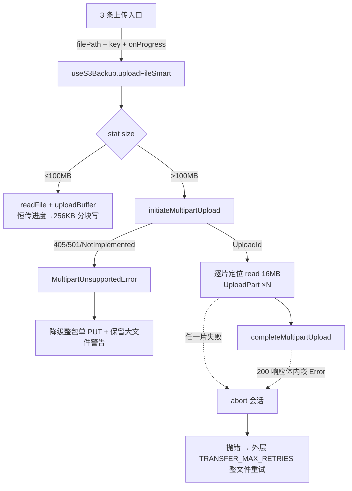

## 用户需求

用户报告 s3Backup 打包上传时控制台出现警告「[S3备份] 大文件整体读入内存上传: data-20260908/20260908-174030.zip（251767324 字节）」，经分析确认这是项目有意警告（阈值 100MB），但暴露了三个真实风险：大文件整包 `readFile` 驻留内存（约等于文件大小）、增量上传路径未传进度回调导致 Node 写缓冲二次驻留整包（内存约 2× 文件大小）、单次 PUT 大文件在上传超时（默认 240s）下容易失败。

用户已确认「修复风险」，并明确：

- 后端为 **OpenList / Alist 等聚合代理**（Multipart 兼容不完整），必须保留失败自动降级回退单次 PUT 的能力，确保兼容性不倒退；
- 修复范围覆盖 **s3Backup 全部 3 条上传入口**（全量上传、增量备份、手动选择备份上传），大文件统一走流式分片上传。

## 产品概述

在不改变用户可见交互的前提下，将共享层 S3 客户端升级为「大文件感知」上传能力：文件超过阈值时自动采用 S3 Multipart Upload（流式分片读取、逐片上传、逐片签名），内存占用从「整包文件大小」降至「单片大小」级别，并细化超时粒度；当 OpenList/Alist 等代理不支持分片协议时自动降级回现有单次 PUT 路径并给出明确警告。三条上传入口行为一致、无需用户感知差异。

## 核心功能

- 大文件（>100MB）上传自动走 Multipart 分片：CreateMultipartUpload → 逐片 UploadPart → CompleteMultipartUpload，任一步失败自动 Abort 会话；
- 分片上传被代理拒绝（405/501/NotImplemented 等）时自动降级为现有整包单 PUT 路径，保留原「大文件整包读入内存」警告以便用户知悉风险；
- 分片路径内存峰值恒定（约单片 16MB + 常数开销），文件读取采用 fd 定位读而非整包 `readFile`；
- 字节级进度语义保持不变：全量上传进度条仍按 sent/total 折算，256KB 粒度平滑推进；
- 覆盖全量上传、增量备份、手动上传三条入口；manifest 等小体积内存上传路径不受影响；下载/列举/删除/复制零改动。

## 技术栈

沿用项目现有技术栈，无新增依赖：

- Vue 3 + TypeScript 组合式 composable（feature 层编排）
- Node.js fs / http / crypto 原生模块（共享层 S3 客户端基于 SigV4 自研协议实现，零外部 SDK）

## 现状链路（问题根因）

`useFullS3Upload / useIncrementalBackup / useLocalBackupList` → `fs.readFile` 整包读入 Buffer（内存 ≈ 文件大小）→ `useS3Backup.uploadFileContent(buffer)` → `S3Client.uploadBuffer` → 单次 PUT：

- 签名强制 `sha256Hex(body)` 整体哈希（SigV4 的 `x-amz-content-sha256`），这是「必须整包在内存」的协议原因；
- 增量路径未传 `onProgress` → `req.write(body)` 整写（`s3Client.ts:477`），慢网时 Node OutgoingMessage 写缓冲二次驻留整包，内存 ≈ 2× 文件大小；
- 单次 PUT 上传超时默认 240s，>240MB 文件在上行 <1MB/s 时必然超时。

## 实现方案（总览）

三层改造，主战场在共享层 `src/utils/s3/`：

1. **常量与 XML 协议纯函数**（`types.ts` + `s3Protocol.ts`）：新增 `MULTIPART_MIN_SIZE`（以 `LARGE_FILE_WARN_SIZE` 为单一数据源别名，保持「>100MB 分片、≤100MB 原样」的既有语义边界）、`MULTIPART_PART_SIZE = 16MB`；Multipart 请求的 XML 构造（Complete 请求体：各片 PartNumber+ETag）与单标签解析（`<UploadId>`）做成纯函数，复用 `unescapeXml` 范式。

2. **新增 Multipart 编排模块 `src/utils/s3/s3Multipart.ts`**（新文件，仿 `s3ObjectOps` 的「基于 `client.sendRequest` 的自由函数」范式，避免 `s3Client.ts` 突破 500 行硬阈值，`s3Client.ts` 本体零改动）：

- `initiateMultipartUpload(client, key)`：POST `?uploads`，解析 UploadId；HTTP 405/501 或 XML Code 为 NotImplemented/MethodNotAllowed 时抛 `MultipartUnsupportedError`（降级信号）；
- `uploadPart(client, key, uploadId, partNumber, body, onProgress?)`：PUT `?partNumber=N&uploadId=…`，从响应头取 ETag；
- `completeMultipartUpload(client, key, uploadId, parts)`：POST `?uploadId=…` + XML；仿 `copyObject` 已知行为，检查 200 响应体内嵌 `<Error>` 的情况；
- `abortMultipartUpload(client, key, uploadId)`：DELETE `?uploadId=…`（best-effort）；
- `uploadFileSmart(client, filePath, key, onProgress?)`：stat 判定大小 →
    - ≤100MB：`readFile` + `uploadBuffer`（保持原样，但**恒传进度回调**使 `req.write` 路径升级为 256KB 分块写，修复增量双倍缓冲隐患）；
    - >100MB：先尝试 Multipart；`MultipartUnsupportedError` 时降级整包单 PUT 并输出保留原语义的警告（文案含 key 与字节数）；UploadPart/Complete 阶段失败则先 abort 再抛错，交外层既有整文件重试（`TRANSFER_MAX_RETRIES=2`）。
- 流式读文件：`fsRaw.open(path,'r')` + 定位 `read` 循环，每片复用单片 Buffer（16MB），单片独立 `sha256Hex` 签名与上传，串行执行（与现有文件级并发 2/4 协同，避免请求风暴）；逐片完成后按总字节回调 `onProgress(sent, total)`，片内透传 256KB 分块进度保持平滑。

3. **s3Backup 三条入口接入**：`useS3Backup` 新增 `uploadFileSmart(filePath, key, onProgress?)` 薄封装（内部 `requireClient()` 后调共享层函数），三条入口由「读 Buffer 再传」改为「传磁盘路径」，删除各 composable 中的 `fs.readFile` 整读与旧 `LARGE_FILE_WARN_SIZE` 警告（该职责收敛至共享层降级路径）；全量上传的 checksum size 口径改用已 stat 的 `stats.size`（不再依赖 `content.length`）。



## 关键设计决策与取舍

- **分片模块独立成文件、S3Client 零改动**：Multipart 全部操作仅依赖公开的 `sendRequest`/`NodeResponse.headers`，无需触碰类私有签名路径；既避免行数超限，也把新协议风险隔离在新文件，便于回退。
- **降级仅在 initiate 阶段判定**：initiate 失败语义是「协议不支持」，降级单 PUT 保兼容；UploadPart/Complete 失败是传输/数据问题，不降级（重试整文件即可），避免「半个 multipart 会话 + 降级」的混合态。
- **阈值复用 100MB 而非另立新值**：`MULTIPART_MIN_SIZE = LARGE_FILE_WARN_SIZE` 保证 ≤100MB 行为与今天完全一致（今天该区间本就不警告），>100MB 由「整读+警告」变为「分片无警告」，风险消除且日志口径自然收敛。
- **片内串行上传**：单文件分片串行 + 片内 256KB 背压分块写，配合外层文件级并发（全量 2 / 增量 4）总请求数可控；内存峰值 = 单片 16MB + 常数，远低于整包驻留。吞吐方面单片上传各自独立连接，串行对总耗时影响有限；如需更高吞吐可后续在片内加小并发（YAGNI，不提前做）。
- **性能与内存**：单 PUT 路径内存峰值 ≤100MB（原来 ≤100MB 场景不变）；分片路径内存恒定约 16MB；每片 sha256 为必须的 CPU 一遍（SigV4 要求），总 CPU 与整包哈希持平。上传超时粒度从「整文件 240s」细化为「单片 16MB/240s」，慢网不再因单次 PUT 超时整文件失败。

## 实现要点（防回归）

- `uploadBuffer` 调用点统一恒传进度回调（内部 no-op 亦可），确保走 `writeBodyInChunks` 分块写分支，杜绝 `req.write` 整写二次驻留——manifest 小体积上传可一并处理，成本为零。
- Complete 请求体 XML 仅含 PartNumber 与 ETag（十六进制+引号，天然 XML 安全），UploadId/partNumber 拼查询串时 `encodeURIComponent`，key 编码复用既有 `encodeKeyPath`（经 `sendRequest` 自动处理）。
- 降级警告沿用现有 console.warn 级别与「大文件整包读入内存」语义，前缀统一为 `[S3]`（共享层无增量/全量上下文），文案含对象 key 与字节数，不含密钥等敏感信息。
- abort 自身失败仅记 warn 不覆盖原始错误；fd 与单片 Buffer 在 finally 中释放。
- 下载（已流式写盘）、列举、删除、复制、测试连接路径零改动；`s3Client.ts`、i18n、功能开关注册清单零改动。

## 目录结构

```
src/
├── utils/
│   └── s3/
│       ├── types.ts           # [MODIFY] 新增 MULTIPART_MIN_SIZE(=LARGE_FILE_WARN_SIZE 别名) 与 MULTIPART_PART_SIZE(16MB)
│       ├── s3Protocol.ts      # [MODIFY] 新增 Multipart XML 纯函数：buildCompleteMultipartBody(parts) / parseUploadId(xml)（复用 unescapeXml 范式）
│       ├── s3Multipart.ts     # [NEW] Multipart 编排：initiate/uploadPart/complete/abort 自由函数 + uploadFileSmart 大文件感知入口 + MultipartUnsupportedError 类 + fd 定位读分片循环。文件头注释 10~30 字。仿 s3ObjectOps 范式基于 client.sendRequest，S3Client 本体零改动
│       └── s3Client.ts        # 不改动（sendRequest/NodeResponse.headers 已满足全部需求）
└── features/
    └── s3Backup/
        ├── composables/
        │   ├── useS3Backup.ts       # [MODIFY] 新增 uploadFileSmart(filePath,key,onProgress?) 薄封装并导出（requireClient 后调共享层函数）；uploadFileContent 保留供 manifest 等 Buffer 场景
        │   ├── useFullS3Upload.ts   # [MODIFY] 循环改调 uploadFileSmart(file.fullPath,s3Key,onProgress)；删除 fs.readFile/整读警告；checksum size 改用既有 stats.size；deps 类型 uploadFileContent→uploadFileSmart；清理 LARGE_FILE_WARN_SIZE 导入
        │   ├── useIncrementalBackup.ts  # [MODIFY] uploadWithRetry 改调 uploadFileSmart(file.fullPath,key)；删除整读与旧警告；deps 类型新增 uploadFileSmart（manifest 仍走 uploadFileContent Buffer 路径）
        │   └── useLocalBackupList.ts     # [MODIFY] 手动上传改调 uploadFileSmart(backup.path,s3Key)；deps 类型替换
        ├── types/index.ts       # [MODIFY] 若 LARGE_FILE_WARN_SIZE 重导出已无消费者则从重导出列表移除（保持其余不变）
        ├── index.vue            # [MODIFY] 从 useS3Backup 解构并向下传递 uploadFileSmart 至 3 处 DI 装配点（现有 uploadFileContent 传递处同步调整）
        └── README.md            # [MODIFY] 补充大文件自动分片 + 代理不支持自动降级的行为说明
```

## 验证链（用户执行）

- `pnpm lint`、`npx tsc --noEmit` 全绿；
- OpenList/Alist 后端实测：>100MB ZIP 走分片成功且云端对象完整可下载校验；小文件路径行为不变；三条入口各触发一次成功上传；模拟代理拒绝分片（如禁用 multipart）验证自动降级单 PUT 且出现降级警告；上传中途断网验证 abort + 整文件重试。