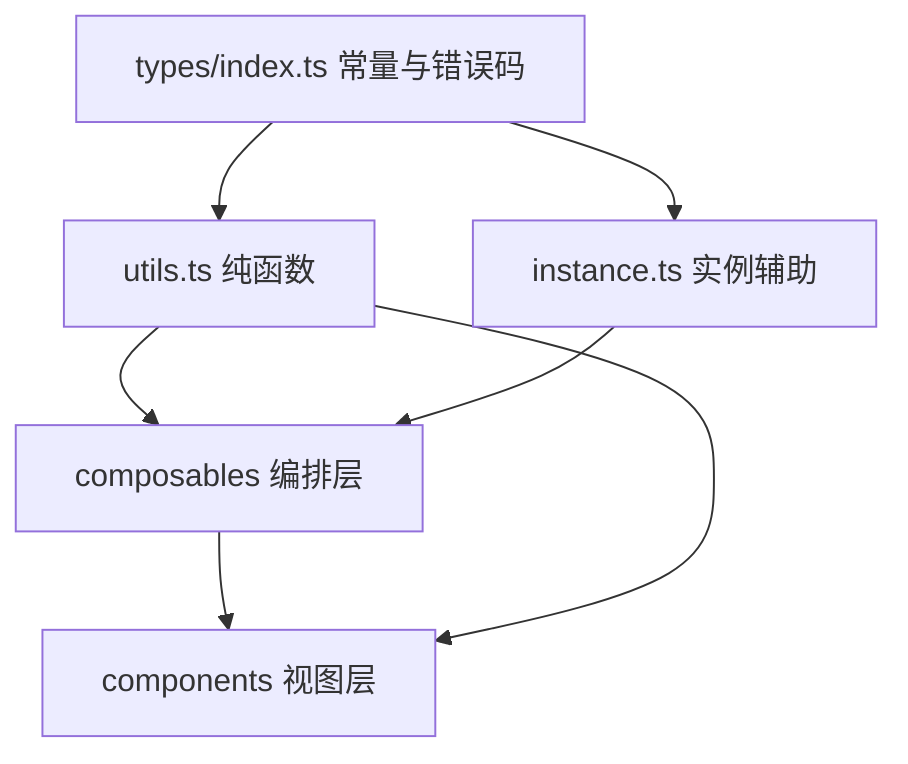

## 用户要求

对 `src/features/s3Backup` 模块做「**组件审查 + 冗余重复审查**」，并在确认范围后**全量修复**。

## 审查已确认的结论（实现依据）

### 一、真缺陷 3 项

1. `styles/BackupLogCard.scss:49-67` 只定义了 `log-type-localZip / -s3Upload / -s3Download / -s3Delete` 四套配色，而模板 `BackupLogCard.vue:32` 会按 `BackupLog.type` 的 **7 个取值**生成类名 ⇒ `log-type-s3Incremental`、`log-type-s3IncrementalRestore`、`log-type-autoBackup` **无颜色无底色**。
2. `components/checksums/StoredChecksumsSection.vue:8` 的 `class="section-header-actions"` 全项目零定义（死类）。
3. `composables/useLocalZipBackup.ts:76` 用户可见文案硬编码中文。

### 二、重复实现 8 项

重试循环两套（`useIncrementalBackup.ts:58-71` 的 `withRetry` vs `useFullS3Upload.ts:166-185` 内联循环）；`persistStorage` 逐字重复两份（`index.vue:169-173` / `useBackupOrchestrator.ts:75-79`）；上传 key 构建规则重复（`useFullS3Upload.ts:49-57` 与 `useBackupOrchestrator.ts:235-241`）；备份目录拼接重复（`useCloudBackupActions.ts:34-39` / `useIncrementalPanel.ts:131-135`）；纯函数 `capFileList` / `isUnsafeRelativePath` 未下沉 `utils.ts`；并发常量位置与命名不统一；`workspacePath` 运行时 ref 与 `workspaceRoot` 恒等却仍双份流转；`useIncrementalBackup.ts:106-113` 内 `getNodeModules()` 判空为死代码。

### 三、i18n 硬编码 7 处（5 处经 `showMessage` 呈现给用户）

### 四、组件复用偏离（**用户采纳 4 项，排除 Card 与 ConfirmDialog**）

- 采纳：`Tag` 替换 7 类自建徽章、`Select` 替换原生下拉、`ProgressBar` 替换自绘进度条、`Tabs` 五件套替换自建 Tab 壳。
- 排除（本次不动）：`Card` 替换 `.card-section`、`ConfirmDialog` 替换 7 处原生 `confirm()`。

### 五、格式/一致性小问题 5 项

尾部空行、`styles/index.scss` 过期头注释（仍在写已移除的长名 Token）、`hsl(...)` 与 `#6366f1` 硬编码色值、`useS3Backup.ts:148` 未使用的 catch 参数与被注释的日志、`BackupLogCard.vue` 模板内 `hasDetail(log)` 每条日志调用 3 次。

## 交付效果

- 模块内不再有重复实现：同一规则只有一处定义，跨文件复用走 `utils.ts` / `instance.ts` / `types/index.ts`。
- 全部用户可见文案可中英切换。
- 徽章、下拉、进度条、Tab 栏改用共享组件，日志类型 7 种配色齐全，进度条获得无障碍语义，Tab 栏获得完整键盘操作与 ARIA 关联。
- 视觉有变化（徽章底色/描边、进度条高度、Tab 下划线），由用户自行回归渲染。
- 明确排除项（`Card`、`ConfirmDialog`）保持现状不动。

## 技术栈

沿用现有工程，不新增任何依赖：

- 构建：Vite + Vue 3 + TypeScript（`script setup` + `defineModel`）
- 样式：SCSS，统一 Token 短名制（`$s-*` / `$t-*` / `$r-*` / `$fw-*` / `$ff-*`），样式一律外置到 `styles/*.scss`
- 宿主：思源笔记插件 API（`@/utils/pluginStorage`、`@/utils/typedStorage`、`@/utils/nodeModules`、`@/features/statusBar`）
- UI 复用：`src/components/` 共享组件库（52 个），本次用到 `Tag` / `Select` / `ProgressBar` / `Tabs`+`TabList`+`Tab`+`TabPanels`+`TabPanel`

## 实现方案

### 总策略

按模块既有三层结构收敛，**不新建文件、不改目录结构**：常量与类型上移 `types/index.ts`，纯函数下沉 `utils.ts`，实例相关辅助放 `instance.ts`，编排层只做接线。

### 关键决策

1. **错误文案国际化：错误码而非注入 i18n**
`BackupManager` / `backupScanner` 是零 i18n 依赖的纯模块，直接把 i18n 注入会破坏分层。改为在 `types/index.ts` 定义 `BackupErrorCode` 联合类型与 `BackupError` 类（`code` + 可选 `detail`，`detail` 只放不含中文的技术细节如路径），模块改抛 `BackupError`；视图层用一个共享的 `localizeBackupError(err, i18n)` 把 code 映射为 i18n 键，并把 `detail` 以「键文案 + 全角冒号 + detail」形式拼接。模块保持纯净，文案可翻译。

2. **单一定义多路复用（DRY）**

- `withRetry(task, failLabel)` 从 `useIncrementalBackup` 提升到 `utils.ts`（依赖已有 `TRANSFER_MAX_RETRIES`），`useFullS3Upload` 的内联 `Promise.allSettled` 分支改为调用它。
- `capFileList` / `isUnsafeRelativePath` 下沉 `utils.ts`（符合 AGENTS.md「纯工具函数 → utils.ts」）。
- `resolveBackupDir(workspaceRoot, localBackupDir)` 下沉 `utils.ts`（`utils.ts` 已有 `getNodeStream` 这类 node 依赖先例），供 `useCloudBackupActions` 与 `useIncrementalPanel` 共用。
- `persistS3BackupStorage(save)`（签名复用 `types/index.ts` 已有的 `PersistFn`）放入 `instance.ts`——它依赖 `getS3BackupInstance`，不属纯函数，不能进 `utils.ts`。`index.vue` 与 `useBackupOrchestrator` 各删一份本地实现后改为导入。

3. **上传 key 构建收敛为单一注入点**
在 `useBackupOrchestrator` 内构造一次 `buildUploadKey(relativePath, dateStr?)`，同时注入 `useFullS3Upload`（替代其私有 `makeS3Key` 与 run 级 `timestamp`）与 `useLocalBackupList`。日期段规则仍走 `buildBackupUploadKey`，`makeBackupTimestamp` 由编排层单点求值，消除两套包装与重复取时。

4. **冗余状态收敛**
删除 `useWorkspaceSettings` 内与 `workspaceRoot` 恒等的运行期 `workspacePath` ref，全部改读 `workspaceRoot`；**持久化对象仍保留 `workspacePath` 字段写值**（`BackupSettings` 里该字段标注为旧数据兼容保留，删掉会让旧工作区路径丢失）。同步修改 `useBackupOrchestrator`（`ensureWorkspaceReady`、`performManualBackup`、reactive 导出）与 `BackupTab.vue` / `IncrementalTab.vue` 的绑定。

5. **组件迁移遵循「先查 props → 复用 → 覆写算特异性」**

- `Tag` 承载全部 7 类徽章：以 `BackupLog.type` 为键建立 variant 映射常量（新增的 3 类据此获得配色，一并修掉缺陷 1）。`Tag` 默认外观为「同色系 10% 浅底 + 100% 文字 + 20% 描边」，与现有 `.status-badge-*` 的 `rgba(var(--b3-theme-*-rgb), 0.1)` 语义一致；字号按现有档位映射（`$t-2xs` → `size="xsmall"`，`$t-xs` → `size="small"`）。迁移后 `_mixins.scss` 的 `status-badge` / `-ok` / `-fail` 三个 mixin 失去全部引用应删除，`meta-sep` 保留（`.log-sep` / `.checksum-sep` 仍在用）。
- `Select` 替换 `DropVerifySection` 原生下拉：原实现「`<option value="">比对...</option>` + items」映射为 `options = [{ label: i18n.compareWith, value: "" }, ...]`。**关键点**：原 `onCompareChange(index)` 依赖 `compareSelects[index]` 已被写回，改用 `v-model` 加 `@update:model-value` 存在监听器执行顺序依赖；改为不使用 `v-model`，统一走 `@update:model-value` 的单一处理函数，在函数内先写 ref 再做比对，彻底消除时序依赖。
- `ProgressBar` 替换自绘进度条：保留现有 `.progress-info` 行（左侧 phaseLabel、右侧百分比），组件传 `:show-value="false"` 以最小化视觉差异；删除 `.progress-bar-container` / `.progress-bar` 两条样式，仅补 `margin-bottom`，档位选 `xsmall` 并按 `styles/ProgressBar.scss` 的 track 高度核对是否贴合原 6px。
- `Tabs` 五件套替换 Tab 壳：`activeTab` 由收窄的字面量联合改为 `TabsValue`（`v-model:value` 的载荷是 `string | number`，保留收窄类型会 TS2322）。**必须传 `lazy`**，以保持现有 `v-if` 的「进入即挂载、离开即卸载」语义——`IncrementalTab.vue` 依赖 `onMounted` 首次进入时自动加载云端清单。`.s3-tab-bar` / `.s3-tab-btn` / `.s3-tab-btn.active::after` 下划线全部删除（`si-tablist` 自带分隔线与激活下划线），`.s3-tab-badge` 由 `Tag` 承担。

6. **性能与回归风险控制**

- 并发常量上移 `types/index.ts` 并统一命名（`FULL_UPLOAD_CONCURRENCY` / `INCREMENTAL_CONCURRENCY`），语义不变，无行为风险。
- `BackupLogCard` 模板内每条日志 3 次 `hasDetail(log)` 改为一个 `computed` 产出带 `expandable` 标记的行数组；`detailGroups(log)` 只在展开项上调用，保持不变（展开项数量天然很少）。
- 唯一可能破坏布局的是 `Tabs` 引入的两层容器：`.s3-backup-panel` 是 `display:flex; flex-direction:column; height:100%`，`.settings-container` 靠 `flex:1; overflow-y:auto` 撑出滚动区。插入 `si-tabs` / `si-tabpanels` / `si-tabpanel` 后 flex 链断裂，必须在 `styles/index.scss` 用 `:deep()` 补 `flex:1; min-height:0` 接线，否则滚动区塌陷。这是本次最需要目视回归的点。

## 实现要点

- **分层硬规则**：同一常量/函数被 2 个以上文件使用即必须提取，禁止复制粘贴；`types/index.ts` 是显式导出清单（值 export / type export 两块），新增 `BackupError` / `BackupErrorCode` / `INCREMENTAL_CONCURRENCY` 须两处登记，否则消费方报 TS2305。
- **统一入口**：文案国际化走分片 JSON（`src/i18n/zh_CN/s3Backup.json` + `en_US/s3Backup.json`），合并产物 `src/i18n/zh_CN.json` 由脚本生成不手改；校验用 `pnpm i18n:verify`。
- **文件头注释**：所有被改的 `.ts` / `.vue` 顶部保留/补齐 10~30 字功能说明注释（`.scss` 不要求）。
- **组件库约定**：`Tag.icon` 受 `IconKey` 约束，不得传任意 Iconify 名；共享组件根元素在 `index.vue` 模板里直接书写时自带调用方 scope，内部元素才需 `:deep()`；跨组件覆写要按「类名写两遍」抬特异性。
- **验证边界**：AI 不执行 `pnpm lint` / `pnpm vite build`；可执行 `read_lints`、`pnpm i18n:merge`、`pnpm i18n:verify`、`npx sass --no-source-map <单个 .scss>`。类型检查必须用 `pnpm typecheck`（`vue-tsc`），禁用 `npx tsc --noEmit`（不解析 `.vue`，会报大量假错）。

## Agent Extensions

### Skill

- **universal-arch-skill**
- Purpose: 对本次收敛结果做架构规范校验——重点核验「功能模块内代码分层（类型/常量 → types、纯函数 → utils、视图逻辑 → composables/.vue）」是否落实、有无跨文件残留复制粘贴、统一入口是否被绕过。
- Expected outcome: 输出可执行的校验结论，逐条确认 `withRetry` / `capFileList` / `isUnsafeRelativePath` / `resolveBackupDir` / `persistS3BackupStorage` 各自只存在一处定义且被正确复用，`types/index.ts` 导出清单两处已同步登记，模块内不再出现被搬走的重复实现。