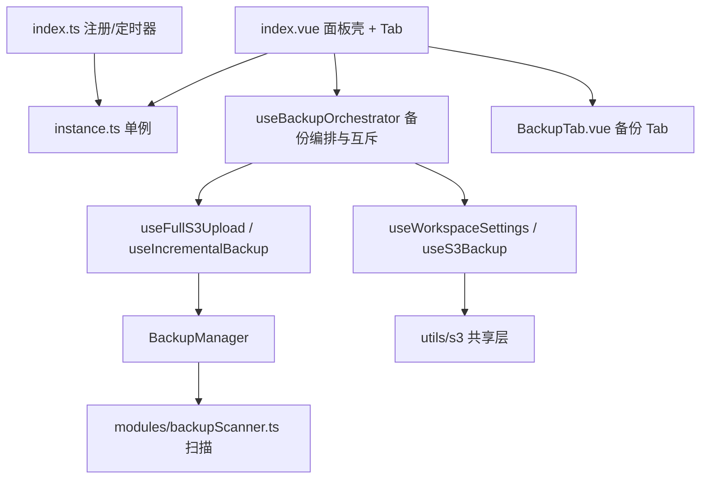

## 产品概述

针对 `src/features/s3Backup`（S3 备份功能模块）完成的代码审查，按「P0 数据正确性 → P1 稳定性与资源 → P2 可观测性 → 死代码/重复类型 → 结构性收敛」五个阶段实施修复，每个阶段可独立验证、独立回退。

## 核心需求

1. **P0 修复数据正确性**

- 修复 S3 对象 key 双日期嵌套（`prefix/sub/今天/历史日期/xxx.zip`），使 key 布局与 README 声明及本地目录语义一致。
- 修复 ZIP 打包失败时写流句柄未释放导致 Windows 上清理必然失败、损坏半包被当作有效归档上传的问题。

2. **P1 修复稳定性与资源占用**

- 消除「await 选择目录期间运行标志未置位」的并发空窗，防止两次备份流程并发写共享进度与 manifest。
- 捕获日志持久化的 floating promise，避免 unhandled rejection。
- 为 `checksums`、`uploadHostMap` 增加存储上限，与既有 `MAX_LOG_COUNT` 对齐，抑制存储单调膨胀。

3. **P2 提升可观测性与一致性**

- manifest / 全量上传失败时补齐失败日志（当前静默失败且无记录）。
- `backupTime` 输入防抖，避免每次按键重启自动备份定时器。
- 修复 `FileChecksumsCard` 清理 watch 不触发导致的验证状态残留。
- 统一手动上传与自动上传的 S3 key 规则；修复百分比回跳、列表重复 key 等小项。

4. **清理死代码与重复类型**

- 移除 `padNum` 无效导出、未使用的 `updateWorkspacePath` 返回值、恒等的 `workspacePath` 字段。
- 用工具类型收敛 `WorkspaceFile`/`ManifestEntry`/`DropResult`/`BackupResult` 与 `LocalBackupInfo` 的重复定义。
- 三处 `buildS3Key(prefix, sub, "")` 复用 `getListPrefix()`；同步 README 与 i18n。

5. **结构性收敛（风险最高，放最后）**

- `index.vue`（855 行）、`BackupManager.ts`（510 行）拆至 500 行硬阈值内，`FileChecksumsCard.vue`（421 行）拆至 300 行警戒线内。
- 解耦 `index.ts ↔ index.vue` 循环依赖，收敛工作区路径 / `lastBackupTimestamp` / `S3Config` 的多份重复状态为单一事实源。

## 约束

- 不得改变既有持久化数据格式，旧数据缺字段一律显式兜底（参照 `s3Incremental ?? false` 写法）。
- 不新增 UI 视觉设计，保持 Codex 风格与现有交互不变。

## 技术栈

- 现有栈：Vue 3 `<script setup>` + TypeScript + Vite + SCSS，思源插件运行时（Electron 渲染进程，Node 模块经 `@/utils/nodeModules` 统一入口获取）。
- 复用既有共享层：`@/utils/s3/types`（`S3Config`/`S3FileInfo`/常量）、`@/utils/s3/concurrency`（`runWithConcurrency`/`getHostname`）、`@/utils/s3/s3Multipart`（`uploadFileSmart`）。
- 统一入口：存储 `TypedStorage`、事件 `emitCustomEvent`、定时器 `TimerRegistry`、状态栏 `useStatusBarTask`。不引入任何新依赖。

## 实施方案

**总体策略：分 6 个阶段推进，先修正确性（P0/P1），再修可观测性（P2），再做清理，最后做结构收敛。** 每阶段结束后用户可用 `npx tsc --noEmit` 快速回归，bugfix 阶段与重构阶段严格隔离，避免重构掩盖回归。

关键决策与权衡：

1. **key 归一化放在 `makeS3Key` 而非 `scanBackupDir`**：`scanBackupDir` 的 `name`（`data-20260706/xxx.zip`）是本地列表展示与保留数清理的事实源，不能改；只在上传出口把 `relativePath` 拆成 `datePath + basename`，改动面最小且不影响本地语义。
2. **写盘改用 `stream.pipeline` 而非手工 `on("error")`**：`pipeline` 在任一端出错时会同时销毁上下游并回调统一错误，从根上消除句柄泄漏；失败清理保留 `unlink` 并在失败时降级为重命名 `.part`，确保损坏包不会被 `isArchiveFile` 识别。
3. **互斥守卫改为「进入即置位」**：三个入口在 `await selectWorkspacePath()` 之前置运行标志、`finally` 复位，把异步挂起窗口纳入互斥范围，比「await 后重查」更彻底。
4. **存储上限新增常量而非改结构**：`MAX_CHECKSUM_COUNT` / `MAX_UPLOAD_HOST_MAP` 与既有 `MAX_LOG_COUNT` 同风格放 `types/index.ts`；超限按「最新在前」截断（与 `checksums` 的 unshift 语义一致），不引入新的存储槽。
5. **日志持久化改为「内存同步 + 异步落盘 + catch 兜底」**：`addLog` 保持同步返回（不阻塞调用方），落盘失败仅 `console.warn`，杜绝 unhandled rejection；busy 场景的重复「跳过」日志改为同类去重，避免长任务期间每 60s 全量重写数 MB JSON。
6. **循环依赖用独立 `instance.ts` 解耦**：把模块级单例与 `getS3BackupInstance` 抽到 `s3Backup/instance.ts`，`index.ts` 与 `index.vue` 都只依赖它，彻底断开环，且对 `src/index.ts` 的 `DESTROYABLE_KEYS` 零影响。
7. **结构收敛最后做**：拆文件前先用 `code-explorer` 全量确认 `BackupResult`/`LocalBackupInfo`/`getS3BackupInstance` 的调用点，避免漏改。

## 实施要点

- **向后兼容**：`BackupSettings.workspacePath` 冗余字段保留在类型与默认值中（仅停止新写入/改为从 `workspaceRoot` 派生读取），避免旧配置反序列化报错；`BackupLog.type` 新增 `s3IncrementalRestore` 枚举值属扩充，旧日志的 `s3Download` 仍能渲染。
- **i18n**：只改 `src/i18n/{zh_CN,en_US}/s3Backup.json` 分片，zh/en 同步新增 `logTypeS3IncrementalRestore`；顶层 `zh_CN.json`/`en_US.json` 由 `pnpm i18n:merge` 生成，**禁止手改**。
- **性能**：`performFullBackup` 的 `allFiles` 大数组在本次仅把「可读性探测」从 `open+close` 换为 `fs.access`（减半 fd 开合并消除 TOCTOU），不做流式化改造以控制风险；日志落盘节流后单次写入量从「全量 200 条（含 600 路径/条）」降为按需。
- **规范**：新增/修改文件顶部补 10~30 字功能说明注释；SCSS 仍在 `styles/` 独立文件、Vue SFC 只留 `@use`；Token 化不硬编码；if 必带花括号；emit camelCase。
- **验证边界**：AI 不执行 `pnpm vite build` 与 `pnpm lint`；每阶段交付后由用户执行 `pnpm lint`、`pnpm i18n:verify`、`pnpm validate:icons`、`npx tsc --noEmit`。

## 架构设计

当前问题集中在「编排层过重 + 状态多份拷贝」。收敛后的职责分层：



- `instance.ts` 作为单例唯一持有者，断开 `index.ts ↔ index.vue` 的 import 环。
- `useBackupOrchestrator` 统一持有「立即备份 / 压缩包 / 增量备份 / 增量还原」四个入口与运行标志，`index.vue` 仅剩 Tab 容器与事件注册。
- 工作区路径以 `useWorkspaceSettings.workspaceRoot` 为唯一事实源，`S3Backup.cachedWorkspaceRoot` 与 `BackupManager.workspaceRoot` 改为由其单向同步派生。

## 目录结构

```
src/features/s3Backup/
├── index.ts                              # [MODIFY] 改用 instance.ts 单例；destroy 补 timers.clearAll()；移除与面板重复的工作区检测
├── index.vue                             # [MODIFY] 大幅瘦身：抽出 BackupTab 与 useBackupOrchestrator，仅保留 Tab 壳/事件注册/配置加载
├── instance.ts                           # [NEW] 模块级 S3Backup 单例持有与 getter/setter，解耦 index.ts 与 index.vue 的循环依赖
├── utils.ts                              # [MODIFY] 移除 padNum 导出；createLazyReadStream 增加销毁兜底；新增 splitBackupRelativePath
├── types/
│   ├── index.ts                          # [MODIFY] 新增 MAX_CHECKSUM_COUNT/MAX_UPLOAD_HOST_MAP；BackupLog.type 扩 s3IncrementalRestore；WorkspaceFile/ManifestEntry 改为工具类型派生；workspacePath 标注废弃
│   └── storage.ts                        # [NEW] 从 types/index.ts 迁入 S3BackupStorage 类（对齐 AGENTS 分层规范）
├── modules/
│   ├── BackupManager.ts                  # [MODIFY] finalizeAndSaveBackup 改用 pipeline + 可靠清理；可读性探测改 fs.access；扫描逻辑外迁后降至阈值内
│   └── backupScanner.ts                  # [NEW] SKIP_DIRS/DATE_DIR_RE/scanDirectory/scanBackupDir 扫描实现
├── composables/
│   ├── useFullS3Upload.ts                # [MODIFY] makeS3Key 归一化（basename + 首段日期）；进度百分比去竞态；失败补日志
│   ├── useIncrementalBackup.ts           # [MODIFY] manifest 上传失败补 addLog 后再抛
│   ├── useBackupLogs.ts                  # [MODIFY] 落盘 catch 兜底 + busy 日志去重节流
│   ├── useChecksums.ts                   # [MODIFY] 新增上限截断
│   ├── useLocalBackupList.ts             # [MODIFY] uploadHostMap 上限截断；buildUploadKey 复用统一前缀
│   ├── useWorkspaceSettings.ts           # [MODIFY] 移除未使用的 updateWorkspacePath 导出；统一前缀构造；单一事实源化
│   ├── useS3Backup.ts                    # [MODIFY] 导出 getListPrefix 供外部复用
│   ├── useBackupOrchestrator.ts          # [NEW] 四入口编排 + 互斥守卫（await 前置位、finally 复位）+ 状态栏上报
│   └── useDropVerify.ts                  # [NEW] 拖放校验状态与结果（从 FileChecksumsCard 抽出，含上限）
├── components/
│   ├── BackupTab.vue                     # [NEW] 备份 Tab 容器（WorkspaceInfoCard/ManualBackupCard/两份 BackupListCard）
│   ├── BackupLogCard.vue                 # [MODIFY] 新增 s3IncrementalRestore 类型标签
│   ├── BackupListCard.vue                # [MODIFY] :key 改为稳定唯一键
│   ├── AutoBackupCard.vue                # [MODIFY] backupTime 改为失焦/回车提交，避免逐键重启定时器
│   ├── FileChecksumsCard.vue             # [MODIFY] 拆分为两个子组件后的容器；修正 storedItems watch 为 deep
│   └── checksums/
│       ├── DropVerifySection.vue         # [NEW] 拖放文件即时校验区
│       └── StoredChecksumsSection.vue    # [NEW] 已存储校验值列表与验证/删除
├── styles/
│   ├── BackupTab.scss                    # [NEW] 备份 Tab 容器样式
│   ├── DropVerifySection.scss            # [NEW] 拖放校验区样式
│   └── StoredChecksumsSection.scss       # [NEW] 已存储校验值区样式
├── README.md                             # [MODIFY] 补 filesys_status_check 说明、key 布局修正、新增上限与语义说明
└── src/i18n/{zh_CN,en_US}/s3Backup.json  # [MODIFY] 同步新增 logTypeS3IncrementalRestore
```

## 关键代码结构

```ts
// types/index.ts —— 新增存储上限常量（与既有 MAX_LOG_COUNT 同风格）
export const MAX_CHECKSUM_COUNT = 100
export const MAX_UPLOAD_HOST_MAP = 200

// BackupLog.type 扩充（旧日志 s3Download 仍可渲染）
type: "localZip" | "s3Upload" | "s3Download" | "s3Delete" | "s3Incremental" | "s3IncrementalRestore" | "autoBackup"
```

```ts
// utils.ts —— 上传 key 归一化纯函数（供 useFullS3Upload 与 useLocalBackupList 共用，消除两套规则）
export interface SplitRelativePath { datePath: string; baseName: string }
export function splitBackupRelativePath(relativePath: string, useDateFolder: boolean): SplitRelativePath
// 规则：末段取 basename；首段形如 data-YYYYMMDD 时以其为 datePath，否则回退今日；useDateFolder 关闭时 datePath 为空
```

## Agent Extensions

### Skill

- **universal-arch-skill**
- Purpose: 在结构收敛阶段对 s3Backup 做架构规范校验（单文件行数阈值、模块内三层分层、types/utils/composables 职责边界、SCSS 分离）
- Expected outcome: 输出拆分后各文件的行数与规范符合性结论，确保 index.vue / BackupManager.ts / FileChecksumsCard.vue 全部落入阈值内且不违反分层规则

### SubAgent

- **code-explorer**
- Purpose: 在结构收敛前跨文件定位 `BackupResult`、`LocalBackupInfo`、`getS3BackupInstance`、`buildS3Key` 的全部调用点与映射点，确认拆分与解耦的影响面
- Expected outcome: 给出完整调用点清单，避免拆分 instance.ts / 合并重复类型时漏改导致编译或运行时错误